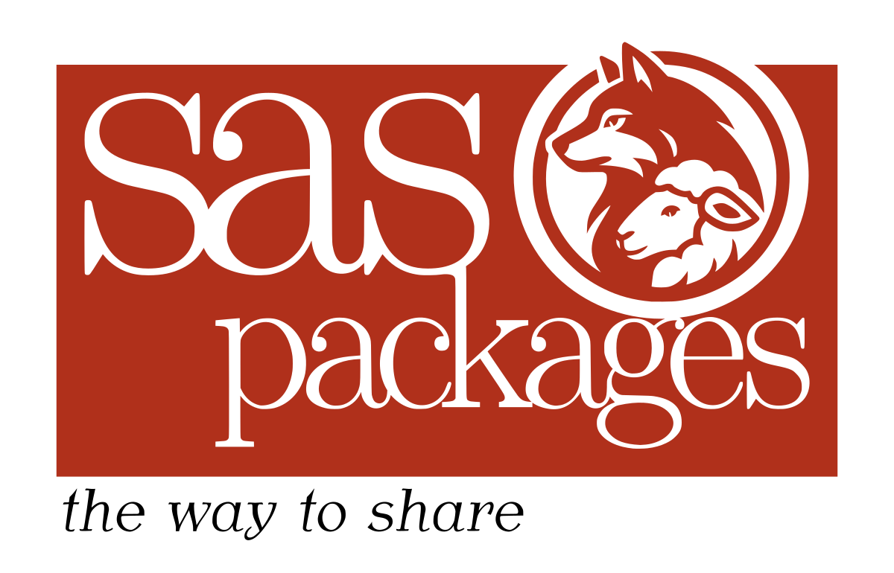

# SAS Packages Framework



---

A **SAS package** is an automatically generated, single, stand alone *zip* file containing organized and ordered code structures, created by the developer and extended with additional automatically generated "driving" files (i.e. description, metadata, load, unload, and help files). 

The *purpose of a package* is to be a simple, and easy to access, code sharing medium, which will allow: on the one hand, to separate the code complex dependencies created by the developer from the user experience with the final product and, on the other hand, reduce developer's and user's unnecessary frustration related to a remote deployment process.

In this repository we are presenting the **SAS Packages Framework** - a tool that allows to develop and use SAS packages. 

Don't forget to give the repository a **STAR** and become [stargazer](https://github.com/yabwon/SAS_PACKAGES/stargazers)! :-)


---

### Current version:

**The latest version** of the **SAS Packages Framework** is **`20251231`**.

---

---

## Intro: 

To get started with SAS Packages try: [**`Introduction to SAS Packages`**](https://youtube.com/playlist?list=PLeMzGEImIT5eV13IGXQIgWmTFCJt_cLZG&si=ElQm0_ifq76mvUbq "Introduction to SAS Packages video series") video series or [**`Getting Started with SAS Packages`**](https://github.com/yabwon/SAS_PACKAGES/blob/main/SPF/Documentation/Getting_Started_with_SAS_Packages.pdf "Getting Started with SAS Packages") presentation (see the `./SPF/Documentation` directory).

The documentation and more advance reading can be found in the [**`SAS(r) packages - the way to share (a how to)- Paper 4725-2020 - extended.pdf`**](https://github.com/yabwon/SAS_PACKAGES/blob/main/SPF/Documentation/SAS(r)%20packages%20-%20the%20way%20to%20share%20(a%20how%20to)-%20Paper%204725-2020%20-%20extended.pdf "SAS packages - the way to share") article (see the `./SPF/Documentation` directory).

Short description of the SAS Packages Framework macros and their parameters can be found [here](https://github.com/yabwon/SAS_PACKAGES/blob/main/SPF/SPFinit.md "Short description of the SAS Packages Framework macros")

### Recordings and Presentations:

Videos presenting the SPF and packages, from various conferences and meetups (the newer the better):

  - ["SAS Packages: The Way to Share" - SAS Global Forum 2020 V.E.](https://www.youtube.com/watch?v=qCkb-bx0Dv8&t=0s "SGF2020") (April 2020, ~20 minutes, general overview but with a bit obsolete technical details)
  - ["SAS Packages: The Way to Share" - SaSensei International Dojo No. 1](https://www.youtube.com/watch?v=BFhdUBQgjYQ&t=0s "SID no. 1") (April 2020, ~28 minutes, general overview but with a bit obsolete technical details)
  - ["Co nowego z pakietami SAS?" - SAS dla Administratorów i Praktyków 2020](https://www.youtube.com/watch?v=mXuep2k48Z8&feature=youtu.be&t=0s "SASAiP2020") (October 2020, in Polish, ~41 minutes, general overview and technical details how to use SPF)
  - ["SAS Packages - The Way to Share" - Boston Area SAS Users Group webinar](https://www.basug.org/videos?wix-vod-video-id=78067e61413d43d3a6951974b3bc3014&wix-vod-comp-id=comp-klv807gt "BASUG") (November 2020, ~59 minutes, general overview and technical details how to use SPF)
  - ["My First SAS Package: A How-To" - SAS Global Forum 2021 V.E.](https://www.youtube.com/watch?v=hqexaQtGw88 "SGF2021") (May 20th 2021, ~30 minutes, technical workshop on how to create a package)
  -  ["Kod SASowy ukryty na widoku" - SAS dla Administratorów i Praktyków 2021](https://www.youtube.com/watch?v=LtaWPe2sgRY&t=1s) (November 24th 2021, in Polish, ~34 minutes, technical presentation with details about the GSM package)
  - ["A BasePlus Package for SAS" - SAS Explore 2022](https://communities.sas.com/t5/SAS-Explore-Presentations/A-BasePlus-Package-for-SAS/ta-p/838246 "SASexplore2022 communities.sas.com") (September 27th-29th 2022, ~28 minutes, technical presentation with details about the BasePlus package), alternative video at YouTube is [here](https://www.youtube.com/watch?v=-Poxkx5WfOQ "SASexplore2022 TouTube")
  - ["SAS Packages - State of the Union" - SaSensei International Dojo No. 13](https://www.youtube.com/watch?v=1GEldZYQjj0&t=0s "SID no. 13") (November 10th 2022, ~50 minutes, general overview with the latest technical details)
  - ["SAS Packages Framework - an easy code sharing medium for SAS" - Warsaw IT Days 2023](https://youtu.be/T52Omisi0dk&t=0s "Warsaw IT Days 2023") (March 31st 2023, ~60 minutes, general overview with technical details for user and developer)
  - ["SAS Package ー その共有、もっとスマートに" - SASユーザー総会 2025](https://youtu.be/4QRr7sUhO9E "SASユーザー総会2025") (September 25th 2025, ~22 minutes, general overview with the list of reasons: why is it worth to use SAS packages?)


### Tutorials:

Here are links to some tutorials which may help you to start with the framework. 
Order is dictated by the amount of details presented. 
Letter "D" indicates tutorial dedicated for developers and "U" materials for users.

1) (DU) A [video](https://youtu.be/T52Omisi0dk&t=0s) explaining the idea in more details.

2) (D) Very simple ["Hello World" example](https://github.com/yabwon/SAS_PACKAGES/blob/main/SPF/Documentation/HelloWorldPackage.md) tutorial for developers. As a support a [walk-through video](https://youtu.be/T52Omisi0dk&t=2160s)

3) (D) Article and all required materials for ["My first SAS Package"](https://github.com/yabwon/SAS_PACKAGES/tree/main/SPF/Documentation/Paper_1079-2021) tutorial.

4) (DU) Materials from Hands-on-Workshop (4+ hours) tutorial: [Share your code with SAS Packages](https://github.com/yabwon/HoW-SASPackages). 
   It is a "zero to hero" tutorial that explains all the "bells and whistles" of using, and all the "nuts and bolts" of developing SAS packages.

---

---

### Initiative to add SAS Packages Framework to SAS Base/Viya:

A **SASware Ballot Idea** for adding *SAS Packages Framework* macros into Base SAS and Viya was submitted Friday, May 27th 2022. If you would like to support the idea visit this [**communities.sas.com post**](https://communities.sas.com/t5/SASware-Ballot-Ideas/Add-SAS-Packages-Framework-to-the-SAS-Base-Viya/idi-p/815508) and up vote the idea! We have 48 likes from 46 supporters up to today (as of September 30, 2025)!

---

### A Brief User Manual:

This is a brief intro. See below to find a link to detailed workshop materials.

#### Create directory 

The first step to use a package with the SAS Packages Framework:

- Create a folder for your packages, under Windows OS family e.g., `C:/SAS_PACKAGES` or under Linux/UNIX OS family e.g., `/home/<username>/SAS_PACKAGES`. The path selected is totally up to you.

#### Manual installation 

- Manually download the `SPFinit.sas` file (the SAS Packages Framework) into the local packages folder.
- \[Optional\] Manually download the `<packageName>.zip` file into the local packages folder.
- and Execute:

```sas
filename packages "<directory/containing/packages/>";         /* setup directory for packages */
%include packages(SPFinit.sas);                               /* enable the framework */

/* %installPackage(packageName) */                            /* install the package, unless you downloaded it manually */

%helpPackage(packageName)                                     /* get help about the package */
%loadPackage(packageName)                                     /* load the package content into the SAS session */
```

---

#### Automatic (one-time-only) installation 

If you need it just for "one time" only, e.g., for test if you like it:

- Execute: 

```sas
filename packages "%sysfunc(pathname(work))"; /* setup WORK as temporary directory for packages */
filename SPFinit url "https://raw.githubusercontent.com/yabwon/SAS_PACKAGES/main/SPF/SPFinit.sas";
%include SPFinit; /* enable the framework */

%installPackage(packageName) /* install a package */
%helpPackage(packageName)    /* get help about the package */
%loadPackage(packageName)    /* load the package content into the SAS session */
```

---

#### Automatic (permanent) installation

To install SPF pragmatically:

- Enable the framework [do this first and one time only!]:

```sas
filename SPFinit url "https://raw.githubusercontent.com/yabwon/SAS_PACKAGES/main/SPF/SPFinit.sas";
%include SPFinit; /* enable the framework */
```

  or (shorter) with:

```sas
filename SPFinit url "https://bit.ly/SPFinit";
%include SPFinit; /* enable the framework */
```

- Install the framework on your machine in the folder you created:

```sas
filename packages "<directory/containing/packages/>"; 
%installPackage(SPFinit) /* install the framework */
```

- From now on, just like you would assign libraries, run the SPF and use packages like this:

```sas
filename packages "<directory/containing/packages/>";
%include packages(SPFinit.sas);

%installPackage(packageName) /* install a package */
%helpPackage(packageName)    /* get help about the package */
%loadPackage(packageName)    /* load the package content into the SAS session */
```

---

[**Detailed workshop materials**](https://github.com/yabwon/HoW-SASPackages) (i.e. "from 0 to hero" instruction).

The youtube "Workshop video for the User" got outdated (in general). Newer version is coming soon, in the mean time see some of the videos from the "Recordings and Presentations" section above. 
(You can watch the workshop if you wish, link is working and some parts are still valid source of information e.g., "`ICE` loading" or "`disk` loading")

 <s>[**Workshop video for the User**](https://youtu.be/qX_-HJ76g8Y) \[May 6th, 2020\] [~86 minutes, outdated (installPackage macro was not there yet) but gives the idea how it works especially load, help, unload, ICEload, and other details]</s>

---

---

### For The Developer:

In brief, to create your own package:

- Download (and use) the `SPFinit.sas` file (the SAS Packages Framework), the part of the framework required for *testing* is there too.

- See this ["Hello World" example tutorial.](https://github.com/yabwon/SAS_PACKAGES/blob/main/SPF/Documentation/HelloWorldPackage.md "Hello World")

- Read the [**`SAS Packages - The Way to Share (a How-To) - Paper 4725-2020 - extended version`**](https://github.com/yabwon/SAS_PACKAGES/blob/main/SPF/Documentation/SAS(r)%20packages%20-%20the%20way%20to%20share%20(a%20how%20to)-%20Paper%204725-2020%20-%20extended.pdf "SAS packages - the way to share") article to learn more details.

- Read the **`My First SAS Package: A How-To - Paper 1079-2021`** article available at communities.sas.com [**`here`**](https://communities.sas.com/t5/SAS-Global-Forum-Proceedings/My-First-SAS-Package-A-How-To/ta-p/726319 "My First SAS Package: A How-To") or locally [**`here`**](https://github.com/yabwon/SAS_PACKAGES/blob/main/SPF/Documentation/Paper_1079-2021/My%20First%20SAS%20Package%20-%20a%20How%20To.pdf "My First SAS Package: A How-To")

The SAS Packages Framework [(short) documentation](https://github.com/yabwon/SAS_PACKAGES/blob/main/SPF/SPFinit.md) to quickly see macros options and parameters.

[**Detailed workshop materials**](https://github.com/yabwon/HoW-SASPackages) (i.e. "from 0 to hero" detailed instruction with a bunch of examples).

---

### If you have any questions, suggestions, or ideas do not hesitate to contact me!

---

### Updates worth mentioning:
**Update**\[December 31st, 2025\]**:** `%bundlePackages()` and `%unbundlePackages()` **macros are available. (see [here](https://github.com/yabwon/SAS_PACKAGES/releases/tag/20241231 "bundling macros"))**.

**Update**\[December 28th, 2025\]**:** `buildLocation=` and `archLocation=` **parameters added to** `%generatePackage()` **macro, they allow to redirect results of the packages generation process. (see [here](https://github.com/yabwon/SAS_PACKAGES/releases/tag/20251228 "redirect results with buildLocation="))**.

**Update**\[December 21st, 2025\]**:** `%relocatePackage()`, `%SasPackagesFrameworkNotes()`, and `%isPackagesFilerefOK()` **utility macros are available. (see [here](https://github.com/yabwon/SAS_PACKAGES/releases/tag/20241221 "relocatePackage, SasPackagesFrameworkNotes, and isPackagesFilerefOK macros"))**.

**Update**\[October 27th, 2024\]**:** `%splitCodeForPackage()` **utility macro is available. (see [here](https://github.com/yabwon/SAS_PACKAGES/releases/tag/20241027 "splitCodeForPackage"))**.

**Update**\[October 14th, 2024\]**:** `DS2PCK` and `DS2THR` **types for `PROC DS2` *threads* and *packages* added to the framework. (see [here](https://github.com/yabwon/SAS_PACKAGES/releases/tag/20241014 "PROC DS2"))**.

**Update**\[December 10th, 2023\]**:** `markdownDoc=` **parameter added to** `%generatePackage()` **macro, it allows to generate markdown file with documentation. Content is taken from the help information notes and the description. (see [here](https://github.com/yabwon/SAS_PACKAGES/releases/tag/20231210 "markdown documentation"))**.

**Update**\[November 11th, 2023\]**:** `KMFSNIP` **type for *key macro abbreviations* snippets added to the framework. (see [here](https://github.com/yabwon/SAS_PACKAGES/releases/tag/20231111 "KMF-abbreviations"))**.

**Update**\[February 7th, 2023\]**:** `ADDCNT` **type for *additional content* feature and ** `%loadPackageAddCnt()` **macro added to the framework. (see [here](https://github.com/yabwon/SAS_PACKAGES/releases/tag/20230207 "Additional Content"))**.

**Update**\[December 12th, 2022\]**:** `CASLUDF` **type for CASL user defined functions added to the framework. Utility macros for for loading content in proc IML and proc CAS added. (see [here](https://github.com/yabwon/SAS_PACKAGES/releases/tag/20221212 "New Type and Utility macros"))**.

**Update**\[November 21st, 2022\]**:** `%loadPackage()` **macro allows Cherry Picking of content (see [here](https://github.com/yabwon/SAS_PACKAGES/releases/tag/20221121 "Cherry Picking"))**.

**Update**\[September 30th, 2022\]**:** **New dedicated repository:** *SASPAC - the SAS Packages Archive* **is available as new location for packages storage**. Location of SASPAC is: [`https://github.com/SASPAC`](https://github.com/SASPAC) 

**Update**\[November 11th, 2021\]**:** `%extendPackagesFileref()` **macro is available**.

**Update**\[October 15th, 2020\]**:** `%previewPackage()` **macro is available**.

**Update**\[September 11th, 2020\]**:** ` %loadPackageS()` and `%verifyPackage()` **macros are available**.

**Update**\[July 30th, 2020\]**:** All components of SAS Packages Framework are now in one file `SPFinit.sas` (located in the `./SPF` directory). Documentation moved to `./SPF/Documentation` directory. Packages zip files moved to `./packages` directory.

**Update**\[June 10th, 2020\]**:** To see help info about framework macros and their parameters just run: `%generatePackage()`, `%installPackage()`, `%helpPackage()`, `%loadPackage()`, and `%unloadPackage()` with empty parameter list.

**Update**\[June 3rd, 2020\]**:** `%installPackage()` **macro is available**. The `%installPackage()` macro is embedded in the `loadpackage.sas` part of the framework.

**Initial release**\[October 13th, 2019\]**: the SAS Packages Framework is publicly available**.

---

## Where the SAS Packages Framework is used:

This is a list of locations where the SAS Packages Framework is used:
 - Warsaw (Poland)
 - Osaka (Japan)
 - Kyoto (Japan)

If you want to share that you are using the SPF let me know and I'll update the list.

If you find the SPF useful **share info** about it or **give it a [star ( ⭐ )](https://github.com/yabwon/SAS_PACKAGES/stargazers)** so more people will know.

---


---

## Available packages:

This section presents some examples of available SAS packages.

**(!)** Since *September 2022* the default and **official** location for packages is **SASPAC - the SAS Packages Archive** located under: [`https://github.com/SASPAC`](https://github.com/SASPAC) where each package is stored as a separate repository with historical versions.

**(!)** For "backward compatibility"/historical point of view the following packages are also available under the `./packages` directory in this repository.

Packages:

- **SQLinDS**

  [Documentation for SQLinDS](https://github.com/SASPAC/blob/main/sqlinds.md "Documentation for SQLinDS")

  [SQLinDS in SASPAC](https://github.com/SASPAC/sqlinds "SQLinDS in SASPAC")


- **DFA** (Dynamic Function Arrays)

  [Documentation for DFA](https://github.com/SASPAC/blob/main/dfa.md "Documentation for DFA")

  [DFA in SASPAC](https://github.com/SASPAC/dfa "DFA in SASPAC")

- **macroArray**

  [Documentation for macroArray](https://github.com/SASPAC/blob/main/macroarray.md "Documentation for macroArray")

  [MacroArray in SASPAC](https://github.com/SASPAC/macroarray "MacroArray in SASPAC")

- **BasePlus**

  [Documentation for BasePlus](https://github.com/SASPAC/blob/main/baseplus.md "Documentation for BasePlus")

  [BasePlus in SASPAC](https://github.com/SASPAC/baseplus "BasePlus in SASPAC")

- **GSM** (Generate Secure Macros)

  [Documentation for GSM](https://github.com/SASPAC/blob/main/gsm.md "Documentation for GSM")

  [GSM in SASPAC](https://github.com/SASPAC/gsm "GSM in SASPAC")

- **dynMacroArray**

  Development of this package is currently on hold.


