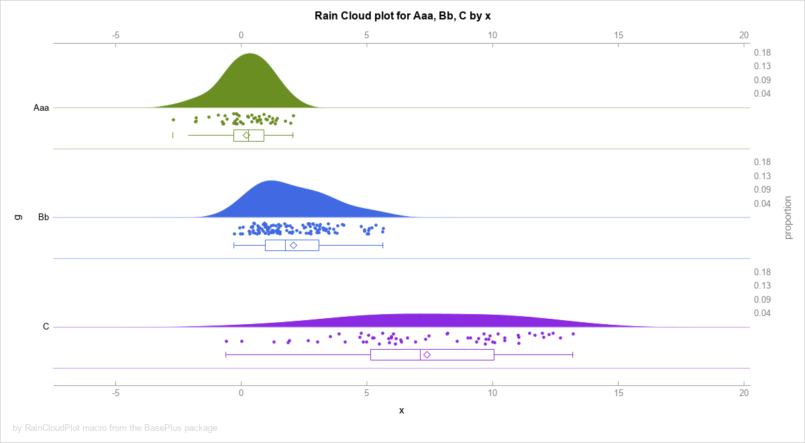

- [The BasePlus package](#baseplus-package)
- [Content description](#content-description)
  * [`%getVars()` macro](#getvars-macro)  
  * [`%QgetVars()` macro](#qgetvars-macro)  
  * [`%symdelGlobal()` macro](#symdelglobal-macro)
  * [`bool.` format](#bool-format)
  * [`boolz.` format](#boolz-format)
  * [`ceil.` format](#ceil-format)
  * [`floor.` format](#floor-format)
  * [`int.` format](#int-format)
  * [`arrFill()` subroutine](#arrfill-subroutine)  
  * [`arrFillC()` subroutine](#arrfillc-subroutine)  
  * [`arrMissFill()` subroutine](#arrmissfill-subroutine)  
  * [`arrMissFillC()` subroutine](#arrmissfillc-subroutine)  
  * [`arrMissToLeft()` subroutine](#arrmisstoleft-subroutine)  
  * [`arrMissToLeftC()` subroutine](#arrmisstoleftc-subroutine)  
  * [`arrMissToRight()` subroutine](#arrmisstoright-subroutine)  
  * [`arrMissToRightC()` subroutine](#arrmisstorightc-subroutine)  
  * [`catXFc()` function](#catxfc-function)  
  * [`catXFi()` function](#catxfi-function)  
  * [`catXFj()` function](#catxfj-function)  
  * [`catXFn()` function](#catxfn-function)  
  * [`delDataset()` function](#deldataset-function)  
  * [`qsortInCbyProcProto()` proto function](#qsortincbyprocproto-proto-function)  
  * [`fromMissingToNumberBS()` function](#frommissingtonumberbs-function)  
  * [`fromNumberToMissing()` function](#fromnumbertomissing-function)  
  * [`quickSort4NotMiss()` subroutine](#quicksort4notmiss-subroutine)  
  * [`quickSortHash()` subroutine](#quicksorthash-subroutine)  
  * [`quickSortHashSDDV()` subroutine](#quicksorthashsddv-subroutine)  
  * [`quickSortLight()` subroutine](#quicksortlight-subroutine) 
  * [`%dedupListS()` macro](#deduplists-macro)
  * [`%dedupListC()` macro](#deduplistc-macro)
  * [`%dedupListP()` macro](#deduplistp-macro)
  * [`%dedupListX()` macro](#deduplistx-macro)
  * [`%QdedupListX()` macro](#qdeduplistx-macro)
  * [`brackets.` format](#brackets-format)
  * [`semicolon.` format](#semicolon-format)
  * [`bracketsC()` function](#bracketsc-function)  
  * [`bracketsN()` function](#bracketsn-function)  
  * [`semicolonC()` function](#semicolonc-function) 
  * [`semicolonN()` function](#semicolonn-function)
  * [`%zipEvalf()` macro](#zipevalf-macro) 
  * [`%QzipEvalf()` macro](#qzipevalf-macro) 
  * [`%functionExists()` macro](#functionexists-macro)
  * [`%RainCloudPlot()` macro](#raincloudplot-macro)
  * [`%zipLibrary()` macro](#ziplibrary-macro)
  * [`%unzipLibrary()` macro](#unziplibrary-macro)
  * [`%LDSN()` macro](#ldsn-macro)
  * [`%LDsNm()` macro](#ldsnm-macro)
  * [`%LVarNm()` macro](#lvarnm-macro)
  * [`%LVarNmLab()` macro](#lvarnmlab-macro)

  
  
  * [License](#license)
  
---

# The BasePlus package [ver. 1.17.2]  ###############################################

The **BasePlus** package implements useful
functions and functionalities I miss in the BASE SAS.

It is inspired by various people, e.g.
- at the SAS-L discussion list
- at the communities.sas.com (SASware Ballot Ideas)
- at the Office...
- etc.

Kudos to all who inspired me to generate this package:
*Mark Keintz*, 
*Paul Dorfman*, 
*Richard DeVenezia*, 
*Christian Graffeuille*,
*Allan Bowe*,
*Anamaria Calai*,
*Michal Ludwicki*,
*Quentin McMullen*.

Recording from the SAS Explore 2022 conference: [A BasePlus Package for SAS](https://communities.sas.com/t5/SAS-Explore-Presentations/A-BasePlus-Package-for-SAS/ta-p/838246 "A BasePlus Package for SAS") (September 27th-29th, 2022).

---

### BASIC EXAMPLES AND USECASES: ####################################################

**Example 1**: One-dimensional array functions.
               Array parameters to subroutine 
               calls must be 1-based.          
~~~~~~~~~~~~~~~~~~~~~~~~~~~~~~~~~~~~~~~~~~~~~~~~~~~~~~~~~~~~~~~~~~~~~~~~~~~~~~~~~~~~~sas
  data _null_;
   array X[4] _temporary_ (. 1 . 2);

   call arrMissToRight(X);
    do i = 1 to 4;
     put X[i]= @;
    end;
    put;

   call arrFillMiss(17, X);
    do i = 1 to 4;
     put X[i]= @;
    end;
    put;

   call arrFill(42, X);
    do i = 1 to 4;
     put X[i]= @;
    end;
  run;
~~~~~~~~~~~~~~~~~~~~~~~~~~~~~~~~~~~~~~~~~~~~~~~~~~~~~~~~~~~~~~~~~~~~~~~~~~~~~~~~~~~~~

**Example 2**: Delete dataset by name.
~~~~~~~~~~~~~~~~~~~~~~~~~~~~~~~~~~~~~~~~~~~~~~~~~~~~~~~~~~~~~~~~~~~~~~~~~~~~~~~~~~~~~sas
  data toDrop;
    x = 17;
  run;
  data _null_;
    p = delDataset("toDrop");
    put p=;
  run;
~~~~~~~~~~~~~~~~~~~~~~~~~~~~~~~~~~~~~~~~~~~~~~~~~~~~~~~~~~~~~~~~~~~~~~~~~~~~~~~~~~~~~

**Example 3**: Strings concatenation with format.
~~~~~~~~~~~~~~~~~~~~~~~~~~~~~~~~~~~~~~~~~~~~~~~~~~~~~~~~~~~~~~~~~~~~~~~~~~~~~~~~~~~~~sas
  data test;
    x =  1 ; y =  . ; z =  3 ;
    t = "t"; u = " "; v = "v";

    array a[*] x y z;
    array b[*] t u v;

    length s1 s2 s3 s4 $ 17;
    s1 = catXFn("z5.", "#", A);
    s2 = catXFi("z5.", "#", A);
    s3 = catXFc("upcase.", "*", B);
    s4 = catXFj("upcase.", "*", B);

    put (_all_) (=);
  run;
~~~~~~~~~~~~~~~~~~~~~~~~~~~~~~~~~~~~~~~~~~~~~~~~~~~~~~~~~~~~~~~~~~~~~~~~~~~~~~~~~~~~~

**Example 4**: Useful formats.
~~~~~~~~~~~~~~~~~~~~~~~~~~~~~~~~~~~~~~~~~~~~~~~~~~~~~~~~~~~~~~~~~~~~~~~~~~~~~~~~~~~~~sas
  data _null_;
    input x @@;
    put @1 x= @11 x= bool. @21 x= int. @31 x= ceil. @41 x= floor.;
  cards;
  . ._ .A -10 -3.14 0 3.14 10
  ;
  run;
~~~~~~~~~~~~~~~~~~~~~~~~~~~~~~~~~~~~~~~~~~~~~~~~~~~~~~~~~~~~~~~~~~~~~~~~~~~~~~~~~~~~~

**Example 5**: Getting variables names from datasets.
~~~~~~~~~~~~~~~~~~~~~~~~~~~~~~~~~~~~~~~~~~~~~~~~~~~~~~~~~~~~~~~~~~~~~~~~~~~~~~~~~~~~~sas
  %put *%getVars(sashelp.class
                ,pattern   = ght$
                ,sep      = +
                ,varRange = _numeric_)*;
~~~~~~~~~~~~~~~~~~~~~~~~~~~~~~~~~~~~~~~~~~~~~~~~~~~~~~~~~~~~~~~~~~~~~~~~~~~~~~~~~~~~~

**Example 6**: Quick sort as an alternative to call sortn()
~~~~~~~~~~~~~~~~~~~~~~~~~~~~~~~~~~~~~~~~~~~~~~~~~~~~~~~~~~~~~~~~~~~~~~~~~~~~~~~~~~~~~sas
  data _null_;
    array test[25000000] _temporary_ ;

    t = time();
      call streaminit(123);
      do _N_ = 25000000 to 1 by -1;
        test[_N_] = rand("uniform");
      end;
    t = time() - t;
    put "Array population time: "  t;

    t = time();
      call quickSortLight (test);
    t = time()-t;
    put "Sorting time: " / t=;
  run;
~~~~~~~~~~~~~~~~~~~~~~~~~~~~~~~~~~~~~~~~~~~~~~~~~~~~~~~~~~~~~~~~~~~~~~~~~~~~~~~~~~~~~

**Example 7**: De-duplicate values from a space separated list.
~~~~~~~~~~~~~~~~~~~~~~~~~~~~~~~~~~~~~~~~~~~~~~~~~~~~~~~~~~~~~~~~~~~~~~~~~~~~~~~~~~~~~sas
  %let list = 4 5 6 1 2 3 1 2 3 4 5 6;
  %put *%dedupListS(&list.)*;
~~~~~~~~~~~~~~~~~~~~~~~~~~~~~~~~~~~~~~~~~~~~~~~~~~~~~~~~~~~~~~~~~~~~~~~~~~~~~~~~~~~~~

**Example 8**: Zip elements of two space separated list.
~~~~~~~~~~~~~~~~~~~~~~~~~~~~~~~~~~~~~~~~~~~~~~~~~~~~~~~~~~~~~~~~~~~~~~~~~~~~~~~~~~~~~sas
%let x = %zipEvalf(1 2 3 4 5 6, 2018 2019 2020, argMd=5, function=MDY, format=date11.);
%put &=x;
~~~~~~~~~~~~~~~~~~~~~~~~~~~~~~~~~~~~~~~~~~~~~~~~~~~~~~~~~~~~~~~~~~~~~~~~~~~~~~~~~~~~~

**Example 9**: Simple Rain Cloud plot.
~~~~~~~~~~~~~~~~~~~~~~~~~~~~~~~~~~~~~~~~~~~~~~~~~~~~~~~~~~~~~~~~~~~~~~~~~~~~~~~~~~~~~sas
%rainCloudPlot(sashelp.cars,DriveTrain,Invoice)
~~~~~~~~~~~~~~~~~~~~~~~~~~~~~~~~~~~~~~~~~~~~~~~~~~~~~~~~~~~~~~~~~~~~~~~~~~~~~~~~~~~~~

**Example 10**: Zip SAS library.
~~~~~~~~~~~~~~~~~~~~~~~~~~~~~~~~~~~~~~~~~~~~~~~~~~~~~~~~~~~~~~~~~~~~~~~~~~~~~~~~~~~~~sas
%zipLibrary(sashelp, libOut=work)

%unzipLibrary(%sysfunc(pathname(work)), zip=sashelp, mode=S, clean=1)
~~~~~~~~~~~~~~~~~~~~~~~~~~~~~~~~~~~~~~~~~~~~~~~~~~~~~~~~~~~~~~~~~~~~~~~~~~~~~~~~~~~~~

**Example 11**: Long dataset names.
~~~~~~~~~~~~~~~~~~~~~~~~~~~~~~~~~~~~~~~~~~~~~~~~~~~~~~~~~~~~~~~~~~~~~~~~~~~~~~~~~~~~~sas
data %LDSN(  work. peanut butter & jelly time with a "Hot-Dog" in [a box], popcorn, and s*t*a*r*s (drop = sex rename=(name=first_name) where = (age in (12,13,14)))  );
  set sashelp.class;
run;

proc print data  = %LDSN(  work. peanut butter & jelly with a "Hot-Dog" in [a box], popcorn, and s*t*a*r*s  );
run;

data MyNextDataset;
  set %LDSN(  work. peanut butter & jelly with a "Hot-Dog" in [a box], popcorn, and s*t*a*r*s  );
  where age > 12;
run;
~~~~~~~~~~~~~~~~~~~~~~~~~~~~~~~~~~~~~~~~~~~~~~~~~~~~~~~~~~~~~~~~~~~~~~~~~~~~~~~~~~~~~

---

Package contains: 
1.   macro      deduplistc 
2.   macro      deduplistp 
3.   macro      deduplists 
4.   macro      deduplistx 
5.   macro      functionexists 
6.   macro      getvars 
7.   macro      ldsn 
8.   macro      ldsnm 
9.   macro      lvarnm 
10.  macro      lvarnmlab 
11.  macro      qdeduplistx 
12.  macro      qgetvars 
13.  macro      qzipevalf 
14.  macro      raincloudplot 
15.  macro      symdelglobal 
16.  macro      unziplibrary 
17.  macro      zipevalf 
18.  macro      ziplibrary 
19.  format     bool 
20.  format     boolz 
21.  format     ceil 
22.  format     floor 
23.  format     int 
24.  functions  arrfill 
25.  functions  arrfillc 
26.  functions  arrmissfill 
27.  functions  arrmissfillc 
28.  functions  arrmisstoleft 
29.  functions  arrmisstoleftc 
30.  functions  arrmisstoright 
31.  functions  arrmisstorightc 
32.  functions  bracketsc 
33.  functions  bracketsn 
34.  functions  catxfc 
35.  functions  catxfi 
36.  functions  catxfj 
37.  functions  catxfn 
38.  functions  deldataset 
39.  functions  semicolonc 
40.  functions  semicolonn 
41.  format     brackets 
42.  format     semicolon 
43.  proto      qsortincbyprocproto 
44.  functions  frommissingtonumberbs 
45.  functions  fromnumbertomissing 
46.  functions  quicksort4notmiss 
47.  functions  quicksorthash 
48.  functions  quicksorthashsddv 
49.  functions  quicksortlight 

*SAS package generated by generatePackage, version 20221121*

The SHA256 hash digest for package BasePlus: 
`EBA9EDB3D50D854288970CC0E965DA6AD5B057F6E6433EEBEC4A02B9A25CF6E2` 

---
# Content description ############################################################################################

## >>> `%getVars()` macro: <<<  #######################  

The getVars() and QgetVars() macro functions
allow to extract variables names form a dataset
according to a given pattern into a list.

The getVars() returns unquoted value [by %unquote()].
The QgetVars() returns quoted value [by %superq()].

See examples below for the details.

The `%getVars()` macro executes like a pure macro code.

### SYNTAX: ###################################################################

The basic syntax is the following, the `<...>` means optional parameters:
~~~~~~~~~~~~~~~~~~~~~~~sas
%getVars(
   ds               
 <,sep=>
 <,pattern=>
 <,varRange=>
 <,quote=>
 <,mcArray=> 
)
~~~~~~~~~~~~~~~~~~~~~~~

**Arguments description**:

1. `ds`              - *Required*, the name of the dataset from 
                       which variables are to be taken.

* `sep = %str( )`    - *Optional*, default value `%str( )`, 
                       a variables separator on the created list. 

* `pattern = .*`     - *Optional*, default value `.*` (i.e. any text), 
                       a variable name regexp pattern, case INSENSITIVE! 

* `varRange = _all_` - *Optional*, default value `_all_`, 
                       a named range list of variables. 

* `quote =`          - *Optional*, default value is blank, a quotation 
                       symbol to be used around values.

* `mcArray=`         - *Optional*, default value is blank.
                       1) When *null* - the macro behaves like a macro function 
                          and returns a text string with variables list.
                       2) When *not null* - behaviour of the macro is altered.
                          In such case a macro array of selected variables, named 
                          with `mcArray` value as a prefix, is created.
                          Furthermore a macro named as `mcArray` value is generated.
                          (see the macroArray package for the details).
                          When `mcArray=` parameter is active the `getVars` macro 
                          cannot be called within the `%put` statement. Execution like: 
                           `%put %getVars(..., mcArray=XXX);` will result with  
                          an Explicit & Radical Refuse Of Run (aka ERROR).

### EXAMPLES AND USECASES: ####################################################

**EXAMPLE 1.** A list of all variables from the 
               sashelp.class dataset:
~~~~~~~~~~~~~~~~~~~~~~~~~~~~~~~~~~~~~~~~~~~~~~~~~~~~~~~~~~~~~~~~sas
  %put *%getVars(sashelp.class)*;
~~~~~~~~~~~~~~~~~~~~~~~~~~~~~~~~~~~~~~~~~~~~~~~~~~~~~~~~~~~~~~~~

**EXAMPLE 2.** A list of all variables from the 
               sashelp.class dataset separated 
               by backslash:
~~~~~~~~~~~~~~~~~~~~~~~~~~~~~~~~~~~~~~~~~~~~~~~~~~~~~~~~~~~~~~~~sas
  %let x = %getVars(sashelp.class, sep=\);
  %put &=x;
~~~~~~~~~~~~~~~~~~~~~~~~~~~~~~~~~~~~~~~~~~~~~~~~~~~~~~~~~~~~~~~~

**EXAMPLE 3.** Use of regular expressions:
 a) A list of variables which name contains "i" or "a" 
~~~~~~~~~~~~~~~~~~~~~~~~~~~~~~~~~~~~~~~~~~~~~~~~~~~~~~~~~~~~~~~~sas
  %put *%getVars(sashelp.class, pattern=i|a)*;
~~~~~~~~~~~~~~~~~~~~~~~~~~~~~~~~~~~~~~~~~~~~~~~~~~~~~~~~~~~~~~~~

 b) A list of variables which name starts with "w"
~~~~~~~~~~~~~~~~~~~~~~~~~~~~~~~~~~~~~~~~~~~~~~~~~~~~~~~~~~~~~~~~sas  
  %put *%getVars(sashelp.class, pattern=^w)*;
~~~~~~~~~~~~~~~~~~~~~~~~~~~~~~~~~~~~~~~~~~~~~~~~~~~~~~~~~~~~~~~~

 c) A list of variables which name ends with "ght"
~~~~~~~~~~~~~~~~~~~~~~~~~~~~~~~~~~~~~~~~~~~~~~~~~~~~~~~~~~~~~~~~sas  
  %put *%getVars(sashelp.class, pattern=ght$)*;
~~~~~~~~~~~~~~~~~~~~~~~~~~~~~~~~~~~~~~~~~~~~~~~~~~~~~~~~~~~~~~~~

**EXAMPLE 4.** A list of numeric variables which name 
               starts with "w" or "h" or ends with "x"
~~~~~~~~~~~~~~~~~~~~~~~~~~~~~~~~~~~~~~~~~~~~~~~~~~~~~~~~~~~~~~~~~~~~~~~~~~~~~~~~~~~~~sas
  %put *%getVars(sashelp.class, sep=+, pattern=^(w|h)|x$, varRange=_numeric_)*;
~~~~~~~~~~~~~~~~~~~~~~~~~~~~~~~~~~~~~~~~~~~~~~~~~~~~~~~~~~~~~~~~~~~~~~~~~~~~~~~~~~~~~

**EXAMPLE 5.**
~~~~~~~~~~~~~~~~~~~~~~~~~~~~~~~~~~~~~~~~~~~~~~~~~~~~~~~~~~~~~~~~~~~~~~~~~~~~~~~~~~~~~sas
  data test;
    array x[30];
    array y[30] $ ;
    array z[30];
  run;
~~~~~~~~~~~~~~~~~~~~~~~~~~~~~~~~~~~~~~~~~~~~~~~~~~~~~~~~~~~~~~~~~~~~~~~~~~~~~~~~~~~~~

 a) A list of variables separated by a comma:
~~~~~~~~~~~~~~~~~~~~~~~~~~~~~~~~~~~~~~~~~~~~~~~~~~~~~~~~~~~~~~~~~~~~~~~~~~~~~~~~~~~~~sas
  %put *%getVars(test, sep=%str(,))*;
~~~~~~~~~~~~~~~~~~~~~~~~~~~~~~~~~~~~~~~~~~~~~~~~~~~~~~~~~~~~~~~~~~~~~~~~~~~~~~~~~~~~~

 b) A list of variables separated by a comma
    with suffix 5 or 7:
~~~~~~~~~~~~~~~~~~~~~~~~~~~~~~~~~~~~~~~~~~~~~~~~~~~~~~~~~~~~~~~~~~~~~~~~~~~~~~~~~~~~~sas
  %put *%getVars(test, sep=%str(,), pattern=(5|7)$)*;
~~~~~~~~~~~~~~~~~~~~~~~~~~~~~~~~~~~~~~~~~~~~~~~~~~~~~~~~~~~~~~~~~~~~~~~~~~~~~~~~~~~~~

 c) A list of variables separated by a comma
    with suffix 5 or 7 from a given variables range:
~~~~~~~~~~~~~~~~~~~~~~~~~~~~~~~~~~~~~~~~~~~~~~~~~~~~~~~~~~~~~~~~~~~~~~~~~~~~~~~~~~~~~sas
  %put *%getVars(test, sep=%str(,), varRange=x10-numeric-z22 y6-y26, pattern=(5|7)$)*;
~~~~~~~~~~~~~~~~~~~~~~~~~~~~~~~~~~~~~~~~~~~~~~~~~~~~~~~~~~~~~~~~~~~~~~~~~~~~~~~~~~~~~

**EXAMPLE 6.** Case of quotes and special characters 
               when the quote= parameter is _not_ used:

 a) one single or double qiote:
~~~~~~~~~~~~~~~~~~~~~~~~~~~~~~~~~~~~~~~~~~~~~~~~~~~~~~~~~~~~~~~~~~~~~~~~~~~~~~~~~~~~~sas
  %put *%bquote(%getVars(sashelp.class, sep=%str(%")))*;
  %put *%bquote(%getVars(sashelp.class, sep=%str(%')))*;
~~~~~~~~~~~~~~~~~~~~~~~~~~~~~~~~~~~~~~~~~~~~~~~~~~~~~~~~~~~~~~~~~~~~~~~~~~~~~~~~~~~~~

 b) two single or double qiotes:
~~~~~~~~~~~~~~~~~~~~~~~~~~~~~~~~~~~~~~~~~~~~~~~~~~~~~~~~~~~~~~~~~~~~~~~~~~~~~~~~~~~~~sas
  %put *"%bquote(%getVars(sashelp.class,sep=""))"*;
  %put *%str(%')%bquote(%getVars(sashelp.class,sep=''))%str(%')*;
~~~~~~~~~~~~~~~~~~~~~~~~~~~~~~~~~~~~~~~~~~~~~~~~~~~~~~~~~~~~~~~~~~~~~~~~~~~~~~~~~~~~~

 c) coma separated double quote list:
~~~~~~~~~~~~~~~~~~~~~~~~~~~~~~~~~~~~~~~~~~~~~~~~~~~~~~~~~~~~~~~~~~~~~~~~~~~~~~~~~~~~~sas
  %put *"%getVars(sashelp.class,sep=%str(", "))"*;
~~~~~~~~~~~~~~~~~~~~~~~~~~~~~~~~~~~~~~~~~~~~~~~~~~~~~~~~~~~~~~~~~~~~~~~~~~~~~~~~~~~~~

 d) coma separated single quote list:
~~~~~~~~~~~~~~~~~~~~~~~~~~~~~~~~~~~~~~~~~~~~~~~~~~~~~~~~~~~~~~~~~~~~~~~~~~~~~~~~~~~~~sas
  %put *%str(%')%getVars(sashelp.class,sep=', ')%str(%')*;
  %let x = %str(%')%getVars(sashelp.class,sep=', ')%str(%');

  %put *%str(%')%QgetVars(sashelp.class,sep=', ')%str(%')*;
  %let y = %str(%')%QgetVars(sashelp.class,sep=', ')%str(%');
  %let z = %unquote(&y.);
~~~~~~~~~~~~~~~~~~~~~~~~~~~~~~~~~~~~~~~~~~~~~~~~~~~~~~~~~~~~~~~~~~~~~~~~~~~~~~~~~~~~~

 e) ampersand (&) as a separator [compare behaviour]:
~~~~~~~~~~~~~~~~~~~~~~~~~~~~~~~~~~~~~~~~~~~~~~~~~~~~~~~~~~~~~~~~~~~~~~~~~~~~~~~~~~~~~sas
  %put *%getVars(sashelp.class,sep=&)*;
  %let x = %getVars(sashelp.class,sep=&);

  %put *%getVars(sashelp.class,sep=%str( & ))*;
  %let x = %getVars(sashelp.class,sep=%str( & ));

  %put *%QgetVars(sashelp.class,sep=&)*;
  %let y = %QgetVars(sashelp.class,sep=&);
  %let z = %unquote(&y.);

  %put *%QgetVars(sashelp.class,sep=%str( & ))*;
  %let y = %QgetVars(sashelp.class,sep=%str( & ));
  %let z = %unquote(&y.);

  %put *%getVars(sashelp.class,sep=&)*;
  %let x = %getVars(sashelp.class,sep=&);

  %put *%getVars(sashelp.class,sep=%str( & ))*;
  %let x = %getVars(sashelp.class,sep=%str( & ));
~~~~~~~~~~~~~~~~~~~~~~~~~~~~~~~~~~~~~~~~~~~~~~~~~~~~~~~~~~~~~~~~~~~~~~~~~~~~~~~~~~~~~

 f) percent (%) as a separator [compare behaviour]:
~~~~~~~~~~~~~~~~~~~~~~~~~~~~~~~~~~~~~~~~~~~~~~~~~~~~~~~~~~~~~~~~~~~~~~~~~~~~~~~~~~~~~sas
  %put *%QgetVars(sashelp.class,sep=%)*;
  %let y = %QgetVars(sashelp.class,sep=%);
  %let z = %unquote(&y.);

  %put *%QgetVars(sashelp.class,sep=%str( % ))*;
  %let y = %QgetVars(sashelp.class,sep=%str( % ));
  %let z = %unquote(&y.);
~~~~~~~~~~~~~~~~~~~~~~~~~~~~~~~~~~~~~~~~~~~~~~~~~~~~~~~~~~~~~~~~~~~~~~~~~~~~~~~~~~~~~

**EXAMPLE 7.** Case of quotes and special characters 
               when the quote= parameter is used:

a) one single or double qiote:
~~~~~~~~~~~~~~~~~~~~~~~~~~~~~~~~~~~~~~~~~~~~~~~~~~~~~~~~~~~~~~~~~~~~~~~~~~~~~~~~~~~~~sas
  %put *%getVars(sashelp.class, quote=%str(%"))*;
  %put *%getVars(sashelp.class, quote=%str(%'))*;
~~~~~~~~~~~~~~~~~~~~~~~~~~~~~~~~~~~~~~~~~~~~~~~~~~~~~~~~~~~~~~~~~~~~~~~~~~~~~~~~~~~~~

 b) two single or double quotes:
~~~~~~~~~~~~~~~~~~~~~~~~~~~~~~~~~~~~~~~~~~~~~~~~~~~~~~~~~~~~~~~~~~~~~~~~~~~~~~~~~~~~~sas
  %* this gives an error:                   ;
  %* %put *%getVars(sashelp.class,quote="")*;
  %* %put *%getVars(sashelp.class,quote='')*;

  %* this does not give an error:         ;
  %put *%QgetVars(sashelp.class,quote="")*;
  %put *%QgetVars(sashelp.class,quote='')*;
~~~~~~~~~~~~~~~~~~~~~~~~~~~~~~~~~~~~~~~~~~~~~~~~~~~~~~~~~~~~~~~~~~~~~~~~~~~~~~~~~~~~~

 c) coma separated double quote list:
~~~~~~~~~~~~~~~~~~~~~~~~~~~~~~~~~~~~~~~~~~~~~~~~~~~~~~~~~~~~~~~~~~~~~~~~~~~~~~~~~~~~~sas
  %put *%getVars(sashelp.class,sep=%str(,),quote=%str(%"))*;
~~~~~~~~~~~~~~~~~~~~~~~~~~~~~~~~~~~~~~~~~~~~~~~~~~~~~~~~~~~~~~~~~~~~~~~~~~~~~~~~~~~~~

 d) coma separated single quote list:
~~~~~~~~~~~~~~~~~~~~~~~~~~~~~~~~~~~~~~~~~~~~~~~~~~~~~~~~~~~~~~~~~~~~~~~~~~~~~~~~~~~~~sas
  %let x = %getVars(sashelp.class,sep=%str(,),quote=%str(%'));
  %put &=x.;
~~~~~~~~~~~~~~~~~~~~~~~~~~~~~~~~~~~~~~~~~~~~~~~~~~~~~~~~~~~~~~~~~~~~~~~~~~~~~~~~~~~~~

**EXAMPLE 8.** Variables that start with `A` and do not end with `GHT`:
~~~~~~~~~~~~~~~~~~~~~~~~~~~~~~~~~~~~~~~~~~~~~~~~~~~~~~~~~~~~~~~~~~~~~~~~~~~~~~~~~~~~~sas
data class;
  set sashelp.class;
  Aeight  = height;
run;

%put *%getVars(class, pattern = ^A(.*)(?<!ght)$, quote=%str(%"))*;
~~~~~~~~~~~~~~~~~~~~~~~~~~~~~~~~~~~~~~~~~~~~~~~~~~~~~~~~~~~~~~~~~~~~~~~~~~~~~~~~~~~~~

**EXAMPLE 9.** Variables that do not start with `N` and do not end with `GHT`:
~~~~~~~~~~~~~~~~~~~~~~~~~~~~~~~~~~~~~~~~~~~~~~~~~~~~~~~~~~~~~~~~~~~~~~~~~~~~~~~~~~~~~sas
data class;
  set sashelp.class;
  Aeight  = height;
  Neight  = height;
run;

%put *%getVars(class, pattern = ^(?!N.*)(.*)(?<!ght)$, quote=%str(%"))*;
~~~~~~~~~~~~~~~~~~~~~~~~~~~~~~~~~~~~~~~~~~~~~~~~~~~~~~~~~~~~~~~~~~~~~~~~~~~~~~~~~~~~~

**EXAMPLE 10.** Composition with itself:
~~~~~~~~~~~~~~~~~~~~~~~~~~~~~~~~~~~~~~~~~~~~~~~~~~~~~~~~~~~~~~~~~~~~~~~~~~~~~~~~~~~~~~~~~~~~~~~~~~~~~sas
  data class;
    set sashelp.class;
    Age_C    = put(Age, best32.);
    Height_C = put(Height, best32.);
    Weight_C = put(Weight, best32.);
  run;

  %put #%getVars(class, varRange=_numeric_, sep=%str(: ))# <- no : at the end!!;

  %put #%getVars(class, varRange=%getVars(class, varRange=_numeric_, sep=%str(: )):, sep=\)#;
~~~~~~~~~~~~~~~~~~~~~~~~~~~~~~~~~~~~~~~~~~~~~~~~~~~~~~~~~~~~~~~~~~~~~~~~~~~~~~~~~~~~~~~~~~~~~~~~~~~~~

**EXAMPLE 11.** Create a macro array `XYZ...` of variables names and an additional 
                macro `%XYZ()` which allows easy access to the list. Can be used with 
                the `%do_over()` macro (provided with the macroArray package).
~~~~~~~~~~~~~~~~~~~~~~~~~~~~~~~~~~~~~~~~~~~~~~~~~~~~~~~~~~~~~~~~~~~~~~~~~~~~~~~~~~~~~sas
  data test;
    array x[30];
    array y[30] $ ;
    array z[30];
  run;

  %getVars(test
          ,mcArray=XYZ
          ,varRange=x10-numeric-z22 y6-y26
          ,pattern=(5|7)$
          ,quote=#)

  %put _user_;
  %put *%XYZ(1)**%XYZ(2)*%XYZ(3)*;
  
  %* Load the macroArray package first. ; 
  %put %do_over(XYZ);
~~~~~~~~~~~~~~~~~~~~~~~~~~~~~~~~~~~~~~~~~~~~~~~~~~~~~~~~~~~~~~~~~~~~~~~~~~~~~~~~~~~~~

---

## >>> `%QgetVars()` macro: <<<  #######################  

The getVars() and QgetVars() macro functions
allow to extract variables names form a dataset
according to a given pattern into a list.

The getVars() returns unquoted value [by %unquote()].
The QgetVars() returns quoted value [by %superq()].

The `%QgetVars()` macro executes like a pure macro code.

### SYNTAX: ###################################################################

The basic syntax is the following, the `<...>` means optional parameters:
~~~~~~~~~~~~~~~~~~~~~~~sas
%QgetVars(
   ds               
 <,sep=>
 <,pattern=>
 <,varRange=>
 <,quote=>          
)
~~~~~~~~~~~~~~~~~~~~~~~

**Arguments description**:

1. `ds`              - *Required*, the name of the dataset from 
                       which variables are to be taken.

* `sep = %str( )`    - *Optional*, default value `%str( )`, 
                       a variables separator on the created list. 

* `pattern = .*`     - *Optional*, default value `.*` (i.e. any text), 
                       a variable name regexp pattern, case INSENSITIVE! 

* `varRange = _all_` - *Optional*, default value `_all_`, 
                       a named range list of variables. 

* `quote =`          - *Optional*, default value is blank, a quotation 
                       symbol to be used around values.

### EXAMPLES AND USECASES: ####################################################

See examples in `%getVars()` help for the details.

---

## >>> `%symdelGlobal()` macro: <<<  #######################

The `%symdelGlobal()` macro deletes all global macrovariables
created by the user. The only exceptions are read only variables
and variables the one which starts with SYS, AF, or FSP.
In that case a warning is printed in the log.

One temporary global macrovariable `________________98_76_54_32_10_` 
and a dataset, in `work` library, named `_%sysfunc(datetime(),hex7.)`
are created and deleted during the process.

The `%symdelGlobal()` macro executes like a pure macro code.

### SYNTAX: ###################################################################

The basic syntax is the following, the `<...>` means optional parameters:
~~~~~~~~~~~~~~~~~~~~~~~sas
%symdelGlobal(
 info
)
~~~~~~~~~~~~~~~~~~~~~~~

**Arguments description**:

1. `info` - *Optional*, default value should be empty, 
            if set to `NOINFO` or `QUIET` then infos and 
            warnings about variables deletion are suspended. 

 
### EXAMPLES AND USECASES: ####################################################

**EXAMPLE 1.** Basic use-case one. 
    Delete global macrovariables, info notes 
    and warnings are printed in the log.

~~~~~~~~~~~~~~~~~~~~~~~~~~~~~~~~~~~~~~~~~~~~~~~~~~~~~~~~~~~~~~~~sas
  %let a = 1;
  %let b = 2;
  %let c = 3;
  %let sys_my_var = 11;
  %let  af_my_var = 22;
  %let fsp_my_var = 33;
  %global / readonly read_only_x = 1234567890;

  %put _user_;

  %symdelGlobal();

  %put _user_;
~~~~~~~~~~~~~~~~~~~~~~~~~~~~~~~~~~~~~~~~~~~~~~~~~~~~~~~~~~~~~~~~

**EXAMPLE 2.** Basic use-case two. 
    Delete global macrovariables in quite mode
    No info notes and warnings are printed in the log.

~~~~~~~~~~~~~~~~~~~~~~~~~~~~~~~~~~~~~~~~~~~~~~~~~~~~~~~~~~~~~~~~sas
  %let a = 1;
  %let b = 2;
  %let c = 3;
  %let sys_my_var = 11;
  %let  af_my_var = 22;
  %let fsp_my_var = 33;
  %global / readonly read_only_x = 1234567890;

  %put _user_;
  %put *%symdelGlobal(NOINFO)*;
  %put _user_;
~~~~~~~~~~~~~~~~~~~~~~~~~~~~~~~~~~~~~~~~~~~~~~~~~~~~~~~~~~~~~~~~
---

## >>> `bool.` format: <<<  #######################

The **bool** format returns: 
*zero* for 0 or missing, 
*one* for other values.

### EXAMPLES AND USECASES: #################################################### 

It allows for a %sysevalf()'ish
conversion-type [i.e. `%sysevalf(1.7 & 4.2, boolean)`]
inside the `%sysfunc()` [e.g. `%sysfunc(aFunction(), bool.)`]

--- 

## >>> `boolz.` format: <<<  #######################

The **boolz** format returns:
*zero* for 0 or missing, 
*one* for other values.

*Fuzz* value is 0.

### EXAMPLES AND USECASES: #################################################### 

It allows for a %sysevalf()'ish
conversion-type [i.e. `%sysevalf(1.7 & 4.2, boolean)`]
inside the `%sysfunc()` [e.g. `%sysfunc(aFunction(), boolz.)`]

--- 

## >>> `ceil.` format: <<<  #######################

The **ceil** format is a "wrapper" for the `ceil()` function. 

### EXAMPLES AND USECASES: #################################################### 

It allows for a %sysevalf()'ish
conversion-type [i.e. `%sysevalf(1.7 + 4.2, ceil)`]
inside the `%sysfunc()` [e.g. `%sysfunc(aFunction(), ceil.)`]

--- 

## >>> `floor.` format: <<<  #######################

The **floor** format is a "wrapper" for the `floor()` function.

### EXAMPLES AND USECASES: #################################################### 

It allows for a %sysevalf()'ish
conversion-type [i.e. `%sysevalf(1.7 + 4.2, floor)`]
inside the `%sysfunc()` [e.g. `%sysfunc(aFunction(), floor.)`]

--- 

## >>> `int.` format: <<<  #######################

The **int** format is a "wrapper" for the `int()` function. 

### EXAMPLES AND USECASES: #################################################### 

It allows for a %sysevalf()'ish
conversion-type [i.e. `%sysevalf(1.7 + 4.2, integer)`]
inside the `%sysfunc()` [e.g. `%sysfunc(aFunction(), int.)`]

--- 

## >>> `arrFill()` subroutine: <<<  #######################  

The **arrFill()** subroutine is a wrapper 
for the Call Fillmatrix() [a special FCMP subroutine]. 

A numeric array is filled with selected numeric value, e.g.

for array `A = [. . . .]` the subroutine
`call arrFill(42, A)` returns `A = [42 42 42 42]`

*Caution!* Array parameters to subroutine calls *must* be 1-based.

### SYNTAX: ###################################################################

The basic syntax is the following, the `<...>` means optional parameters:
~~~~~~~~~~~~~~~~~~~~~~~sas
call arrFill(N ,A)
~~~~~~~~~~~~~~~~~~~~~~~

**Arguments description**:

1. `N` - Numeric value.

2. `A` - Numeric array.

 
### EXAMPLES AND USECASES: ####################################################

**Example 1.**
~~~~~~~~~~~~~~~~~~~~~~~~~~~~~~~~~~~~~~~~~~~~~~~~~~~~~~~~~~~~~~~~sas
data _null_;
 array X[*] a b c;

 put "before: " (_all_) (=);
 call arrFill(42, X);
 put "after:  " (_all_) (=);

run;
~~~~~~~~~~~~~~~~~~~~~~~~~~~~~~~~~~~~~~~~~~~~~~~~~~~~~~~~~~~~~~~~

---

## >>> `arrFillC()` subroutine: <<<  #######################  

The **arrFillC()** subroutine fills 
a character array with selected character value, e.g. 

for array `A = [" ", " ", " "]` the subroutine
`call arrFillC("B", A)` returns `A = ["B", "B", "B"]`

*Caution!* Array parameters to subroutine calls *must* be 1-based.

### SYNTAX: ###################################################################

The basic syntax is the following, the `<...>` means optional parameters:
~~~~~~~~~~~~~~~~~~~~~~~sas
call arrFillC(C ,A)
~~~~~~~~~~~~~~~~~~~~~~~

**Arguments description**:

1. `C` - Character value.

2. `A` - Character array.

 
### EXAMPLES AND USECASES: ####################################################

**Example 1.**
~~~~~~~~~~~~~~~~~~~~~~~~~~~~~~~~~~~~~~~~~~~~~~~~~~~~~~~~~~~~~~~~sas
data _null_;
 array X[*] $ a b c;

 put "before: " (_all_) (=);
 call arrFillC("ABC", X);
 put "after:  " (_all_) (=);

run;
~~~~~~~~~~~~~~~~~~~~~~~~~~~~~~~~~~~~~~~~~~~~~~~~~~~~~~~~~~~~~~~~

---

## >>> `arrMissFill()` subroutine: <<<  #######################  

The **arrMissFill()** subroutine fills 
all missing values (i.e. less or equal than `.Z`) 
of a numeric array with selected numeric value, e.g.

for array `A = [1 . . 4]` the subroutine
`call arrMissFill(42, A)` returns `A = [1 42 42 4]`

*Caution!* Array parameters to subroutine calls *must* be 1-based.

### SYNTAX: ###################################################################

The basic syntax is the following, the `<...>` means optional parameters:
~~~~~~~~~~~~~~~~~~~~~~~sas
call arrMissFill(N ,A)
~~~~~~~~~~~~~~~~~~~~~~~

**Arguments description**:

1. `N` - Numeric value.

2. `A` - Numeric array.

 
### EXAMPLES AND USECASES: ####################################################

**Example 1.**
~~~~~~~~~~~~~~~~~~~~~~~~~~~~~~~~~~~~~~~~~~~~~~~~~~~~~~~~~~~~~~~~sas
data have;
  input a b c;
cards4;
1 . 3
. 2 .
. . 3
;;;;
run;

data _null_;
 set have ;
 array X[*] a b c;

 put "before: " (_all_) (=);
 call arrMissFill(42, X);
 put "after:  " (_all_) (=);

run;
~~~~~~~~~~~~~~~~~~~~~~~~~~~~~~~~~~~~~~~~~~~~~~~~~~~~~~~~~~~~~~~~

---

## >>> `arrMissFillC()` subroutine: <<<  #######################  

The **arrMissFillC()** subroutine fills 
all missing values of a character array 
with selected character value, e.g. 

for array `A = ["A", " ", "C"]` the subroutine
`call arrMissFillC("B", A)` returns `A = ["A", "B", "C"]`

*Caution!* Array parameters to subroutine calls *must* be 1-based.

### SYNTAX: ###################################################################

The basic syntax is the following, the `<...>` means optional parameters:
~~~~~~~~~~~~~~~~~~~~~~~sas
call arrMissFillC(C, A)
~~~~~~~~~~~~~~~~~~~~~~~

**Arguments description**:

1. `C` - Character value.

2. `A` - Character array.

 
### EXAMPLES AND USECASES: ####################################################

**Example 1.**
~~~~~~~~~~~~~~~~~~~~~~~~~~~~~~~~~~~~~~~~~~~~~~~~~~~~~~~~~~~~~~~~sas
data have;
  infile cards dsd dlm="," missover;
  input (a b c) (: $ 1.);
cards4;
A, ,C
 ,B, 
 , ,C
;;;;
run;

data _null_;
 set have ;
 array X[*] $ a b c;

 put "before: " (_all_) (=);
 call arrMissFillC("X", X);
 put "after:  " (_all_) (=);

run;
~~~~~~~~~~~~~~~~~~~~~~~~~~~~~~~~~~~~~~~~~~~~~~~~~~~~~~~~~~~~~~~~

---

## >>> `arrMissToLeft()` subroutine: <<<  #######################  

The **arrMissToLeft()** subroutine shifts 
all non-missing (i.e. greater than `.Z`) 
numeric elements to the right side of an array 
and missing values to the left, e.g. 

for array `A = [1 . 2 . 3]` the subroutine
`call arrMissToLeft(A)` returns `A = [. . 1 2 3]`

All missing values are replaced with the dot (`.`)

*Caution!* Array parameters to subroutine calls *must* be 1-based.

### SYNTAX: ###################################################################

The basic syntax is the following, the `<...>` means optional parameters:
~~~~~~~~~~~~~~~~~~~~~~~sas
call arrMissToLeft(A)
~~~~~~~~~~~~~~~~~~~~~~~

**Arguments description**:

1. `A` - Numeric array.

### EXAMPLES AND USECASES: ####################################################

**Example 1.**
~~~~~~~~~~~~~~~~~~~~~~~~~~~~~~~~~~~~~~~~~~~~~~~~~~~~~~~~~~~~~~~~sas
data have;
  input a b c;
cards4;
1 . 3
. 2 .
. . 3
;;;;
run;

data _null_;
 set have ;
 array X[*] a b c;

 put "before: " (_all_) (=);
 call arrMissToLeft(X);
 put "after:  " (_all_) (=);

run;
~~~~~~~~~~~~~~~~~~~~~~~~~~~~~~~~~~~~~~~~~~~~~~~~~~~~~~~~~~~~~~~~

---

## >>> `arrMissToLeftC()` subroutine: <<<  #######################  

The **arrMissToLeftC()** subroutine shifts 
all non-missing (i.e. different than empty string) 
character elements to the right side of an array 
and all missing values to the left, e.g. 

for array `A = ["A", " ", "B", " ", "C"]` the subroutine
`call arrMissToLeftC(A)` returns `A = [" ", " ", "A", "B", "C"]`

*Caution!* Array parameters to subroutine calls *must* be 1-based.

### SYNTAX: ###################################################################

The basic syntax is the following, the `<...>` means optional parameters:
~~~~~~~~~~~~~~~~~~~~~~~sas
call arrMissToLeftC(A)
~~~~~~~~~~~~~~~~~~~~~~~

**Arguments description**:

1. `A` - Character array.

 
### EXAMPLES AND USECASES: ####################################################

**Example 1.**
~~~~~~~~~~~~~~~~~~~~~~~~~~~~~~~~~~~~~~~~~~~~~~~~~~~~~~~~~~~~~~~~sas
data have;
  infile cards dsd dlm="," missover;
  input (a b c) (: $ 1.);
cards4;
A, ,C
 ,B, 
 , ,C
;;;;
run;

data _null_;
 set have ;
 array X[*] $ a b c;

 put "before: " (_all_) (=);
 call arrMissToLeftC(X);
 put "after:  " (_all_) (=);

run;
~~~~~~~~~~~~~~~~~~~~~~~~~~~~~~~~~~~~~~~~~~~~~~~~~~~~~~~~~~~~~~~~

---

## >>> `arrMissToRight()` subroutine: <<<  #######################  

The **arrMissToRight()** subroutine shifts 
all non-missing (i.e. greater than `.Z`) 
numeric elements to the left side of an array 
and missing values to the right, e.g.

for array `A = [1 . 2 . 3]` the subroutine
`call arrMissToRight(A)` returns `A = [1 2 3 . .]`

All missing values are replaced with the dot (`.`)

*Caution!* Array parameters to subroutine calls *must* be 1-based.

### SYNTAX: ###################################################################

The basic syntax is the following, the `<...>` means optional parameters:
~~~~~~~~~~~~~~~~~~~~~~~sas
call arrMissToRight(A)
~~~~~~~~~~~~~~~~~~~~~~~

**Arguments description**:

1. `A` - Numeric array.

 
### EXAMPLES AND USECASES: ####################################################

**Example 1.**
~~~~~~~~~~~~~~~~~~~~~~~~~~~~~~~~~~~~~~~~~~~~~~~~~~~~~~~~~~~~~~~~sas
data have;
  input a b c;
cards4;
1 . 3
. 2 .
. . 3
;;;;
run;

data _null_;
 set have ;
 array X[*] a b c;

 put "before: " (_all_) (=);
 call arrMissToRight(X);
 put "after:  " (_all_) (=);

run;
~~~~~~~~~~~~~~~~~~~~~~~~~~~~~~~~~~~~~~~~~~~~~~~~~~~~~~~~~~~~~~~~

---

## >>> `arrMissToRightC()` subroutine: <<<  #######################  

The **arrMissToRightC()** subroutine shifts 
all non-missing (i.e. different than empty string) 
character elements to the left side of an array 
and missing values to the right, e.g. 

for array `A = ["A", " ", "B", " ", "C"]` the subroutine
`call arrMissToRightC(A)` returns `A = ["A", "B", "C", " ", " "]`

*Caution!* Array parameters to subroutine calls *must* be 1-based.

### SYNTAX: ###################################################################

The basic syntax is the following, the `<...>` means optional parameters:
~~~~~~~~~~~~~~~~~~~~~~~sas
call arrMissToRightC(A)
~~~~~~~~~~~~~~~~~~~~~~~

**Arguments description**:

1. `A` - Character array.

 
### EXAMPLES AND USECASES: ####################################################

**Example 1.**
~~~~~~~~~~~~~~~~~~~~~~~~~~~~~~~~~~~~~~~~~~~~~~~~~~~~~~~~~~~~~~~~sas
data have;
  infile cards dsd dlm="," missover;
  input (a b c) (: $ 1.);
cards4;
A, ,C
 ,B, 
 , ,C
;;;;
run;

data _null_;
 set have ;
 array X[*] $ a b c;

 put "before: " (_all_) (=);
 call arrMissToRightC(X);
 put "after:  " (_all_) (=);

run;
~~~~~~~~~~~~~~~~~~~~~~~~~~~~~~~~~~~~~~~~~~~~~~~~~~~~~~~~~~~~~~~~

---

## >>> `catXFc()` function: <<<  #######################  

The **catXFc()** function is a wrapper 
of the `catX()` function but with ability 
to format character values. 

For array `A = ["a", " ", "c"]` the 
`catXFc("upcase.", "*", A)` returns `"A*C"`. 

If format does not handle nulls they are ignored. 

*Caution!* Array parameters to function calls *must* be 1-based. 

### SYNTAX: ###################################################################

The basic syntax is the following, the `<...>` means optional parameters:
~~~~~~~~~~~~~~~~~~~~~~~sas
catXFc(format, delimiter, A)
~~~~~~~~~~~~~~~~~~~~~~~

**Arguments description**:

1. `format`    - A name of the *character* format to be used.

2. `delimiter` - A delimiter string to be used.

3. `A`         - Character array

 
### EXAMPLES AND USECASES: ####################################################

**Example 1.**
~~~~~~~~~~~~~~~~~~~~~~~~~~~~~~~~~~~~~~~~~~~~~~~~~~~~~~~~~~~~~~~~sas
data _null_;
  t = "t";
  u = " ";
  v = "v";

  array b[*] t u v;

  length s $ 17;
  s = catXFc("upcase.", "*", B);
  put (_all_) (=);
run;
~~~~~~~~~~~~~~~~~~~~~~~~~~~~~~~~~~~~~~~~~~~~~~~~~~~~~~~~~~~~~~~~

---

## >>> `catXFi()` function: <<<  #######################  

The **catXFi()** function is a wrapper 
of the `catX()` function but with ability 
to format numeric values but 
IGNORES missing values (i.e. `._`, `.`, `.a`, ..., `.z`). 

For array `A = [0, ., 2]` the 
`catXFi("date9.", "#", A)` returns 
`"01JAN1960#03JAN1960"` 

*Caution!* Array parameters to function calls *must* be 1-based. 

### SYNTAX: ###################################################################

The basic syntax is the following, the `<...>` means optional parameters:
~~~~~~~~~~~~~~~~~~~~~~~sas
catXFi(format, delimiter, A)
~~~~~~~~~~~~~~~~~~~~~~~

**Arguments description**:

1. `format`    - A name of the *numeric* format to be used.

2. `delimiter` - A delimiter string to be used.

3. `A`         - Numeric array

 
### EXAMPLES AND USECASES: ####################################################

**Example 1.**
~~~~~~~~~~~~~~~~~~~~~~~~~~~~~~~~~~~~~~~~~~~~~~~~~~~~~~~~~~~~~~~~sas
data _null_;
  x = 1;
  y = .;
  z = 3;

  array a[*] x y z;

  length s $ 17;
  s = catXFi("z5.", "#", A);
  put (_all_) (=);
run;
~~~~~~~~~~~~~~~~~~~~~~~~~~~~~~~~~~~~~~~~~~~~~~~~~~~~~~~~~~~~~~~~

---

## >>> `catXFj()` function: <<<  #######################  

The **catXFj()** function is a wrapper 
of the catX() function but with ability 
to format character values. 

For array `A = ["a", " ", "c"]` the 
`catXFj("upcase.", "*", A)` returns `"A**C"` 

If format does not handle nulls they are 
printed as an empty string. 

*Caution!* Array parameters to function calls *must* be 1-based. 

### SYNTAX: ###################################################################

The basic syntax is the following, the `<...>` means optional parameters:
~~~~~~~~~~~~~~~~~~~~~~~sas
catXFj(format, delimiter, A)
~~~~~~~~~~~~~~~~~~~~~~~

**Arguments description**:

1. `format`    - A name of the *character* format to be used.

2. `delimiter` - A delimiter string to be used.

3. `A`         - Character array

 
### EXAMPLES AND USECASES: ####################################################

**Example 1.**
~~~~~~~~~~~~~~~~~~~~~~~~~~~~~~~~~~~~~~~~~~~~~~~~~~~~~~~~~~~~~~~~sas
data _null_;
  t = "t";
  u = " ";
  v = "v";

  array b[*] t u v;

  length s $ 17;
  s = catXFj("upcase.", "*", B);
  put (_all_) (=);
run;
~~~~~~~~~~~~~~~~~~~~~~~~~~~~~~~~~~~~~~~~~~~~~~~~~~~~~~~~~~~~~~~~

---

## >>> `catXFn()` function: <<<  #######################  

The **catXFn()** function is a wrapper 
of the `catX()` function but with ability 
to format numeric values. 

For array `A = [0, 1, 2]` the 
`catXFn("date9.", "#", A)` returns 
`"01JAN1960#02JAN1960#03JAN1960"`

*Caution!* Array parameters to function calls *must* be 1-based. 

### SYNTAX: ###################################################################

The basic syntax is the following, the `<...>` means optional parameters:
~~~~~~~~~~~~~~~~~~~~~~~sas
catXFn(format, delimiter, A)
~~~~~~~~~~~~~~~~~~~~~~~

**Arguments description**:

1. `format`    - A name of the *numeric* format to be used.

2. `delimiter` - A delimiter string to be used.

3. `A`         - Numeric array

 
### EXAMPLES AND USECASES: ####################################################

**Example 1.**
~~~~~~~~~~~~~~~~~~~~~~~~~~~~~~~~~~~~~~~~~~~~~~~~~~~~~~~~~~~~~~~~sas
data _null_;
  x = 1;
  y = .;
  z = 3;

  array a[*] x y z;

  length s $ 17;
  s = catXFn("z5.", "#", A);
  put (_all_) (=);
run;
~~~~~~~~~~~~~~~~~~~~~~~~~~~~~~~~~~~~~~~~~~~~~~~~~~~~~~~~~~~~~~~~

---

## >>> `delDataset()` function: <<<  #######################  

The **delDataset()** function is a "wrapper" 
for the `Fdelete()` function. 
`delDataset()` function uses a text string with 
a dataset name as an argument.

Function checks for `*.sas7bdat`, `*.sas7bndx`, 
and `*.sas7bvew` files and delete them.
Return code of 0 means dataset was deleted.

For compound library files are 
deleted from _ALL_ locations!

*Note:*
Currently only the BASE SAS engine datasets/views are deleted.

Tested on Windows and Linux. Not tested on Z/OS.

### SYNTAX: ###################################################################

The basic syntax is the following, the `<...>` means optional parameters:
~~~~~~~~~~~~~~~~~~~~~~~sas
delDataset(lbds_)
~~~~~~~~~~~~~~~~~~~~~~~

**Arguments description**:

1. `lbds_` - *Required*, character argument containing 
             name of the dataset/view to be deleted.
             The `_last_` special name is honored.
 
### EXAMPLES AND USECASES: ####################################################

**EXAMPLE 1.**
~~~~~~~~~~~~~~~~~~~~~~~~~~~~~~~~~~~~~~~~~~~~~~~~~~~~~~~~~~~~~~~~sas
  data TEST1 TEST2(index=(x));
    x = 17;
  run;

  data TEST3 / view=TEST3;
    set test1;
  run;

  data _null_;
    p = delDataset("WORK.TEST1");
    put p=;

    p = delDataset("TEST2");
    put p=;

    p = delDataset("WORK.TEST3");
    put p=;
  run;
~~~~~~~~~~~~~~~~~~~~~~~~~~~~~~~~~~~~~~~~~~~~~~~~~~~~~~~~~~~~~~~~

**Example 2.**
~~~~~~~~~~~~~~~~~~~~~~~~~~~~~~~~~~~~~~~~~~~~~~~~~~~~~~~~~~~~~~~~sas
  data TEST4;
    x=42;
  run;
  data _null_;
    p = delDataset("_LAST_");
    put p=;
  run;
~~~~~~~~~~~~~~~~~~~~~~~~~~~~~~~~~~~~~~~~~~~~~~~~~~~~~~~~~~~~~~~~

**Example 3.**
~~~~~~~~~~~~~~~~~~~~~~~~~~~~~~~~~~~~~~~~~~~~~~~~~~~~~~~~~~~~~~~~sas
  options dlcreatedir;
  libname user "%sysfunc(pathname(work))/user";

  data TEST5;
    x=42;
  run;

  data _null_;
    p = delDataset("test5");
    put p=;
  run;

  libname user clear;
~~~~~~~~~~~~~~~~~~~~~~~~~~~~~~~~~~~~~~~~~~~~~~~~~~~~~~~~~~~~~~~~

**Example 4.**
~~~~~~~~~~~~~~~~~~~~~~~~~~~~~~~~~~~~~~~~~~~~~~~~~~~~~~~~~~~~~~~~sas
  data TEST6;
    x=42;
  run;

  %put *%sysfunc(delDataset(test6))*;
~~~~~~~~~~~~~~~~~~~~~~~~~~~~~~~~~~~~~~~~~~~~~~~~~~~~~~~~~~~~~~~~

**Example 5.**
~~~~~~~~~~~~~~~~~~~~~~~~~~~~~~~~~~~~~~~~~~~~~~~~~~~~~~~~~~~~~~~~~~~~~~~~~~~~~~~~~sas
  options dlcreatedir;
  libname L1 "%sysfunc(pathname(work))/L)1";
  libname L2 "%sysfunc(pathname(work))/L(2";
  libname L3 "%sysfunc(pathname(work))/L'3";

  data L1.TEST7 L2.TEST7 L3.TEST7;
    x=42;
  run;

  libname L12 ("%sysfunc(pathname(work))/L(1" "%sysfunc(pathname(work))/L)2");
  libname L1L2 (L2 L3);

  %put *%sysfunc(delDataset(L12.test7))*;
  %put *%sysfunc(delDataset(L1L2.test7))*;
~~~~~~~~~~~~~~~~~~~~~~~~~~~~~~~~~~~~~~~~~~~~~~~~~~~~~~~~~~~~~~~~~~~~~~~~~~~~~~~~~

---

## >>> `qsortInCbyProcProto()` proto function: <<<  #######################  

The **qsortInCbyProcProto()** is external *C* function, 
this is the implementation of the *Quick Sort* algorithm. 

The function is used **internally** by 
functions in the *BasePlus* package.

Asumptions:
- smaller subarray is sorted first, 
- subarrays of *size < 11* are sorted by *insertion sort*, 
- pivot is selected as median of low index value, 
  high index value, and (low+high)/2 index value.

`!!!!!!!!!!!!!!!!!!!!!!!!!!!!!!!!!!!!!!!!!!!!!!!!!!!!!!!!!!!` 
`!CAUTION! Sorted array CANNOT contains SAS missing values !` 
`!!!!!!!!!!!!!!!!!!!!!!!!!!!!!!!!!!!!!!!!!!!!!!!!!!!!!!!!!!!` 

### SYNTAX: ###################################################################

The basic syntax is the following:
~~~~~~~~~~~~~~~~~~~~~~~~~~~~~~~~~~~~~~~~~~~~~~~~~~~~~~~~~~~~~~~~~~~~~sas
qsortInCbyProcProto(arr, low, high)
~~~~~~~~~~~~~~~~~~~~~~~~~~~~~~~~~~~~~~~~~~~~~~~~~~~~~~~~~~~~~~~~~~~~~

**Arguments description**:

1. `arr`  - An array of double type to be sorted.

2. `low`  - An integer low index of starting position (from which the sorting is done).

3. `high` - An integer high index of ending position (up to which the sorting is done).

 
### REFERENCES: ####################################################

*Reference 1.*

Insertion sort for arrays smaller then 11 elements: 

Based on the code from the following WikiBooks page [2020.08.14]:

[https://pl.wikibooks.org/wiki/Kody_%C5%BAr%C3%B3d%C5%82owe/Sortowanie_przez_wstawianie](https://pl.wikibooks.org/wiki/Kody_%C5%BAr%C3%B3d%C5%82owe/Sortowanie_przez_wstawianie)

 
*Reference 2.*

Iterative Quick Sort:  

Based on the code from the following pages [2020.08.14]:

[https://www.geeksforgeeks.org/iterative-quick-sort/](https://www.geeksforgeeks.org/iterative-quick-sort/)

[https://www.geeksforgeeks.org/c-program-for-iterative-quick-sort/](https://www.geeksforgeeks.org/c-program-for-iterative-quick-sort/)

---

## >>> `fromMissingToNumberBS()` function: <<<  #######################  

The **fromMissingToNumberBS()** function 
gets numeric missing value or a number 
as an argument and returns an integer 
from 1 to 29.

For a numeric missing argument 
the returned values are:
- 1 for `._`
- 2 for `.`
- 3 for `.a`
-   ...
- 28 for `.z` and
- 29 for *all other*.

The function is used **internally** by 
functions in the *BasePlus* package.

For *missing value arguments* the function
is an inverse of the `fromNumberToMissing()` function.

### SYNTAX: ###################################################################

The basic syntax is the following, the `<...>` means optional parameters:
~~~~~~~~~~~~~~~~~~~~~~~sas
fromMissingToNumberBS(x)
~~~~~~~~~~~~~~~~~~~~~~~

**Arguments description**:

1. `x` - A numeric missing value or a number.

 
### EXAMPLES AND USECASES: ####################################################

**EXAMPLE 1.**
~~~~~~~~~~~~~~~~~~~~~~~~~~~~~~~~~~~~~~~~~~~~~~~~~~~~~~~~~~~~~~~~sas
  data _null_;
    do x = ._, ., .a, .b, .c, 42;
      y = fromMissingToNumberBS(x);
      put x= y=; 
    end;
  run;
~~~~~~~~~~~~~~~~~~~~~~~~~~~~~~~~~~~~~~~~~~~~~~~~~~~~~~~~~~~~~~~~

---

## >>> `fromNumberToMissing()` function: <<<  #######################  

The **fromNumberToMissing()** function 
gets a number as an argument and returns 
a numeric missing value or zero.

For a numeric argument 
the returned values are:
- `._` for 1
- `.`  for 2
- `.a` for 3
-   ...
- `.z` for 28 and
- `0`  for *all other*.

The function is used **internally** by 
functions in the *BasePlus* package.

For arguments 1,2,3, ..., and 28 the function
is an inverse of the `fromMissingToNumberBS()` function.

### SYNTAX: ###################################################################

The basic syntax is the following, the `<...>` means optional parameters:
~~~~~~~~~~~~~~~~~~~~~~~sas
fromNumberToMissing(x)
~~~~~~~~~~~~~~~~~~~~~~~

**Arguments description**:

1. `x` - A numeric value.

 
### EXAMPLES AND USECASES: ####################################################

**EXAMPLE 1.**
~~~~~~~~~~~~~~~~~~~~~~~~~~~~~~~~~~~~~~~~~~~~~~~~~~~~~~~~~~~~~~~~sas
  data _null_;
    do x = 1 to 29;
      y = fromNumberToMissing(x);
      put x= y=; 
    end;
  run;
~~~~~~~~~~~~~~~~~~~~~~~~~~~~~~~~~~~~~~~~~~~~~~~~~~~~~~~~~~~~~~~~

---
 
## >>> `quickSort4NotMiss()` subroutine: <<<  #######################  

The **quickSort4NotMiss()** subroutine is an alternative to the 
`CALL SORTN()` subroutine for 1-based big arrays (i.e. `> 10'000'000` elements)
when memory used by `call sortn()` may be an issue.
For smaller arrays the memory footprint is not significant.

The subroutine is based on an iterative quick sort algorithm 
implemented in the `qsortInCbyProcProto()` *C* prototype function.

**Caution 1!** Array _CANNOT_ contains missing values!

**Caution 2!** Array parameters to subroutine calls must be 1-based.

### SYNTAX: ###################################################################

The basic syntax is the following, the `<...>` means optional parameters:
~~~~~~~~~~~~~~~~~~~~~~~~~~~~~~~~~~~~~~~~~~~~~~sas
call quickSort4NotMiss(A)
~~~~~~~~~~~~~~~~~~~~~~~~~~~~~~~~~~~~~~~~~~~~~~

**Arguments description**:

1. `A` - Argument is a 1-based array of NOT missing numeric values.

 
### EXAMPLES AND USECASES: ####################################################

**EXAMPLE 1.** For session with 8GB of RAM,
               array of size 250'000'000 with values in range 
               from 0 to 99'999'999 and _NO_ missing values.
~~~~~~~~~~~~~~~~~~~~~~~~~~~~~~~~~~~~~~~~~~~~~~~~~~~~~~~~~~~~~~~~sas
  %let size = 250000000;
  options fullstimer;

  data _null_;
    array test[&size.] _temporary_ ;

    t = time();
    call streaminit(123);
    do _N_ = &size. to 1 by -1;
      test[_N_] = int(100000000*rand("uniform"));
    end;
    t = time() - t;
    put "Array population time: "  t;

    put "First 50 elements before sorting:";
    do _N_ = 1 to 20;
      put test[_N_] = @;
    end;  

    t = time();
    call quickSort4NotMiss (test);
    t = time()-t;
    put "Sorting time: " / t=;

    put; put "First 50 elements after sorting:";
    do _N_ = 1 to 20;
      put test[_N_] = @;
    end;
  run;
~~~~~~~~~~~~~~~~~~~~~~~~~~~~~~~~~~~~~~~~~~~~~~~~~~~~~~~~~~~~~~~~

**Example 2.** Resources comparison for 
               session with 8GB of RAM.

  Array of size 250'000'000 with random values 
  from 0 to 999'999'999 and _NO_ missing values.
~~~~~~~~~~~~~~~~~~~~~~~~~~~~~~~~~~~~~~~~~~~~~~~~~~~~~~~~~~~~~~~~sas
    Array:
      Population time     8.82s
      memory              1'953'470.62k
      OS Memory           1'977'436.00k

    Call quickSort4NotMiss:
      Sorting time        66.92s
      Memory              1'954'683.06k
      OS Memory           1'977'436.00k

    Call quickSortLight:
      Sorting time        70.98s
      Memory              1'955'479.71k
      OS Memory           1'977'436.00k
~~~~~~~~~~~~~~~~~~~~~~~~~~~~~~~~~~~~~~~~~~~~~~~~~~~~~~~~~~~~~~~~

---
 
## >>> `quickSortHash()` subroutine: <<<  #######################  

The **quickSortHash()** subroutine is an alternative to the 
`CALL SORTN()` subroutine for 1-based big arrays (i.e. `> 10'000'000` elements) 
when memory used by `call sortn()` may be an issue. 
For smaller arrays the memory footprint is not significant. 

The subroutine is based on an iterative quick sort algorithm 
implemented in the `qsortInCbyProcProto()` *C* prototype function.

The number of "sparse distinct data values" is set to `100'000` to 
use the hash sort instead of the quick sort.
  E.g. when number of unique values for sorting is less then 
  100'000 then an ordered hash table is used to store the data 
  and their count and sort them.

*Caution!* Array parameters to subroutine calls *must* be 1-based.

*Note!* Due to improper memory reporting/releasing for hash 
  tables in FCMP procedure the reported memory used after running 
  the function may not be in line with the RAM memory required 
  for processing.

### SYNTAX: ###################################################################

The basic syntax is the following, the `<...>` means optional parameters:
~~~~~~~~~~~~~~~~~~~~~~~~~~~~~~~~~~~~~~~~~~~~~~sas
call quickSortHash(A)
~~~~~~~~~~~~~~~~~~~~~~~~~~~~~~~~~~~~~~~~~~~~~~

**Arguments description**:

1. `A` - Argument is a 1-based array of numeric values.

 
### EXAMPLES AND USECASES: ####################################################

**EXAMPLE 1.** For session with 8GB of RAM
   Array of size 250'000'000 with values in range 
   from 0 to 99'999'999 and around 10% of various 
   missing values.
~~~~~~~~~~~~~~~~~~~~~~~~~~~~~~~~~~~~~~~~~~~~~~~~~~~~~~~~~~~~~~~~~~~~~~~~~~~~~~~~~~~~~~~~sas
  %let size = 250000000;
  options fullstimer;

  data _null_;
    array test[&size.] _temporary_ ;

    array m[0:27] _temporary_ 
      (._ .  .A .B .C .D .E .F .G .H .I .J .K .L 
       .M .N .O .P .Q .R .S .T .U .V .W .X .Y .Z);

    t = time();
    call streaminit(123);
    do _N_ = &size. to 1 by -1;
      _I_ + 1;
      if rand("uniform") > 0.1 then test[_I_] = int(100000000*rand("uniform"));
                               else test[_I_] = m[mod(_N_,28)];
    end;
    t = time() - t;
    put "Array population time: "  t;

    put "First 50 elements before sorting:";
    do _N_ = 1 to 20;
      put test[_N_] = @;
    end;  

    t = time();
    call quickSortHash (test);
    t = time()-t;
    put "Sorting time: " / t=;

    put; put "First 50 elements after sorting:";
    do _N_ = 1 to 20;
      put test[_N_] = @;
    end;
  run;
~~~~~~~~~~~~~~~~~~~~~~~~~~~~~~~~~~~~~~~~~~~~~~~~~~~~~~~~~~~~~~~~~~~~~~~~~~~~~~~~~~~~~~~~

**Example 2.** For session with 8GB of RAM
   Array of size 250'000'000 with values in range 
   from 0 to 9'999 and around 10% of various 
   missing values.
~~~~~~~~~~~~~~~~~~~~~~~~~~~~~~~~~~~~~~~~~~~~~~~~~~~~~~~~~~~~~~~~~~~~~~~~~~~~~~~~~~~~~~~~sas
  %let size = 250000000;
  options fullstimer;

  data _null_;
    array test[&size.] _temporary_ ;

    array m[0:27] _temporary_ 
      (._ .  .A .B .C .D .E .F .G .H .I .J .K .L 
       .M .N .O .P .Q .R .S .T .U .V .W .X .Y .Z);

    t = time();
    call streaminit(123);
    do _N_ = &size. to 1 by -1;
      _I_ + 1;
      if rand("uniform") > 0.1 then test[_I_] = int(10000*rand("uniform"));
                               else test[_I_] = m[mod(_N_,28)];
    end;
    t = time() - t;
    put "Array population time: "  t;

    put "First 50 elements before sorting:";
    do _N_ = 1 to 20;
      put test[_N_] = @;
    end;  

    t = time();
    call quickSortHash (test);
    t = time()-t;
    put "Sorting time: " / t=;

    put; put "First 50 elements after sorting:";
    do _N_ = 1 to 20;
      put test[_N_] = @;
    end;
  run;
~~~~~~~~~~~~~~~~~~~~~~~~~~~~~~~~~~~~~~~~~~~~~~~~~~~~~~~~~~~~~~~~~~~~~~~~~~~~~~~~~~~~~~~~

**Example 3.** Resources comparison for 
              session with 8GB of RAM

  A) Array of size 10'000'000 with 
     random values from 0 to 9'999 range (sparse)
     and around 10% of missing data.
~~~~~~~~~~~~~~~~~~~~~~~~~~~~~~~~~~~~~~~~~~~~~~~~~~~~~~~~~~~~~~~~~~~~~~~~~~~~~~~~~~~~~~~~sas
    Array:
      Population time     0.61s
      Memory              78'468.50k
      OS Memory           101'668.00k

    Call sortn:
      Sorting time        0.87s
      Memory              1'120'261.53k
      OS Memory           1'244'968.00k

    Call quickSortHash:
      Sorting time        6.76s
      Memory              1'222'242.75k(*)
      OS Memory           1'402'920.00k(*)

    Call quickSortLight:
      Sorting time        23.45s
      Memory              80'527.75k
      OS Memory           101'924.00k
~~~~~~~~~~~~~~~~~~~~~~~~~~~~~~~~~~~~~~~~~~~~~~~~~~~~~~~~~~~~~~~~~~~~~~~~~~~~~~~~~~~~~~~~

  B) Array of size 10'000'000 with 
     random values from 0 to 99'999'999 range (dense)
     and around 10% of missing data.
~~~~~~~~~~~~~~~~~~~~~~~~~~~~~~~~~~~~~~~~~~~~~~~~~~~~~~~~~~~~~~~~~~~~~~~~~~~~~~~~~~~~~~~~sas
    Array:
      Population time     0.6s
      Memory              78'463.65k
      OS Memory           101'924.00k

    Call sortn:
      Sorting time        1.51s
      Memory              1'120'253.53k
      OS Memory           1'244'968.00k

    Call quickSortHash:
      Sorting time        6.28s
      Memory              1'222'241.93k(*)
      OS Memory           1'402'920.00k(*)

    Call quickSortLight:
      Sorting time        0.78s
      Memory              80'669.28k
      OS Memory           102'436.00k
~~~~~~~~~~~~~~~~~~~~~~~~~~~~~~~~~~~~~~~~~~~~~~~~~~~~~~~~~~~~~~~~~~~~~~~~~~~~~~~~~~~~~~~~

  C) Array of size 250'000'000 with 
     random values from 0 to 999'999'999 range (dense)
     and around 10% of missing data.
~~~~~~~~~~~~~~~~~~~~~~~~~~~~~~~~~~~~~~~~~~~~~~~~~~~~~~~~~~~~~~~~~~~~~~~~~~~~~~~~~~~~~~~~sas
    Array:
      Population time     15.34s
      memory              1'953'471.81k
      OS Memory           1'977'436.00k

    Call sortn:
      FATAL: Insufficient memory to execute DATA step program. 
             Aborted during the COMPILATION phase.
      ERROR: The SAS System stopped processing this step 
             because of insufficient memory.

    Call quickSortHash:
      Sorting time        124.68s
      Memory              7'573'720.34k(*)
      OS Memory           8'388'448.00k(*)

    Call quickSortLight:
      Sorting time        72.41s
      Memory              1'955'520.78k
      OS Memory           1'977'180.00k
~~~~~~~~~~~~~~~~~~~~~~~~~~~~~~~~~~~~~~~~~~~~~~~~~~~~~~~~~~~~~~~~~~~~~~~~~~~~~~~~~~~~~~~~

  D) Array of size 250'000'000 with 
     random values from 0 to 99'999 range (sparse)
     and around 10% of missing data.
~~~~~~~~~~~~~~~~~~~~~~~~~~~~~~~~~~~~~~~~~~~~~~~~~~~~~~~~~~~~~~~~~~~~~~~~~~~~~~~~~~~~~~~~sas
    Array:
      Population time     16.07
      Memory              1'953'469.78k
      OS Memory           1'977'180.00k

    Call sortn:
      FATAL: Insufficient memory to execute DATA step program. 
             Aborted during the COMPILATION phase.
      ERROR: The SAS System stopped processing this step 
             because of insufficient memory.

    Call quickSortHash:
      Sorting time        123.5s
      Memory              7'573'722.03k
      OS Memory           8'388'448.00k

    Call quickSortLight:
      Sorting time        1'338.25s
      Memory              1'955'529.90k
      OS Memory           1'977'436.00k
~~~~~~~~~~~~~~~~~~~~~~~~~~~~~~~~~~~~~~~~~~~~~~~~~~~~~~~~~~~~~~~~~~~~~~~~~~~~~~~~~~~~~~~~

(*) When using hash tables in `Proc FCMP` the RAM 
    usage is not indicated properly. The memory 
    allocation is reported up to the session limit
    and then reused if needed. The really required 
    memory is in fact much less then reported.

---
 
## >>> `quickSortHashSDDV()` subroutine: <<<  #######################  

The **quickSortHashSDDV()** subroutine is an alternative to the 
`CALL SORTN()` subroutine for 1-based big arrays (i.e. `> 10'000'000` elements) 
when memory used by `call sortn()` may be an issue. 
For smaller arrays the memory footprint is not significant.

The subroutine is based on an iterative quick sort algorithm 
implemented in the `qsortInCbyProcProto()` *C* prototype function.

The number of "sparse distinct data values" (argument `SDDV`) may 
be adjusted to use the hash sort instead of the quick sort.
  E.g. when number of unique values for sorting is less then 
  some *N* then an ordered hash table is used to store the data 
  and their count and sort them.

*Caution!* Array parameters to subroutine calls *must* be 1-based.

*Note!* Due to improper memory reporting/releasing for hash 
  tables in FCMP procedure the report memory used after running 
  the function may not be in line with the RAM memory required 
  for processing.

### SYNTAX: ###################################################################

The basic syntax is the following, the `<...>` means optional parameters:
~~~~~~~~~~~~~~~~~~~~~~~~~~~~~~~~~~~~~~~~~~~~~~sas
call quickSortHashSDDV(A, SDDV)
~~~~~~~~~~~~~~~~~~~~~~~~~~~~~~~~~~~~~~~~~~~~~~

**Arguments description**:

1. `A`    - Argument is a 1-based array of numeric values.

2. `SDDV` - A number of distinct data values, e.g. 100'000.

 
### EXAMPLES AND USECASES: ####################################################

**EXAMPLE 1.** For session with 8GB of RAM
   Array of size 250'000'000 with values in range 
   from 0 to 99'999'999 and around 10% of various 
   missing values.
~~~~~~~~~~~~~~~~~~~~~~~~~~~~~~~~~~~~~~~~~~~~~~~~~~~~~~~~~~~~~~~~~~~~~~~~~~~~~~~~~~~~~~~~sas
  %let size = 250000000;
  options fullstimer;

  data _null_;
    array test[&size.] _temporary_ ;

    array m[0:27] _temporary_ 
      (._ .  .A .B .C .D .E .F .G .H .I .J .K .L 
       .M .N .O .P .Q .R .S .T .U .V .W .X .Y .Z);

    t = time();
    call streaminit(123);
    do _N_ = &size. to 1 by -1;
      _I_ + 1;
      if rand("uniform") > 0.1 then test[_I_] = int(100000000*rand("uniform"));
                               else test[_I_] = m[mod(_N_,28)];
    end;
    t = time() - t;
    put "Array population time: "  t;

    put "First 50 elements before sorting:";
    do _N_ = 1 to 20;
      put test[_N_] = @;
    end;  

    t = time();
    call quickSortHashSDDV (test, 2e4);
    t = time()-t;
    put "Sorting time: " / t=;

    put; put "First 50 elements after sorting:";
    do _N_ = 1 to 20;
      put test[_N_] = @;
    end;
  run;
~~~~~~~~~~~~~~~~~~~~~~~~~~~~~~~~~~~~~~~~~~~~~~~~~~~~~~~~~~~~~~~~~~~~~~~~~~~~~~~~~~~~~~~~

**Example 2.** For session with 8GB of RAM
   Array of size 250'000'000 with values in range 
   from 0 to 9'999 and around 10% of various 
   missing values.
~~~~~~~~~~~~~~~~~~~~~~~~~~~~~~~~~~~~~~~~~~~~~~~~~~~~~~~~~~~~~~~~~~~~~~~~~~~~~~~~~~~~~~~~sas
  %let size = 250000000;
  options fullstimer;

  data _null_;
    array test[&size.] _temporary_ ;

    array m[0:27] _temporary_ 
      (._ .  .A .B .C .D .E .F .G .H .I .J .K .L 
       .M .N .O .P .Q .R .S .T .U .V .W .X .Y .Z);

    t = time();
    call streaminit(123);
    do _N_ = &size. to 1 by -1;
      _I_ + 1;
      if rand("uniform") > 0.1 then test[_I_] = int(10000*rand("uniform"));
                               else test[_I_] = m[mod(_N_,28)];
    end;
    t = time() - t;
    put "Array population time: "  t;

    put "First 50 elements before sorting:";
    do _N_ = 1 to 20;
      put test[_N_] = @;
    end;  

    t = time();
    call quickSortHashSDDV (test, 2e4);
    t = time()-t;
    put "Sorting time: " / t=;

    put; put "First 50 elements after sorting:";
    do _N_ = 1 to 20;
      put test[_N_] = @;
    end;
  run;
~~~~~~~~~~~~~~~~~~~~~~~~~~~~~~~~~~~~~~~~~~~~~~~~~~~~~~~~~~~~~~~~~~~~~~~~~~~~~~~~~~~~~~~~

---
 
## >>> `quickSortLight()` subroutine: <<<  #######################  

The **quickSortLight()** subroutine is an alternative to the 
`CALL SORTN()` subroutine for 1-based big arrays (i.e. `> 10'000'000` elements) 
when memory used by `call sortn()` may be an issue. 
For smaller arrays the memory footprint is not significant. 

The subroutine is based on an iterative quick sort algorithm 
implemented in the `qsortInCbyProcProto()` *C* prototype function.

*Caution!* Array parameters to subroutine calls *must* be 1-based.

### SYNTAX: ###################################################################

The basic syntax is the following, the `<...>` means optional parameters:
~~~~~~~~~~~~~~~~~~~~~~~~~~~~~~~~~~~~~~~~~~~~~~sas
call quickSortLight(A)
~~~~~~~~~~~~~~~~~~~~~~~~~~~~~~~~~~~~~~~~~~~~~~

**Arguments description**:

1. `A` - Argument is a 1-based array of numeric values.

 
### EXAMPLES AND USECASES: ####################################################

**EXAMPLE 1.** For session with 8GB of RAM
   Array of size 250'000'000 with values in range 
   from 0 to 99'999'999 and around 10% of various 
   missing values.
~~~~~~~~~~~~~~~~~~~~~~~~~~~~~~~~~~~~~~~~~~~~~~~~~~~~~~~~~~~~~~~~~~~~~~~~~~~~~~~~~~~~~~~~sas
  %let size = 250000000;
  options fullstimer;

  data _null_;
    array test[&size.] _temporary_ ;

    array m[0:27] _temporary_ 
      (._ .  .A .B .C .D .E .F .G .H .I .J .K .L 
       .M .N .O .P .Q .R .S .T .U .V .W .X .Y .Z);

    t = time();
    call streaminit(123);
    do _N_ = &size. to 1 by -1;
      _I_ + 1;
      if rand("uniform") > 0.1 then test[_I_] = int(100000000*rand("uniform"));
                               else test[_I_] = m[mod(_N_,28)];
    end;
    t = time() - t;
    put "Array population time: "  t;

    put "First 50 elements before sorting:";
    do _N_ = 1 to 20;
      put test[_N_] = @;
    end;  

    t = time();
    call quickSortLight (test);
    t = time()-t;
    put "Sorting time: " / t=;

    put; put "First 50 elements after sorting:";
    do _N_ = 1 to 20;
      put test[_N_] = @;
    end;
  run;
~~~~~~~~~~~~~~~~~~~~~~~~~~~~~~~~~~~~~~~~~~~~~~~~~~~~~~~~~~~~~~~~~~~~~~~~~~~~~~~~~~~~~~~~

**Example 2.** Resources comparison for 
               session with 8GB of RAM.

  Array of size 250'000'000 with random values 
  from 0 to 999'999'999 and _NO_ missing values.
~~~~~~~~~~~~~~~~~~~~~~~~~~~~~~~~~~~~~~~~~~~~~~~~~~~~~~~~~~~~~~~~~~~~~~~~~~~~~~~~~~~~~~~~sas
    Array:
      Population time     8.82s
      memory              1'953'470.62k
      OS Memory           1'977'436.00k

    Call quickSort4NotMiss:
      Sorting time        66.92s
      Memory              1'954'683.06k
      OS Memory           1'977'436.00k

    Call quickSortLight:
      Sorting time        70.98s
      Memory              1'955'479.71k
      OS Memory           1'977'436.00k
~~~~~~~~~~~~~~~~~~~~~~~~~~~~~~~~~~~~~~~~~~~~~~~~~~~~~~~~~~~~~~~~~~~~~~~~~~~~~~~~~~~~~~~~

**Example 3.** Resources comparison for 
               session with 8GB of RAM

  A) Array of size 10'000'000 with 
     random values from 0 to 9'999 range (sparse)
     and around 10% of missing data.
~~~~~~~~~~~~~~~~~~~~~~~~~~~~~~~~~~~~~~~~~~~~~~~~~~~~~~~~~~~~~~~~~~~~~~~~~~~~~~~~~~~~~~~~sas
    Array:
      Population time     0.61s
      Memory              78'468.50k
      OS Memory           101'668.00k

    Call sortn:
      Sorting time        0.87s
      Memory              1'120'261.53k
      OS Memory           1'244'968.00k

    Call quickSortHash:
      Sorting time        6.76s
      Memory              1'222'242.75k(*)
      OS Memory           1'402'920.00k(*)

    Call quickSortLight:
      Sorting time        23.45s
      Memory              80'527.75k
      OS Memory           101'924.00k
~~~~~~~~~~~~~~~~~~~~~~~~~~~~~~~~~~~~~~~~~~~~~~~~~~~~~~~~~~~~~~~~~~~~~~~~~~~~~~~~~~~~~~~~

  B) Array of size 10'000'000 with 
     random values from 0 to 99'999'999 range (dense)
     and around 10% of missing data.
~~~~~~~~~~~~~~~~~~~~~~~~~~~~~~~~~~~~~~~~~~~~~~~~~~~~~~~~~~~~~~~~~~~~~~~~~~~~~~~~~~~~~~~~sas
    Array:
      Population time     0.6s
      Memory              78'463.65k
      OS Memory           101'924.00k

    Call sortn:
      Sorting time        1.51s
      Memory              1'120'253.53k
      OS Memory           1'244'968.00k

    Call quickSortHash:
      Sorting time        6.28s
      Memory              1'222'241.93k(*)
      OS Memory           1'402'920.00k(*)

    Call quickSortLight:
      Sorting time        0.78s
      Memory              80'669.28k
      OS Memory           102'436.00k
~~~~~~~~~~~~~~~~~~~~~~~~~~~~~~~~~~~~~~~~~~~~~~~~~~~~~~~~~~~~~~~~~~~~~~~~~~~~~~~~~~~~~~~~

  C) Array of size 250'000'000 with 
     random values from 0 to 999'999'999 range (dense)
     and around 10% of missing data.
~~~~~~~~~~~~~~~~~~~~~~~~~~~~~~~~~~~~~~~~~~~~~~~~~~~~~~~~~~~~~~~~~~~~~~~~~~~~~~~~~~~~~~~~sas
    Array:
      Population time     15.34s
      memory              1'953'471.81k
      OS Memory           1'977'436.00k

    Call sortn:
      FATAL: Insufficient memory to execute DATA step program. 
             Aborted during the COMPILATION phase.
      ERROR: The SAS System stopped processing this step 
             because of insufficient memory.

    Call quickSortHash:
      Sorting time        124.68s
      Memory              7'573'720.34k(*)
      OS Memory           8'388'448.00k(*)

    Call quickSortLight:
      Sorting time        72.41s
      Memory              1'955'520.78k
      OS Memory           1'977'180.00k
~~~~~~~~~~~~~~~~~~~~~~~~~~~~~~~~~~~~~~~~~~~~~~~~~~~~~~~~~~~~~~~~~~~~~~~~~~~~~~~~~~~~~~~~

  D) Array of size 250'000'000 with 
     random values from 0 to 99'999 range (sparse)
     and around 10% of missing data.
~~~~~~~~~~~~~~~~~~~~~~~~~~~~~~~~~~~~~~~~~~~~~~~~~~~~~~~~~~~~~~~~~~~~~~~~~~~~~~~~~~~~~~~~sas
    Array:
      Population time     16.07
      Memory              1'953'469.78k
      OS Memory           1'977'180.00k

    Call sortn:
      FATAL: Insufficient memory to execute DATA step program. 
             Aborted during the COMPILATION phase.
      ERROR: The SAS System stopped processing this step 
             because of insufficient memory.

    Call quickSortHash:
      Sorting time        123.5s
      Memory              7'573'722.03k
      OS Memory           8'388'448.00k

    Call quickSortLight:
      Sorting time        1'338.25s
      Memory              1'955'529.90k
      OS Memory           1'977'436.00k
~~~~~~~~~~~~~~~~~~~~~~~~~~~~~~~~~~~~~~~~~~~~~~~~~~~~~~~~~~~~~~~~~~~~~~~~~~~~~~~~~~~~~~~~

(*) When using hash tables in `Proc FCMP` the RAM 
    usage is not indicated properly. The memory 
    allocation is reported up to the session limit
    and then reused if needed. The really required 
    memory is in fact much less then reported.

---

## >>> `%dedupListS()` macro: <<<  #######################

The `%dedupListS()` macro deletes duplicated values from 
a *SPACE separated* list of values. List, including separators,
can be no longer than a value carried by a single macrovariable.

Returned value is *unquoted*.

The `%dedupListS()` macro executes like a pure macro code.

### SYNTAX: ###################################################################

The basic syntax is the following, the `<...>` means optional parameters:
~~~~~~~~~~~~~~~~~~~~~~~sas
%dedupListS(
 list of space separated values
)
~~~~~~~~~~~~~~~~~~~~~~~

**Arguments description**:

1. `list` - A list of *space separated* values. 

 
### EXAMPLES AND USECASES: ####################################################

**EXAMPLE 1.** Basic use-case one. 
    Delete duplicated values from a list.

~~~~~~~~~~~~~~~~~~~~~~~~~~~~~~~~~~~~~~~~~~~~~~~~~~~~~~~~~~~~~~~~sas
  %put *%dedupListS(a b  c   b    c)*;

  %put *%dedupListS(a b,c b,c)*;

  %put *%dedupListS(%str(a b c b c))*;

  %put *%dedupListS(%str(a) %str(b) %str(c) b c)*;
~~~~~~~~~~~~~~~~~~~~~~~~~~~~~~~~~~~~~~~~~~~~~~~~~~~~~~~~~~~~~~~~

**EXAMPLE 2.** Macro variable as an argument. 
    Delete duplicated values from a list.

~~~~~~~~~~~~~~~~~~~~~~~~~~~~~~~~~~~~~~~~~~~~~~~~~~~~~~~~~~~~~~~~sas
  %let list = 4 5 6 1 2 3 1 2 3 4 5 6;
  %put *%dedupListS(&list.)*;
~~~~~~~~~~~~~~~~~~~~~~~~~~~~~~~~~~~~~~~~~~~~~~~~~~~~~~~~~~~~~~~~

---

## >>> `%dedupListC()` macro: <<<  #######################

The `%dedupListC()` macro deletes duplicated values from 
a *COMMA separated* list of values. List, including separators,
can be no longer than a value carried by a single macrovariable.

Returned value is *unquoted*. Leading and trailing spaces are ignored.

The `%dedupListC()` macro executes like a pure macro code.

### SYNTAX: ###################################################################

The basic syntax is the following, the `<...>` means optional parameters:
~~~~~~~~~~~~~~~~~~~~~~~sas
%dedupListC(
 list,of,comma,separated,values
)
~~~~~~~~~~~~~~~~~~~~~~~

**Arguments description**:

1. `list` - A list of *comma separated* values. 

 
### EXAMPLES AND USECASES: ####################################################

**EXAMPLE 1.** Basic use-case one. 
    Delete duplicated values from a list.

~~~~~~~~~~~~~~~~~~~~~~~~~~~~~~~~~~~~~~~~~~~~~~~~~~~~~~~~~~~~~~~~sas
  %put *%dedupListC(a,b,c,b,c)*;

  %put *%dedupListC(a,b c,b c)*;

  %put *%dedupListC(%str(a,b,c,b,c))*;

  %put *%dedupListC(%str(a),%str(b),%str(c),b,c)*;
~~~~~~~~~~~~~~~~~~~~~~~~~~~~~~~~~~~~~~~~~~~~~~~~~~~~~~~~~~~~~~~~

**EXAMPLE 2.** Leading and trailing spaces are ignored. 
    Delete duplicated values from a list.

~~~~~~~~~~~~~~~~~~~~~~~~~~~~~~~~~~~~~~~~~~~~~~~~~~~~~~~~~~~~~~~~sas
  %put *%dedupListC( a , b b ,  c , b b, c    )*;
~~~~~~~~~~~~~~~~~~~~~~~~~~~~~~~~~~~~~~~~~~~~~~~~~~~~~~~~~~~~~~~~

**EXAMPLE 3.** Macro variable as an argument. 
    Delete duplicated values from a list.

~~~~~~~~~~~~~~~~~~~~~~~~~~~~~~~~~~~~~~~~~~~~~~~~~~~~~~~~~~~~~~~~sas
  %let list = 4, 5, 6, 1, 2, 3, 1, 2, 3, 4, 5, 6;
  %put *%dedupListC(&list.)*;
~~~~~~~~~~~~~~~~~~~~~~~~~~~~~~~~~~~~~~~~~~~~~~~~~~~~~~~~~~~~~~~~

---

## >>> `%dedupListP()` macro: <<<  #######################

The `%dedupListP()` macro deletes duplicated values from 
a *PIPE(`|`) separated* list of values. List, including separators,
can be no longer than a value carried by a single macrovariable.

Returned value is *unquoted*. Leading and trailing spaces are ignored.

The `%dedupListP()` macro executes like a pure macro code.

### SYNTAX: ###################################################################

The basic syntax is the following, the `<...>` means optional parameters:
~~~~~~~~~~~~~~~~~~~~~~~sas
%dedupListP(
 list|of|pipe|separated|values
)
~~~~~~~~~~~~~~~~~~~~~~~

**Arguments description**:

1. `list` - A list of *pipe separated* values. 

 
### EXAMPLES AND USECASES: ####################################################

**EXAMPLE 1.** Basic use-case one. 
    Delete duplicated values from a list.

~~~~~~~~~~~~~~~~~~~~~~~~~~~~~~~~~~~~~~~~~~~~~~~~~~~~~~~~~~~~~~~~sas
  %put *%dedupListP(a|b|c|b|c)*;

  %put *%dedupListP(a|b c|b c)*;

  %put *%dedupListP(%str(a|b|c|b|c))*;

  %put *%dedupListP(%str(a)|%str(b)|%str(c)|b|c)*;
~~~~~~~~~~~~~~~~~~~~~~~~~~~~~~~~~~~~~~~~~~~~~~~~~~~~~~~~~~~~~~~~

**EXAMPLE 2.** Leading and trailing spaces are ignored. 
    Delete duplicated values from a list.

~~~~~~~~~~~~~~~~~~~~~~~~~~~~~~~~~~~~~~~~~~~~~~~~~~~~~~~~~~~~~~~~sas
  %put *%dedupListP( a | b b |  c | b b| c    )*;
~~~~~~~~~~~~~~~~~~~~~~~~~~~~~~~~~~~~~~~~~~~~~~~~~~~~~~~~~~~~~~~~

**EXAMPLE 3.** Macro variable as an argument. 
    Delete duplicated values from a list.

~~~~~~~~~~~~~~~~~~~~~~~~~~~~~~~~~~~~~~~~~~~~~~~~~~~~~~~~~~~~~~~~sas
  %let list = 4|5|6|1|2|3|1|2|3|4|5|6;
  %put *%dedupListP(&list.)*;
~~~~~~~~~~~~~~~~~~~~~~~~~~~~~~~~~~~~~~~~~~~~~~~~~~~~~~~~~~~~~~~~

---

## >>> `%dedupListX()` macro: <<<  #######################

The `%dedupListX()` macro deletes duplicated values from 
a *X separated* list of values, where the `X` represents 
a *single character* separator. List, including separators, 
can be no longer than a value carried by a single macrovariable.

**Caution.** The value of `X` *has to be* in **the first** byte of the list,
             just after the opening bracket, i.e. `(X...)`.

Returned value is *unquoted*. Leading and trailing spaces are ignored.

The `%dedupListX()` macro executes like a pure macro code.

### SYNTAX: ###################################################################

The basic syntax is the following, the `<...>` means optional parameters:
~~~~~~~~~~~~~~~~~~~~~~~sas
%dedupListX(
XlistXofXxXseparatedXvalues
)
~~~~~~~~~~~~~~~~~~~~~~~

**Arguments description**:

1. `list` - A list of *X separated* values. 

 
### EXAMPLES AND USECASES: ####################################################

**EXAMPLE 1.** Basic use-case one. 
    Delete duplicated values from a list.

~~~~~~~~~~~~~~~~~~~~~~~~~~~~~~~~~~~~~~~~~~~~~~~~~~~~~~~~~~~~~~~~sas
  %put *%dedupListX(|a|b|c|b|c)*;

  %put *%dedupListX( a b c b c)*;

  %put *%dedupListX(,a,b,c,b,c)*;

  %put *%dedupListX(XaXbXcXbXc)*;

  %put *%dedupListX(/a/b/c/b/c)*;

  data _null_;
    x = "%dedupListX(%str(;a;b;c;b;c))";
    put x=;
  run;
~~~~~~~~~~~~~~~~~~~~~~~~~~~~~~~~~~~~~~~~~~~~~~~~~~~~~~~~~~~~~~~~

**EXAMPLE 2.** Leading and trailing spaces are ignored. 
    Delete duplicated values from a list.

~~~~~~~~~~~~~~~~~~~~~~~~~~~~~~~~~~~~~~~~~~~~~~~~~~~~~~~~~~~~~~~~sas
  %put *%dedupListX(| a | b.b |  c | b.b| c    )*;

  %put *%dedupListX(. a . b b .  c . b b. c    )*;
~~~~~~~~~~~~~~~~~~~~~~~~~~~~~~~~~~~~~~~~~~~~~~~~~~~~~~~~~~~~~~~~

**EXAMPLE 3.** Macro variable as an argument. 
    Delete duplicated values from a list.

~~~~~~~~~~~~~~~~~~~~~~~~~~~~~~~~~~~~~~~~~~~~~~~~~~~~~~~~~~~~~~~~sas
  %let list = 4$5.5$6$1$2$3$1$2$3$4$5.5$6;
  %put *%dedupListX($&list.)*;

  %let list = 4$ 5.5$ 6$ 1$ 2$ 3$ 1$ 2$ 3$ 4$ 5.5$ 6$;
  %put *%dedupListX( &list.)*;
~~~~~~~~~~~~~~~~~~~~~~~~~~~~~~~~~~~~~~~~~~~~~~~~~~~~~~~~~~~~~~~~

---

## >>> `%QdedupListX()` macro: <<<  #######################

The `%QdedupListX()` macro deletes duplicated values from 
a *X separated* list of values, where the `X` represents 
a *single character* separator. List, including separators, 
can be no longer than a value carried by a single macrovariable.

**Caution.** The value of `X` *has to be* in **the first** byte of the list,
             just after the opening bracket, i.e. `(X...)`.

Returned value is **quoted** with `%superq()`. Leading and trailing spaces are ignored.

The `%QdedupListX()` macro executes like a pure macro code.

### SYNTAX: ###################################################################

The basic syntax is the following, the `<...>` means optional parameters:
~~~~~~~~~~~~~~~~~~~~~~~sas
%QdedupListX(
XlistXofXxXseparatedXvalues
)
~~~~~~~~~~~~~~~~~~~~~~~

**Arguments description**:

1. `list` - A list of *X separated* values. 

 
### EXAMPLES AND USECASES: ####################################################

**EXAMPLE 1.** Basic use-case one. 
    Delete duplicated values from a list.

~~~~~~~~~~~~~~~~~~~~~~~~~~~~~~~~~~~~~~~~~~~~~~~~~~~~~~~~~~~~~~~~sas
  %put *%QdedupListX(|a|b|c|b|c)*;

  %put *%QdedupListX( a b c b c)*;

  %put *%QdedupListX(,a,b,c,b,c)*;

  %put *%QdedupListX(XaXbXcXbXc)*;

  %put *%QdedupListX(/a/b/c/b/c)*;

  %put *%QdedupListX(%str(;a;b;c;b;c))*;

  %put *%QdedupListX(%nrstr(&a&b&c&b&c))*;

  %put *%QdedupListX(%nrstr(%a%b%c%b%c))*;
~~~~~~~~~~~~~~~~~~~~~~~~~~~~~~~~~~~~~~~~~~~~~~~~~~~~~~~~~~~~~~~~

**EXAMPLE 2.** Leading and trailing spaces are ignored. 
    Delete duplicated values from a list.

~~~~~~~~~~~~~~~~~~~~~~~~~~~~~~~~~~~~~~~~~~~~~~~~~~~~~~~~~~~~~~~~sas
  %put *%QdedupListX(| a | b.b |  c | b.b| c    )*;

  %put *%QdedupListX(. a . b b .  c . b b. c    )*;
~~~~~~~~~~~~~~~~~~~~~~~~~~~~~~~~~~~~~~~~~~~~~~~~~~~~~~~~~~~~~~~~

**EXAMPLE 3.** Macro variable as an argument. 
    Delete duplicated values from a list.

~~~~~~~~~~~~~~~~~~~~~~~~~~~~~~~~~~~~~~~~~~~~~~~~~~~~~~~~~~~~~~~~sas
  %let list = 4$5.5$6$1$2$3$1$2$3$4$5.5$6;
  %put *%QdedupListX($&list.)*;

  %let list = 4$ 5.5$ 6$ 1$ 2$ 3$ 1$ 2$ 3$ 4$ 5.5$ 6$;
  %put *%QdedupListX( &list.)*;
~~~~~~~~~~~~~~~~~~~~~~~~~~~~~~~~~~~~~~~~~~~~~~~~~~~~~~~~~~~~~~~~

---

## >>> `brackets.` format: <<<  #######################

The **brackets** format adds brackets around a text or a number. 
Leading and trailing spaces are dropped before adding brackets.

### EXAMPLES AND USECASES: #################################################### 

**Example 1.**

~~~~~~~~~~~~~~~~~~~~~~~~~~~~~~~~~~~~~~~~sas
data _null_;
  input x;
  if x < 0 then put x= brackets.;
           else put x= best32.;
cards;
2
1
0
-1
-2
;
run;
~~~~~~~~~~~~~~~~~~~~~~~~~~~~~~~~~~~~~~~~

---

## >>> `semicolon.` format: <<<  #######################

The **semicolon** format adds semicolon after text or number. 
Leading and trailing spaces are dropped before adding semicolon.

### EXAMPLES AND USECASES: #################################################### 

**Example 1.**

~~~~~~~~~~~~~~~~~~~~~~~~~~~~~~~~~~~~~~~~sas
data _null_;
  x = 1;
  y = "A";
  put x= semicolon. y= $semicolon.;
run;
~~~~~~~~~~~~~~~~~~~~~~~~~~~~~~~~~~~~~~~~

---

## >>> `bracketsC()` function: <<<  #######################  

The **bracketsC()** function is internal function used by the *brackets* format.
Returns character value of length 32767.
 
### SYNTAX: ###################################################################

The basic syntax is the following:
~~~~~~~~~~~~~~~~~~~~~~~sas
bracketsC(X)
~~~~~~~~~~~~~~~~~~~~~~~

**Arguments description**:

1. `X` - Character value.

---

## >>> `bracketsN()` function: <<<  #######################  

The **bracketsN()** function is internal function used by the *brackets* format.
Returns character value of length 34.
 
### SYNTAX: ###################################################################

The basic syntax is the following:
~~~~~~~~~~~~~~~~~~~~~~~sas
bracketsN(X)
~~~~~~~~~~~~~~~~~~~~~~~

**Arguments description**:

1. `X` - Numeric value.

---

## >>> `semicolonC()` function: <<<  #######################  

The **semicolonC()** function is internal function used by the *semicolon* format.
Returns character value of length 32767.
 
### SYNTAX: ###################################################################

The basic syntax is the following:
~~~~~~~~~~~~~~~~~~~~~~~sas
semicolonC(X)
~~~~~~~~~~~~~~~~~~~~~~~

**Arguments description**:

1. `X` - Character value.

---

## >>> `semicolonN()` function: <<<  #######################  

The **semicolonN()** function is internal function used by the *semicolon* format.
Returns character value of length 33.
 
### SYNTAX: ###################################################################

The basic syntax is the following:
~~~~~~~~~~~~~~~~~~~~~~~sas
semicolonN(X)
~~~~~~~~~~~~~~~~~~~~~~~

**Arguments description**:

1. `X` - Numeric value.

---

## >>> `%QzipEvalf()` macro: <<<  #######################  

The zipEvalf() and QzipEvalf() macro functions
allow to use a function on elements of pair of 
space separated lists. 

For two space separated lists of text strings the corresponding 
elements are taken and the macro applies a function, provided by user, 
to calculate result of the function on taken elements. 

When one of the lists is shorter then elements are "reused" starting 
from the beginning.

The zipEvalf() returns unquoted value [by %unquote()].
The QzipEvalf() returns quoted value [by %superq()].

See examples below for the details.

The `%QzipEvalf()` macro executes like a pure macro code.

### SYNTAX: ###################################################################

The basic syntax is the following, the `<...>` means optional parameters:
~~~~~~~~~~~~~~~~~~~~~~~sas
%QzipEvalf(
    first
   ,second
  <,function=>
  <,operator=> 
  <,argBf=>
  <,argMd=>
  <,argAf=>
  <,format=>
)
~~~~~~~~~~~~~~~~~~~~~~~

**Arguments description**:

1. `first`         - *Required*, a space separated list of texts.

2. `second`        - *Required*, a space separated list of texts.

* `function = cat` - *Optional*, default value is `cat`, 
                     a function which will be applied 
                     to corresponding pairs of elements of 
                     the first and the second list. 

* `operator =`     - *Optional*, default value is empty,
                     arithmetic infix operator used with elements 
                     the first and the second list. The first
                     list is used on the left side of the operator
                     the second list is used on the right side
                     of the operator. 

* `argBf =`        - *Optional*, default value is empty,
                     arguments of the function inserted
                     *before* elements the first list.
                     If multiple should be comma separated.

* `argMd =`        - *Optional*, default value is empty,
                     arguments of the function inserted
                     *between* elements the first list and 
                     the second list.
                     If multiple should be comma separated.

* `argAf =`        - *Optional*, default value is empty,
                     arguments of the function inserted
                     *after* elements the second list.
                     If multiple should be comma separated.

* `format=`        - *Optional*, default value is empty,
                     indicates a format which should be used
                     to format the result, does not work when 
                     the `operator=` is used.

### EXAMPLES AND USECASES: ####################################################

See examples in `%zipEvalf()` help for the details.

---

## >>> `%zipEvalf()` macro: <<<  #######################  

The zipEvalf() and QzipEvalf() macro functions
allow to use a function on elements of pair of 
space separated lists. 

For two space separated lists of text strings the corresponding 
elements are taken and the macro applies a function, provided by user, 
to calculate result of the function on taken elements. 

When one of the lists is shorter then elements are "reused" starting 
from the beginning.

The zipEvalf() returns unquoted value [by %unquote()].
The QzipEvalf() returns quoted value [by %superq()].

See examples below for the details.

The `%zipEvalf()` macro executes like a pure macro code.

### SYNTAX: ###################################################################

The basic syntax is the following, the `<...>` means optional parameters:
~~~~~~~~~~~~~~~~~~~~~~~sas
%zipEvalf(
    first
   ,second
  <,function=>
  <,operator=> 
  <,argBf=>
  <,argMd=>
  <,argAf=>
  <,format=>
)
~~~~~~~~~~~~~~~~~~~~~~~

**Arguments description**:

1. `first`         - *Required*, a space separated list of texts.

2. `second`        - *Required*, a space separated list of texts.

* `function = cat` - *Optional*, default value is `cat`, 
                     a function which will be applied 
                     to corresponding pairs of elements of 
                     the first and the second list. 

* `operator =`     - *Optional*, default value is empty,
                     arithmetic infix operator used with elements 
                     the first and the second list. The first
                     list is used on the left side of the operator
                     the second list is used on the right side
                     of the operator. 

* `argBf =`        - *Optional*, default value is empty,
                     arguments of the function inserted
                     *before* elements the first list.
                     If multiple should be comma separated.

* `argMd =`        - *Optional*, default value is empty,
                     arguments of the function inserted
                     *between* elements the first list and 
                     the second list.
                     If multiple should be comma separated.

* `argAf =`        - *Optional*, default value is empty,
                     arguments of the function inserted
                     *after* elements the second list.
                     If multiple should be comma separated.

* `format=`        - *Optional*, default value is empty,
                     indicates a format which should be used
                     to format the result, does not work when 
                     the `operator=` is used.

### EXAMPLES AND USECASES: ####################################################

**EXAMPLE 1.** Simple concatenation of elements:
~~~~~~~~~~~~~~~~~~~~~~~~~~~~~~~~~~~~~~~~~~~~~~~~~~~~~~~~~~~~~~~~~~~~~~~~~~~~~~~~~~~~~sas
%let x = %zipEvalf(1 2 3 4 5 6, q w e r t y);
%put &=x;
~~~~~~~~~~~~~~~~~~~~~~~~~~~~~~~~~~~~~~~~~~~~~~~~~~~~~~~~~~~~~~~~~~~~~~~~~~~~~~~~~~~~~

**EXAMPLE 2.** Shorter list is "reused":
~~~~~~~~~~~~~~~~~~~~~~~~~~~~~~~~~~~~~~~~~~~~~~~~~~~~~~~~~~~~~~~~~~~~~~~~~~~~~~~~~~~~~sas
%let x = %zipEvalf(1 2 3 4 5 6, a b c);
%put &=x;
~~~~~~~~~~~~~~~~~~~~~~~~~~~~~~~~~~~~~~~~~~~~~~~~~~~~~~~~~~~~~~~~~~~~~~~~~~~~~~~~~~~~~

**EXAMPLE 3.** Use of the `operator=`, shorter list is "reused":
~~~~~~~~~~~~~~~~~~~~~~~~~~~~~~~~~~~~~~~~~~~~~~~~~~~~~~~~~~~~~~~~~~~~~~~~~~~~~~~~~~~~~sas
%let y = %zipEvalf(1 2 3 4 5 6, 100 200, operator = +);
%put &=y;

%let z = %zipEvalf(1 2 3 4 5 6 8 9 10, 1 2 3 4 5 6 8 9 10, operator = **);
%put &=z;
~~~~~~~~~~~~~~~~~~~~~~~~~~~~~~~~~~~~~~~~~~~~~~~~~~~~~~~~~~~~~~~~~~~~~~~~~~~~~~~~~~~~~

**EXAMPLE 4.** Format result:
~~~~~~~~~~~~~~~~~~~~~~~~~~~~~~~~~~~~~~~~~~~~~~~~~~~~~~~~~~~~~~~~~~~~~~~~~~~~~~~~~~~~~sas
%let x = %zipEvalf(1 2 3 4 5 6, q w e r t y, format=$upcase.);
%put &=x;

%put *
%zipEvalf(
 ą ż ś ź ę ć ń ó ł
,Ą Ż Ś Ź Ę Ć Ń Ó Ł
,format = $brackets.
)
*;
~~~~~~~~~~~~~~~~~~~~~~~~~~~~~~~~~~~~~~~~~~~~~~~~~~~~~~~~~~~~~~~~~~~~~~~~~~~~~~~~~~~~~

**EXAMPLE 5.** Use with macrovariables:
~~~~~~~~~~~~~~~~~~~~~~~~~~~~~~~~~~~~~~~~~~~~~~~~~~~~~~~~~~~~~~~~~~~~~~~~~~~~~~~~~~~~~sas
%let abc = 10 100 1000;
%put *
%zipEvalf(
%str(1 2 3 4 5 6 7 8 9)
,&abc.
,function = sum
)
*;
~~~~~~~~~~~~~~~~~~~~~~~~~~~~~~~~~~~~~~~~~~~~~~~~~~~~~~~~~~~~~~~~~~~~~~~~~~~~~~~~~~~~~

**EXAMPLE 6.** If one of elements is empty:
~~~~~~~~~~~~~~~~~~~~~~~~~~~~~~~~~~~~~~~~~~~~~~~~~~~~~~~~~~~~~~~~~~~~~~~~~~~~~~~~~~~~~sas
%put *
%zipEvalf(
 abc efg
,
)
*;
~~~~~~~~~~~~~~~~~~~~~~~~~~~~~~~~~~~~~~~~~~~~~~~~~~~~~~~~~~~~~~~~~~~~~~~~~~~~~~~~~~~~~

**EXAMPLE 7.** Use of the `function=`, shorter list is "reused":
~~~~~~~~~~~~~~~~~~~~~~~~~~~~~~~~~~~~~~~~~~~~~~~~~~~~~~~~~~~~~~~~~~~~~~~~~~~~~~~~~~~~~sas
%put *
%zipEvalf(
 a b c
,efg
,function = catx
,argBf = %str(,)
,format = $brackets.
)
*;

%put *
%zipEvalf(
 a b c
,efg
,function = catx
,argBf = %str( )
,format = $upcase.
)
*;

%put *
%zipEvalf(
 %str(! @ # $ [ ] % ^ & * )
,1 2 3 4 5 6 7 8 9
,function = catx
,argBf = %str( )
,format = $quote.
)
*;
~~~~~~~~~~~~~~~~~~~~~~~~~~~~~~~~~~~~~~~~~~~~~~~~~~~~~~~~~~~~~~~~~~~~~~~~~~~~~~~~~~~~~

**EXAMPLE 8.** Use inside resolve:
~~~~~~~~~~~~~~~~~~~~~~~~~~~~~~~~~~~~~~~~~~~~~~~~~~~~~~~~~~~~~~~~~~~~~~~~~~~~~~~~~~~~~sas
data _null_;
z = resolve('
%zipEvalf(
 %nrstr(! @ # $ [ ] % ^ & *)
,1 2 3 4 5 6 7 8 9
,function = catx
,argBf = %str(.)
,format = $quote.
)');
put z=;
run;
~~~~~~~~~~~~~~~~~~~~~~~~~~~~~~~~~~~~~~~~~~~~~~~~~~~~~~~~~~~~~~~~~~~~~~~~~~~~~~~~~~~~~

**EXAMPLE 9.** Use in data step:
~~~~~~~~~~~~~~~~~~~~~~~~~~~~~~~~~~~~~~~~~~~~~~~~~~~~~~~~~~~~~~~~~~~~~~~~~~~~~~~~~~~~~sas
data test;
  %zipEvalf(
     a b c d e f g 
    ,1 2 3 4 5 6 7
    ,function = catx
    ,argBf    = =
    ,format   = $semicolon.
  )
run;
~~~~~~~~~~~~~~~~~~~~~~~~~~~~~~~~~~~~~~~~~~~~~~~~~~~~~~~~~~~~~~~~~~~~~~~~~~~~~~~~~~~~~

**EXAMPLE 10.** With 9.4M6 hashing() function:
~~~~~~~~~~~~~~~~~~~~~~~~~~~~~~~~~~~~~~~~~~~~~~~~~~~~~~~~~~~~~~~~~~~~~~~~~~~~~~~~~~~~~sas
%put %zipEvalf(MD5 SHA1 SHA256 SHA384 SHA512 CRC32, abcd, function = HASHING);
~~~~~~~~~~~~~~~~~~~~~~~~~~~~~~~~~~~~~~~~~~~~~~~~~~~~~~~~~~~~~~~~~~~~~~~~~~~~~~~~~~~~~

**EXAMPLE 11.** Use middle argument:
~~~~~~~~~~~~~~~~~~~~~~~~~~~~~~~~~~~~~~~~~~~~~~~~~~~~~~~~~~~~~~~~~~~~~~~~~~~~~~~~~~~~~sas
%let x = %zipEvalf(1 2 3 4 5 6, 2020, argMd=5, function=MDY, format=date11.);
%put &=x;
~~~~~~~~~~~~~~~~~~~~~~~~~~~~~~~~~~~~~~~~~~~~~~~~~~~~~~~~~~~~~~~~~~~~~~~~~~~~~~~~~~~~~

---

## >>> `%functionExists()` macro: <<<  #######################  

The functionExists() macro function tests
if given funcion exists in the SAS session.
The `sashelp.vfunc` view is used.

See examples below for the details.

The `%functionExists()` macro executes like a pure macro code.

The function is a result of cooperation with [Allan Bowe](https://www.linkedin.com/in/allanbowe/)

### SYNTAX: ###################################################################

The basic syntax is the following, the `<...>` means optional parameters:
~~~~~~~~~~~~~~~~~~~~~~~sas
%functionExists(
   funName
)
~~~~~~~~~~~~~~~~~~~~~~~

**Arguments description**:

1. `funName`        - *Required*, the name of the function 
                       existence of which you are testing.

### EXAMPLES AND USECASES: ####################################################

**EXAMPLE 1.** Test if function exists:
~~~~~~~~~~~~~~~~~~~~~~~~~~~~~~~~~~~~~~~~~~~~~~~~~~~~~~~~~~~~~~~~sas
  %put %functionExists(HASHING);

  %put %functionExists(COSsinLOG);
~~~~~~~~~~~~~~~~~~~~~~~~~~~~~~~~~~~~~~~~~~~~~~~~~~~~~~~~~~~~~~~~

---

## >>> `%RainCloudPlot()` macro: <<<  #######################  

The RainCloudPlot() macro allow to plot Rain Cloud plots, i.e. pots of 
kernel density estimates, jitter data values, and box-and-whiskers plot.

See examples below for the details.

### SYNTAX: ###################################################################

The basic syntax is the following, the `<...>` means optional parameters:
~~~~~~~~~~~~~~~~~~~~~~~sas
%RainCloudPlot(
   DS
  ,gr
  ,vars

 <,WidthPX=>
 <,HeightPX=>
 <,boxPlot=>
 <,roundFactor=>
 <,rainDropSize=>
 <,boxPlotSymbolSize=>
 <,colorsList=>
 <,monochrome=>
 <,antialiasMax=>
 <,title=>
 <,footnote=>
 <,catLabels=>
 <,xLabels=>
 <,catLabelPos=> 
 <,xLabelPos=>
 <,formated=>
 <,y2axis=>
 <,y2axisLevels=>
 <,y2axisValueAttrs=>
 <,xaxisValueAttrs=>
 <,xaxisTickstyle=>

 <,VSCALE=>
 <,KERNEL_K=>
 <,KERNEL_C=>

 <,cleanTempData=> 
)
~~~~~~~~~~~~~~~~~~~~~~~

**Arguments description**:

1. `DS`                - *Required*, name of the dataset from 
                         which variables are to be taken.

2. `gr`                - *Required*, name of the grouping variable. 
                         When more than one variable is specified 
                         separate plots are rendered.
                         Can be numeric or character.

3. `vars`              - *Required*, name of the aggregated numeric variable.
                         When more than one variable is specified 
                         separate plots are rendered.

***Plot related options***:

* `WidthPX`            - *Optional*, default value `1200`. 
                         Total width of the plot in pixels. 

* `HeightPX`           - *Optional*, default value `220`. 
                         Partial height of the plot in pixels.
                         Total height is calculated as `#GROUPS x HeightPX`.

* `boxPlot`            - *Optional*, default value `1`.
                         Indicates if the Box Plot should be added. 
                          
* `roundFactor`        - *Optional*, default value `0.000001`.
                         Rounding level when calculating maximum value 
                         of the cloud chart. Should be adjusted to data
                         granularity level, e.g. for data with value 
                         around `1e-8` should be decreased. 

* `rainDropSiz`        - *Optional*, default value `5px`.
                         Size of data points in the "rain" plot.

* `boxPlotSymbolSize`  - *Optional*, default value `8px`.
                         Size of symbols on the box plot.

* `colorsList`         - *Optional*, default value is empty.
                         List of colours for plotting.
                         Empty indicates that the default list will be used.

* `monochrome`         - *Optional*, default value `0`.
                         Indicates if the default list of colours should be gray-scale.

* `antialiasMax`       - *Optional*, default value is empty.
                         Sets a value to the ODS graphics `ANTIALIASMAX` option.
                         When empty the value is calculated from data.

* `title`              - *Optional*, default value - see notes below.
                         Provides a list of titles printed on the plot.
                         For details see notes below.

* `footnote`           - *Optional*, default value - see notes below.
                         Provides a list of titles printed on the plot.
                         For details see notes below.

* `catLabels`          - *Optional*, default value is empty. 
                         List of values for group axix labels (vertical).
                         When empty a grouping variable name is used.
                         For details see notes below.

* `xLabels`            - *Optional*, default value is empty. 
                         List of values for data variable axix labels (horizontal).
                         When empty a data variable name is used.
                         For details see notes below.

* `catLabelPos`        - *Optional*, default value `DATACENTER`.
                         Indicates position of the label on group axix (vertical).
                         Allowed values are `BOTTOM`, `CENTER`, `DATACENTER`, and `TOP`.

* `xLabelPos`          - *Optional*, default value `DATACENTER`.
                         Indicates position of the label on data axix (horizontal).
                         Allowed values are `LEFT`, `CENTER`, `DATACENTER`, and `RIGHT`.

* `formated`           - *Optional*, default value `0`.
                         Indicates if values of the grouping variable should be formated.

* `y2axis`             - *Optional*, default value `1`.
                         Indicates if the righ vertical axix should be displayed.

* `y2axisLevels`       - *Optional*, default value `4`.
                         Indicates if the number of expected levels of values printed 
                         on the right vertical axix.

* `y2axisValueAttrs`   - *Optional*, default value `Color=Grey`.
                         Allows to modify Y2 axis values attributes.

* `xaxisValueAttrs`    - *Optional*, default value `Color=Grey`.
                         Allows to modify X axis values attributes.

* `xaxisTickstyle`     - *Optional*, default value `INSIDE`.
                         Allows to modify X axis tick style. 
                         Allowed values are `OUTSIDE`, `INSIDE`, `ACROSS`, and `INBETWEEN`. 
                         *For SAS previous to* **9.4M5** *set to missing!*

***Stat related options***:

* `VSCALE`             - *Optional*, default value `Proportion`.
                         Specifies the scale of the vertical axis.
                         Allowed values are `PROPORTION`, `PERCENT`, and `COUNT`.
                         `PROPORTION` scales the data in units of proportion of observations per data unit. 
                         `PERCENT` scales the data in units of percent of observations per data unit. 
                         `COUNT` scales the data in units of the number of observations per data unit.

* `KERNEL_K`           - *Optional*, default value `NORMAL`. 
                         Specifies type of kernel function to compute kernel density estimates.
                         Allowed values are `NORMAL`, `QUADRATIC`, and `TRIANGULAR`. 

* `KERNEL_C`           - *Optional*, default value `1`.
                         Specifies standardized bandwidth parameter *C* to compute kernel density estimates.
                         Allowed values are between `0` and `1`,

***Other options***:

* `cleanTempData`      - *Optional*, default value `1`.
                         Indicates if temporary data sets should be deleted.

---

### NOTES: ###################################################################

* Default value of the `title` option is:
  `%nrstr(title1 JUSTIFY=C "Rain Cloud plot for &list_g. by "  %unquote(&xLabel.);)`
  Use the `%str()` or `%nrstr()` macro-function to handle special characters.
  The `%unquote()` is used when resolving the parameter.

* Default value of the `footnote` option is:
  `%nrstr(footnote1 JUSTIFY=L COLOR=lightGray HEIGHT=1 "by RainCloudPlot macro from the BasePlus package";)`
  Use the `%str()` or `%nrstr()` macro-function to handle special characters.
  The `%unquote()` is used when resolving the parameter.

* The `catLabels` and `xLabels` should be quoted comma separated lists enclosed with brackets, 
  e.g. `catLabels=("Continent of Origin", "Car Type")`, see Example below.

* Kernel density estimates and basic statistics are calculated with `PROC UNIVARIATE`.

* Plot is generated by `PROC SGPLOT` with `BAND`, `SCATTE`, and `POLYGON` plots.

* After execution the ODS graphics dimension parameters are set to `800px` by `600px`.

* SAS notes (`NOTE:`) are disabled for the execution time.

* List of predefined colours is: 
  `BlueViolet`, `RoyalBlue`, `OliveDrab`, `Gold`, `HotPink`, `Crimson`,  
  `MediumPurple`, `CornflowerBlue`, `YellowGreen`, `Goldenrod`, `Orchid`, `IndianRed`.

### BOX-AND-WHISKERS PLOT: ###################################################################

The box-and-whiskers plot has the following interpretation: 
- left vertical bar indicates the minimum,
- left whisker line starts at `max(Q1 - 1.5IQR, minimum)` and ends at lower quartile (Q1),
- diamond indicates mean,
- vertical bar inside of the box indicates median,
- right whisker line starts at upper quartile (Q3) and ends at `min(Q3 + 1.5IQR, maximum)`,
- right vertical bar indicates the maximum.

With above setup it may happen that 
there is a gap between the minimum marker and the beginning of the left whisker 
or 
there is a gap between the end of the right whisker and the maximum marker. 
See examples below.

---

### EXAMPLES AND USECASES: ####################################################

**EXAMPLE 1.** Simple Rain Cloud Plot for a `have` dataset:
~~~~~~~~~~~~~~~~~~~~~~~~~~~~~~~~~~~~~~~~~~~~~~~~~~~~~~~~~~~~~~~~sas

  data have;
    g = "Aaa";
    do _N_ = 1 to 50;
      x = rannor(42);
      output;
    end;

    g = "Bb";
    do _N_ = 1 to 120;
      select (mod(_N_,9)); 
        when(1,2,3,4,5) x = 0.5*rannor(42)+1;
        when(6,7,8)   x = 0.5*rannor(42)+3;
        otherwise   x = 0.5*rannor(42)+5;
      end; 
      output;
    end;

    g = "C";
    do _N_ = 1 to 60;
      x = 3*rannor(42)+7;
      output;
    end;
  run;

  %RainCloudPlot(have, g, x)

~~~~~~~~~~~~~~~~~~~~~~~~~~~~~~~~~~~~~~~~~~~~~~~~~~~~~~~~~~~~~~~~

The output:

**EXAMPLE 2.** Rain Cloud plot for `sashelp.cars` dataset
               with groups by Origin or Type 
               for Invoice variables:
~~~~~~~~~~~~~~~~~~~~~~~~~~~~~~~~~~~~~~~~~~~~~~~~~~~~~~~~~~~~~~~~sas

  %RainCloudPlot(
    sashelp.cars(where=(Type ne "Hybrid"))
  , Origin Type
  , Invoice 
  , HeightPX=300 
  , y2axisLevels=3
  , catLabels=("Continent of Origin", "Car Type")
  , xLabels="Invoice, [$]"
  )

~~~~~~~~~~~~~~~~~~~~~~~~~~~~~~~~~~~~~~~~~~~~~~~~~~~~~~~~~~~~~~~~

The output:

---

## >>> `%zipLibrary()` macro: <<<  #######################  

The zipLibrary() macro allows to zip content of a SAS library. 

Files can be zipped into a single file (named as the input library)
or into multiple files (named as "dataset.sas7bdat.zip"). 
If a file is indexed also the index file is zipped.

Source files can be deleted after compression.

Status of compression and processing time is reported. 

See examples below for the details.

### SYNTAX: ###################################################################

The basic syntax is the following, the `<...>` means optional parameters:
~~~~~~~~~~~~~~~~~~~~~~~sas
%zipLibrary(
    lib
  <,mode=>
  <,clean=> 
  <,libOut=>
  <,compression=>
)
~~~~~~~~~~~~~~~~~~~~~~~

**Arguments description**:

1. `lib`           - *Required*, a name of the library to be zipped.
                     Must be a valid SAS V7, V8, or V9 library.

* `mode  = S`      - *Optional*, default value is `S`, 
                     indicates mode of compression 
                     generates single zip file (`SINGLE/S`) 
                     or multiple files (`MULTI/M`)

* `clean = 0`      - *Optional*, default value is `0`,
                     should datasets be deleted after zipping? 
                     `1` means *yes*, `0` means *no*. 

* `libOut =`       - *Optional*, default value is empty,
                     output library for a single zip file.

* `compression =`  - *Optional*, default value is `6`,
                     specifies the compression level
                     `0` to `9`, where `0` is no compression
                     and `9` is maximum compression.

### EXAMPLES AND USECASES: ####################################################

**EXAMPLE 1.** Generate data:
~~~~~~~~~~~~~~~~~~~~~~~~~~~~~~~~~~~~~~~~~~~~~~~~~~~~~~~~~~~~~~~~~~~~~~~~~~~~~~~~~~~~~sas

options dlcreatedir;
  libname test1 "%sysfunc(pathname(work))/test1";
  libname test2 "%sysfunc(pathname(work))/test2";
  libname test3 (test1 test2);
  libname test4 "%sysfunc(pathname(work))/test4";
options nodlcreatedir;

%put %sysfunc(pathname(test3));
%put %sysfunc(pathname(test4));

data 
  test1.A(index=(model)) 
  test1.B 
  test2.C 
  test2.D(index=(model make io=(invoice origin))) 
;
  set sashelp.cars;
run;

data test1.B2 / view=test1.B2;
  set test1.B;
  output;
  output;
run;
~~~~~~~~~~~~~~~~~~~~~~~~~~~~~~~~~~~~~~~~~~~~~~~~~~~~~~~~~~~~~~~~~~~~~~~~~~~~~~~~~~~~~

**EXAMPLE 2.** Zip content of test3 library 
               into the same location in one zip file:
~~~~~~~~~~~~~~~~~~~~~~~~~~~~~~~~~~~~~~~~~~~~~~~~~~~~~~~~~~~~~~~~~~~~~~~~~~~~~~~~~~~~~sas
%zipLibrary(test3)
~~~~~~~~~~~~~~~~~~~~~~~~~~~~~~~~~~~~~~~~~~~~~~~~~~~~~~~~~~~~~~~~~~~~~~~~~~~~~~~~~~~~~

**EXAMPLE 3.** Zip content of test3 library 
               into the same location in multiple zip files:
~~~~~~~~~~~~~~~~~~~~~~~~~~~~~~~~~~~~~~~~~~~~~~~~~~~~~~~~~~~~~~~~~~~~~~~~~~~~~~~~~~~~~sas
%zipLibrary(test3, mode=MULTI)
~~~~~~~~~~~~~~~~~~~~~~~~~~~~~~~~~~~~~~~~~~~~~~~~~~~~~~~~~~~~~~~~~~~~~~~~~~~~~~~~~~~~~

**EXAMPLE 4.** Zip content of test3 library
               with maximum compression level 
               into different location in one zip file
               and delete source files:
~~~~~~~~~~~~~~~~~~~~~~~~~~~~~~~~~~~~~~~~~~~~~~~~~~~~~~~~~~~~~~~~~~~~~~~~~~~~~~~~~~~~~sas
%zipLibrary(test3, clean=1, libOut=test4, compression=9)
~~~~~~~~~~~~~~~~~~~~~~~~~~~~~~~~~~~~~~~~~~~~~~~~~~~~~~~~~~~~~~~~~~~~~~~~~~~~~~~~~~~~~

---

## >>> `%unzipLibrary()` macro: <<<  #######################  

The unzipLibrary() macro allows to unzip content of a SAS library. 
It is a *counterpart* to the `%zipLibrary()` macro and is *not* intended to work 
with zip files generated by other software (though it may in some cases).

Files can be unzipped from a single file
or from multiple files (named e.g. "dataset.sas7bdat.zip"). 
If a file is indexed also the index file is unzipped.

Source files can be deleted after decompression.

Status of decompression and processing time is reported. 

See examples below for the details.

### SYNTAX: ###################################################################

The basic syntax is the following, the `<...>` means optional parameters:
~~~~~~~~~~~~~~~~~~~~~~~sas
%unzipLibrary(
    path
  <,zip=>
  <,mode=>
  <,clean=> 
  <,libOut=>
)
~~~~~~~~~~~~~~~~~~~~~~~

**Arguments description**:

1. `path`          - *Required*, a path pointing to zipped file(s) location.

* `zip =`          - *Optional*, When `mode=S` a name of the 
                     zip file containing SAS files to be unzipped.
                     
* `mode  = S`      - *Optional*, default value is `S`, 
                     indicates mode of decompression 
                     read from a single zip file (`SINGLE/S`) 
                     or from multiple files (`MULTI/M`)

* `clean = 0`      - *Optional*, default value is `0`,
                     should zip files be deleted after unzipping? 
                     `1` means *yes*, `0` means *no*. 

* `libOut =`       - *Optional*, default value is empty,
                     output library for a single zip file
                     decompression.

### EXAMPLES AND USECASES: ####################################################

**EXAMPLE 1.** Generate data:
~~~~~~~~~~~~~~~~~~~~~~~~~~~~~~~~~~~~~~~~~~~~~~~~~~~~~~~~~~~~~~~~~~~~~~~~~~~~~~~~~~~~~sas

options dlcreatedir;
  libname test1 "%sysfunc(pathname(work))/test1";
  libname test2 "%sysfunc(pathname(work))/test2";
  libname test3 (test1 test2);
  libname test4 "%sysfunc(pathname(work))/test4";
options nodlcreatedir;

%put %sysfunc(pathname(test3));
%put %sysfunc(pathname(test4));

data 
  test1.A(index=(model)) 
  test1.B 
  test2.C 
  test2.D(index=(model make io=(invoice origin))) 
;
  set sashelp.cars;
run;

data test1.B2 / view=test1.B2;
  set test1.B;
  output;
  output;
run;
~~~~~~~~~~~~~~~~~~~~~~~~~~~~~~~~~~~~~~~~~~~~~~~~~~~~~~~~~~~~~~~~~~~~~~~~~~~~~~~~~~~~~

**EXAMPLE 2.** Use data from Example 1.
               First zip content of the `test3` library
               to `test4` location into one zip file
               and delete source files.
               Next unzip `test3.zip` library into the 
               `test4` location and delete the zip file.
~~~~~~~~~~~~~~~~~~~~~~~~~~~~~~~~~~~~~~~~~~~~~~~~~~~~~~~~~~~~~~~~~~~~~~~~~~~~~~~~~~~~~sas
%zipLibrary(test3, clean=1, libOut=test4)

%unzipLibrary(%sysfunc(pathname(test4)), zip=test3, clean=1)
~~~~~~~~~~~~~~~~~~~~~~~~~~~~~~~~~~~~~~~~~~~~~~~~~~~~~~~~~~~~~~~~~~~~~~~~~~~~~~~~~~~~~

**EXAMPLE 3.** Use data from Example 1.
               First zip content of the `test1` library
               into multiple zip files and delete source files.
               Next unzip `*.zip` files in `test1` 
               location and delete zipped files
~~~~~~~~~~~~~~~~~~~~~~~~~~~~~~~~~~~~~~~~~~~~~~~~~~~~~~~~~~~~~~~~~~~~~~~~~~~~~~~~~~~~~sas
%zipLibrary(test1, mode=M, clean=1)

%unzipLibrary(%sysfunc(pathname(test1)), mode=M, clean=1)
~~~~~~~~~~~~~~~~~~~~~~~~~~~~~~~~~~~~~~~~~~~~~~~~~~~~~~~~~~~~~~~~~~~~~~~~~~~~~~~~~~~~~

**EXAMPLE 4.** First zip content of the `sashelp` library
               into `work` library.
               Next unzip `sashelp.zip` file in `work` 
               location and delete zip file.
~~~~~~~~~~~~~~~~~~~~~~~~~~~~~~~~~~~~~~~~~~~~~~~~~~~~~~~~~~~~~~~~~~~~~~~~~~~~~~~~~~~~~sas
%zipLibrary(sashelp, mode=S, clean=0, libOut=work)

%unzipLibrary(%sysfunc(pathname(work)), zip=sashelp, mode=S, clean=1)
~~~~~~~~~~~~~~~~~~~~~~~~~~~~~~~~~~~~~~~~~~~~~~~~~~~~~~~~~~~~~~~~~~~~~~~~~~~~~~~~~~~~~

---

## >>> `%LDSN()` macro: <<<  #######################  

The LDSN (Long DataSet Names) macro function 
allows to use an "arbitrary" text string to name a dataset.

The LDSN macro has some limitation described below, to overcome them 
another macro, with different name: LDSNM (Long DataSet Names Modified) 
was created. See its description to learn how to use it.

---

The idea for the macro came from the following story: 

Good friend of mine, who didn't use SAS for quite some time, 
told me that he lost a few hours for debugging because 
he forgot that the SAS dataset name limitation is 32 bytes.
 
I replied that it shouldn't be a problem to do a workaround 
for this inconvenience with a macro and the `MD5()` hashing function. 

I said: *The macro should take an "arbitrary string" for a dataset 
name, convert it, with help of `MD5()`, to a hash digest, and 
create a dataset with an "artificial" `hex16.` formated name.*

Starting with something like this:

~~~~~~~~~~~~~~~~~~~~~~~sas
data %LDSN(work. peanut butter & jelly with a hot-dog in [a box] and s*t*a*r*s (drop = sex rename=(name=first_name) where = (age in (12,13,14))) );
  set sashelp.class;
run;
~~~~~~~~~~~~~~~~~~~~~~~

the macro would do:

~~~~~~~~~~~~~~~~~~~~~~~sas
%sysfunc(MD5(peanut butter & jelly with a hot-dog in [a box] and s*t*a*r*s), hex16.)
~~~~~~~~~~~~~~~~~~~~~~~

and (under the hood) return and execute the following code: 

~~~~~~~~~~~~~~~~~~~~~~~sas
data work.DSN_41D599EF51FBA58_(drop = sex rename=(name=first_name) where = (age in (12,13,14))) ;
  set sashelp.class;
run;
~~~~~~~~~~~~~~~~~~~~~~~

Also in the next data step user should be able to do:

~~~~~~~~~~~~~~~~~~~~~~~sas
data my_next_data_step;
  set %DSN(work. peanut butter & jelly with a hot-dog in [a box] and s*t*a*r*s);
run;
~~~~~~~~~~~~~~~~~~~~~~~

and work without the "dataset-name-length-limitation" issue.

---

See examples below for the details.

The `%LDSN()` macro executes like a pure macro code.

**Known "Limitations":**

- dataset name _cannot_ contain dots (`.`) since they are used as separators!

- dataset name _cannot_ contain round brackets(`(` and `)`) since they are used as separators
  (but `[]` and `{}` are allowed)!

- dataset name _cannot_ contain unpaired quotes (`'` and `"`), 
  text: `a "hot-dog"` is ok, but `John's dog` is not!

**Behaviour:**

- dataset name text is *converted to upcase*

- dataset name text *leading and trailing spaces are ignored*, 
  e.g. the following will give the same hash digest:
  `%ldsn(work.test)`, `%ldsn( work.test)`, `%ldsn(work.test )`,
  `%ldsn(work .test)`, `%ldsn(work. test)`, `%ldsn(work . test)`.

- macro calls of the form:
  `data %LDSN(); run;`, `data %LDSN(    ); run;`, `data %LDSN( . ); run;` or even
  `data %LDSN( . (keep=x)); run;` are resolved to empty string, so the result is
  equivalent to `data; run;`

### SYNTAX: ###################################################################

The basic syntax is the following, the `<...>` means optional parameters:
~~~~~~~~~~~~~~~~~~~~~~~sas
%LDSN(
   arbitrary text string (in line with limitations)
)
~~~~~~~~~~~~~~~~~~~~~~~

The text string is concider as *"fully qualified dataset name"*, i.e. macro
assumes it may contain library as prefix and data set options as sufix.
See the `%LDsNm()` macro for comparison.

---

### EXAMPLES AND USECASES: ####################################################

**EXAMPLE 1.** 
~~~~~~~~~~~~~~~~~~~~~~~~~~~~~~~~~~~~~~~~~~~~~~~~~~~~~~~~~~~~~~~~sas
options nomprint source nomlogic nosymbolgen ls = max ps = max;

data %LDSN(  work. peanut butter & jelly with a "Hot-Dog" in [a box], popcorn, and s*t*a*r*s (drop = sex rename=(name=first_name) where = (age in (12,13,14)))  );
  set sashelp.class;
run;

proc print data  = %LDSN(  work. peanut butter & jelly with a "Hot-Dog" in [a box], popcorn, and s*t*a*r*s  );
run;

data MyNextDataset;
  set %LDSN(  work. peanut butter & jelly with a "Hot-Dog" in [a box], popcorn, and s*t*a*r*s  );
  where age > 12;
run;
~~~~~~~~~~~~~~~~~~~~~~~~~~~~~~~~~~~~~~~~~~~~~~~~~~~~~~~~~~~~~~~~~~~~~~~~~~~~~~~~~~~~~

---

## >>> `%LDSNM()` macro: <<<  #######################  

The LDSNM (Long DataSet Names Modified) macro function 
allows to use an "arbitrary" text string to name a dataset.

The LDSN macro had some limitation (see its documentation), to overcome them 
another `%LDSNM()` (Long DataSet Names Modified) macro was created.

The main idea behind the `%LDSNM()` is the same as for `%LDSN()` - see the description there.

---

The `%LDSNM()` macro works differently than the `%LDSN()` macro.

The `%LDSN()` macro assumes that *both* libname and dataset options *are*
be passed as elements **inside** the macro argument, together with the data set name. E.g.

~~~~~~~~~~~~~~~~~~~~~~~~~~~~~~~~~~~~~~~~~~~~~~~~~~~~~~~~~~~~~~~~~~~~~~~~~~~~~~~~~~~~~~~~~~~~~~~~~~~~~~~~~~~~~~~~~~~sas
data %LDSN( WORK.peanut butter & jelly with a hot-dog in [a box] and s*t*a*r*s (drop = sex) );
  set sashelp.class;
run;
~~~~~~~~~~~~~~~~~~~~~~~~~~~~~~~~~~~~~~~~~~~~~~~~~~~~~~~~~~~~~~~~~~~~~~~~~~~~~~~~~~~~~~~~~~~~~~~~~~~~~~~~~~~~~~~~~~~

The `%LDSNM()` macro, in contrary, assumes that both libname and dataset options are
passed **outside** the macro parameter, i.e.

~~~~~~~~~~~~~~~~~~~~~~~~~~~~~~~~~~~~~~~~~~~~~~~~~~~~~~~~~~~~~~~~~~~~~~~~~~~~~~~~~~~~~~~~~~~~~~~~~~~~~~~~~~~~~~~~~~~sas
data WORK.%LDSNM( peanut butter & jelly with a hot-dog in [a box] and s*t*a*r*s ) (drop = sex);
  set sashelp.class;
run;
~~~~~~~~~~~~~~~~~~~~~~~~~~~~~~~~~~~~~~~~~~~~~~~~~~~~~~~~~~~~~~~~~~~~~~~~~~~~~~~~~~~~~~~~~~~~~~~~~~~~~~~~~~~~~~~~~~~

This approach overcomes some limitations the LDSN has.

The **additional** feature of the `%LDSNM()` is that when the macro is called, 
a global macrovariable is created.
The macro variable name is the text of the hashed data set name. 
The macro variable value is the text of the unhashed data set name (i.e. the argument of the macro). 
For example the following macro call:

~~~~~~~~~~~~~~~~~~~~~~~~~~~~~~~~~~~~~~~~~~~~~~sas
data %LDSNM(John "x" 'y' dog);
  set sashelp.class;
  where name = 'John';
run;
~~~~~~~~~~~~~~~~~~~~~~~~~~~~~~~~~~~~~~~~~~~~~~

creates macro variable with name `DSN_BF1F8C4D6495B34A_` and with value:  `JOHN "X" 'Y' DOG`.

The macrovariable is useful when combined with `symget()` function and 
the `indsname=` option to get the original text string value back, 
like in this example:

~~~~~~~~~~~~~~~~~~~~~~~~~~~~~~~~~~~~~~~~~~~~~~sas
data test;
  set %LDSNM(John "x" 'y' dog) indsname = i;
  
  indsname = symget(scan(i,-1,"."));
run;
~~~~~~~~~~~~~~~~~~~~~~~~~~~~~~~~~~~~~~~~~~~~~~

See examples below for the details.

---

The `%LDSN()` macro executes like a pure macro code.

**Known "Limitations":**

- dataset name _cannot_ contain _unpaired_ round brackets(`(` and `)`) 
  (but unmatched `[]` and `{}` are allowed)!

- dataset name _cannot_ contain _unpaired_ quotes (`'` and `"`), 
  text: `a "hot-dog"` is ok, but `John's dog` is not!

**Behaviour:**

- dataset name text is *converted to upcase*

- dataset name text *leading and trailing spaces are ignored*, 
  e.g. the following will give the same hash digest:
  `%ldsn(test)`, `%ldsn( test)`, `%ldsn(test )`.

- macro calls of the form:
  `data %LDSN(); run;` or `data %LDSN(    ); run;` are resolved 
  to empty string, so the result is equivalent to `data; run;`

- created macrovariable is _global_ in scope.

### SYNTAX: ###################################################################

The basic syntax is the following, the `<...>` means optional parameters:
~~~~~~~~~~~~~~~~~~~~~~~sas
%LDSNM(
   arbitrary text string (in line with limitations)
)
~~~~~~~~~~~~~~~~~~~~~~~

The text string is considered as *"only dataset name"*, i.e. the macro does not 
assume it contains library as prefix or data set options as suffix.
See the `%LDSN()` macro for comparison.

---

### EXAMPLES AND USECASES: ####################################################

**EXAMPLE 1.** 
~~~~~~~~~~~~~~~~~~~~~~~~~~~~~~~~~~~~~~~~~~~~~~~~~~~~~~~~~~~~~~~~sas
data %LDSNM(John "x" 'y' & dog);
  set sashelp.class;
  where name = 'John';
run;

data %LDSNM(John "x"[ 'y' & dog);
  set sashelp.class;
  where name = 'John';
run;

data %LDSNM(John "x" 'y'} & dog);
  set sashelp.class;
  where name = 'John';
run;
~~~~~~~~~~~~~~~~~~~~~~~~~~~~~~~~~~~~~~~~~~~~~~~~~~~~~~~~~~~~~~~~

**EXAMPLE 2.** 
~~~~~~~~~~~~~~~~~~~~~~~~~~~~~~~~~~~~~~~~~~~~~~~~~~~~~~~~~~~~~~~~sas
data work.%LDsNm(  peanut butter & jelly, a hot-dog in [a box], and s(*)t(*)a(*)r(*)s!!   ) (drop = sex rename=(name=first_name) where = (age in (12,13,14)))
;
  set sashelp.class;
run;

data test;
  set work.%LDsNm(  peanut butter & jelly, a hot-dog in [a box], and s(*)t(*)a(*)r(*)s!!   ) indsname=i;

  indsname=symget(scan(i,-1,"."));
run;
~~~~~~~~~~~~~~~~~~~~~~~~~~~~~~~~~~~~~~~~~~~~~~~~~~~~~~~~~~~~~~~~

**EXAMPLE 3.** 
~~~~~~~~~~~~~~~~~~~~~~~~~~~~~~~~~~~~~~~~~~~~~~~~~~~~~~~~~~~~~~~~sas
data work.%LDsNm(  . );
  set sashelp.class;
run;

data %LDsNm(  );
  set sashelp.class;
run;

data %LDsNm();
  set sashelp.class;
run;
~~~~~~~~~~~~~~~~~~~~~~~~~~~~~~~~~~~~~~~~~~~~~~~~~~~~~~~~~~~~~~~~~~~~~~~~~~~~~~~~~~~~~

---

## >>> `%LVarNm()` macro: <<<  #######################  

The LVarNm() macro function works like the LDSN() macro function, but for variables.
Supported by LVarNmLab() macro function which allows to remember "user names" in labels.

The motivation for the macro was similar to that for the LDSN() macro. 

---

See examples below for the details.

The `%LVarNm()` macro executes like a pure macro code.

**Known "Limitations":**

- variable name _cannot_ contain unpaired quotes (`'` and `"`), 
  text: `a "hot-dog"` is ok, but `John's dog` is not!

**Behaviour:**

- variable name text is *converted to upcase*

- variable name text *leading and trailing spaces are ignored*, 
  e.g. the following will give the same hash digest:
  `%LVarNm(test)`, `%LVarNm( test)`, `%LVarNm(test )`.

### SYNTAX: ###################################################################

The basic syntax is the following, the `<...>` means optional parameters:
~~~~~~~~~~~~~~~~~~~~~~~sas
%LVarNm(
   arbitrary text string (in line with limitations)
)
~~~~~~~~~~~~~~~~~~~~~~~

---

### EXAMPLES AND USE CASES: ####################################################

**EXAMPLE 1.** 
~~~~~~~~~~~~~~~~~~~~~~~~~~~~~~~~~~~~~~~~~~~~~~~~~~~~~~~~~~~~~~~~sas
options ls=max;
data test;
  %LVarNmLab( peanut butter & jelly with a "Hot-Dog" in [a box], popcorn, and s*t*a*r*s  )

  do %LVarNm( peanut butter & jelly with a "Hot-Dog" in [a box], popcorn, and s*t*a*r*s  ) = 1 to 10;

    y = 5 + %LVarNm( peanut butter & jelly with a "Hot-Dog" in [a box], popcorn, and s*t*a*r*s  ) * 17; 
    output;
  end;
run;

data test2;
  set test;
  where %LVarNm( peanut butter & jelly with a "Hot-Dog" in [a box], popcorn, and s*t*a*r*s  ) < 5;
run;
~~~~~~~~~~~~~~~~~~~~~~~~~~~~~~~~~~~~~~~~~~~~~~~~~~~~~~~~~~~~~~~~

**EXAMPLE 2.** 
~~~~~~~~~~~~~~~~~~~~~~~~~~~~~~~~~~~~~~~~~~~~~~~~~~~~~~~~~~~~~~~~sas
data test3;
  %LVarNmLab() = 17;
  
  %LVarNm() = 17;

  %LVarNm( ) = 42;

  %LVarNm(  ) = 303;
run;
~~~~~~~~~~~~~~~~~~~~~~~~~~~~~~~~~~~~~~~~~~~~~~~~~~~~~~~~~~~~~~~~

**EXAMPLE 3.** 
~~~~~~~~~~~~~~~~~~~~~~~~~~~~~~~~~~~~~~~~~~~~~~~~~~~~~~~~~~~~~~~~sas
data test3;
  %LVarNm(test) = 1;

  %LVarNm( test) = 2;

  %LVarNm(test ) = 3;
run;
~~~~~~~~~~~~~~~~~~~~~~~~~~~~~~~~~~~~~~~~~~~~~~~~~~~~~~~~~~~~~~~~

**EXAMPLE 4.** 
~~~~~~~~~~~~~~~~~~~~~~~~~~~~~~~~~~~~~~~~~~~~~~~~~~~~~~~~~~~~~~~~sas
data test4;
  array X[*] %LVarNm(some strange! name)_0 - %LVarNm(some strange! name)_10;

  do i = lbound(X) to hbound(X);
    X[i] = 2**(i-1);    
    put X[i]=;
  end;
run;
~~~~~~~~~~~~~~~~~~~~~~~~~~~~~~~~~~~~~~~~~~~~~~~~~~~~~~~~~~~~~~~~

## >>> `%LVarNmLab()` macro: <<<  #######################  

The LVarNmLab() macro function supports LVarNm() and allows to remember "user names" in labels.

The motivation for the macro was similar one as for the LDSN() macro. 

---

See examples in LVarNm() documentation for the details.

The `%LVarNmLab()` macro executes like a pure macro code.

**Known "Limitations":**

- variable name _cannot_ contain unpaired quotes (`'` and `"`), 
  text: `a "hot-dog"` is ok, but `John's dog` is not!

**Behaviour:**

- variable name text is *converted to upcase*

- variable name text *leading and trailing spaces are ignored*, 
  e.g. the following will give the same hash digest:
  `%LVarNmLab(test)`, `%LVarNmLab( test)`, `%LVarNmLab(test )`.

### SYNTAX: ###################################################################

The basic syntax is the following, the `<...>` means optional parameters:
~~~~~~~~~~~~~~~~~~~~~~~sas
%LVarNmLab(
   arbitrary text string (in line with limitations)
)
~~~~~~~~~~~~~~~~~~~~~~~

---

## License ####################################################################

Copyright (c) since 2020 Bartosz Jablonski

Permission is hereby granted, free of charge, to any person obtaining a copy
of this software and associated documentation files (the "Software"), to deal
in the Software without restriction, including without limitation the rights
to use, copy, modify, merge, publish, distribute, sublicense, and/or sell
copies of the Software, and to permit persons to whom the Software is
furnished to do so, subject to the following conditions:

The above copyright notice and this permission notice shall be included in all
copies or substantial portions of the Software.

THE SOFTWARE IS PROVIDED "AS IS", WITHOUT WARRANTY OF ANY KIND, EXPRESS OR
IMPLIED, INCLUDING BUT NOT LIMITED TO THE WARRANTIES OF MERCHANTABILITY,
FITNESS FOR A PARTICULAR PURPOSE AND NONINFRINGEMENT. IN NO EVENT SHALL THE
AUTHORS OR COPYRIGHT HOLDERS BE LIABLE FOR ANY CLAIM, DAMAGES OR OTHER
LIABILITY, WHETHER IN AN ACTION OF CONTRACT, TORT OR OTHERWISE, ARISING FROM,
OUT OF OR IN CONNECTION WITH THE SOFTWARE OR THE USE OR OTHER DEALINGS IN THE
SOFTWARE.

---
