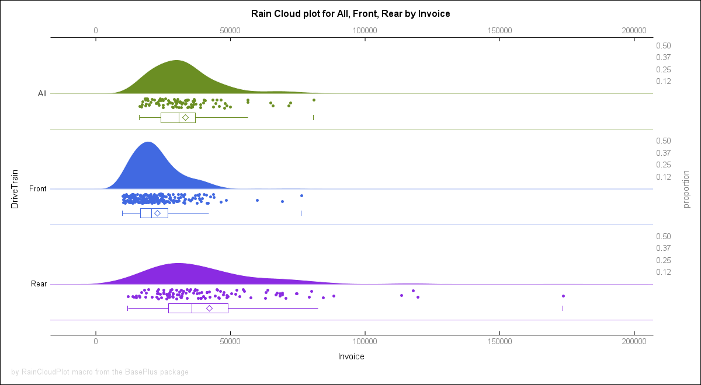
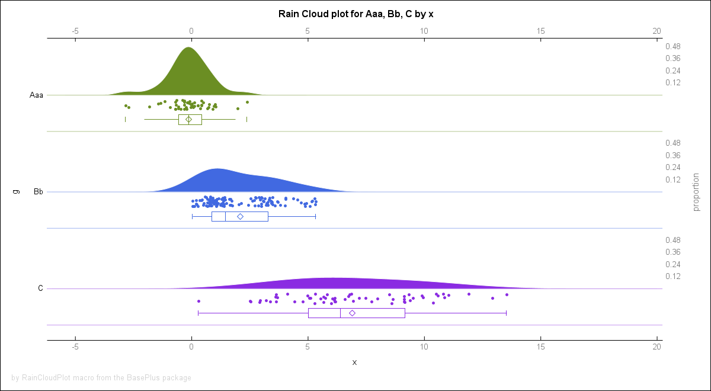
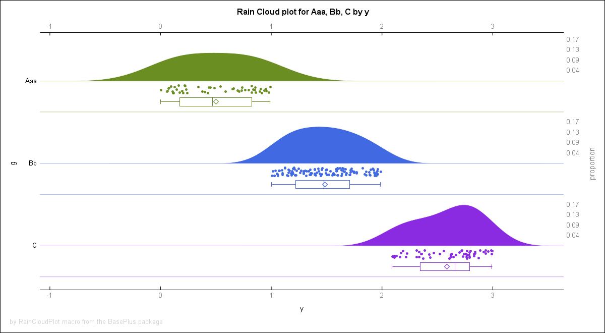
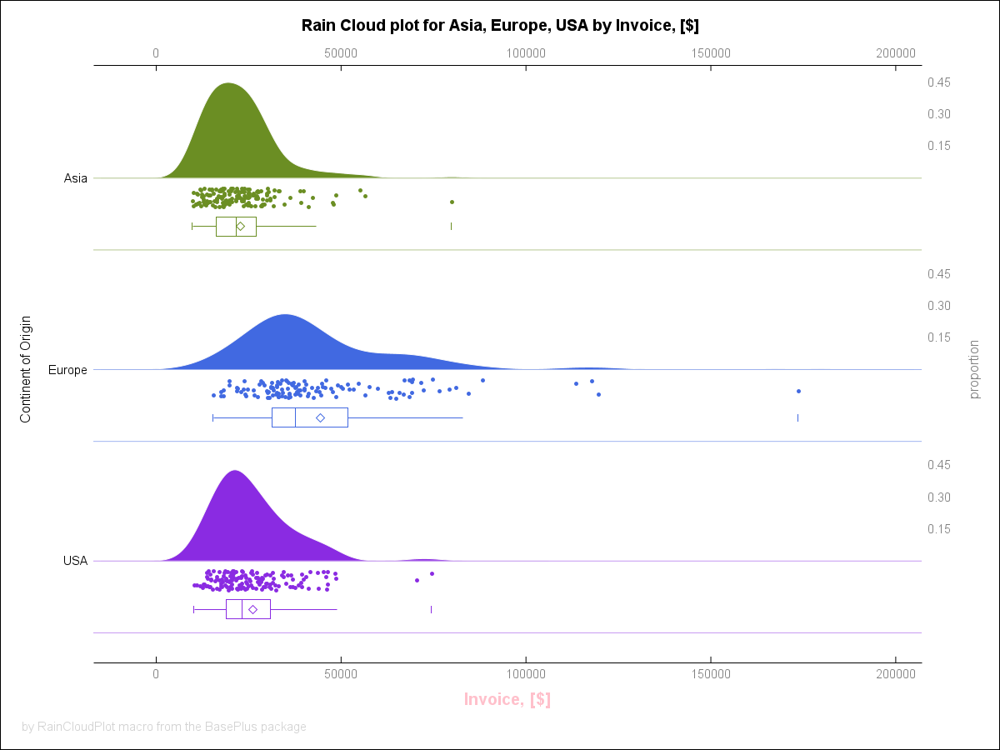
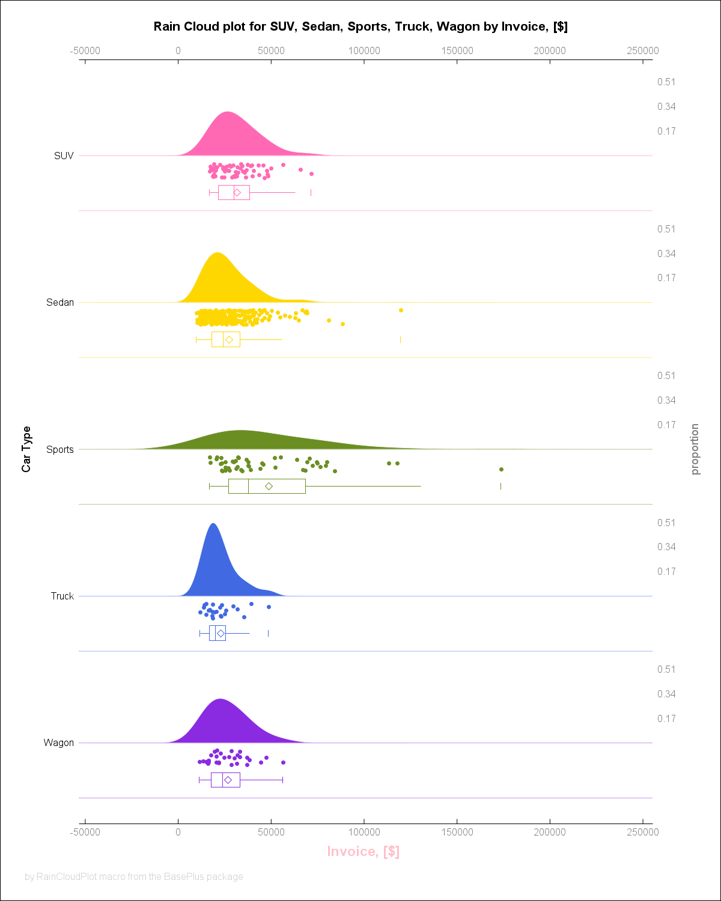
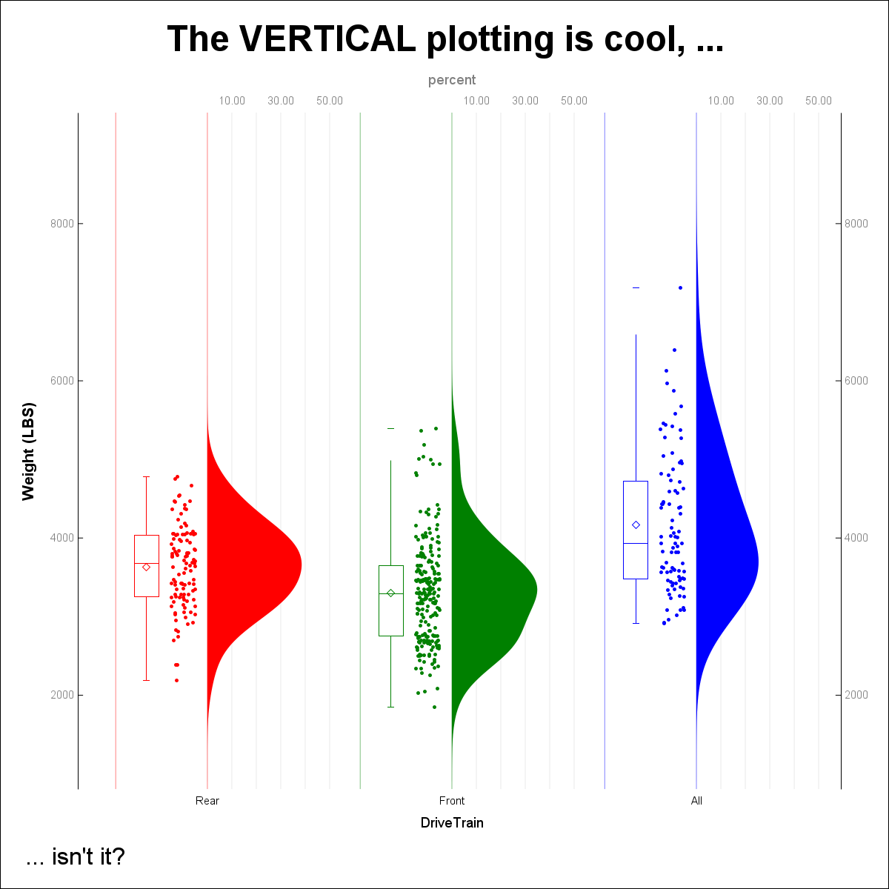

# Documentation for the `BasePlus` package.
  
----------------------------------------------------------------
 
 *The BASE SAS plus a bunch of functionalities I am missing in BASE SAS* 
  
----------------------------------------------------------------
 
### Version information:
  
- Package: BasePlus
- Version: 1.43.0
- Generated: 2024-07-22T08:50:35
- Author(s): Bartosz Jablonski (yabwon@gmail.com), Quentin McMullen (qmcmullen@gmail.com)
- Maintainer(s): Bartosz Jablonski (yabwon@gmail.com)
- License: MIT
- File SHA256: `F*68BB953CD732EB43119A3339656670292317FE1C3B764EC57484C7D5C9DF23EB` for this version
- Content SHA256: `C*7436BD6446CDA2F57163B7BA45482750D460CA9AEFDCA4012253D742B8EE5E65` for this version
  
---
 
# The `BasePlus` package, version: `1.43.0`;
  
---
 

# The BasePlus package [ver. 1.43.0]  ###############################################

The **BasePlus** package implements useful
functions and functionalities I miss in the BASE SAS.

It is inspired by various people, e.g.
- at the SAS-L discussion list
- at the communities.sas.com (SASware Ballot Ideas)
- at StackOverflow
- at the Office...
- etc.

Kudos to all who inspired me to generate this package:
*Mark Keintz*, 
*Paul Dorfman*, 
*Richard DeVenezia*, 
*Christian Graffeuille*,
*Allan Bowe*,
*Anamaria Calai*,
*Michal Ludwicki*,
*Quentin McMullen*,
*Kurt Bremser*,
*Leonid Batkhan*,
*Louise Hadden*.

---

### BASIC EXAMPLES AND USECASES: ####################################################

**Example 1**: One-dimensional array functions.
               Array parameters to subroutine 
               calls must be 1-based.          
~~~~~~~~~~~~~~~~~~~~~~~~~~~~~~~~~~~~~~~~~~~~~~~~~~~~~~~~~~~~~~~~~~~~~~~~~~~~~~~~~~~~~sas
  data _null_;
   array X[4] _temporary_ (. 1 . 2);

   call arrMissToRight(X);
    do i = 1 to 4;
     put X[i]= @;
    end;
    put;

   call arrFillMiss(17, X);
    do i = 1 to 4;
     put X[i]= @;
    end;
    put;

   call arrFill(42, X);
    do i = 1 to 4;
     put X[i]= @;
    end;
  run;
~~~~~~~~~~~~~~~~~~~~~~~~~~~~~~~~~~~~~~~~~~~~~~~~~~~~~~~~~~~~~~~~~~~~~~~~~~~~~~~~~~~~~

**Example 2**: Delete dataset by name.
~~~~~~~~~~~~~~~~~~~~~~~~~~~~~~~~~~~~~~~~~~~~~~~~~~~~~~~~~~~~~~~~~~~~~~~~~~~~~~~~~~~~~sas
  data toDrop;
    x = 17;
  run;
  data _null_;
    p = delDataset("toDrop");
    put p=;
  run;
~~~~~~~~~~~~~~~~~~~~~~~~~~~~~~~~~~~~~~~~~~~~~~~~~~~~~~~~~~~~~~~~~~~~~~~~~~~~~~~~~~~~~

**Example 3**: Strings concatenation with format.
~~~~~~~~~~~~~~~~~~~~~~~~~~~~~~~~~~~~~~~~~~~~~~~~~~~~~~~~~~~~~~~~~~~~~~~~~~~~~~~~~~~~~sas
  data test;
    x =  1 ; y =  . ; z =  3 ;
    t = "t"; u = " "; v = "v";

    array a[*] x y z;
    array b[*] t u v;

    length s1 s2 s3 s4 $ 17;
    s1 = catXFn("z5.", "#", A);
    s2 = catXFi("z5.", "#", A);
    s3 = catXFc("upcase.", "*", B);
    s4 = catXFj("upcase.", "*", B);

    put (_all_) (=);
  run;
~~~~~~~~~~~~~~~~~~~~~~~~~~~~~~~~~~~~~~~~~~~~~~~~~~~~~~~~~~~~~~~~~~~~~~~~~~~~~~~~~~~~~

**Example 4**: Useful formats.
~~~~~~~~~~~~~~~~~~~~~~~~~~~~~~~~~~~~~~~~~~~~~~~~~~~~~~~~~~~~~~~~~~~~~~~~~~~~~~~~~~~~~sas
  data _null_;
    input x @@;
    put @1 x= @11 x= bool. @21 x= int. @31 x= ceil. @41 x= floor.;
  cards;
  . ._ .A -10 -3.14 0 3.14 10
  ;
  run;
~~~~~~~~~~~~~~~~~~~~~~~~~~~~~~~~~~~~~~~~~~~~~~~~~~~~~~~~~~~~~~~~~~~~~~~~~~~~~~~~~~~~~

**Example 5**: Getting variables names from datasets.
~~~~~~~~~~~~~~~~~~~~~~~~~~~~~~~~~~~~~~~~~~~~~~~~~~~~~~~~~~~~~~~~~~~~~~~~~~~~~~~~~~~~~sas
  %put *%getVars(sashelp.class
                ,pattern   = ght$
                ,sep      = +
                ,varRange = _numeric_)*;
~~~~~~~~~~~~~~~~~~~~~~~~~~~~~~~~~~~~~~~~~~~~~~~~~~~~~~~~~~~~~~~~~~~~~~~~~~~~~~~~~~~~~

**Example 6**: Quick sort as an alternative to call sortn()
~~~~~~~~~~~~~~~~~~~~~~~~~~~~~~~~~~~~~~~~~~~~~~~~~~~~~~~~~~~~~~~~~~~~~~~~~~~~~~~~~~~~~sas
  data _null_;
    array test[25000000] _temporary_ ;

    t = time();
      call streaminit(123);
      do _N_ = 25000000 to 1 by -1;
        test[_N_] = rand("uniform");
      end;
    t = time() - t;
    put "Array population time: "  t;

    t = time();
      call quickSortLight (test);
    t = time()-t;
    put "Sorting time: " / t=;
  run;
~~~~~~~~~~~~~~~~~~~~~~~~~~~~~~~~~~~~~~~~~~~~~~~~~~~~~~~~~~~~~~~~~~~~~~~~~~~~~~~~~~~~~

**Example 7**: De-duplicate values from a space separated list.
~~~~~~~~~~~~~~~~~~~~~~~~~~~~~~~~~~~~~~~~~~~~~~~~~~~~~~~~~~~~~~~~~~~~~~~~~~~~~~~~~~~~~sas
  %let list = 4 5 6 1 2 3 1 2 3 4 5 6;
  %put *%dedupListS(&list.)*;
~~~~~~~~~~~~~~~~~~~~~~~~~~~~~~~~~~~~~~~~~~~~~~~~~~~~~~~~~~~~~~~~~~~~~~~~~~~~~~~~~~~~~

**Example 8**: Zip elements of two space separated list.
~~~~~~~~~~~~~~~~~~~~~~~~~~~~~~~~~~~~~~~~~~~~~~~~~~~~~~~~~~~~~~~~~~~~~~~~~~~~~~~~~~~~~sas
%let x = %zipEvalf(1 2 3 4 5 6, 2018 2019 2020, argMd=5, function=MDY, format=date11.);
%put &=x;
~~~~~~~~~~~~~~~~~~~~~~~~~~~~~~~~~~~~~~~~~~~~~~~~~~~~~~~~~~~~~~~~~~~~~~~~~~~~~~~~~~~~~

**Example 9**: Simple Rain Cloud plot.
~~~~~~~~~~~~~~~~~~~~~~~~~~~~~~~~~~~~~~~~~~~~~~~~~~~~~~~~~~~~~~~~~~~~~~~~~~~~~~~~~~~~~sas
%rainCloudPlot(sashelp.cars,DriveTrain,Invoice)
~~~~~~~~~~~~~~~~~~~~~~~~~~~~~~~~~~~~~~~~~~~~~~~~~~~~~~~~~~~~~~~~~~~~~~~~~~~~~~~~~~~~~

The output can be seen in the `md` file.

**Example 10**: Zip SAS library.
~~~~~~~~~~~~~~~~~~~~~~~~~~~~~~~~~~~~~~~~~~~~~~~~~~~~~~~~~~~~~~~~~~~~~~~~~~~~~~~~~~~~~sas
%zipLibrary(sashelp, libOut=work)

%unzipLibrary(%sysfunc(pathname(work)), zip=sashelp, mode=S, clean=1)
~~~~~~~~~~~~~~~~~~~~~~~~~~~~~~~~~~~~~~~~~~~~~~~~~~~~~~~~~~~~~~~~~~~~~~~~~~~~~~~~~~~~~

**Example 11**: Long dataset names.
~~~~~~~~~~~~~~~~~~~~~~~~~~~~~~~~~~~~~~~~~~~~~~~~~~~~~~~~~~~~~~~~~~~~~~~~~~~~~~~~~~~~~sas
data %LDSN(  work. peanut butter & jelly with a "Hot-Dog" in [a box], popcorn, and s*t*a*r*s (drop = sex rename=(name=first_name) where = (age in (12,13,14)))  );
  set sashelp.class;
run;

proc print data  = %LDSN(  work. peanut butter & jelly with a "Hot-Dog" in [a box], popcorn, and s*t*a*r*s  );
run;

data MyNextDataset;
  set %LDSN(  work. peanut butter & jelly with a "Hot-Dog" in [a box], popcorn, and s*t*a*r*s  );
  where age > 12;
run;
~~~~~~~~~~~~~~~~~~~~~~~~~~~~~~~~~~~~~~~~~~~~~~~~~~~~~~~~~~~~~~~~~~~~~~~~~~~~~~~~~~~~~

**Example 12**: List, to the log, content of `home` directory.
~~~~~~~~~~~~~~~~~~~~~~~~~~~~~~~~~~~~~~~~~~~~~~~~~~~~~~~~~~~~~~~~~~~~~~~~~~~~~~~~~~~~~sas
%bpPIPE(ls -la ~/)
~~~~~~~~~~~~~~~~~~~~~~~~~~~~~~~~~~~~~~~~~~~~~~~~~~~~~~~~~~~~~~~~~~~~~~~~~~~~~~~~~~~~~

**EXAMPLE 13** Get list of all files and directories from `C:\SAS_WORK\`:
~~~~~~~~~~~~~~~~~~~~~~~~~~~~~~~~~~~~~~~~~~~~~~~~~~~~~~~~~~~~~~~~~~~~~~~~~~~~~~~~~~~~~sas
%dirsAndFiles(C:\SAS_WORK\,ODS=work.result)
~~~~~~~~~~~~~~~~~~~~~~~~~~~~~~~~~~~~~~~~~~~~~~~~~~~~~~~~~~~~~~~~~~~~~~~~~~~~~~~~~~~~~

**EXAMPLE 14** Text repetition:
~~~~~~~~~~~~~~~~~~~~~~~~~~~~~~~~~~~~~~~~~~~~~~~~~~~~~~~~~~~~~~~~~~~~~~~~~~~~~~~~~~~~~sas
%put %repeatTxt(#,15,s=$) HELLO SAS! %repeatTxt(#,15,s=$);
~~~~~~~~~~~~~~~~~~~~~~~~~~~~~~~~~~~~~~~~~~~~~~~~~~~~~~~~~~~~~~~~~~~~~~~~~~~~~~~~~~~~~

**EXAMPLE 15** Integer list:
~~~~~~~~~~~~~~~~~~~~~~~~~~~~~~~~~~~~~~~~~~~~~~~~~~~~~~~~~~~~~~~~~~~~~~~~~~~~~~~~~~~~~sas
%put %intsList(42);
~~~~~~~~~~~~~~~~~~~~~~~~~~~~~~~~~~~~~~~~~~~~~~~~~~~~~~~~~~~~~~~~~~~~~~~~~~~~~~~~~~~~~

**EXAMPLE 16** Split dataset into blocks of 5 observations:
~~~~~~~~~~~~~~~~~~~~~~~~~~~~~~~~~~~~~~~~~~~~~~~~~~~~~~~~~~~~~~~~~~~~~~~~~~~~~~~~~~~~~sas
%splitDSIntoBlocks(5, sashelp.class, classBlock)
~~~~~~~~~~~~~~~~~~~~~~~~~~~~~~~~~~~~~~~~~~~~~~~~~~~~~~~~~~~~~~~~~~~~~~~~~~~~~~~~~~~~~

**EXAMPLE 17** Split dataset into 7 parts:
~~~~~~~~~~~~~~~~~~~~~~~~~~~~~~~~~~~~~~~~~~~~~~~~~~~~~~~~~~~~~~~~~~~~~~~~~~~~~~~~~~~~~sas
%splitDSIntoParts(7, sashelp.cars, carsPart)
~~~~~~~~~~~~~~~~~~~~~~~~~~~~~~~~~~~~~~~~~~~~~~~~~~~~~~~~~~~~~~~~~~~~~~~~~~~~~~~~~~~~~

**EXAMPLE 18** Return path to temporary file:
~~~~~~~~~~~~~~~~~~~~~~~~~~~~~~~~~~~~~~~~~~~~~~~~~~~~~~~~~~~~~~~~~~~~~~~~~~~~~~~~~~~~~sas
  filename f temp;
  %put %filePath(f);
~~~~~~~~~~~~~~~~~~~~~~~~~~~~~~~~~~~~~~~~~~~~~~~~~~~~~~~~~~~~~~~~~~~~~~~~~~~~~~~~~~~~~

**EXAMPLE 19** Get titles:
~~~~~~~~~~~~~~~~~~~~~~~~~~~~~~~~~~~~~~~~~~~~~~~~~~~~~~~~~~~~~~~~~~~~~~~~~~~~~~~~~~~~~sas
  title1 j=c "Hi Roger" ;
  title2 j=l "Good Morning" ;
  title3 "How are you?" ;
  title4 ;
  title5 "Bye bye!" ;

  %put %GetTitle(1 2 3 5, dlm=s, qt='') ;
~~~~~~~~~~~~~~~~~~~~~~~~~~~~~~~~~~~~~~~~~~~~~~~~~~~~~~~~~~~~~~~~~~~~~~~~~~~~~~~~~~~~~

**EXAMPLE 20** Format and informat macro variables values:
~~~~~~~~~~~~~~~~~~~~~~~~~~~~~~~~~~~~~~~~~~~~~~~~~~~~~~~~~~~~~~~~~~~~~~~~~~~~~~~~~~~~~sas
  %put %fmt(12345, date9.) %fmt(12345, yymmdd10.);
  
  %put %infmt($111234,  dollar10.2);
  %put %infmt($111.234, dollar10.2);
  
  %let text = ##%fmt(ABC, $char9., -C)##;
  %put &text.;
~~~~~~~~~~~~~~~~~~~~~~~~~~~~~~~~~~~~~~~~~~~~~~~~~~~~~~~~~~~~~~~~~~~~~~~~~~~~~~~~~~~~~

**EXAMPLE 21** "Macro including" a text file:
~~~~~~~~~~~~~~~~~~~~~~~~~~~~~~~~~~~~~~~~~~~~~~~~~~~~~~~~~~~~~~~~~~~~~~~~~~~~~~~~~~~~~sas
  filename f "%workpath()/testFile1.txt";
  data _null_;
    file f;
    put "13 14 15";
  run;

  data testDataset;
    set sashelp.class;
    where age in ( %mInclude(f) );
  run;
~~~~~~~~~~~~~~~~~~~~~~~~~~~~~~~~~~~~~~~~~~~~~~~~~~~~~~~~~~~~~~~~~~~~~~~~~~~~~~~~~~~~~

**EXAMPLE 22** Repeating texts and lists:
~~~~~~~~~~~~~~~~~~~~~~~~~~~~~~~~~~~~~~~~~~~~~~~~~~~~~~~~~~~~~~~~~~~~~~~~~~~~~~~~~~~~~sas
options mprint;

data work.A;
  x=17;
data work.B;
  x=42;
data work.C;
  x=303;
run;

data work.test5;
  set 
   %repeatTxt(work.A work.B work.C, 5) 
    ;
run;

data Times2_A3B4C5;
  set
    %repList(work.A work.B work.C, times = 2, each = 3 4 5)
  ;
run;
~~~~~~~~~~~~~~~~~~~~~~~~~~~~~~~~~~~~~~~~~~~~~~~~~~~~~~~~~~~~~~~~~~~~~~~~~~~~~~~~~~~~~

**EXAMPLE 23** Date and time one-liners:
~~~~~~~~~~~~~~~~~~~~~~~~~~~~~~~~~~~~~~~~~~~~~~~~~~~~~~~~~~~~~~~~~~~~~~~~~~~~~~~~~~~~~sas
%put #%today()#%date()#%time()#%datetime()#; 

%put @%today(yymmdd10.)@%date(date11.)@%time(time8.)@%datetime(e8601dt.)@; 
~~~~~~~~~~~~~~~~~~~~~~~~~~~~~~~~~~~~~~~~~~~~~~~~~~~~~~~~~~~~~~~~~~~~~~~~~~~~~~~~~~~~~

**EXAMPLE 24** Months shifting:
~~~~~~~~~~~~~~~~~~~~~~~~~~~~~~~~~~~~~~~~~~~~~~~~~~~~~~~~~~~~~~~~~~~~~~~~~~~~~~~~~~~~~sas
%put 
  Past:    %monthShift(2023, 1, -1) 
  Current: %monthShift(2023, 1    )
  Future:  %monthShift(2023, 1, +1)
;
~~~~~~~~~~~~~~~~~~~~~~~~~~~~~~~~~~~~~~~~~~~~~~~~~~~~~~~~~~~~~~~~~~~~~~~~~~~~~~~~~~~~~

**EXAMPLE 25** Zipping and unzipping directories:
~~~~~~~~~~~~~~~~~~~~~~~~~~~~~~~~~~~~~~~~~~~~~~~~~~~~~~~~~~~~~~~~~~~~~~~~~~~~~~~~~~~~~sas
options dlCreateDir;
libname arch1 "%workPath()/testArch1";
libname arch2 "%workPath()/testArch2";

filename arch1 "%workPath()/testArch1";

data _null_;
  file arch1(test1.txt);
  put "text for test file 1";
data _null_;
  file arch1(test2.txt);
  put "text for test file 2";
data _null_;
  file arch1(test3.txt);
  put "text for test file 3";
run;

data arch1.class(index=(name));
  set sashelp.class;
run;
data arch1.cars(index=(model));
  set sashelp.cars;
run;

%zipArch(
  archName2.zip
, pathRef = arch1
, target = %workPath()/testArch2
, list = 1 
, overwrite = 1
)

%unzipArch(
  archName2.zip 
, path = %workPath()/testArch2
, target = %workPath()/testArch2
, clean=1
, list=1
);

~~~~~~~~~~~~~~~~~~~~~~~~~~~~~~~~~~~~~~~~~~~~~~~~~~~~~~~~~~~~~~~~~~~~~~~~~~~~~~~~~~~~~

**EXAMPLE 26** Downloading data from the internet to a local directory:
~~~~~~~~~~~~~~~~~~~~~~~~~~~~~~~~~~~~~~~~~~~~~~~~~~~~~~~~~~~~~~~~~~~~~~~~~~~~~~~~~~~~~sas
%downloadFilesTo(~/directoryA)
datalines4;
https://www.lexjansen.com/wuss/2023/WUSS-2023-Paper-189.pdf
https://www.lexjansen.com/wuss/2023/WUSS-2023-Paper-189.zip
;;;;
run;
~~~~~~~~~~~~~~~~~~~~~~~~~~~~~~~~~~~~~~~~~~~~~~~~~~~~~~~~~~~~~~~~~~~~~~~~~~~~~~~~~~~~~

**EXAMPLE 27** Conditional value assignment:
~~~~~~~~~~~~~~~~~~~~~~~~~~~~~~~~~~~~~~~~~~~~~~~~~~~~~~~~~~~~~~~~~~~~~~~~~~~~~~~~~~~~~sas
%let x = A B C;
%let y = %iffunc((%scan(&x.,1)=A),Starts with "A"., Does not start with "A".);
%put &=y.;
~~~~~~~~~~~~~~~~~~~~~~~~~~~~~~~~~~~~~~~~~~~~~~~~~~~~~~~~~~~~~~~~~~~~~~~~~~~~~~~~~~~~~

---
  
---
 
  
---
 
  
---
 
Package contains additional content, run:  `%loadPackageAddCnt(BasePlus)`  to load it
or look for the `baseplus_AdditionalContent` directory in the `packages` fileref
localization (only if additional content was deployed during the installation process).
 
--------------------------------------------------------------------
 
*SAS package generated by SAS Package Framework, version `20240711`*
 
--------------------------------------------------------------------
 
# The `BasePlus` package content
The `BasePlus` package consists of the following content:
 
1. [`%bppipe()` macro ](#bppipe-macro-1 )
2. [`%deduplistc()` macro ](#deduplistc-macro-2 )
3. [`%deduplistp()` macro ](#deduplistp-macro-3 )
4. [`%deduplists()` macro ](#deduplists-macro-4 )
5. [`%deduplistx()` macro ](#deduplistx-macro-5 )
6. [`%dirsandfiles()` macro ](#dirsandfiles-macro-6 )
7. [`%functionexists()` macro ](#functionexists-macro-7 )
8. [`%getvars()` macro ](#getvars-macro-8 )
9. [`%intslist()` macro ](#intslist-macro-9 )
10. [`%ldsn()` macro ](#ldsn-macro-10 )
11. [`%ldsnm()` macro ](#ldsnm-macro-11 )
12. [`%lvarnm()` macro ](#lvarnm-macro-12 )
13. [`%lvarnmlab()` macro ](#lvarnmlab-macro-13 )
14. [`%qdeduplistx()` macro ](#qdeduplistx-macro-14 )
15. [`%qgetvars()` macro ](#qgetvars-macro-15 )
16. [`%qzipevalf()` macro ](#qzipevalf-macro-16 )
17. [`%raincloudplot()` macro ](#raincloudplot-macro-17 )
18. [`%repeattxt()` macro ](#repeattxt-macro-18 )
19. [`%splitdsintoblocks()` macro ](#splitdsintoblocks-macro-19 )
20. [`%splitdsintoparts()` macro ](#splitdsintoparts-macro-20 )
21. [`%symdelglobal()` macro ](#symdelglobal-macro-21 )
22. [`%unziparch()` macro ](#unziparch-macro-22 )
23. [`%unziplibrary()` macro ](#unziplibrary-macro-23 )
24. [`%ziparch()` macro ](#ziparch-macro-24 )
25. [`%zipevalf()` macro ](#zipevalf-macro-25 )
26. [`%ziplibrary()` macro ](#ziplibrary-macro-26 )
27. [`$bool.` format/informat ](#bool-format-27 )
28. [`$boolz.` format/informat ](#boolz-format-28 )
29. [`$ceil.` format/informat ](#ceil-format-29 )
30. [`$floor.` format/informat ](#floor-format-30 )
31. [`$int.` format/informat ](#int-format-31 )
32. [`arrfill()` function ](#arrfill-functions-32 )
33. [`arrfillc()` function ](#arrfillc-functions-33 )
34. [`arrmissfill()` function ](#arrmissfill-functions-34 )
35. [`arrmissfillc()` function ](#arrmissfillc-functions-35 )
36. [`arrmisstoleft()` function ](#arrmisstoleft-functions-36 )
37. [`arrmisstoleftc()` function ](#arrmisstoleftc-functions-37 )
38. [`arrmisstoright()` function ](#arrmisstoright-functions-38 )
39. [`arrmisstorightc()` function ](#arrmisstorightc-functions-39 )
40. [`bracketsc()` function ](#bracketsc-functions-40 )
41. [`bracketsn()` function ](#bracketsn-functions-41 )
42. [`catxfc()` function ](#catxfc-functions-42 )
43. [`catxfi()` function ](#catxfi-functions-43 )
44. [`catxfj()` function ](#catxfj-functions-44 )
45. [`catxfn()` function ](#catxfn-functions-45 )
46. [`deldataset()` function ](#deldataset-functions-46 )
47. [`semicolonc()` function ](#semicolonc-functions-47 )
48. [`semicolonn()` function ](#semicolonn-functions-48 )
49. [`$brackets.` format/informat ](#brackets-format-49 )
50. [`$semicolon.` format/informat ](#semicolon-format-50 )
51. [`qsortincbyprocproto()` proto ](#qsortincbyprocproto-proto-51 )
52. [`frommissingtonumberbs()` function ](#frommissingtonumberbs-functions-52 )
53. [`fromnumbertomissing()` function ](#fromnumbertomissing-functions-53 )
54. [`quicksort4notmiss()` function ](#quicksort4notmiss-functions-54 )
55. [`quicksorthash()` function ](#quicksorthash-functions-55 )
56. [`quicksorthashsddv()` function ](#quicksorthashsddv-functions-56 )
57. [`quicksortlight()` function ](#quicksortlight-functions-57 )
58. [`%date()` macro ](#date-macro-58 )
59. [`%datetime()` macro ](#datetime-macro-59 )
60. [`%downloadfilesto()` macro ](#downloadfilesto-macro-60 )
61. [`%filepath()` macro ](#filepath-macro-61 )
62. [`%finddswithvarval()` macro ](#finddswithvarval-macro-62 )
63. [`%fmt()` macro ](#fmt-macro-63 )
64. [`%generateoneliners()` macro ](#generateoneliners-macro-64 )
65. [`%gettitle()` macro ](#gettitle-macro-65 )
66. [`%iffunc()` macro ](#iffunc-macro-66 )
67. [`%infmt()` macro ](#infmt-macro-67 )
68. [`%letters()` macro ](#letters-macro-68 )
69. [`%libpath()` macro ](#libpath-macro-69 )
70. [`%minclude()` macro ](#minclude-macro-70 )
71. [`%monthshift()` macro ](#monthshift-macro-71 )
72. [`%replist()` macro ](#replist-macro-72 )
73. [`%time()` macro ](#time-macro-73 )
74. [`%today()` macro ](#today-macro-74 )
75. [`%translate()` macro ](#translate-macro-75 )
76. [`%tranwrd()` macro ](#tranwrd-macro-76 )
77. [`%workpath()` macro ](#workpath-macro-77 )
  
 
78. [License note](#license)
  
---
 
## `%bppipe()` macro  ######
 
## >>> `%bpPIPE()` macro: <<<  #######################  

The bpPIPE() [Base Plus PIPE] macro executes OS command
and print to the log output of the execution.

Under the hood it uses `_` filename reference to PIPE device.

### SYNTAX: ###################################################################

The basic syntax is the following, the `<...>` means optional parameters:
~~~~~~~~~~~~~~~~~~~~~~~sas
%bpPIPE( <OS command goes here> )
~~~~~~~~~~~~~~~~~~~~~~~

**Arguments description**:

* **NO Arguments**    - Everything inside brackets is treated as an OS command.

---

 
### EXAMPLES AND USECASES: ####################################################

**EXAMPLE 1.** List, to the log, content of D and C drives:
~~~~~~~~~~~~~~~~~~~~~~~~~~~~~~~~~~~~~~~~~~~~~~~~~~~~~~~~~~~~~~~~sas
  %bpPIPE(D: & dir & dir "C:\")
~~~~~~~~~~~~~~~~~~~~~~~~~~~~~~~~~~~~~~~~~~~~~~~~~~~~~~~~~~~~~~~~

**EXAMPLE 2.** List, to the log, content of `home` directory:
~~~~~~~~~~~~~~~~~~~~~~~~~~~~~~~~~~~~~~~~~~~~~~~~~~~~~~~~~~~~~~~~sas
  %bpPIPE(ls -halt ~/)
~~~~~~~~~~~~~~~~~~~~~~~~~~~~~~~~~~~~~~~~~~~~~~~~~~~~~~~~~~~~~~~~

---

  
---
 
## `%deduplistc()` macro  ######
 
## >>> `%dedupListC()` macro: <<<  #######################

The `%dedupListC()` macro deletes duplicated values from 
a *COMMA-separated* list of values. List, including separators,
can be no longer than a value carried by a single macro variable.

Returned value is *unquoted*. Leading and trailing spaces are ignored.

The `%dedupListC()` macro executes like a pure macro code.

### SYNTAX: ###################################################################

The basic syntax is the following, the `<...>` means optional parameters:
~~~~~~~~~~~~~~~~~~~~~~~sas
%dedupListC(
 list,of,comma,separated,values
)
~~~~~~~~~~~~~~~~~~~~~~~

**Arguments description**:

1. `list` - A list of *comma-separated* values. 

 
### EXAMPLES AND USECASES: ####################################################

**EXAMPLE 1.** Basic use-case one. 
    Delete duplicated values from a list.

~~~~~~~~~~~~~~~~~~~~~~~~~~~~~~~~~~~~~~~~~~~~~~~~~~~~~~~~~~~~~~~~sas
  %put *%dedupListC(a,b,c,b,c)*;

  %put *%dedupListC(a,b c,b c)*;

  %put *%dedupListC(%str(a,b,c,b,c))*;

  %put *%dedupListC(%str(a),%str(b),%str(c),b,c)*;
~~~~~~~~~~~~~~~~~~~~~~~~~~~~~~~~~~~~~~~~~~~~~~~~~~~~~~~~~~~~~~~~

**EXAMPLE 2.** Leading and trailing spaces are ignored. 
    Delete duplicated values from a list.

~~~~~~~~~~~~~~~~~~~~~~~~~~~~~~~~~~~~~~~~~~~~~~~~~~~~~~~~~~~~~~~~sas
  %put *%dedupListC( a , b b ,  c , b b, c    )*;
~~~~~~~~~~~~~~~~~~~~~~~~~~~~~~~~~~~~~~~~~~~~~~~~~~~~~~~~~~~~~~~~

**EXAMPLE 3.** Macro variable as an argument. 
    Delete duplicated values from a list.

~~~~~~~~~~~~~~~~~~~~~~~~~~~~~~~~~~~~~~~~~~~~~~~~~~~~~~~~~~~~~~~~sas
  %let list = 4, 5, 6, 1, 2, 3, 1, 2, 3, 4, 5, 6;
  %put *%dedupListC(&list.)*;
~~~~~~~~~~~~~~~~~~~~~~~~~~~~~~~~~~~~~~~~~~~~~~~~~~~~~~~~~~~~~~~~

---

  
---
 
## `%deduplistp()` macro  ######
 
## >>> `%dedupListP()` macro: <<<  #######################

The `%dedupListP()` macro deletes duplicated values from 
a *PIPE(`|`)-separated* list of values. List, including separators,
can be no longer than a value carried by a single macro variable.

Returned value is *unquoted*. Leading and trailing spaces are ignored.

The `%dedupListP()` macro executes like a pure macro code.

### SYNTAX: ###################################################################

The basic syntax is the following, the `<...>` means optional parameters:
~~~~~~~~~~~~~~~~~~~~~~~sas
%dedupListP(
 list|of|pipe|separated|values
)
~~~~~~~~~~~~~~~~~~~~~~~

**Arguments description**:

1. `list` - A list of *pipe-separated* values. 

 
### EXAMPLES AND USECASES: ####################################################

**EXAMPLE 1.** Basic use-case one. 
    Delete duplicated values from a list.

~~~~~~~~~~~~~~~~~~~~~~~~~~~~~~~~~~~~~~~~~~~~~~~~~~~~~~~~~~~~~~~~sas
  %put *%dedupListP(a|b|c|b|c)*;

  %put *%dedupListP(a|b c|b c)*;

  %put *%dedupListP(%str(a|b|c|b|c))*;

  %put *%dedupListP(%str(a)|%str(b)|%str(c)|b|c)*;
~~~~~~~~~~~~~~~~~~~~~~~~~~~~~~~~~~~~~~~~~~~~~~~~~~~~~~~~~~~~~~~~

**EXAMPLE 2.** Leading and trailing spaces are ignored. 
    Delete duplicated values from a list.

~~~~~~~~~~~~~~~~~~~~~~~~~~~~~~~~~~~~~~~~~~~~~~~~~~~~~~~~~~~~~~~~sas
  %put *%dedupListP( a | b b |  c | b b| c    )*;
~~~~~~~~~~~~~~~~~~~~~~~~~~~~~~~~~~~~~~~~~~~~~~~~~~~~~~~~~~~~~~~~

**EXAMPLE 3.** Macro variable as an argument. 
    Delete duplicated values from a list.

~~~~~~~~~~~~~~~~~~~~~~~~~~~~~~~~~~~~~~~~~~~~~~~~~~~~~~~~~~~~~~~~sas
  %let list = 4|5|6|1|2|3|1|2|3|4|5|6;
  %put *%dedupListP(&list.)*;
~~~~~~~~~~~~~~~~~~~~~~~~~~~~~~~~~~~~~~~~~~~~~~~~~~~~~~~~~~~~~~~~

---

  
---
 
## `%deduplists()` macro  ######
 
## >>> `%dedupListS()` macro: <<<  #######################

The `%dedupListS()` macro deletes duplicated values from 
a *SPACE-separated* list of values. List, including separators,
can be no longer than a value carried by a single macro variable.

Returned value is *unquoted*.

The `%dedupListS()` macro executes like a pure macro code.

### SYNTAX: ###################################################################

The basic syntax is the following, the `<...>` means optional parameters:
~~~~~~~~~~~~~~~~~~~~~~~sas
%dedupListS(
 list of space-separated values
)
~~~~~~~~~~~~~~~~~~~~~~~

**Arguments description**:

1. `list` - A list of *space-separated* values. 

 
### EXAMPLES AND USECASES: ####################################################

**EXAMPLE 1.** Basic use-case one. 
    Delete duplicated values from a list.

~~~~~~~~~~~~~~~~~~~~~~~~~~~~~~~~~~~~~~~~~~~~~~~~~~~~~~~~~~~~~~~~sas
  %put *%dedupListS(a b  c   b    c)*;

  %put *%dedupListS(a b,c b,c)*;

  %put *%dedupListS(%str(a b c b c))*;

  %put *%dedupListS(%str(a) %str(b) %str(c) b c)*;
~~~~~~~~~~~~~~~~~~~~~~~~~~~~~~~~~~~~~~~~~~~~~~~~~~~~~~~~~~~~~~~~

**EXAMPLE 2.** Macro variable as an argument. 
    Delete duplicated values from a list.

~~~~~~~~~~~~~~~~~~~~~~~~~~~~~~~~~~~~~~~~~~~~~~~~~~~~~~~~~~~~~~~~sas
  %let list = 4 5 6 1 2 3 1 2 3 4 5 6;
  %put *%dedupListS(&list.)*;
~~~~~~~~~~~~~~~~~~~~~~~~~~~~~~~~~~~~~~~~~~~~~~~~~~~~~~~~~~~~~~~~

---

  
---
 
## `%deduplistx()` macro  ######
 
## >>> `%dedupListX()` macro: <<<  #######################

The `%dedupListX()` macro deletes duplicated values from 
a *X-separated* list of values, where the `X` represents 
a *single character* separator. List, including separators, 
can be no longer than a value carried by a single macro variable.

**Caution.** The value of `X` *has to be* in **the first** byte of the list,
             just after the opening bracket, i.e. `(X...)`.

Returned value is *unquoted*. Leading and trailing spaces are ignored.

The `%dedupListX()` macro executes like a pure macro code.

### SYNTAX: ###################################################################

The basic syntax is the following, the `<...>` means optional parameters:
~~~~~~~~~~~~~~~~~~~~~~~sas
%dedupListX(
XlistXofXxXseparatedXvalues
)
~~~~~~~~~~~~~~~~~~~~~~~

**Arguments description**:

1. `list` - A list of *X-separated* values. 

 
### EXAMPLES AND USECASES: ####################################################

**EXAMPLE 1.** Basic use-case one. 
    Delete duplicated values from a list.

~~~~~~~~~~~~~~~~~~~~~~~~~~~~~~~~~~~~~~~~~~~~~~~~~~~~~~~~~~~~~~~~sas
  %put *%dedupListX(|a|b|c|b|c)*;

  %put *%dedupListX( a b c b c)*;

  %put *%dedupListX(,a,b,c,b,c)*;

  %put *%dedupListX(XaXbXcXbXc)*;

  %put *%dedupListX(/a/b/c/b/c)*;

  data _null_;
    x = "%dedupListX(%str(;a;b;c;b;c))";
    put x=;
  run;
~~~~~~~~~~~~~~~~~~~~~~~~~~~~~~~~~~~~~~~~~~~~~~~~~~~~~~~~~~~~~~~~

**EXAMPLE 2.** Leading and trailing spaces are ignored. 
    Delete duplicated values from a list.

~~~~~~~~~~~~~~~~~~~~~~~~~~~~~~~~~~~~~~~~~~~~~~~~~~~~~~~~~~~~~~~~sas
  %put *%dedupListX(| a | b.b |  c | b.b| c    )*;

  %put *%dedupListX(. a . b b .  c . b b. c    )*;
~~~~~~~~~~~~~~~~~~~~~~~~~~~~~~~~~~~~~~~~~~~~~~~~~~~~~~~~~~~~~~~~

**EXAMPLE 3.** Macro variable as an argument. 
    Delete duplicated values from a list.

~~~~~~~~~~~~~~~~~~~~~~~~~~~~~~~~~~~~~~~~~~~~~~~~~~~~~~~~~~~~~~~~sas
  %let list = 4$5.5$6$1$2$3$1$2$3$4$5.5$6;
  %put *%dedupListX($&list.)*;

  %let list = 4$ 5.5$ 6$ 1$ 2$ 3$ 1$ 2$ 3$ 4$ 5.5$ 6$;
  %put *%dedupListX( &list.)*;
~~~~~~~~~~~~~~~~~~~~~~~~~~~~~~~~~~~~~~~~~~~~~~~~~~~~~~~~~~~~~~~~

---

  
---
 
## `%dirsandfiles()` macro  ######

## >>> `%dirsAndFiles()` macro: <<<  #######################  

The `%dirsAndFiles()` macro allows to extract info about all files 
and subdirectories of a given `root` directory. 

The extracted info may be just a list of files and subdirectories or, if 
the `details=` parameter is set to 1, additional operating system information 
is extracted (information is OS-dependent and gives different results for Linux 
and for Windows)

The extracted info can be narrowed down to files (`keepFiles=1`) or to 
directories (`keepDirs=1`) if need be.

The extracted info can be presented in wide or long format (`longFormat=1`).

The extracted info for files can be narrowed down to only files with particular
extension, for example: `fileExt=sas7bdat`.

The extracted info can be narrowed down maximal path depth 
by setting up the `maxDepth=` parameter.

See examples below for the details.

### REFERENCES: ###################################################################

The macro is based on Kurt Bremser's "*Talking to Your Host*" article 
presented at WUSS 2022 conference.

The article is available [here](https://communities.sas.com/t5/SAS-User-Groups-Library/WUSS-Presentation-Talking-to-Your-Host/ta-p/838344)
and also as an additional content of this package.
The paper was awarded the "Best Paper Award - Programming".

### SYNTAX: ###################################################################

The basic syntax is the following, the `<...>` means optional parameters:
~~~~~~~~~~~~~~~~~~~~~~~sas
%dirsAndFiles(
    root
  <,ODS=>
  <,details=>
  <,keepDirs=>
  <,keepFiles=>
  <,longFormat=>
  <,fileExt=>
  <,maxDepth=>
)
~~~~~~~~~~~~~~~~~~~~~~~

**Arguments description**:

1. `root`                     - *Required*, path to be searched
                                for information.

* `ODS=work.dirsAndFilesInfo` - *Optional*, output data set, 
                                name of a dataset to store information.

* `details=0`                 - *Optional*, indicates if detailed info 
                                 will be collected, `1` = yes, `0` = no.

* `keepDirs=1`                - *Optional*, indicates if directories info 
                                will be collected, `1` = yes, `0` = no.

* `keepFiles=1`               - *Optional*, indicates if files info 
                                will be collected, `1` = yes, `0` = no.

* `longFormat=0`              - *Optional*, indicates if output be 
                                in long format, `1` = yes, `0` = no.

* `fileExt=`                  - *Optional*, if not missing then indicates 
                                a list of space-separated file extensions 
                                to filter out results.
                                
* `maxDepth=0`                - *Optional*, if not zero then indicates
                                maximum depth of search in the root path.

### EXAMPLES AND USECASES: ####################################################

**EXAMPLE 1.** Get list of files and directories:
~~~~~~~~~~~~~~~~~~~~~~~~~~~~~~~~~~~~~~~~~~~~~~~~~~~~~~~~~~~~~~~~~~~~~~~~~~~~~~~~~~~~~sas
%dirsAndFiles(C:\SAS_WORK\,ODS=work.result1)
~~~~~~~~~~~~~~~~~~~~~~~~~~~~~~~~~~~~~~~~~~~~~~~~~~~~~~~~~~~~~~~~~~~~~~~~~~~~~~~~~~~~~

**EXAMPLE 2.** Get detailed info:
~~~~~~~~~~~~~~~~~~~~~~~~~~~~~~~~~~~~~~~~~~~~~~~~~~~~~~~~~~~~~~~~~~~~~~~~~~~~~~~~~~~~~sas
%dirsAndFiles(C:\SAS_WORK\,ODS=work.result2,details=1)
~~~~~~~~~~~~~~~~~~~~~~~~~~~~~~~~~~~~~~~~~~~~~~~~~~~~~~~~~~~~~~~~~~~~~~~~~~~~~~~~~~~~~

**EXAMPLE 3.** Get only files info:
~~~~~~~~~~~~~~~~~~~~~~~~~~~~~~~~~~~~~~~~~~~~~~~~~~~~~~~~~~~~~~~~~~~~~~~~~~~~~~~~~~~~~sas
%dirsAndFiles(C:\SAS_WORK\,ODS=work.result3,keepDirs=0)

%dirsAndFiles(C:\SAS_WORK\,ODS=work.result5,keepDirs=0,details=1)
~~~~~~~~~~~~~~~~~~~~~~~~~~~~~~~~~~~~~~~~~~~~~~~~~~~~~~~~~~~~~~~~~~~~~~~~~~~~~~~~~~~~~

**EXAMPLE 4.** Get only directories info:
~~~~~~~~~~~~~~~~~~~~~~~~~~~~~~~~~~~~~~~~~~~~~~~~~~~~~~~~~~~~~~~~~~~~~~~~~~~~~~~~~~~~~sas
%dirsAndFiles(C:\SAS_WORK\,ODS=work.result4,keepFiles=0)

%dirsAndFiles(C:\SAS_WORK\,ODS=work.result6,keepFiles=0,details=1)
~~~~~~~~~~~~~~~~~~~~~~~~~~~~~~~~~~~~~~~~~~~~~~~~~~~~~~~~~~~~~~~~~~~~~~~~~~~~~~~~~~~~~

**EXAMPLE 5.** Filter out by `sas` extension:
~~~~~~~~~~~~~~~~~~~~~~~~~~~~~~~~~~~~~~~~~~~~~~~~~~~~~~~~~~~~~~~~~~~~~~~~~~~~~~~~~~~~~sas
%dirsAndFiles(~/,ODS=work.result7,fileExt=sas)

%dirsAndFiles(~/,ODS=work.result8,fileExt=sas,details=1)
~~~~~~~~~~~~~~~~~~~~~~~~~~~~~~~~~~~~~~~~~~~~~~~~~~~~~~~~~~~~~~~~~~~~~~~~~~~~~~~~~~~~~

**EXAMPLE 6.** Keep result in the long format:
~~~~~~~~~~~~~~~~~~~~~~~~~~~~~~~~~~~~~~~~~~~~~~~~~~~~~~~~~~~~~~~~~~~~~~~~~~~~~~~~~~~~~sas
%dirsAndFiles(~/,ODS=work.result9,details=1,longFormat=1)
~~~~~~~~~~~~~~~~~~~~~~~~~~~~~~~~~~~~~~~~~~~~~~~~~~~~~~~~~~~~~~~~~~~~~~~~~~~~~~~~~~~~~

**EXAMPLE 7.** Get info for maximum depth of 2:
~~~~~~~~~~~~~~~~~~~~~~~~~~~~~~~~~~~~~~~~~~~~~~~~~~~~~~~~~~~~~~~~~~~~~~~~~~~~~~~~~~~~~sas
%dirsAndFiles(C:\SAS_WORK\,ODS=work.result10,details=1,maxDepth=2)
~~~~~~~~~~~~~~~~~~~~~~~~~~~~~~~~~~~~~~~~~~~~~~~~~~~~~~~~~~~~~~~~~~~~~~~~~~~~~~~~~~~~~

**EXAMPLE 8.** How locked/unavailable files are handled:
~~~~~~~~~~~~~~~~~~~~~~~~~~~~~~~~~~~~~~~~~~~~~~~~~~~~~~~~~~~~~~~~~~~~~~~~~~~~~~~~~~~~~sas
%dirsAndFiles(%sysfunc(pathname(WORK)),ODS=work.result11,details=1)
~~~~~~~~~~~~~~~~~~~~~~~~~~~~~~~~~~~~~~~~~~~~~~~~~~~~~~~~~~~~~~~~~~~~~~~~~~~~~~~~~~~~~

**EXAMPLE 9.** Not existing directory:
~~~~~~~~~~~~~~~~~~~~~~~~~~~~~~~~~~~~~~~~~~~~~~~~~~~~~~~~~~~~~~~~~~~~~~~~~~~~~~~~~~~~~sas
%dirsAndFiles(%sysfunc(pathname(WORK))/noSuchDir,ODS=work.result12,details=1)
~~~~~~~~~~~~~~~~~~~~~~~~~~~~~~~~~~~~~~~~~~~~~~~~~~~~~~~~~~~~~~~~~~~~~~~~~~~~~~~~~~~~~

  
---
 
## `%functionexists()` macro  ######
 
## >>> `%functionExists()` macro: <<<  #######################  

The functionExists() macro function tests
if given funcion exists in the SAS session.
The `sashelp.vfunc` view is used.

See examples below for the details.

The `%functionExists()` macro executes like a pure macro code.

The function is a result of cooperation with [Allan Bowe](https://www.linkedin.com/in/allanbowe/)

### SYNTAX: ###################################################################

The basic syntax is the following, the `<...>` means optional parameters:
~~~~~~~~~~~~~~~~~~~~~~~sas
%functionExists(
   funName
)
~~~~~~~~~~~~~~~~~~~~~~~

**Arguments description**:

1. `funName`        - *Required*, the name of the function 
                       existence of which you are testing.

 
### EXAMPLES AND USECASES: ####################################################

**EXAMPLE 1.** Test if function exists:
~~~~~~~~~~~~~~~~~~~~~~~~~~~~~~~~~~~~~~~~~~~~~~~~~~~~~~~~~~~~~~~~sas
  %put %functionExists(HASHING);

  %put %functionExists(COSsinLOG);
~~~~~~~~~~~~~~~~~~~~~~~~~~~~~~~~~~~~~~~~~~~~~~~~~~~~~~~~~~~~~~~~

---

  
---
 
## `%getvars()` macro  ######
 
## >>> `%getVars()` macro: <<<  #######################  

The getVars() and QgetVars() macro functions
allow to extract variables names form a dataset
according to a given pattern into a list.

The getVars() returns unquoted value [by %unquote()].
The QgetVars() returns quoted value [by %superq()].

See examples below for the details.

The `%getVars()` macro executes like a pure macro code.

### SYNTAX: ###################################################################

The basic syntax is the following, the `<...>` means optional parameters:
~~~~~~~~~~~~~~~~~~~~~~~sas
%getVars(
   ds               
 <,sep=>
 <,pattern=>
 <,varRange=>
 <,quote=>
 <,mcArray=> 
 <,ignoreCases>
)
~~~~~~~~~~~~~~~~~~~~~~~

**Arguments description**:

1. `ds`              - *Required*, the name of the dataset from 
                       which variables are to be taken.

* `sep = %str( )`    - *Optional*, default value `%str( )`, 
                       a variables separator on the created list. 

* `pattern = .*`     - *Optional*, default value `.*` (i.e. any text), 
                       a variable name regexp pattern, by default case INSENSITIVE! 

* `varRange = _all_` - *Optional*, default value `_all_`, 
                       a named range list of variables. 

* `quote =`          - *Optional*, default value is blank, a quotation 
                       symbol to be used around values.

* `mcArray=`         - *Optional*, default value is blank.
                       1) When *null* - the macro behaves like a macro function 
                          and returns a text string with variables list.
                       2) When *not null* - behaviour of the macro is altered.
                          In such case a macro array of selected variables, named 
                          with `mcArray` value as a prefix, is created.
                          Furthermore a macro named as `mcArray` value is generated.
                          (see the macroArray package for the details).
                          When `mcArray=` parameter is active the `getVars` macro 
                          cannot be called within the `%put` statement. Execution like: 
                           `%put %getVars(..., mcArray=XXX);` will result with  
                          an Explicit & Radical Refuse Of Run (aka ERROR).

* `ignoreCases=`     - *Optional*, default value is 1.  
                        Indicates if search should be case insensitive.

 
### EXAMPLES AND USECASES: ####################################################

**EXAMPLE 1.** A list of all variables from the 
               sashelp.class dataset:
~~~~~~~~~~~~~~~~~~~~~~~~~~~~~~~~~~~~~~~~~~~~~~~~~~~~~~~~~~~~~~~~sas
  %put *%getVars(sashelp.class)*;
~~~~~~~~~~~~~~~~~~~~~~~~~~~~~~~~~~~~~~~~~~~~~~~~~~~~~~~~~~~~~~~~

**EXAMPLE 2.** A list of all variables from the 
               sashelp.class dataset separated 
               by backslash:
~~~~~~~~~~~~~~~~~~~~~~~~~~~~~~~~~~~~~~~~~~~~~~~~~~~~~~~~~~~~~~~~sas
  %let x = %getVars(sashelp.class, sep=\);
  %put &=x;
~~~~~~~~~~~~~~~~~~~~~~~~~~~~~~~~~~~~~~~~~~~~~~~~~~~~~~~~~~~~~~~~

**EXAMPLE 3.** Use of regular expressions:
 a) A list of variables which name contains "i" or "a" 
~~~~~~~~~~~~~~~~~~~~~~~~~~~~~~~~~~~~~~~~~~~~~~~~~~~~~~~~~~~~~~~~sas
  %put *%getVars(sashelp.class, pattern=i|a)*;
~~~~~~~~~~~~~~~~~~~~~~~~~~~~~~~~~~~~~~~~~~~~~~~~~~~~~~~~~~~~~~~~

 b) A list of variables which name starts with "w"
~~~~~~~~~~~~~~~~~~~~~~~~~~~~~~~~~~~~~~~~~~~~~~~~~~~~~~~~~~~~~~~~sas  
  %put *%getVars(sashelp.class, pattern=^w)*;
~~~~~~~~~~~~~~~~~~~~~~~~~~~~~~~~~~~~~~~~~~~~~~~~~~~~~~~~~~~~~~~~

 c) A list of variables which name ends with "ght"
~~~~~~~~~~~~~~~~~~~~~~~~~~~~~~~~~~~~~~~~~~~~~~~~~~~~~~~~~~~~~~~~sas  
  %put *%getVars(sashelp.class, pattern=ght$)*;
~~~~~~~~~~~~~~~~~~~~~~~~~~~~~~~~~~~~~~~~~~~~~~~~~~~~~~~~~~~~~~~~

**EXAMPLE 4.** A list of numeric variables which name 
               starts with "w" or "h" or ends with "x"
~~~~~~~~~~~~~~~~~~~~~~~~~~~~~~~~~~~~~~~~~~~~~~~~~~~~~~~~~~~~~~~~~~~~~~~~~~~~~~~~~~~~~sas
  %put *%getVars(sashelp.class, sep=+, pattern=^(w|h)|x$, varRange=_numeric_)*;
~~~~~~~~~~~~~~~~~~~~~~~~~~~~~~~~~~~~~~~~~~~~~~~~~~~~~~~~~~~~~~~~~~~~~~~~~~~~~~~~~~~~~

**EXAMPLE 5.**
~~~~~~~~~~~~~~~~~~~~~~~~~~~~~~~~~~~~~~~~~~~~~~~~~~~~~~~~~~~~~~~~~~~~~~~~~~~~~~~~~~~~~sas
  data test;
    array x[30];
    array y[30] $ ;
    array z[30];
  run;
~~~~~~~~~~~~~~~~~~~~~~~~~~~~~~~~~~~~~~~~~~~~~~~~~~~~~~~~~~~~~~~~~~~~~~~~~~~~~~~~~~~~~

 a) A list of variables separated by a comma:
~~~~~~~~~~~~~~~~~~~~~~~~~~~~~~~~~~~~~~~~~~~~~~~~~~~~~~~~~~~~~~~~~~~~~~~~~~~~~~~~~~~~~sas
  %put *%getVars(test, sep=%str(,))*;
~~~~~~~~~~~~~~~~~~~~~~~~~~~~~~~~~~~~~~~~~~~~~~~~~~~~~~~~~~~~~~~~~~~~~~~~~~~~~~~~~~~~~

 b) A list of variables separated by a comma
    with suffix 5 or 7:
~~~~~~~~~~~~~~~~~~~~~~~~~~~~~~~~~~~~~~~~~~~~~~~~~~~~~~~~~~~~~~~~~~~~~~~~~~~~~~~~~~~~~sas
  %put *%getVars(test, sep=%str(,), pattern=(5|7)$)*;
~~~~~~~~~~~~~~~~~~~~~~~~~~~~~~~~~~~~~~~~~~~~~~~~~~~~~~~~~~~~~~~~~~~~~~~~~~~~~~~~~~~~~

 c) A list of variables separated by a comma
    with suffix 5 or 7 from a given variables range:
~~~~~~~~~~~~~~~~~~~~~~~~~~~~~~~~~~~~~~~~~~~~~~~~~~~~~~~~~~~~~~~~~~~~~~~~~~~~~~~~~~~~~sas
  %put *%getVars(test, sep=%str(,), varRange=x10-numeric-z22 y6-y26, pattern=(5|7)$)*;
~~~~~~~~~~~~~~~~~~~~~~~~~~~~~~~~~~~~~~~~~~~~~~~~~~~~~~~~~~~~~~~~~~~~~~~~~~~~~~~~~~~~~

**EXAMPLE 6.** Case of quotes and special characters 
               when the quote= parameter is _not_ used:

 a) one single or double qiote:
~~~~~~~~~~~~~~~~~~~~~~~~~~~~~~~~~~~~~~~~~~~~~~~~~~~~~~~~~~~~~~~~~~~~~~~~~~~~~~~~~~~~~sas
  %put *%bquote(%getVars(sashelp.class, sep=%str(%")))*;
  %put *%bquote(%getVars(sashelp.class, sep=%str(%')))*;
~~~~~~~~~~~~~~~~~~~~~~~~~~~~~~~~~~~~~~~~~~~~~~~~~~~~~~~~~~~~~~~~~~~~~~~~~~~~~~~~~~~~~

 b) two single or double qiotes:
~~~~~~~~~~~~~~~~~~~~~~~~~~~~~~~~~~~~~~~~~~~~~~~~~~~~~~~~~~~~~~~~~~~~~~~~~~~~~~~~~~~~~sas
  %put *"%bquote(%getVars(sashelp.class,sep=""))"*;
  %put *%str(%')%bquote(%getVars(sashelp.class,sep=''))%str(%')*;
~~~~~~~~~~~~~~~~~~~~~~~~~~~~~~~~~~~~~~~~~~~~~~~~~~~~~~~~~~~~~~~~~~~~~~~~~~~~~~~~~~~~~

 c) comma-separated double quote list:
~~~~~~~~~~~~~~~~~~~~~~~~~~~~~~~~~~~~~~~~~~~~~~~~~~~~~~~~~~~~~~~~~~~~~~~~~~~~~~~~~~~~~sas
  %put *"%getVars(sashelp.class,sep=%str(", "))"*;
~~~~~~~~~~~~~~~~~~~~~~~~~~~~~~~~~~~~~~~~~~~~~~~~~~~~~~~~~~~~~~~~~~~~~~~~~~~~~~~~~~~~~

 d) comma-separated single quote list:
~~~~~~~~~~~~~~~~~~~~~~~~~~~~~~~~~~~~~~~~~~~~~~~~~~~~~~~~~~~~~~~~~~~~~~~~~~~~~~~~~~~~~sas
  %put *%str(%')%getVars(sashelp.class,sep=', ')%str(%')*;
  %let x = %str(%')%getVars(sashelp.class,sep=', ')%str(%');

  %put *%str(%')%QgetVars(sashelp.class,sep=', ')%str(%')*;
  %let y = %str(%')%QgetVars(sashelp.class,sep=', ')%str(%');
  %let z = %unquote(&y.);
~~~~~~~~~~~~~~~~~~~~~~~~~~~~~~~~~~~~~~~~~~~~~~~~~~~~~~~~~~~~~~~~~~~~~~~~~~~~~~~~~~~~~

 e) ampersand (&) as a separator [compare behaviour]:
~~~~~~~~~~~~~~~~~~~~~~~~~~~~~~~~~~~~~~~~~~~~~~~~~~~~~~~~~~~~~~~~~~~~~~~~~~~~~~~~~~~~~sas
  %put *%getVars(sashelp.class,sep=&)*;
  %let x = %getVars(sashelp.class,sep=&);

  %put *%getVars(sashelp.class,sep=%str( & ))*;
  %let x = %getVars(sashelp.class,sep=%str( & ));

  %put *%QgetVars(sashelp.class,sep=&)*;
  %let y = %QgetVars(sashelp.class,sep=&);
  %let z = %unquote(&y.);

  %put *%QgetVars(sashelp.class,sep=%str( & ))*;
  %let y = %QgetVars(sashelp.class,sep=%str( & ));
  %let z = %unquote(&y.);

  %put *%getVars(sashelp.class,sep=&)*;
  %let x = %getVars(sashelp.class,sep=&);

  %put *%getVars(sashelp.class,sep=%str( & ))*;
  %let x = %getVars(sashelp.class,sep=%str( & ));
~~~~~~~~~~~~~~~~~~~~~~~~~~~~~~~~~~~~~~~~~~~~~~~~~~~~~~~~~~~~~~~~~~~~~~~~~~~~~~~~~~~~~

 f) percent (%) as a separator [compare behaviour]:
~~~~~~~~~~~~~~~~~~~~~~~~~~~~~~~~~~~~~~~~~~~~~~~~~~~~~~~~~~~~~~~~~~~~~~~~~~~~~~~~~~~~~sas
  %put *%QgetVars(sashelp.class,sep=%)*;
  %let y = %QgetVars(sashelp.class,sep=%);
  %let z = %unquote(&y.);

  %put *%QgetVars(sashelp.class,sep=%str( % ))*;
  %let y = %QgetVars(sashelp.class,sep=%str( % ));
  %let z = %unquote(&y.);
~~~~~~~~~~~~~~~~~~~~~~~~~~~~~~~~~~~~~~~~~~~~~~~~~~~~~~~~~~~~~~~~~~~~~~~~~~~~~~~~~~~~~

**EXAMPLE 7.** Case of quotes and special characters 
               when the quote= parameter is used:

a) one single or double qiote:
~~~~~~~~~~~~~~~~~~~~~~~~~~~~~~~~~~~~~~~~~~~~~~~~~~~~~~~~~~~~~~~~~~~~~~~~~~~~~~~~~~~~~sas
  %put *%getVars(sashelp.class, quote=%str(%"))*;
  %put *%getVars(sashelp.class, quote=%str(%'))*;
~~~~~~~~~~~~~~~~~~~~~~~~~~~~~~~~~~~~~~~~~~~~~~~~~~~~~~~~~~~~~~~~~~~~~~~~~~~~~~~~~~~~~

 b) two single or double quotes:
~~~~~~~~~~~~~~~~~~~~~~~~~~~~~~~~~~~~~~~~~~~~~~~~~~~~~~~~~~~~~~~~~~~~~~~~~~~~~~~~~~~~~sas
  %* this gives an error:                   ;
  %* %put *%getVars(sashelp.class,quote="")*;
  %* %put *%getVars(sashelp.class,quote='')*;

  %* this does not give an error:         ;
  %put *%QgetVars(sashelp.class,quote="")*;
  %put *%QgetVars(sashelp.class,quote='')*;
~~~~~~~~~~~~~~~~~~~~~~~~~~~~~~~~~~~~~~~~~~~~~~~~~~~~~~~~~~~~~~~~~~~~~~~~~~~~~~~~~~~~~

 c) comma-separated double quote list:
~~~~~~~~~~~~~~~~~~~~~~~~~~~~~~~~~~~~~~~~~~~~~~~~~~~~~~~~~~~~~~~~~~~~~~~~~~~~~~~~~~~~~sas
  %put *%getVars(sashelp.class,sep=%str(,),quote=%str(%"))*;
~~~~~~~~~~~~~~~~~~~~~~~~~~~~~~~~~~~~~~~~~~~~~~~~~~~~~~~~~~~~~~~~~~~~~~~~~~~~~~~~~~~~~

 d) comma-separated single quote list:
~~~~~~~~~~~~~~~~~~~~~~~~~~~~~~~~~~~~~~~~~~~~~~~~~~~~~~~~~~~~~~~~~~~~~~~~~~~~~~~~~~~~~sas
  %let x = %getVars(sashelp.class,sep=%str(,),quote=%str(%'));
  %put &=x.;
~~~~~~~~~~~~~~~~~~~~~~~~~~~~~~~~~~~~~~~~~~~~~~~~~~~~~~~~~~~~~~~~~~~~~~~~~~~~~~~~~~~~~

**EXAMPLE 8.** Variables that start with `A` and do not end with `GHT`:
~~~~~~~~~~~~~~~~~~~~~~~~~~~~~~~~~~~~~~~~~~~~~~~~~~~~~~~~~~~~~~~~~~~~~~~~~~~~~~~~~~~~~sas
data class;
  set sashelp.class;
  Aeight  = height;
run;

%put *%getVars(class, pattern = ^A(.*)(?<!ght)$, quote=%str(%"))*;
~~~~~~~~~~~~~~~~~~~~~~~~~~~~~~~~~~~~~~~~~~~~~~~~~~~~~~~~~~~~~~~~~~~~~~~~~~~~~~~~~~~~~

**EXAMPLE 9.** Variables that do not start with `N` and do not end with `GHT`:
~~~~~~~~~~~~~~~~~~~~~~~~~~~~~~~~~~~~~~~~~~~~~~~~~~~~~~~~~~~~~~~~~~~~~~~~~~~~~~~~~~~~~sas
data class;
  set sashelp.class;
  Aeight  = height;
  Neight  = height;
run;

%put *%getVars(class, pattern = ^(?!N.*)(.*)(?<!ght)$, quote=%str(%"))*;
~~~~~~~~~~~~~~~~~~~~~~~~~~~~~~~~~~~~~~~~~~~~~~~~~~~~~~~~~~~~~~~~~~~~~~~~~~~~~~~~~~~~~

**EXAMPLE 10.** Composition with itself:
~~~~~~~~~~~~~~~~~~~~~~~~~~~~~~~~~~~~~~~~~~~~~~~~~~~~~~~~~~~~~~~~~~~~~~~~~~~~~~~~~~~~~~~~~~~~~~~~~~~~~sas
  data class;
    set sashelp.class;
    Age_C    = put(Age, best32.);
    Height_C = put(Height, best32.);
    Weight_C = put(Weight, best32.);
  run;

  %put #%getVars(class, varRange=_numeric_, sep=%str(: ))# <- no : at the end!!;

  %put #%getVars(class, varRange=%getVars(class, varRange=_numeric_, sep=%str(: )):, sep=\)#;
~~~~~~~~~~~~~~~~~~~~~~~~~~~~~~~~~~~~~~~~~~~~~~~~~~~~~~~~~~~~~~~~~~~~~~~~~~~~~~~~~~~~~~~~~~~~~~~~~~~~~

**EXAMPLE 11.** Create a macro array `XYZ...` of variables names and an additional 
                macro `%XYZ()` which allows easy access to the list. Can be used with 
                the `%do_over()` macro (provided with the macroArray package).
~~~~~~~~~~~~~~~~~~~~~~~~~~~~~~~~~~~~~~~~~~~~~~~~~~~~~~~~~~~~~~~~~~~~~~~~~~~~~~~~~~~~~sas
  data test;
    array x[30];
    array y[30] $ ;
    array z[30];
  run;

  %getVars(test
          ,mcArray=XYZ
          ,varRange=x10-numeric-z22 y6-y26
          ,pattern=(5|7)$
          ,quote=#)

  %put _user_;
  %put *%XYZ(1)**%XYZ(2)*%XYZ(3)*;
  
  %* Load the macroArray package first. ; 
  %put %do_over(XYZ);
~~~~~~~~~~~~~~~~~~~~~~~~~~~~~~~~~~~~~~~~~~~~~~~~~~~~~~~~~~~~~~~~~~~~~~~~~~~~~~~~~~~~~

---

  
---
 
## `%intslist()` macro  ######
 
## >>> `%intsList()` macro: <<<  #######################  

The intsList() macro function allows to print a list of 
integers starting from `start` up to `end` incremented by `by`
and separated by `sep=`.

If `start`, `end` or `by` are non-integers the are converted to integers.

See examples below for the details.

The `%intsList()` macro executes like a pure macro code.

### SYNTAX: ###################################################################

The basic syntax is the following, the `<...>` means optional parameters:
~~~~~~~~~~~~~~~~~~~~~~~sas
%intsList(
    start
  <,end>
  <,by>
  <,sep=>
)
~~~~~~~~~~~~~~~~~~~~~~~

**Arguments description**:

1. `start`       - *Required*, the first value of the list.
                   If `end` is missing then the list is generated 
                   from 1 to `start` by 1.

2. `end`         - *Required/Optional*, the last value of the list.

3. `by`          - *Required/Optional*, the increment of the list.
                   If missing then set to `1`. 
                   *Cannot* be equal to `0`.

* `s = %str( )`  - *Optional*, it is a separator between 
                   elements of the list. Default value is space.

---

 
### EXAMPLES AND USECASES: ####################################################

**EXAMPLE 1.** Simple list of integers from 1 to 10 by 1:
~~~~~~~~~~~~~~~~~~~~~~~~~~~~~~~~~~~~~~~~~~~~~~~~~~~~~~~~~~~~~~~~~~~~~~~~~~~~~~~~~~~~~sas
  %put %intsList(10);
~~~~~~~~~~~~~~~~~~~~~~~~~~~~~~~~~~~~~~~~~~~~~~~~~~~~~~~~~~~~~~~~~~~~~~~~~~~~~~~~~~~~~

**EXAMPLE 2.** Ten copies of `sashelp.class` in `test11` to `test20`:
~~~~~~~~~~~~~~~~~~~~~~~~~~~~~~~~~~~~~~~~~~~~~~~~~~~~~~~~~~~~~~~~~~~~~~~~~~~~~~~~~~~~~sas
  data
    %zipEvalf(test, %intsList(11,20))
  ;
    set sashelp.class;
  run;
~~~~~~~~~~~~~~~~~~~~~~~~~~~~~~~~~~~~~~~~~~~~~~~~~~~~~~~~~~~~~~~~~~~~~~~~~~~~~~~~~~~~~

**EXAMPLE 3.** Non-integers are converted to integers, the list is `1 3 5`:
~~~~~~~~~~~~~~~~~~~~~~~~~~~~~~~~~~~~~~~~~~~~~~~~~~~~~~~~~~~~~~~~~~~~~~~~~~~~~~~~~~~~~sas
  %put %intsList(1.1,5.2,2.3);
~~~~~~~~~~~~~~~~~~~~~~~~~~~~~~~~~~~~~~~~~~~~~~~~~~~~~~~~~~~~~~~~~~~~~~~~~~~~~~~~~~~~~

**EXAMPLE 4.** A list with a separator:
~~~~~~~~~~~~~~~~~~~~~~~~~~~~~~~~~~~~~~~~~~~~~~~~~~~~~~~~~~~~~~~~~~~~~~~~~~~~~~~~~~~~~sas
  %put %intsList(1,5,2,sep=+);
~~~~~~~~~~~~~~~~~~~~~~~~~~~~~~~~~~~~~~~~~~~~~~~~~~~~~~~~~~~~~~~~~~~~~~~~~~~~~~~~~~~~~

---

  
---
 
## `%ldsn()` macro  ######
 
## >>> `%LDSN()` macro: <<<  #######################  

The LDSN (Long DataSet Names) macro function 
allows to use an "arbitrary" text string to name a dataset.

The LDSN macro has some limitation described below, to overcome them 
another macro, with different name: LDSNM (Long DataSet Names Modified) 
was created. See its description to learn how to use it.

---

The idea for the macro came from the following story: 

Good friend of mine, who didn't use SAS for quite some time, 
told me that he lost a few hours for debugging because 
he forgot that the SAS dataset name limitation is 32 bytes.
 
I replied that it shouldn't be a problem to do a workaround 
for this inconvenience with a macro and the `MD5()` hashing function. 

I said: *The macro should take an "arbitrary string" for a dataset 
name, convert it, with help of `MD5()`, to a hash digest, and 
create a dataset with an "artificial" `hex16.` formated name.*

Starting with something like this:

~~~~~~~~~~~~~~~~~~~~~~~sas
data %LDSN(work. peanut butter & jelly with a hot-dog in [a box] and s*t*a*r*s (drop = sex rename=(name=first_name) where = (age in (12,13,14))) );
  set sashelp.class;
run;
~~~~~~~~~~~~~~~~~~~~~~~

the macro would do:

~~~~~~~~~~~~~~~~~~~~~~~sas
%sysfunc(MD5(peanut butter & jelly with a hot-dog in [a box] and s*t*a*r*s), hex16.)
~~~~~~~~~~~~~~~~~~~~~~~

and (under the hood) return and execute the following code: 

~~~~~~~~~~~~~~~~~~~~~~~sas
data work.DSN_41D599EF51FBA58_(drop = sex rename=(name=first_name) where = (age in (12,13,14))) ;
  set sashelp.class;
run;
~~~~~~~~~~~~~~~~~~~~~~~

Also in the next data step user should be able to do:

~~~~~~~~~~~~~~~~~~~~~~~sas
data my_next_data_step;
  set %DSN(work. peanut butter & jelly with a hot-dog in [a box] and s*t*a*r*s);
run;
~~~~~~~~~~~~~~~~~~~~~~~

and work without the "dataset-name-length-limitation" issue.

---

See examples below for the details.

The `%LDSN()` macro executes like a pure macro code.

**Known "Limitations":**

- dataset name _cannot_ contain dots (`.`) since they are used as separators!

- dataset name _cannot_ contain round brackets(`(` and `)`) since they are used as separators
  (but `[]` and `{}` are allowed)!

- dataset name _cannot_ contain unpaired quotes (`'` and `"`), 
  text: `a "hot-dog"` is ok, but `John's dog` is not!

**Behaviour:**

- dataset name text is *converted to upcase*

- dataset name text *leading and trailing spaces are ignored*, 
  e.g. the following will give the same hash digest:
  `%ldsn(work.test)`, `%ldsn( work.test)`, `%ldsn(work.test )`,
  `%ldsn(work .test)`, `%ldsn(work. test)`, `%ldsn(work . test)`.

- macro calls of the form:
  `data %LDSN(); run;`, `data %LDSN(    ); run;`, `data %LDSN( . ); run;` or even
  `data %LDSN( . (keep=x)); run;` are resolved to empty string, so the result is
  equivalent to `data; run;`

### SYNTAX: ###################################################################

The basic syntax is the following, the `<...>` means optional parameters:
~~~~~~~~~~~~~~~~~~~~~~~sas
%LDSN(
   arbitrary text string (in line with limitations)
)
~~~~~~~~~~~~~~~~~~~~~~~

The text string is concider as *"fully qualified dataset name"*, i.e. macro
assumes it may contain library as prefix and data set options as sufix.
See the `%LDsNm()` macro for comparison.

---

 
### EXAMPLES AND USECASES: ####################################################

**EXAMPLE 1.** 
~~~~~~~~~~~~~~~~~~~~~~~~~~~~~~~~~~~~~~~~~~~~~~~~~~~~~~~~~~~~~~~~sas
options nomprint source nomlogic nosymbolgen ls = max ps = max;

data %LDSN(  work. peanut butter & jelly with a "Hot-Dog" in [a box], popcorn, and s*t*a*r*s (drop = sex rename=(name=first_name) where = (age in (12,13,14)))  );
  set sashelp.class;
run;

proc print data  = %LDSN(  work. peanut butter & jelly with a "Hot-Dog" in [a box], popcorn, and s*t*a*r*s  );
run;

data MyNextDataset;
  set %LDSN(  work. peanut butter & jelly with a "Hot-Dog" in [a box], popcorn, and s*t*a*r*s  );
  where age > 12;
run;
~~~~~~~~~~~~~~~~~~~~~~~~~~~~~~~~~~~~~~~~~~~~~~~~~~~~~~~~~~~~~~~~~~~~~~~~~~~~~~~~~~~~~

---

  
---
 
## `%ldsnm()` macro  ######
 
## >>> `%LDSNM()` macro: <<<  #######################  

The LDSNM (Long DataSet Names Modified) macro function 
allows to use an "arbitrary" text string to name a dataset.

The LDSN macro had some limitation (see its documentation), to overcome them 
another `%LDSNM()` (Long DataSet Names Modified) macro was created.

The main idea behind the `%LDSNM()` is the same as for `%LDSN()` - see the description there.

---

The `%LDSNM()` works differently then the `%LDSN()`.

The `%LDSN()` assumed that *both* libname and dataset options *could*
be passed as elements in macro argument, e.g.

~~~~~~~~~~~~~~~~~~~~~~~~~~~~~~~~~~~~~~~~~~~~~~~~~~~~~~~~~~~~~~~~~~~~~~~~~~~~~~~~~~~~~~~~~~~~~~~~~~~~~~~~~~~~~~~~~~~sas
data %LDSN( WORK.peanut butter & jelly with a hot-dog in [a box] and s*t*a*r*s (drop = sex) );
  set sashelp.class;
run;
~~~~~~~~~~~~~~~~~~~~~~~~~~~~~~~~~~~~~~~~~~~~~~~~~~~~~~~~~~~~~~~~~~~~~~~~~~~~~~~~~~~~~~~~~~~~~~~~~~~~~~~~~~~~~~~~~~~

The `%LDSNM()`, in contrary, assumes that both libname and dataset options are
passed **outside** the macro, i.e.

~~~~~~~~~~~~~~~~~~~~~~~~~~~~~~~~~~~~~~~~~~~~~~~~~~~~~~~~~~~~~~~~~~~~~~~~~~~~~~~~~~~~~~~~~~~~~~~~~~~~~~~~~~~~~~~~~~~sas
data WORK.%LDSNM( peanut butter & jelly with a hot-dog in [a box] and s*t*a*r*s ) (drop = sex);
  set sashelp.class;
run;
~~~~~~~~~~~~~~~~~~~~~~~~~~~~~~~~~~~~~~~~~~~~~~~~~~~~~~~~~~~~~~~~~~~~~~~~~~~~~~~~~~~~~~~~~~~~~~~~~~~~~~~~~~~~~~~~~~~

This approach reduces some limitations the LDSN has.

The **additional** feature of the `%LDSNM()` is that when the macro is called 
a global macro variable, which name is the same as hashed dataset name, is created.
The macro variable value is the text of the argument of the macro. For example 
the following macro call:

~~~~~~~~~~~~~~~~~~~~~~~~~~~~~~~~~~~~~~~~~~~~~~sas
data %LDSNM(John "x" 'y' dog);
  set sashelp.class;
  where name = 'John';
run;
~~~~~~~~~~~~~~~~~~~~~~~~~~~~~~~~~~~~~~~~~~~~~~

creates `DSN_BF1F8C4D6495B34A_` macro variable with value:  `JOHN "X" 'Y' DOG`.

The macro variable is useful when combined with `symget()` function and 
the `indsname=` option to get the original text string value back, 
like in this example:

~~~~~~~~~~~~~~~~~~~~~~~~~~~~~~~~~~~~~~~~~~~~~~sas
data test;
  set %LDSNM(John "x" 'y' dog) indsname = i;

  indsname = symget(scan(i,-1,"."));
run;
~~~~~~~~~~~~~~~~~~~~~~~~~~~~~~~~~~~~~~~~~~~~~~

See examples below for the details.

---

The `%LDSN()` macro executes like a pure macro code.

**Known "Limitations":**

- dataset name _cannot_ contain _unpaired_ round brackets(`(` and `)`) 
  (but unmatched `[]` and `{}` are allowed)!

- dataset name _cannot_ contain _unpaired_ quotes (`'` and `"`), 
  text: `a "hot-dog"` is ok, but `John's dog` is not!

**Behaviour:**

- dataset name text is *converted to upcase*

- dataset name text *leading and trailing spaces are ignored*, 
  e.g. the following will give the same hash digest:
  `%ldsn(test)`, `%ldsn( test)`, `%ldsn(test )`.

- macro calls of the form:
  `data %LDSN(); run;` or `data %LDSN(    ); run;` are resolved 
  to empty string, so the result is equivalent to `data; run;`

- created macro variable is _global_ in scope.

### SYNTAX: ###################################################################

The basic syntax is the following, the `<...>` means optional parameters:
~~~~~~~~~~~~~~~~~~~~~~~sas
%LDSNM(
   arbitrary text string (in line with limitations)
)
~~~~~~~~~~~~~~~~~~~~~~~

The text string is consider as *"only dataset name"*, i.e. macro does not 
assume it contain library as prefix or data set options as suffix.
See the `%LDSN()` macro for comparison.

---

 
### EXAMPLES AND USECASES: ####################################################

**EXAMPLE 1.** 
~~~~~~~~~~~~~~~~~~~~~~~~~~~~~~~~~~~~~~~~~~~~~~~~~~~~~~~~~~~~~~~~sas
data %LDSNM(John "x" 'y' & dog);
  set sashelp.class;
  where name = 'John';
run;

data %LDSNM(John "x"[ 'y' & dog);
  set sashelp.class;
  where name = 'John';
run;

data %LDSNM(John "x" 'y'} & dog);
  set sashelp.class;
  where name = 'John';
run;
~~~~~~~~~~~~~~~~~~~~~~~~~~~~~~~~~~~~~~~~~~~~~~~~~~~~~~~~~~~~~~~~

**EXAMPLE 2.** 
~~~~~~~~~~~~~~~~~~~~~~~~~~~~~~~~~~~~~~~~~~~~~~~~~~~~~~~~~~~~~~~~sas
data work.%LDsNm(  peanut butter & jelly, a hot-dog in [a box], and s(*)t(*)a(*)r(*)s!!   ) (drop = sex rename=(name=first_name) where = (age in (12,13,14)))
;
  set sashelp.class;
run;

data test;
  set work.%LDsNm(  peanut butter & jelly, a hot-dog in [a box], and s(*)t(*)a(*)r(*)s!!   ) indsname=i;

  indsname=symget(scan(i,-1,"."));
run;
~~~~~~~~~~~~~~~~~~~~~~~~~~~~~~~~~~~~~~~~~~~~~~~~~~~~~~~~~~~~~~~~

**EXAMPLE 3.** 
~~~~~~~~~~~~~~~~~~~~~~~~~~~~~~~~~~~~~~~~~~~~~~~~~~~~~~~~~~~~~~~~sas
data work.%LDsNm(  . );
  set sashelp.class;
run;

data %LDsNm(  );
  set sashelp.class;
run;

data %LDsNm();
  set sashelp.class;
run;
~~~~~~~~~~~~~~~~~~~~~~~~~~~~~~~~~~~~~~~~~~~~~~~~~~~~~~~~~~~~~~~~~~~~~~~~~~~~~~~~~~~~~

---

  
---
 
## `%lvarnm()` macro  ######
 
## >>> `%LVarNm()` macro: <<<  #######################  

The LVarNm() macro function works like the LDSN() macro function, but for variables.
Supported by LVarNmLab() macro function which allows to remember "user names" in labels.

The motivation for the macro was similar one as for the LDSN() macro. 

---

See examples below for the details.

The `%LVarNm()` macro executes like a pure macro code.

**Known "Limitations":**

- variable name _cannot_ contain unpaired quotes (`'` and `"`), 
  text: `a "hot-dog"` is ok, but `John's dog` is not!

**Behaviour:**

- variable name text is *converted to upcase*

- variable name text *leading and trailing spaces are ignored*, 
  e.g. the following will give the same hash digest:
  `%LVarNm(test)`, `%LVarNm( test)`, `%LVarNm(test )`.

- if the user want to add an extra suffix to the variable, 
  e.g. to get a numerical suffix, the `%LVarNm()` macro
  **has** to be wrapped inside the `%unquote()` macro function.
~~~~~~~~~~~~~~~~~~~~~~~sas
data test4;
  array X[*] %unquote(%LVarNm(some strange! name))_0 - %unquote(%LVarNm(some strange! name))_10;

  do i = lbound(X) to hbound(X);
    X[i] = 2**(i-1);    
    put X[i]=;
  end;
run;
~~~~~~~~~~~~~~~~~~~~~~~
  The reason for this is a "bug" like behaviour of SAS tokenizer/macroprocesor.
  See the following SAS-L discussion thread:
  `https://listserv.uga.edu/scripts/wa-UGA.exe?A2=SAS-L;4b2bcf80.2205A&S=`

### SYNTAX: ###################################################################

The basic syntax is the following, the `<...>` means optional parameters:
~~~~~~~~~~~~~~~~~~~~~~~sas
%LVarNm(
   arbitrary text string (in line with limitations)
)
~~~~~~~~~~~~~~~~~~~~~~~

---

 
### EXAMPLES AND USECASES: ####################################################

**EXAMPLE 1.** 
~~~~~~~~~~~~~~~~~~~~~~~~~~~~~~~~~~~~~~~~~~~~~~~~~~~~~~~~~~~~~~~~sas
options ls=max;
data test;
  %LVarNmLab( peanut butter & jelly with a "Hot-Dog" in [a box], popcorn, and s*t*a*r*s  )

  do %LVarNm( peanut butter & jelly with a "Hot-Dog" in [a box], popcorn, and s*t*a*r*s  ) = 1 to 10;

    y = 5 + %LVarNm( peanut butter & jelly with a "Hot-Dog" in [a box], popcorn, and s*t*a*r*s  ) * 17; 
    output;
  end;
run;

data test2;
  set test;
  where %LVarNm( peanut butter & jelly with a "Hot-Dog" in [a box], popcorn, and s*t*a*r*s  ) < 5;
run;
~~~~~~~~~~~~~~~~~~~~~~~~~~~~~~~~~~~~~~~~~~~~~~~~~~~~~~~~~~~~~~~~

**EXAMPLE 2.** 
~~~~~~~~~~~~~~~~~~~~~~~~~~~~~~~~~~~~~~~~~~~~~~~~~~~~~~~~~~~~~~~~sas
data test3;
  %LVarNmLab() = 17;
  
  %LVarNm() = 17;

  %LVarNm( ) = 42;

  %LVarNm(  ) = 303;
run;
~~~~~~~~~~~~~~~~~~~~~~~~~~~~~~~~~~~~~~~~~~~~~~~~~~~~~~~~~~~~~~~~

**EXAMPLE 3.** 
~~~~~~~~~~~~~~~~~~~~~~~~~~~~~~~~~~~~~~~~~~~~~~~~~~~~~~~~~~~~~~~~sas
data test3;
  %LVarNm(test) = 1;

  %LVarNm( test) = 2;

  %LVarNm(test ) = 3;
run;
~~~~~~~~~~~~~~~~~~~~~~~~~~~~~~~~~~~~~~~~~~~~~~~~~~~~~~~~~~~~~~~~

**EXAMPLE 4.** 
~~~~~~~~~~~~~~~~~~~~~~~~~~~~~~~~~~~~~~~~~~~~~~~~~~~~~~~~~~~~~~~~sas
data test4;
  array X[*] %LVarNm(some strange! name)_0 - %LVarNm(some strange! name)_10;

  do i = lbound(X) to hbound(X);
    X[i] = 2**(i-1);    
    put X[i]=;
  end;
run;
~~~~~~~~~~~~~~~~~~~~~~~~~~~~~~~~~~~~~~~~~~~~~~~~~~~~~~~~~~~~~~~~

---

  
---
 
## `%lvarnmlab()` macro  ######
 
## >>> `%LVarNmLab()` macro: <<<  #######################  

The LVarNmLab() macro function supports LVarNm() and allows to remember "user names" in labels.

The motivation for the macro was similar one as for the LDSN() macro. 

---

See examples in LVarNm() documentation for the details.

The `%LVarNmLab()` macro executes like a pure macro code.

**Known "Limitations":**

- variable name _cannot_ contain unpaired quotes (`'` and `"`), 
  text: `a "hot-dog"` is ok, but `John's dog` is not!

**Behaviour:**

- variable name text is *converted to upcase*

- variable name text *leading and trailing spaces are ignored*, 
  e.g. the following will give the same hash digest:
  `%LVarNmLab(test)`, `%LVarNmLab( test)`, `%LVarNmLab(test )`.

### SYNTAX: ###################################################################

The basic syntax is the following, the `<...>` means optional parameters:
~~~~~~~~~~~~~~~~~~~~~~~sas
%LVarNmLab(
   arbitrary text string (in line with limitations)
)
~~~~~~~~~~~~~~~~~~~~~~~

---

  
---
 
## `%qdeduplistx()` macro  ######
 
## >>> `%QdedupListX()` macro: <<<  #######################

The `%QdedupListX()` macro deletes duplicated values from 
a *X-separated* list of values, where the `X` represents 
a *single character* separator. List, including separators, 
can be no longer than a value carried by a single macro variable.

**Caution.** The value of `X` *has to be* in **the first** byte of the list,
             just after the opening bracket, i.e. `(X...)`.

Returned value is **quoted** with `%superq()`. Leading and trailing spaces are ignored.

The `%QdedupListX()` macro executes like a pure macro code.

### SYNTAX: ###################################################################

The basic syntax is the following, the `<...>` means optional parameters:
~~~~~~~~~~~~~~~~~~~~~~~sas
%QdedupListX(
XlistXofXxXseparatedXvalues
)
~~~~~~~~~~~~~~~~~~~~~~~

**Arguments description**:

1. `list` - A list of *X-separated* values. 

 
### EXAMPLES AND USECASES: ####################################################

**EXAMPLE 1.** Basic use-case one. 
    Delete duplicated values from a list.

~~~~~~~~~~~~~~~~~~~~~~~~~~~~~~~~~~~~~~~~~~~~~~~~~~~~~~~~~~~~~~~~sas
  %put *%QdedupListX(|a|b|c|b|c)*;

  %put *%QdedupListX( a b c b c)*;

  %put *%QdedupListX(,a,b,c,b,c)*;

  %put *%QdedupListX(XaXbXcXbXc)*;

  %put *%QdedupListX(/a/b/c/b/c)*;

  %put *%QdedupListX(%str(;a;b;c;b;c))*;

  %put *%QdedupListX(%nrstr(&a&b&c&b&c))*;

  %put *%QdedupListX(%nrstr(%a%b%c%b%c))*;
~~~~~~~~~~~~~~~~~~~~~~~~~~~~~~~~~~~~~~~~~~~~~~~~~~~~~~~~~~~~~~~~

**EXAMPLE 2.** Leading and trailing spaces are ignored. 
    Delete duplicated values from a list.

~~~~~~~~~~~~~~~~~~~~~~~~~~~~~~~~~~~~~~~~~~~~~~~~~~~~~~~~~~~~~~~~sas
  %put *%QdedupListX(| a | b.b |  c | b.b| c    )*;

  %put *%QdedupListX(. a . b b .  c . b b. c    )*;
~~~~~~~~~~~~~~~~~~~~~~~~~~~~~~~~~~~~~~~~~~~~~~~~~~~~~~~~~~~~~~~~

**EXAMPLE 3.** Macro variable as an argument. 
    Delete duplicated values from a list.

~~~~~~~~~~~~~~~~~~~~~~~~~~~~~~~~~~~~~~~~~~~~~~~~~~~~~~~~~~~~~~~~sas
  %let list = 4$5.5$6$1$2$3$1$2$3$4$5.5$6;
  %put *%QdedupListX($&list.)*;

  %let list = 4$ 5.5$ 6$ 1$ 2$ 3$ 1$ 2$ 3$ 4$ 5.5$ 6$;
  %put *%QdedupListX( &list.)*;
~~~~~~~~~~~~~~~~~~~~~~~~~~~~~~~~~~~~~~~~~~~~~~~~~~~~~~~~~~~~~~~~

---

  
---
 
## `%qgetvars()` macro  ######
 
## >>> `%QgetVars()` macro: <<<  #######################  

The getVars() and QgetVars() macro functions
allow to extract variables names form a dataset
according to a given pattern into a list.

The getVars() returns unquoted value [by %unquote()].
The QgetVars() returns quoted value [by %superq()].

The `%QgetVars()` macro executes like a pure macro code.

### SYNTAX: ###################################################################

The basic syntax is the following, the `<...>` means optional parameters:
~~~~~~~~~~~~~~~~~~~~~~~sas
%QgetVars(
   ds               
 <,sep=>
 <,pattern=>
 <,varRange=>
 <,quote=>
 <,ignoreCases=> 
)
~~~~~~~~~~~~~~~~~~~~~~~

**Arguments description**:

1. `ds`              - *Required*, the name of the dataset from 
                       which variables are to be taken.

* `sep = %str( )`    - *Optional*, default value `%str( )`, 
                       a variables separator on the created list. 

* `pattern = .*`     - *Optional*, default value `.*` (i.e. any text), 
                       a variable name regexp pattern, case INSENSITIVE! 

* `varRange = _all_` - *Optional*, default value `_all_`, 
                       a named range list of variables. 

* `quote =`          - *Optional*, default value is blank, a quotation 
                       symbol to be used around values.

* `ignoreCases=`     - *Optional*, default value is 1.  
                        Indicates if search should be case insensitive.

 
### EXAMPLES AND USECASES: ####################################################

See examples in `%getVars()` help for the details.

---

  
---
 
## `%qzipevalf()` macro  ######
 
## >>> `%QzipEvalf()` macro: <<<  #######################  

The zipEvalf() and QzipEvalf() macro functions
allow to use a function on elements of pair of 
space-separated lists. 

For two space-separated lists of text strings the corresponding 
elements are taken and the macro applies a function, provided by user, 
to calculate result of the function on taken elements. 

When one of the lists is shorter then elements are "reused" starting 
from the beginning.

The zipEvalf() returns unquoted value [by %unquote()].
The QzipEvalf() returns quoted value [by %superq()].

See examples below for the details.

The `%QzipEvalf()` macro executes like a pure macro code.

### SYNTAX: ###################################################################

The basic syntax is the following, the `<...>` means optional parameters:
~~~~~~~~~~~~~~~~~~~~~~~sas
%QzipEvalf(
    first
   ,second
  <,function=>
  <,operator=> 
  <,argBf=>
  <,argMd=>
  <,argAf=>
  <,format=>
)
~~~~~~~~~~~~~~~~~~~~~~~

**Arguments description**:

1. `first`         - *Required*, a space-separated list of texts.

2. `second`        - *Required*, a space-separated list of texts.

* `function = cat` - *Optional*, default value is `cat`, 
                     a function which will be applied 
                     to corresponding pairs of elements of 
                     the first and the second list. 

* `operator =`     - *Optional*, default value is empty,
                     arithmetic infix operator used with elements 
                     the first and the second list. The first
                     list is used on the left side of the operator
                     the second list is used on the right side
                     of the operator. 

* `argBf =`        - *Optional*, default value is empty,
                     arguments of the function inserted
                     *before* elements the first list.
                     If multiple should be comma-separated.

* `argMd =`        - *Optional*, default value is empty,
                     arguments of the function inserted
                     *between* elements the first list and 
                     the second list.
                     If multiple should be comma-separated.

* `argAf =`        - *Optional*, default value is empty,
                     arguments of the function inserted
                     *after* elements the second list.
                     If multiple should be comma-separated.

* `format=`        - *Optional*, default value is empty,
                     indicates a format which should be used
                     to format the result, does not work when 
                     the `operator=` is used.

 
### EXAMPLES AND USECASES: ####################################################

See examples in `%zipEvalf()` help for the details.

---

  
---
 
## `%raincloudplot()` macro  ######
 
## >>> `%RainCloudPlot()` macro: <<<  #######################  

The RainCloudPlot() macro allow to plot Rain Cloud plots, i.e. 
plots of kernel density estimates, jitter data values, and box-and-whiskers plot.

See examples below for the details.

### SYNTAX: ###################################################################

The basic syntax is the following, the `<...>` means optional parameters:
~~~~~~~~~~~~~~~~~~~~~~~sas
%RainCloudPlot(
   DS
  ,gr
  ,vars

 <,WidthPX=>
 <,HeightPX=>
 <,boxPlot=>
 <,roundFactor=>
 <,rainDropSize=>
 <,boxPlotSymbolSize=>
 <,boxPlotLineSize=>
 <,boxPlotFill=>
 <,meanShiftLine=>
 <,meanShiftStep=>
 <,meanShiftColors=>
 <,colorsList=>
 <,monochrome=>
 <,antialiasMax=>
 <,title=>
 <,footnote=>
 <,catLabels=>
 <,xLabels=>
 <,xBothAxis=>
 <,catLabelPos=> 
 <,xLabelPos=>
 <,catLabelAttrs=>
 <,xLabelAttrs=>
 <,formated=>
 <,y2axis=>
 <,y2axisLevels=>
 <,y2axisValueAttrs=>
 <,y2axisFormat=>
 <,y2axisLines=>
 <,catAxisValueAttrs=>
 <,xaxisValueAttrs=>
 <,xaxisTickstyle=>
 <,xaxisValues=>
 <,xaxisValuesDisplay=>
 <,xaxisValuesFormat=>
 <,xaxisValuesRotate=>
 <,xaxisOther=>
 <,sganno=>
 <,odsGraphicsOptions=>
 <,sgPlotOptions=>
 <,vertical=>

 <,VSCALE=>
 <,KERNEL_K=>
 <,KERNEL_C=>
 <,VSCALEmax=>
 <,minRange=>
 <,maxRange=>

 <,cleanTempData=>
 <,codePreview=>
 <,reuseN=>
)
~~~~~~~~~~~~~~~~~~~~~~~

**Arguments description**:

1. `DS`                - *Required*, name of the dataset from 
                         which variables are to be taken.

2. `gr`                - *Required*, name of the grouping variable. 
                         When more than one variable is specified 
                         separate plots are rendered.
                         Can be numeric or character.

3. `vars`              - *Required*, name of the aggregated numeric variable.
                         When more than one variable is specified 
                         separate plots are rendered.

***Plot related options***:

* `WidthPX`            - *Optional*, default value `1200`. 
                         Total width of the plot in pixels. 

* `HeightPX`           - *Optional*, default value `220`. 
                         Partial height of the plot in pixels.
                         Total height is calculated as `#GROUPS x HeightPX`.

* `boxPlot`            - *Optional*, default value `1`.
                         Indicates if the Box Plot should be added. 
                          
* `roundFactor`        - *Optional*, default value `0.000001`.
                         Rounding level when calculating maximum value 
                         of the cloud chart. Should be adjusted to data
                         granularity level, e.g. for data with value 
                         around `1e-8` should be decreased. 

* `rainDropSize`       - *Optional*, default value `5px`.
                         Size of data points in the "rain" plot.

* `boxPlotSymbolSize`  - *Optional*, default value `8px`.
                         Size of symbols on the box plot.
                         If two values are provided, e.g., `16px 8px`,
                         the first is used for diamond size (the mean), 
                         the second for "min/max" bars.

* `boxPlotLineSize`    - *Optional*, default value `1px`.
                         Thickness of lines of the box plot.

* `boxPlotFill`        - *Optional*, default value `1`.
                         Transparency of the box plot.
                         Ranges from 0.0 (opaque) to 1.0 (full translucent).

* `meanShiftLine`      - *Optional*, default value `0`.
                         Indicates if a line connecting mean symbol 
                         on the Box Plot should be added.

* `meanShiftStep`      - *Optional*, default value `0.1`.
                         Sets how smooth gradient should be
                         on the "mean-shift" line.

* `meanShiftColors`    - *Optional*, default value is empty.
                         List of colours for plotting the "mean-shift" line.
                         Empty indicates that the `colorsList` value will be used.

* `colorsList`         - *Optional*, default value is empty.
                         List of colours for plotting.
                         Empty indicates that the default list will be used.

* `monochrome`         - *Optional*, default value `0`.
                         Indicates if the default list of colours should be gray-scale.

* `antialiasMax`       - *Optional*, default value is empty.
                         Sets a value to the ODS graphics `ANTIALIASMAX` option.
                         When empty the value is calculated from data.

* `title`              - *Optional*, default value - see notes below.
                         Provides a list of titles printed on the plot.
                         For details see notes below.

* `footnote`           - *Optional*, default value - see notes below.
                         Provides a list of titles printed on the plot.
                         For details see notes below.

* `catLabels`          - *Optional*, default value is empty. 
                         List of values for group axis labels (vertical).
                         When empty a grouping variable name is used.
                         For details see notes below.

* `xLabels`            - *Optional*, default value is empty. 
                         List of values for data variable axis labels (horizontal).
                         When empty a data variable name is used.
                         For details see notes below.

* `xBothAxis`          - *Optional*, default value is `1`. 
                         Indicates if both (top and bottom) axis (horizontal) should be printed.
                         If not `1` then only bottom axis is displayed.

* `catLabelPos`        - *Optional*, default value `DATACENTER`.
                         Indicates position of the label on group axis (vertical).
                         Allowed values are `BOTTOM`, `CENTER`, `DATACENTER`, and `TOP`.

* `xLabelPos`          - *Optional*, default value `DATACENTER`.
                         Indicates position of the label on data axis (horizontal).
                         Allowed values are `LEFT`, `CENTER`, `DATACENTER`, and `RIGHT`.

* `catLabelAttrs`      - *Optional*, default value is empty. 
                         List of attributes for group axis labels (vertical).
                         For details see notes below.

* `xLabelAttrs`        - *Optional*, default value is empty. 
                         List of attributes for data variable axis labels (horizontal).
                         For details see notes below.

* `formated`           - *Optional*, default value `0`.
                         Indicates if values of the grouping variable should be formatted.

* `y2axis`             - *Optional*, default value `1`.
                         Indicates if the right vertical axis should be displayed.

* `y2axisLevels`       - *Optional*, default value `4`.
                         Sets the number of expected levels of values printed 
                         on the right vertical axis.

* `y2axisValueAttrs`   - *Optional*, default value `Color=Grey`.
                         Allows to modify Y2 axis values attributes.

* `y2axisFormat`       - *Optional*, default value `12.2-L`.
                         Allows to modify Y2 axis values format.

* `y2axisLines`        - *Optional*, default value `0`.
                         If `1`, adds horizontal lines for Y2 axis values.

* `catAxisValueAttrs`  - *Optional*, default value `Color=Black`.
                         Allows to modify category (Y) axis values attributes.

* `xaxisValueAttrs`    - *Optional*, default value `Color=Grey`.
                         Allows to modify X axis values attributes.

* `xaxisTickstyle`     - *Optional*, default value `INSIDE`.
                         Allows to modify X axis tick style. 
                         Allowed values are `OUTSIDE`, `INSIDE`, `ACROSS`, and `INBETWEEN`. 
                         *For SAS previous to* **9.4M5** *set to missing!*

* `xaxisValues`        - *Optional*, default value is empty.
                         It is a wrapper to provide value for 
                         the `XAXIS` statement, for `Values` option.

* `xaxisValuesDisplay` - *Optional*, default value is empty.
                         It is a wrapper to provide value for 
                         the `XAXIS` statement, for `ValuesDisplay` option.

* `xaxisValuesFormat`  - *Optional*, default value is empty.
                         It is a wrapper to provide value for 
                         the `XAXIS` statement, for `ValuesFormat` option.
                         Instead using `w.d` format, use its alias `Fw.d`.

* `xaxisValuesRotate`  - *Optional*, default value is empty.
                         It is a wrapper to provide value for 
                         the `XAXIS` statement, for `ValuesRotate` option.

* `xaxisOther`         - *Optional*, default value is empty.
                         It is a wrapper to provide value for 
                         the `XAXIS` statement options not mentioned above.
                         You can use it to provide, e.g., `GRID`, 'MINOR',
                         `MINORGRID`, `GRIDATTRS=`, or `MINORGRIDATTRS=`.

* `sganno`             - *Optional*, default value is empty.
                         keeps name of a data set for the `sganno=` option
                         of the SGPLOT procedure.

* `sgPlotOptions`      - *Optional*, default value is `noautolegend noborder subpixel`.
                         List of additional options values for SGPLOT procedure.

* `odsGraphicsOptions` - *Optional*, default value is empty.
                         List of additional options values for `ODS Graphics` statement.
                         By default only the: `width=`, `height=`, and `antialiasmax=`
                         are modified.

* `vertical`           - *Optional*, default value is `0`.
                         Set value to `1` to plot "clouds & boxes" vertically.
                         **NOTE:** *Before setting the parameter to `1`, first
                         prepare the plot in the "horizontal" version since all
                         other parameters assume that orientation(!) and then are 
                         converted accordingly.*

***Stat related options***:

* `VSCALE`             - *Optional*, default value `Proportion`.
                         Specifies the scale of the vertical axis.
                         Allowed values are `PROPORTION`, `PERCENT`, and `COUNT`.
                         `PROPORTION` scales the data in units of proportion of observations per data unit. 
                         `PERCENT` scales the data in units of percent of observations per data unit. 
                         `COUNT` scales the data in units of the number of observations per data unit.

* `KERNEL_K`           - *Optional*, default value `NORMAL`. 
                         Specifies type of kernel function to compute kernel density estimates.
                         Allowed values are `NORMAL`, `QUADRATIC`, and `TRIANGULAR`. 

* `KERNEL_C`           - *Optional*, default value `1`.
                         Specifies standardized bandwidth parameter *C* to compute kernel density estimates.
                         Allowed values are between `0` and `1`,

* `VSCALEmax`          - *Optional*, default value is empty.
                         Provides maximal value for Y2 axis scale. When used an information
                         note is displayed in the log. Recommended values are:
                         For `VSCALE=PERCENT` between 0 and 100,
                         for `VSCALE=PROPORTION` between 0 and 1, and
                         for `VSCALE=COUNT` between 0 and N (sample size).

* `minRange`           - *Optional*, default value is `.` (numerical missing).
                         Indicates minimum value for x-axis on the plot, by default calculated form data.
                         Is a global parameter used for all plots.

* `maxRange`           - *Optional*, default value is `.` (numerical missing).
                         Indicates maximum value for x-axis on the plot, by default calculated form data.
                         Is a global parameter used for all plots.

***Other options***:

* `cleanTempData`      - *Optional*, default value `1`.
                         Indicates if temporary data sets should be deleted.

* `codePreview`        - *Optional*, default value `0`.
                         Indicates if source code should be MPRINTed to log.

* `reuseN`             - *Optional*, default value `6`.
                         Indicates how many times colours list should be repeated
                         so that colours could be reused in case the number of groups
                         is greater than the colours list length.

---

### NOTES: ###################################################################

* Default value of the `title` option is:
  `%nrstr(title1 JUSTIFY=C "Rain Cloud plot for &list_g. by "  %unquote(&xLabel.);)`
  Use the `%str()` or `%nrstr()` macro-function to handle special characters.
  The `%unquote()` is used when resolving the parameter.

* Default value of the `footnote` option is:
  `%nrstr(footnote1 JUSTIFY=L COLOR=lightGray HEIGHT=1 "by RainCloudPlot macro from the BasePlus package";)`
  Use the `%str()` or `%nrstr()` macro-function to handle special characters.
  The `%unquote()` is used when resolving the parameter.

* The `catLabels` and `xLabels` should be quoted comma-separated lists enclosed with brackets, 
  e.g. `catLabels=("Continent of Origin", "Car Type")`, see Example below.

* The `catLabelAttrs` and `xLabelAttrs` should be space-separated lists of `key=value` pairs,
  e.g. `xLabelAttrs=size=12 color=Pink weight=bold`, see Example below.

* Kernel density estimates and basic statistics are calculated with `PROC UNIVARIATE`.

* Plot is generated by `PROC SGPLOT` with `BAND`, `SCATTER`, and `POLYGON` plots.

* After execution the ODS graphics dimension parameters are set to `800px` by `600px`.

* SAS notes (`NOTE:`) are disabled for the execution time.

* Before setting the `vertical=` parameter to `1`, first prepare the plot 
  in the "horizontal" version since all other parameters assume that orientation(!) 
  and then are converted accordingly.

* List of predefined colours is: 
  `BlueViolet`, `RoyalBlue`, `OliveDrab`, `Gold`, `HotPink`, `Crimson`,  
  `MediumPurple`, `CornflowerBlue`, `YellowGreen`, `Goldenrod`, `Orchid`, `IndianRed`.

### BOX-AND-WHISKERS PLOT: ###################################################################

The box-and-whiskers plot has the following interpretation: 
- left vertical bar indicates the *minimum*,
- left whisker line starts at `max(Q1 - 1.5IQR, minimum)` and ends at lower quartile (Q1),
- diamond indicates mean,
- vertical bar inside of the box indicates median,
- right whisker line starts at upper quartile (Q3) and ends at `min(Q3 + 1.5IQR, maximum)`,
- right vertical bar indicates the *maximum*.

With above setup it may happen that 
there is a gap between the minimum marker and the beginning of the left whisker 
or 
there is a gap between the end of the right whisker and the maximum marker. 
See examples below.

---

 
### EXAMPLES AND USECASES: ####################################################

**EXAMPLE 1.** Simple Rain Cloud Plot for a `have` dataset:
~~~~~~~~~~~~~~~~~~~~~~~~~~~~~~~~~~~~~~~~~~~~~~~~~~~~~~~~~~~~~~~~sas

  data have;
    g = "Aaa";
    do _N_ = 1 to 50;
      x = rannor(42);
      y = ranuni(42);
      output;
    end;

    g = "Bb";
    do _N_ = 1 to 120;
      select (mod(_N_,9)); 
        when(1,2,3,4,5) x = 0.5*rannor(42)+1;
        when(6,7,8)   x = 0.5*rannor(42)+3;
        otherwise   x = 0.5*rannor(42)+5;
      end; 
      y = ranuni(42)+1;
      output;
    end;

    g = "C";
    do _N_ = 1 to 60;
      x = 3*rannor(42)+7;
      y = ranuni(42)+2;
      output;
    end;
  run;

  %RainCloudPlot(have, g, x y)

~~~~~~~~~~~~~~~~~~~~~~~~~~~~~~~~~~~~~~~~~~~~~~~~~~~~~~~~~~~~~~~~

The output can be seen in the `md` file.

**EXAMPLE 2.** Rain Cloud plot for `sashelp.cars` dataset
               with groups by Origin or Type 
               for Invoice variables:
~~~~~~~~~~~~~~~~~~~~~~~~~~~~~~~~~~~~~~~~~~~~~~~~~~~~~~~~~~~~~~~~sas

  %RainCloudPlot(
    sashelp.cars(where=(Type ne "Hybrid"))
  , Origin Type
  , Invoice 
  , HeightPX=300 
  , y2axisLevels=3
  , catLabels=("Continent of Origin", "Car Type")
  , xLabels="Invoice, [$]"
  , xLabelAttrs=size=12 color=Pink weight=bold
  )

~~~~~~~~~~~~~~~~~~~~~~~~~~~~~~~~~~~~~~~~~~~~~~~~~~~~~~~~~~~~~~~~

The output can be seen in the `md` file.

**EXAMPLE 3.** Rain Cloud plot with formated groups:
               and annotations.
~~~~~~~~~~~~~~~~~~~~~~~~~~~~~~~~~~~~~~~~~~~~~~~~~~~~~~~~~~~~~~~~sas

  data annotation; 
    function="text";
    label="This graph is full(*ESC*){sup '2'} of annotations!";
    drawspace="graphpercent";
    rotate=30;
    anchor="center";
    textsize=32;
    x1=50;
    y1=50;
    textcolor="red"; 
    justify="center";
    textweight="bold";
    width=100;
    widthunit="percent";
  run; 

  proc format;
    value system
    1="Windows"
    2="MacOS"
    3="Linux"
    ;
  run;

  data test;
    do system = 1 to 3;
      do i = 1 to 50;
        x = 2*rannor(123)/system - system;
        output;
      end;
    end;
    format system system.;
  run;

  %RainCloudPlot(test, system, x
  , colorslist=CX88CCEE CX44AA99 CX117733
  , formated=1
  , sganno=annotation
  , sgPlotOptions=noborder
  , WidthPX=1000
  , HeightPX=380
  , catAxisValueAttrs=Color=Green weight=bold
  , VSCALE=percent
  , cleanTempData=0
  , y2axisLevels=5
  , y2axisFormat=words20.-L
  , VSCALEmax=60
  , codePreview=1
  , y2axisValueAttrs=Color=Grey size=10px
  , y2axisLines=1
  , xLabels="variable X"
  , title = %nrstr(title1;
                   title2 JUSTIFY=L "Rain Cloud plot for &list_g. by "  %unquote(&xLabel.);
                   title3 JUSTIFY=C "Rain Cloud plot for &list_g. by "  %unquote(&xLabel.);
                   title4 JUSTIFY=R "Rain Cloud plot for &list_g. by "  %unquote(&xLabel.);
            )
  )

~~~~~~~~~~~~~~~~~~~~~~~~~~~~~~~~~~~~~~~~~~~~~~~~~~~~~~~~~~~~~~~~

The output can be seen in the `md` file.

**EXAMPLE 4.** Rain Cloud plot for `sashelp.cars` dataset
               with groups by Drive Train for Weight (LBS) 
               variable ploted "vertically":
~~~~~~~~~~~~~~~~~~~~~~~~~~~~~~~~~~~~~~~~~~~~~~~~~~~~~~~~~~~~~~~~sas

  %RainCloudPlot(
    sashelp.cars
  , DriveTrain
  , Weight 
  , HeightPX=400 
  , colorslist=Red Green Blue
  , y2axisLevels=5
  , catLabels=("DriveTrain")
  , xLabels="Weight (LBS)"
  , xLabelAttrs=size=12 color=Black weight=bold
  , y2axisLines=1
  , vscale=percent
  , vscalemax=50
  , vertical = 1
  , title = %nrstr(title1 J=C HEIGHT=3 "The VERTICAL plotting is cool, ...";)
  , footnote = %nrstr(footnote1 J=L HEIGHT=2 "... isn't it?";)
  )

~~~~~~~~~~~~~~~~~~~~~~~~~~~~~~~~~~~~~~~~~~~~~~~~~~~~~~~~~~~~~~~~

The output can be seen in the `md` file.

---

  
---
 
## `%repeattxt()` macro  ######
 
## >>> `%repeatTxt()` macro: <<<  #######################  

The repeatTxt() macro function allows to repeat `n` 
times a `text` string separated by string `s=`.

The repeatTxt() returns unquoted value [by %unquote()].

See examples below for the details.

The `%repeatTxt()` macro executes like a pure macro code.

### SYNTAX: ###################################################################

The basic syntax is the following, the `<...>` means optional parameters:
~~~~~~~~~~~~~~~~~~~~~~~sas
%repeatTxt(
    text
  <,n>
  <,s=>
)
~~~~~~~~~~~~~~~~~~~~~~~

**Arguments description**:

1. `text`       - *Required*, a text to be repeated.

2. `n`          - *Required/Optional*, the number of repetitions.
                  If missing then set to `1`;

* `s = %str( )` - *Optional*, it is a separator between 
                  repeated elements. Default value is space.

 
### EXAMPLES AND USECASES: ####################################################

**EXAMPLE 1.** Simple repetition of dataset name:
~~~~~~~~~~~~~~~~~~~~~~~~~~~~~~~~~~~~~~~~~~~~~~~~~~~~~~~~~~~~~~~~~~~~~~~~~~~~~~~~~~~~~sas
options mprint;
data work.test5;
  set 
   %repeatTxt(sashelp.cars, 5) 
    ;
run;
~~~~~~~~~~~~~~~~~~~~~~~~~~~~~~~~~~~~~~~~~~~~~~~~~~~~~~~~~~~~~~~~~~~~~~~~~~~~~~~~~~~~~

**EXAMPLE 2.** Simple repetition of data step:
~~~~~~~~~~~~~~~~~~~~~~~~~~~~~~~~~~~~~~~~~~~~~~~~~~~~~~~~~~~~~~~~~~~~~~~~~~~~~~~~~~~~~sas
options mprint;
%repeatTxt(data _null_; set sashelp.cars; run;, 3)
~~~~~~~~~~~~~~~~~~~~~~~~~~~~~~~~~~~~~~~~~~~~~~~~~~~~~~~~~~~~~~~~~~~~~~~~~~~~~~~~~~~~~

**EXAMPLE 3.** "Nice" output:
~~~~~~~~~~~~~~~~~~~~~~~~~~~~~~~~~~~~~~~~~~~~~~~~~~~~~~~~~~~~~~~~~~~~~~~~~~~~~~~~~~~~~sas
%put %repeatTxt(#,15,s=$) HELLO SAS! %repeatTxt(#,15,s=$);
~~~~~~~~~~~~~~~~~~~~~~~~~~~~~~~~~~~~~~~~~~~~~~~~~~~~~~~~~~~~~~~~~~~~~~~~~~~~~~~~~~~~~

 
**EXAMPLE 4.** Macroquote a text with commas:
~~~~~~~~~~~~~~~~~~~~~~~~~~~~~~~~~~~~~~~~~~~~~~~~~~~~~~~~~~~~~~~~~~~~~~~~~~~~~~~~~~~~~sas
%repeatTxt( 
  %str(proc sql; create table wh as select weight,height from sashelp.class; quit;)
  ,3
) 
~~~~~~~~~~~~~~~~~~~~~~~~~~~~~~~~~~~~~~~~~~~~~~~~~~~~~~~~~~~~~~~~~~~~~~~~~~~~~~~~~~~~~

**EXAMPLE 5.** Empty `n` repeats `text` one time:
~~~~~~~~~~~~~~~~~~~~~~~~~~~~~~~~~~~~~~~~~~~~~~~~~~~~~~~~~~~~~~~~~~~~~~~~~~~~~~~~~~~~~sas
options mprint;
data work.test1;
  set 
   %repeatTxt(sashelp.cars) 
    ;
run;
~~~~~~~~~~~~~~~~~~~~~~~~~~~~~~~~~~~~~~~~~~~~~~~~~~~~~~~~~~~~~~~~~~~~~~~~~~~~~~~~~~~~~

**EXAMPLE 6.** Dynamic "formatting":
~~~~~~~~~~~~~~~~~~~~~~~~~~~~~~~~~~~~~~~~~~~~~~~~~~~~~~~~~~~~~~~~~~~~~~~~~~~~~~~~~~~~~sas
%macro printWork();
 %let work=%sysfunc(pathname(work));
 %put +%repeatTxt(~,%length(&work.)+5,s=)+; 
 %put {&=work.}; 
 %put +%repeatTxt(~,%length(&work.)+5,s=)+;
%mend printWork;

%printWork()
~~~~~~~~~~~~~~~~~~~~~~~~~~~~~~~~~~~~~~~~~~~~~~~~~~~~~~~~~~~~~~~~~~~~~~~~~~~~~~~~~~~~~

---

  
---
 
## `%splitdsintoblocks()` macro  ######
 
## >>> `%splitDSIntoBlocks()` macro: <<<  #######################  

The splitDSIntoBlocks() macro allows to split the `set` dataset into blocks 
of size `blockSize` in datasets: `prefix1` to `prefixN`.

The last dataset may have less observations then the `blockSize`.

Macro covers `BASE` engine (`v9`, `v8`, `v7`, `v6`) and `SPDE` engine datasets.

See examples below for the details.

### SYNTAX: ###################################################################

The basic syntax is the following, the `<...>` means optional parameters:
~~~~~~~~~~~~~~~~~~~~~~~sas
%splitDSIntoBlocks(
    blockSize
  <,set>
  <,prefix>
)
~~~~~~~~~~~~~~~~~~~~~~~

**Arguments description**:

1. `blockSize`   - *Required*, the size of the block of data,
                   in other words number of observations in 
                   one block of split data.
                   Block size must be positive integer.

2. `set`         - *Required/Optional*, the name of the dataset to split.
                   If empty then `&syslast.` is used.

3. `prefix`      - *Required/Optional*, the name-prefix for new datasets.
                   If missing then set to `part`. 

---

 
### EXAMPLES AND USECASES: ####################################################

**EXAMPLE 1.** Split `sashelp.class` into 5 elements datasets ABC1 to ABC4:
~~~~~~~~~~~~~~~~~~~~~~~~~~~~~~~~~~~~~~~~~~~~~~~~~~~~~~~~~~~~~~~~~~~~~~~~~~~~~~~~~~~~~sas
  %splitDSIntoBlocks(5,sashelp.class,ABC)
~~~~~~~~~~~~~~~~~~~~~~~~~~~~~~~~~~~~~~~~~~~~~~~~~~~~~~~~~~~~~~~~~~~~~~~~~~~~~~~~~~~~~

**EXAMPLE 2.** By default splits the `_last_` dataset into `part1` to `partN` datasets:
~~~~~~~~~~~~~~~~~~~~~~~~~~~~~~~~~~~~~~~~~~~~~~~~~~~~~~~~~~~~~~~~~~~~~~~~~~~~~~~~~~~~~sas
  data lastData;
    set sashelp.cars;
  run;

  %splitDSIntoBlocks(123)
~~~~~~~~~~~~~~~~~~~~~~~~~~~~~~~~~~~~~~~~~~~~~~~~~~~~~~~~~~~~~~~~~~~~~~~~~~~~~~~~~~~~~

**EXAMPLE 3.** Works with `SPDE` engine too:
~~~~~~~~~~~~~~~~~~~~~~~~~~~~~~~~~~~~~~~~~~~~~~~~~~~~~~~~~~~~~~~~~~~~~~~~~~~~~~~~~~~~~sas
  options dlcreatedir;
  libname test "%sysfunc(pathname(work))/testSPDE";
  libname test;
  libname test SPDE "%sysfunc(pathname(work))/testSPDE";

  data test.test;
    set sashelp.cars;
  run;

  %splitDSIntoBlocks(100,test.test,work.spde)
~~~~~~~~~~~~~~~~~~~~~~~~~~~~~~~~~~~~~~~~~~~~~~~~~~~~~~~~~~~~~~~~~~~~~~~~~~~~~~~~~~~~~

---

  
---
 
## `%splitdsintoparts()` macro  ######
 
## >>> `%splitDSIntoParts()` macro: <<<  #######################  

The splitDSIntoParts() macro allows to split the `set` dataset into `parts` parts 
of approximately `NOBS/parts` size in datasets: `prefix1` to `prefixN`.

The splitDSIntoParts() macro internally runs the splitDSIntoBlocks() macro.

Macro covers `BASE` engine (`v9`, `v8`, `v7`, `v6`) and `SPDE` engine datasets.

See examples below for the details.

### SYNTAX: ###################################################################

The basic syntax is the following, the `<...>` means optional parameters:
~~~~~~~~~~~~~~~~~~~~~~~sas
%splitDSIntoParts(
    parts
  <,set>
  <,prefix>
)
~~~~~~~~~~~~~~~~~~~~~~~

**Arguments description**:

1. `parts`       - *Required*, the number of parts to split data into.
                   Number of parts must be positive integer.

2. `set`         - *Required/Optional*, the name of the dataset to split.
                   If empty then `&syslast.` is used.

3. `prefix`      - *Required/Optional*, the name-prefix for new datasets.
                   If missing then set to `part`. 

---

 
### EXAMPLES AND USECASES: ####################################################

**EXAMPLE 1.** Split `sashelp.cars` into 7 parts: datasets carsInParts1 to carsInParts7:
~~~~~~~~~~~~~~~~~~~~~~~~~~~~~~~~~~~~~~~~~~~~~~~~~~~~~~~~~~~~~~~~~~~~~~~~~~~~~~~~~~~~~sas
  %splitDSIntoParts(7,sashelp.cars, carsInParts)
~~~~~~~~~~~~~~~~~~~~~~~~~~~~~~~~~~~~~~~~~~~~~~~~~~~~~~~~~~~~~~~~~~~~~~~~~~~~~~~~~~~~~

**EXAMPLE 2.** By default splits the `_last_` dataset into `part1` to `part3` datasets:
~~~~~~~~~~~~~~~~~~~~~~~~~~~~~~~~~~~~~~~~~~~~~~~~~~~~~~~~~~~~~~~~~~~~~~~~~~~~~~~~~~~~~sas
  data lastData;
    set sashelp.cars;
  run;

  %splitDSIntoBlocks(3)
~~~~~~~~~~~~~~~~~~~~~~~~~~~~~~~~~~~~~~~~~~~~~~~~~~~~~~~~~~~~~~~~~~~~~~~~~~~~~~~~~~~~~

**EXAMPLE 3.** Works with `SPDE` engine too:
~~~~~~~~~~~~~~~~~~~~~~~~~~~~~~~~~~~~~~~~~~~~~~~~~~~~~~~~~~~~~~~~~~~~~~~~~~~~~~~~~~~~~sas
  options dlcreatedir;
  libname test "%sysfunc(pathname(work))/testSPDE";
  libname test;
  libname test SPDE "%sysfunc(pathname(work))/testSPDE";

  data test.test;
    set sashelp.cars;
  run;

  %splitDSIntoParts(3,test.test,work.spde)
~~~~~~~~~~~~~~~~~~~~~~~~~~~~~~~~~~~~~~~~~~~~~~~~~~~~~~~~~~~~~~~~~~~~~~~~~~~~~~~~~~~~~

---

  
---
 
## `%symdelglobal()` macro  ######
 
## >>> `%symdelGlobal()` macro: <<<  #######################

The `%symdelGlobal()` macro deletes all global macro variables
created by the user. The only exceptions are read only variables
and variables the one which starts with SYS, AF, or FSP.
In that case a warning is printed in the log.

One temporary global macro variable `________________98_76_54_32_10_` 
and a dataset, in `work` library, named `_%sysfunc(datetime(),hex7.)`
are created and deleted during the process.

The `%symdelGlobal()` macro executes like a pure macro code.

### SYNTAX: ###################################################################

The basic syntax is the following, the `<...>` means optional parameters:
~~~~~~~~~~~~~~~~~~~~~~~sas
%symdelGlobal(
 info
)
~~~~~~~~~~~~~~~~~~~~~~~

**Arguments description**:

1. `info` - *Optional*, default value should be empty, 
            if set to `NOINFO` or `QUIET` then infos and 
            warnings about variables deletion are suspended. 

 
### EXAMPLES AND USECASES: ####################################################

**EXAMPLE 1.** Basic use-case one. 
    Delete global macro variables, info notes 
    and warnings are printed in the log.

~~~~~~~~~~~~~~~~~~~~~~~~~~~~~~~~~~~~~~~~~~~~~~~~~~~~~~~~~~~~~~~~sas
  %let a = 1;
  %let b = 2;
  %let c = 3;
  %let sys_my_var = 11;
  %let  af_my_var = 22;
  %let fsp_my_var = 33;
  %global / readonly read_only_x = 1234567890;

  %put _user_;

  %symdelGlobal();

  %put _user_;
~~~~~~~~~~~~~~~~~~~~~~~~~~~~~~~~~~~~~~~~~~~~~~~~~~~~~~~~~~~~~~~~

**EXAMPLE 2.** Basic use-case two. 
    Delete global macro variables in quite mode
    No info notes and warnings are printed in the log.

~~~~~~~~~~~~~~~~~~~~~~~~~~~~~~~~~~~~~~~~~~~~~~~~~~~~~~~~~~~~~~~~sas
  %let a = 1;
  %let b = 2;
  %let c = 3;
  %let sys_my_var = 11;
  %let  af_my_var = 22;
  %let fsp_my_var = 33;
  %global / readonly read_only_x = 1234567890;

  %put _user_;
  %put *%symdelGlobal(NOINFO)*;
  %put _user_;
~~~~~~~~~~~~~~~~~~~~~~~~~~~~~~~~~~~~~~~~~~~~~~~~~~~~~~~~~~~~~~~~
---

  
---
 
## `%unziparch()` macro  ######
 
## >>> `%unzipArch()` macro: <<<  #######################  

The unzipArch() macro allows to unzip content of a ZIP archive. 
Macro is OS-independent, the `XCMD` option is not required.

The `dlCreateDir` option is used under the hood.

Content of unzipped archive can be listed in the log.

Source files can be deleted after decompression.
Errors of decompression and are reported. If any occur
the deletion is suspended.

See examples below for the details.

### SYNTAX: ###################################################################

The basic syntax is the following, the `<...>` means optional parameters:
~~~~~~~~~~~~~~~~~~~~~~~sas
%unzipArch(
    archName
  <,path=>
  <,pathRef=>
  <,target=>
  <,targetRef=>
  <,list=> 
  <,clean=>
)
~~~~~~~~~~~~~~~~~~~~~~~

**Arguments description**:

1. `archName`      - *Required*, name of the ZIP archive to be extracted.
                     Name should be full, i.e., with the extension!

* `path=`          - *Optional*, a path pointing to zipped file location.
                     The path should be provided unquoted.
                     Default value is `WORK` location.

* `pathRef=`       - *Optional*, a fileref to path pointing to zipped file location.
                     The `path`, if not null, has precedense over the `pathRef`.

* `target=`        - *Optional*, a path pointing to target location where
                     files will be extracted.
                     The path should be provided unquoted.
                     Default value is `WORK` location.

* `target=`        - *Optional*, a fileref to path pointing to target location where
                     files will be extracted.
                     The `target`, if not null, has precedense over the `targetRef`.

* `list = 0`       - *Optional*, default value is `0`,
                     indicates if zip content should be listed in the log. 
                     `1` means *yes*, `0` means *no*. 

* `clean = 0`      - *Optional*, default value is `0`,
                     indicates if zip file should be deleted after unzipping. 
                     `1` means *yes*, `0` means *no*. 

---

### EXAMPLES AND USECASES: ####################################################

**EXAMPLE 1.** Unzip compressed archive. Example requires the `basePlus` package.
~~~~~~~~~~~~~~~~~~~~~~~~~~~~~~~~~~~~~~~~~~~~~~~~~~~~~~~~~~~~~~~~~~~~~~~~~~~~~~~~~~~~~sas

filename arch ZIP "%workPath()/testArch.zip";

data _null_;
  file arch(abc/test1.txt);
  put "text for test file 1";
data _null_;
  file arch(abc/subdir/test2.txt);
  put "text for test file 2";
data _null_;
  file arch(abc/subdir/test3.txt);
  put "text for test file 3";
run;

%unzipArch(
  testArch.zip 
, path = %workPath()
, target = %workPath()
, list=1
);

filename pR "%workPath()";

%unzipArch(
  testArch.zip 
, pathRef = pR
, targetRef = pR
, clean=1
);

~~~~~~~~~~~~~~~~~~~~~~~~~~~~~~~~~~~~~~~~~~~~~~~~~~~~~~~~~~~~~~~~~~~~~~~~~~~~~~~~~~~~~

---

  
---
 
## `%unziplibrary()` macro  ######
 
## >>> `%unzipLibrary()` macro: <<<  #######################  

The unzipLibrary() macro allows to unzip content of a SAS library. 
It is a *counterpart* to the `%zipLibrary()` macro and is *not* intended to work 
with zip files generated by other software (though it may in some cases).

Files can be unzipped from a single file
or from multiple files (named e.g. "dataset.sas7bdat.zip"). 
If a file is indexed also the index file is unzipped.

Source files can be deleted after decompression.

Status of decompression and processing time is reported. 

See examples below for the details.

### SYNTAX: ###################################################################

The basic syntax is the following, the `<...>` means optional parameters:
~~~~~~~~~~~~~~~~~~~~~~~sas
%unzipLibrary(
    path
  <,zip=>
  <,mode=>
  <,clean=> 
  <,libOut=>
)
~~~~~~~~~~~~~~~~~~~~~~~

**Arguments description**:

1. `path`          - *Required*, a path pointing to zipped file(s) location.
                     The path should be unquoted, e.g. `%unzipLibrary(/some/dir, ...)`.

* `zip =`          - *Optional*, When `mode=S` a name of the 
                     zip file containing SAS files to be unzipped.
                     
* `mode  = S`      - *Optional*, default value is `S`, 
                     indicates mode of decompression 
                     read from a single zip file (`SINGLE/S`) 
                     or from multiple files (`MULTI/M`)

* `clean = 0`      - *Optional*, default value is `0`,
                     should zip files be deleted after unzipping? 
                     `1` means *yes*, `0` means *no*. 

* `libOut =`       - *Optional*, default value is empty,
                     output library for a single zip file
                     decompression.

### EXAMPLES AND USECASES: ####################################################

**EXAMPLE 1.** Generate data:
~~~~~~~~~~~~~~~~~~~~~~~~~~~~~~~~~~~~~~~~~~~~~~~~~~~~~~~~~~~~~~~~~~~~~~~~~~~~~~~~~~~~~sas

options dlcreatedir;
  libname test1 "%sysfunc(pathname(work))/test1";
  libname test2 "%sysfunc(pathname(work))/test2";
  libname test3 (test1 test2);
  libname test4 "%sysfunc(pathname(work))/test4";
options nodlcreatedir;

%put %sysfunc(pathname(test3));
%put %sysfunc(pathname(test4));

data 
  test1.A(index=(model)) 
  test1.B 
  test2.C 
  test2.D(index=(model make io=(invoice origin))) 
;
  set sashelp.cars;
run;

data test1.B2 / view=test1.B2;
  set test1.B;
  output;
  output;
run;
~~~~~~~~~~~~~~~~~~~~~~~~~~~~~~~~~~~~~~~~~~~~~~~~~~~~~~~~~~~~~~~~~~~~~~~~~~~~~~~~~~~~~

**EXAMPLE 2.** Use data from Example 1.
               First zip content of the `test3` library
               to `test4` location into one zip file
               and delete source files.
               Next unzip `test3.zip` library into the 
               `test4` location and delete the zip file.
~~~~~~~~~~~~~~~~~~~~~~~~~~~~~~~~~~~~~~~~~~~~~~~~~~~~~~~~~~~~~~~~~~~~~~~~~~~~~~~~~~~~~sas
%zipLibrary(test3, clean=1, libOut=test4)

%unzipLibrary(%sysfunc(pathname(test4)), zip=test3, clean=1)
~~~~~~~~~~~~~~~~~~~~~~~~~~~~~~~~~~~~~~~~~~~~~~~~~~~~~~~~~~~~~~~~~~~~~~~~~~~~~~~~~~~~~

**EXAMPLE 3.** Use data from Example 1.
               First zip content of the `test1` library
               into multiple zip files and delete source files.
               Next unzip `*.zip` files in `test1` 
               location and delete zipped files
~~~~~~~~~~~~~~~~~~~~~~~~~~~~~~~~~~~~~~~~~~~~~~~~~~~~~~~~~~~~~~~~~~~~~~~~~~~~~~~~~~~~~sas
%zipLibrary(test1, mode=M, clean=1)

%unzipLibrary(%sysfunc(pathname(test1)), mode=M, clean=1)
~~~~~~~~~~~~~~~~~~~~~~~~~~~~~~~~~~~~~~~~~~~~~~~~~~~~~~~~~~~~~~~~~~~~~~~~~~~~~~~~~~~~~

**EXAMPLE 4.** First zip content of the `sashelp` library
               into `work` library.
               Next unzip `sashelp.zip` file in `work` 
               location and delete zip file.
~~~~~~~~~~~~~~~~~~~~~~~~~~~~~~~~~~~~~~~~~~~~~~~~~~~~~~~~~~~~~~~~~~~~~~~~~~~~~~~~~~~~~sas
%zipLibrary(sashelp, mode=S, clean=0, libOut=work)

%unzipLibrary(%sysfunc(pathname(work)), zip=sashelp, mode=S, clean=1)
~~~~~~~~~~~~~~~~~~~~~~~~~~~~~~~~~~~~~~~~~~~~~~~~~~~~~~~~~~~~~~~~~~~~~~~~~~~~~~~~~~~~~

  
---
 
## `%ziparch()` macro  ######
 
## >>> `%zipArch()` macro: <<<  #######################  

The zipArch() macro allows to ZIP content of a directory. 
Macro is OS-independent, the `XCMD` option is not required.

Content of zipped archive can be listed in the log.

Errors of decompression and are reported. 

Macro **does not** include hidden files.

See examples below for the details.

### SYNTAX: ###################################################################

The basic syntax is the following, the `<...>` means optional parameters:
~~~~~~~~~~~~~~~~~~~~~~~sas
%zipArch(
    archName
   ,path = 
  <,pathRef=>
  <,target=>
  <,targetRef=>
  <,list=>
  <,overwrite=>
  <,dropList=> 
)
~~~~~~~~~~~~~~~~~~~~~~~

**Arguments description**:

1. `archName`      - *Required*, name of the archive to be generated.
                     Name should be full, i.e., with the extension!

2. `path=`         - *Required/Optional*, location of a directory to ZIP.
                     The path should be provided unquoted.
                     Has priority over the `pathRef` parameter.

* `pathRef=`       - *Required/Optional*, fileref to location of a directory to ZIP.
                     The reference **has** to be pointing to single directory.
                     If provided with `path` - the `path` takes 
                     priority over the `pathRef` parameter.

* `target=`        - *Optional*, a path pointing to target location where
                     the archive will be generated.
                     The path should be provided unquoted.
                     Default value is `WORK` location.
                     Has priority over the `targetRef` parameter.

* `targetRef=`     - *Optional*, fileref to a path pointing to target location 
                     where the archive will be generated.
                     The reference **has** to be pointing to single directory.
                     If provided with `target` - the `target` takes 
                     priority over the `targetRef` parameter.

* `list = 0`       - *Optional*, default value is `0`,
                     indicates if zip content should be listed in the log. 
                     `1` means *yes*, `0` means *no*. 

* `overwrite = 0`  - *Optional*, default value is `0`,
                     indicates if existing archive file should be overwritten. 
                     `1` means *yes*, `0` means *no*. 

* `overwrite = 1`  - *Technical*, default value is `1`,
                     indicates if the "to-be-zipped-files-list" 
                     data set should be deleted. 
                     `1` means *yes*, `0` means *no*.

---

### EXAMPLES AND USECASES: ####################################################

**EXAMPLE 1.** Zip a directory . Example requires the `basePlus` package.
~~~~~~~~~~~~~~~~~~~~~~~~~~~~~~~~~~~~~~~~~~~~~~~~~~~~~~~~~~~~~~~~~~~~~~~~~~~~~~~~~~~~~sas

options dlCreateDir;
libname arch1 "%workPath()/testArch1";
libname arch2 "%workPath()/testArch2";

filename arch1 "%workPath()/testArch1";

data _null_;
  file arch1(test1.txt);
  put "text for test file 1";
data _null_;
  file arch1(test2.txt);
  put "text for test file 2";
data _null_;
  file arch1(test3.txt);
  put "text for test file 3";
run;

data arch1.class(index=(name));
  set sashelp.class;
run;
data arch1.cars(index=(model));
  set sashelp.cars;
run;

%zipArch(
  archName1.zip
, path = %workPath()/testArch1
, list = 1 
, overwrite = 1

)

%zipArch(
  archName2.zip
, pathRef = arch1
, target = %workPath()/testArch2
, list = 1 
, overwrite = 1
)

%unzipArch(
  archName2.zip 
, path = %workPath()/testArch2
, target = %workPath()/testArch2
, clean=1
, list=1
);

~~~~~~~~~~~~~~~~~~~~~~~~~~~~~~~~~~~~~~~~~~~~~~~~~~~~~~~~~~~~~~~~~~~~~~~~~~~~~~~~~~~~~

---

  
---
 
## `%zipevalf()` macro  ######
 
## >>> `%zipEvalf()` macro: <<<  #######################  

The zipEvalf() and QzipEvalf() macro functions
allow to use a function on elements of pair of 
space-separated lists. 

For two space-separated lists of text strings the corresponding 
elements are taken and the macro applies a function, provided by user, 
to calculate result of the function on taken elements. 

When one of the lists is shorter then elements are "reused" starting 
from the beginning.

The zipEvalf() returns unquoted value [by %unquote()].
The QzipEvalf() returns quoted value [by %superq()].

See examples below for the details.

The `%zipEvalf()` macro executes like a pure macro code.

### SYNTAX: ###################################################################

The basic syntax is the following, the `<...>` means optional parameters:
~~~~~~~~~~~~~~~~~~~~~~~sas
%zipEvalf(
    first
   ,second
  <,function=>
  <,operator=> 
  <,argBf=>
  <,argMd=>
  <,argAf=>
  <,format=>
)
~~~~~~~~~~~~~~~~~~~~~~~

**Arguments description**:

1. `first`         - *Required*, a space-separated list of texts.

2. `second`        - *Required*, a space-separated list of texts.

* `function = cat` - *Optional*, default value is `cat`, 
                     a function which will be applied 
                     to corresponding pairs of elements of 
                     the first and the second list. 

* `operator =`     - *Optional*, default value is empty,
                     arithmetic infix operator used with elements 
                     the first and the second list. The first
                     list is used on the left side of the operator
                     the second list is used on the right side
                     of the operator. 

* `argBf =`        - *Optional*, default value is empty,
                     arguments of the function inserted
                     *before* elements the first list.
                     If multiple should be comma-separated.

* `argMd =`        - *Optional*, default value is empty,
                     arguments of the function inserted
                     *between* elements the first list and 
                     the second list.
                     If multiple should be comma-separated.

* `argAf =`        - *Optional*, default value is empty,
                     arguments of the function inserted
                     *after* elements the second list.
                     If multiple should be comma-separated.

* `format=`        - *Optional*, default value is empty,
                     indicates a format which should be used
                     to format the result, does not work when 
                     the `operator=` is used.

 
### EXAMPLES AND USECASES: ####################################################

**EXAMPLE 1.** Simple concatenation of elements:
~~~~~~~~~~~~~~~~~~~~~~~~~~~~~~~~~~~~~~~~~~~~~~~~~~~~~~~~~~~~~~~~~~~~~~~~~~~~~~~~~~~~~sas
%let x = %zipEvalf(1 2 3 4 5 6, q w e r t y);
%put &=x;
~~~~~~~~~~~~~~~~~~~~~~~~~~~~~~~~~~~~~~~~~~~~~~~~~~~~~~~~~~~~~~~~~~~~~~~~~~~~~~~~~~~~~

**EXAMPLE 2.** Shorter list is "reused":
~~~~~~~~~~~~~~~~~~~~~~~~~~~~~~~~~~~~~~~~~~~~~~~~~~~~~~~~~~~~~~~~~~~~~~~~~~~~~~~~~~~~~sas
%let x = %zipEvalf(1 2 3 4 5 6, a b c);
%put &=x;
~~~~~~~~~~~~~~~~~~~~~~~~~~~~~~~~~~~~~~~~~~~~~~~~~~~~~~~~~~~~~~~~~~~~~~~~~~~~~~~~~~~~~

**EXAMPLE 3.** Use of the `operator=`, shorter list is "reused":
~~~~~~~~~~~~~~~~~~~~~~~~~~~~~~~~~~~~~~~~~~~~~~~~~~~~~~~~~~~~~~~~~~~~~~~~~~~~~~~~~~~~~sas
%let y = %zipEvalf(1 2 3 4 5 6, 100 200, operator = +);
%put &=y;

%let z = %zipEvalf(1 2 3 4 5 6 8 9 10, 1 2 3 4 5 6 8 9 10, operator = **);
%put &=z;
~~~~~~~~~~~~~~~~~~~~~~~~~~~~~~~~~~~~~~~~~~~~~~~~~~~~~~~~~~~~~~~~~~~~~~~~~~~~~~~~~~~~~

**EXAMPLE 4.** Format result:
~~~~~~~~~~~~~~~~~~~~~~~~~~~~~~~~~~~~~~~~~~~~~~~~~~~~~~~~~~~~~~~~~~~~~~~~~~~~~~~~~~~~~sas
%let x = %zipEvalf(1 2 3 4 5 6, q w e r t y, format=$upcase.);
%put &=x;

%put *
%zipEvalf(
 ą ż ś ź ę ć ń ó ł
,Ą Ż Ś Ź Ę Ć Ń Ó Ł
,format = $brackets.
)
*;
~~~~~~~~~~~~~~~~~~~~~~~~~~~~~~~~~~~~~~~~~~~~~~~~~~~~~~~~~~~~~~~~~~~~~~~~~~~~~~~~~~~~~

**EXAMPLE 5.** Use with macro variables:
~~~~~~~~~~~~~~~~~~~~~~~~~~~~~~~~~~~~~~~~~~~~~~~~~~~~~~~~~~~~~~~~~~~~~~~~~~~~~~~~~~~~~sas
%let abc = 10 100 1000;
%put *
%zipEvalf(
%str(1 2 3 4 5 6 7 8 9)
,&abc.
,function = sum
)
*;
~~~~~~~~~~~~~~~~~~~~~~~~~~~~~~~~~~~~~~~~~~~~~~~~~~~~~~~~~~~~~~~~~~~~~~~~~~~~~~~~~~~~~

**EXAMPLE 6.** If one of elements is empty:
~~~~~~~~~~~~~~~~~~~~~~~~~~~~~~~~~~~~~~~~~~~~~~~~~~~~~~~~~~~~~~~~~~~~~~~~~~~~~~~~~~~~~sas
%put *
%zipEvalf(
 abc efg
,
)
*;
~~~~~~~~~~~~~~~~~~~~~~~~~~~~~~~~~~~~~~~~~~~~~~~~~~~~~~~~~~~~~~~~~~~~~~~~~~~~~~~~~~~~~

**EXAMPLE 7.** Use of the `function=`, shorter list is "reused":
~~~~~~~~~~~~~~~~~~~~~~~~~~~~~~~~~~~~~~~~~~~~~~~~~~~~~~~~~~~~~~~~~~~~~~~~~~~~~~~~~~~~~sas
%put *
%zipEvalf(
 a b c
,efg
,function = catx
,argBf = %str(,)
,format = $brackets.
)
*;

%put *
%zipEvalf(
 a b c
,efg
,function = catx
,argBf = %str( )
,format = $upcase.
)
*;

%put *
%zipEvalf(
 %str(! @ # $ [ ] % ^ & * )
,1 2 3 4 5 6 7 8 9
,function = catx
,argBf = %str( )
,format = $quote.
)
*;
~~~~~~~~~~~~~~~~~~~~~~~~~~~~~~~~~~~~~~~~~~~~~~~~~~~~~~~~~~~~~~~~~~~~~~~~~~~~~~~~~~~~~

**EXAMPLE 8.** Use inside resolve:
~~~~~~~~~~~~~~~~~~~~~~~~~~~~~~~~~~~~~~~~~~~~~~~~~~~~~~~~~~~~~~~~~~~~~~~~~~~~~~~~~~~~~sas
data _null_;
z = resolve('
%zipEvalf(
 %nrstr(! @ # $ [ ] % ^ & *)
,1 2 3 4 5 6 7 8 9
,function = catx
,argBf = %str(.)
,format = $quote.
)');
put z=;
run;
~~~~~~~~~~~~~~~~~~~~~~~~~~~~~~~~~~~~~~~~~~~~~~~~~~~~~~~~~~~~~~~~~~~~~~~~~~~~~~~~~~~~~

**EXAMPLE 9.** Use in data step:
~~~~~~~~~~~~~~~~~~~~~~~~~~~~~~~~~~~~~~~~~~~~~~~~~~~~~~~~~~~~~~~~~~~~~~~~~~~~~~~~~~~~~sas
data test;
  %zipEvalf(
     a b c d e f g 
    ,1 2 3 4 5 6 7
    ,function = catx
    ,argBf    = =
    ,format   = $semicolon.
  )
run;
~~~~~~~~~~~~~~~~~~~~~~~~~~~~~~~~~~~~~~~~~~~~~~~~~~~~~~~~~~~~~~~~~~~~~~~~~~~~~~~~~~~~~

**EXAMPLE 10.** With 9.4M6 hashing() function:
~~~~~~~~~~~~~~~~~~~~~~~~~~~~~~~~~~~~~~~~~~~~~~~~~~~~~~~~~~~~~~~~~~~~~~~~~~~~~~~~~~~~~sas
%put %zipEvalf(MD5 SHA1 SHA256 SHA384 SHA512 CRC32, abcd, function = HASHING);
~~~~~~~~~~~~~~~~~~~~~~~~~~~~~~~~~~~~~~~~~~~~~~~~~~~~~~~~~~~~~~~~~~~~~~~~~~~~~~~~~~~~~

**EXAMPLE 11.** Use middle argument:
~~~~~~~~~~~~~~~~~~~~~~~~~~~~~~~~~~~~~~~~~~~~~~~~~~~~~~~~~~~~~~~~~~~~~~~~~~~~~~~~~~~~~sas
%let x = %zipEvalf(1 2 3 4 5 6, 2020, argMd=5, function=MDY, format=date11.);
%put &=x;
~~~~~~~~~~~~~~~~~~~~~~~~~~~~~~~~~~~~~~~~~~~~~~~~~~~~~~~~~~~~~~~~~~~~~~~~~~~~~~~~~~~~~

---

  
---
 
## `%ziplibrary()` macro  ######
 
## >>> `%zipLibrary()` macro: <<<  #######################  

The zipLibrary() macro allows to zip content of a SAS library. 

Files can be zipped into a single file (named as the input library)
or into multiple files (named as "dataset.sas7bdat.zip"). 
If a file is indexed also the index file is zipped.

Source files can be deleted after compression.

Status of compression and processing time is reported. 

See examples below for the details.

### SYNTAX: ###################################################################

The basic syntax is the following, the `<...>` means optional parameters:
~~~~~~~~~~~~~~~~~~~~~~~sas
%zipLibrary(
    lib
  <,mode=>
  <,clean=> 
  <,libOut=>
  <,compression=>
)
~~~~~~~~~~~~~~~~~~~~~~~

**Arguments description**:

1. `lib`           - *Required*, a name of the library to be zipped.
                     Must be a valid SAS V7, V8, or V9 library.

* `mode  = S`      - *Optional*, default value is `S`, 
                     indicates mode of compression 
                     generates single zip file (`SINGLE/S`) 
                     or multiple files (`MULTI/M`)

* `clean = 0`      - *Optional*, default value is `0`,
                     should datasets be deleted after zipping? 
                     `1` means *yes*, `0` means *no*. 

* `libOut =`       - *Optional*, default value is empty,
                     output library for a single zip file.

* `compression =`  - *Optional*, default value is `6`,
                     specifies the compression level
                     `0` to `9`, where `0` is no compression
                     and `9` is maximum compression.

### EXAMPLES AND USECASES: ####################################################

**EXAMPLE 1.** Generate data:
~~~~~~~~~~~~~~~~~~~~~~~~~~~~~~~~~~~~~~~~~~~~~~~~~~~~~~~~~~~~~~~~~~~~~~~~~~~~~~~~~~~~~sas

options dlcreatedir;
  libname test1 "%sysfunc(pathname(work))/test1";
  libname test2 "%sysfunc(pathname(work))/test2";
  libname test3 (test1 test2);
  libname test4 "%sysfunc(pathname(work))/test4";
options nodlcreatedir;

%put %sysfunc(pathname(test3));
%put %sysfunc(pathname(test4));

data 
  test1.A(index=(model)) 
  test1.B 
  test2.C 
  test2.D(index=(model make io=(invoice origin))) 
;
  set sashelp.cars;
run;

data test1.B2 / view=test1.B2;
  set test1.B;
  output;
  output;
run;
~~~~~~~~~~~~~~~~~~~~~~~~~~~~~~~~~~~~~~~~~~~~~~~~~~~~~~~~~~~~~~~~~~~~~~~~~~~~~~~~~~~~~

**EXAMPLE 2.** Zip content of test3 library 
               into the same location in one zip file:
~~~~~~~~~~~~~~~~~~~~~~~~~~~~~~~~~~~~~~~~~~~~~~~~~~~~~~~~~~~~~~~~~~~~~~~~~~~~~~~~~~~~~sas
%zipLibrary(test3)
~~~~~~~~~~~~~~~~~~~~~~~~~~~~~~~~~~~~~~~~~~~~~~~~~~~~~~~~~~~~~~~~~~~~~~~~~~~~~~~~~~~~~

**EXAMPLE 3.** Zip content of test3 library 
               into the same location in multiple zip files:
~~~~~~~~~~~~~~~~~~~~~~~~~~~~~~~~~~~~~~~~~~~~~~~~~~~~~~~~~~~~~~~~~~~~~~~~~~~~~~~~~~~~~sas
%zipLibrary(test3, mode=MULTI)
~~~~~~~~~~~~~~~~~~~~~~~~~~~~~~~~~~~~~~~~~~~~~~~~~~~~~~~~~~~~~~~~~~~~~~~~~~~~~~~~~~~~~

**EXAMPLE 4.** Zip content of test3 library
               with maximum compression level 
               into different location in one zip file
               and delete source files:
~~~~~~~~~~~~~~~~~~~~~~~~~~~~~~~~~~~~~~~~~~~~~~~~~~~~~~~~~~~~~~~~~~~~~~~~~~~~~~~~~~~~~sas
%zipLibrary(test3, clean=1, libOut=test4, compression=9)
~~~~~~~~~~~~~~~~~~~~~~~~~~~~~~~~~~~~~~~~~~~~~~~~~~~~~~~~~~~~~~~~~~~~~~~~~~~~~~~~~~~~~

  
---
 
## `$bool.` format/informat  ######
 
## >>> `bool.` format: <<<  #######################

The **bool** format returns: 
*zero* for 0 or missing, 
*one* for other values.

### EXAMPLES AND USECASES: #################################################### 
  
It allows for a %sysevalf()'ish
conversion-type [i.e. `%sysevalf(1.7 & 4.2, boolean)`]
inside the `%sysfunc()` [e.g. `%sysfunc(aFunction(), bool.)`]

--- 

  
---
 
## `$boolz.` format/informat  ######
 
## >>> `boolz.` format: <<<  #######################

The **boolz** format returns:
*zero* for 0 or missing, 
*one* for other values.

*Fuzz* value is 0.

### EXAMPLES AND USECASES: #################################################### 
 
It allows for a %sysevalf()'ish
conversion-type [i.e. `%sysevalf(1.7 & 4.2, boolean)`]
inside the `%sysfunc()` [e.g. `%sysfunc(aFunction(), boolz.)`]

--- 

  
---
 
## `$ceil.` format/informat  ######
 
## >>> `ceil.` format: <<<  #######################

The **ceil** format is a "wrapper" for the `ceil()` function. 

### EXAMPLES AND USECASES: #################################################### 
 
It allows for a %sysevalf()'ish
conversion-type [i.e. `%sysevalf(1.7 + 4.2, ceil)`]
inside the `%sysfunc()` [e.g. `%sysfunc(aFunction(), ceil.)`]

--- 

  
---
 
## `$floor.` format/informat  ######
 
## >>> `floor.` format: <<<  #######################

The **floor** format is a "wrapper" for the `floor()` function.

### EXAMPLES AND USECASES: #################################################### 

It allows for a %sysevalf()'ish
conversion-type [i.e. `%sysevalf(1.7 + 4.2, floor)`]
inside the `%sysfunc()` [e.g. `%sysfunc(aFunction(), floor.)`]

--- 

  
---
 
## `$int.` format/informat  ######
 
## >>> `int.` format: <<<  #######################

The **int** format is a "wrapper" for the `int()` function. 

### EXAMPLES AND USECASES: #################################################### 

It allows for a %sysevalf()'ish
conversion-type [i.e. `%sysevalf(1.7 + 4.2, integer)`]
inside the `%sysfunc()` [e.g. `%sysfunc(aFunction(), int.)`]

--- 

  
---
 
## `arrfill()` function  ######
 
## >>> `arrFill()` subroutine: <<<  #######################  

The **arrFill()** subroutine is a wrapper 
for the Call Fillmatrix() [a special FCMP subroutine]. 

A numeric array is filled with selected numeric value, e.g.

for array `A = [. . . .]` the subroutine
`call arrFill(42, A)` returns `A = [42 42 42 42]`

*Caution!* Array parameters to subroutine calls *must* be 1-based.
  
### SYNTAX: ###################################################################

The basic syntax is the following, the `<...>` means optional parameters:
~~~~~~~~~~~~~~~~~~~~~~~sas
call arrFill(N ,A)
~~~~~~~~~~~~~~~~~~~~~~~

**Arguments description**:

1. `N` - Numeric value.

2. `A` - Numeric array.

 
### EXAMPLES AND USECASES: ####################################################

**Example 1.**
~~~~~~~~~~~~~~~~~~~~~~~~~~~~~~~~~~~~~~~~~~~~~~~~~~~~~~~~~~~~~~~~sas
data _null_;
 array X[*] a b c;

 put "before: " (_all_) (=);
 call arrFill(42, X);
 put "after:  " (_all_) (=);

run;
~~~~~~~~~~~~~~~~~~~~~~~~~~~~~~~~~~~~~~~~~~~~~~~~~~~~~~~~~~~~~~~~

---

  
---
 
## `arrfillc()` function  ######
 
## >>> `arrFillC()` subroutine: <<<  #######################  

The **arrFillC()** subroutine fills 
a character array with selected character value, e.g. 

for array `A = [" ", " ", " "]` the subroutine
`call arrFillC("B", A)` returns `A = ["B", "B", "B"]`

*Caution!* Array parameters to subroutine calls *must* be 1-based.
  
### SYNTAX: ###################################################################

The basic syntax is the following, the `<...>` means optional parameters:
~~~~~~~~~~~~~~~~~~~~~~~sas
call arrFillC(C ,A)
~~~~~~~~~~~~~~~~~~~~~~~

**Arguments description**:

1. `C` - Character value.

2. `A` - Character array.

 
### EXAMPLES AND USECASES: ####################################################

**Example 1.**
~~~~~~~~~~~~~~~~~~~~~~~~~~~~~~~~~~~~~~~~~~~~~~~~~~~~~~~~~~~~~~~~sas
data _null_;
 array X[*] $ a b c;

 put "before: " (_all_) (=);
 call arrFillC("ABC", X);
 put "after:  " (_all_) (=);

run;
~~~~~~~~~~~~~~~~~~~~~~~~~~~~~~~~~~~~~~~~~~~~~~~~~~~~~~~~~~~~~~~~

---

  
---
 
## `arrmissfill()` function  ######
 
## >>> `arrMissFill()` subroutine: <<<  #######################  

The **arrMissFill()** subroutine fills 
all missing values (i.e. less or equal than `.Z`) 
of a numeric array with selected numeric value, e.g.

for array `A = [1 . . 4]` the subroutine
`call arrMissFill(42, A)` returns `A = [1 42 42 4]`

*Caution!* Array parameters to subroutine calls *must* be 1-based.

### SYNTAX: ###################################################################

The basic syntax is the following, the `<...>` means optional parameters:
~~~~~~~~~~~~~~~~~~~~~~~sas
call arrMissFill(N ,A)
~~~~~~~~~~~~~~~~~~~~~~~

**Arguments description**:

1. `N` - Numeric value.

2. `A` - Numeric array.

 
### EXAMPLES AND USECASES: ####################################################

**Example 1.**
~~~~~~~~~~~~~~~~~~~~~~~~~~~~~~~~~~~~~~~~~~~~~~~~~~~~~~~~~~~~~~~~sas
data have;
  input a b c;
cards4;
1 . 3
. 2 .
. . 3
;;;;
run;

data _null_;
 set have ;
 array X[*] a b c;

 put "before: " (_all_) (=);
 call arrMissFill(42, X);
 put "after:  " (_all_) (=);

run;
~~~~~~~~~~~~~~~~~~~~~~~~~~~~~~~~~~~~~~~~~~~~~~~~~~~~~~~~~~~~~~~~

---

  
---
 
## `arrmissfillc()` function  ######
 
## >>> `arrMissFillC()` subroutine: <<<  #######################  

The **arrMissFillC()** subroutine fills 
all missing values of a character array 
with selected character value, e.g. 

for array `A = ["A", " ", "C"]` the subroutine
`call arrMissFillC("B", A)` returns `A = ["A", "B", "C"]`

*Caution!* Array parameters to subroutine calls *must* be 1-based.

### SYNTAX: ###################################################################

The basic syntax is the following, the `<...>` means optional parameters:
~~~~~~~~~~~~~~~~~~~~~~~sas
call arrMissFillC(C, A)
~~~~~~~~~~~~~~~~~~~~~~~

**Arguments description**:

1. `C` - Character value.

2. `A` - Character array.

 
### EXAMPLES AND USECASES: ####################################################

**Example 1.**
~~~~~~~~~~~~~~~~~~~~~~~~~~~~~~~~~~~~~~~~~~~~~~~~~~~~~~~~~~~~~~~~sas
data have;
  infile cards dsd dlm="," missover;
  input (a b c) (: $ 1.);
cards4;
A, ,C
 ,B, 
 , ,C
;;;;
run;

data _null_;
 set have ;
 array X[*] $ a b c;

 put "before: " (_all_) (=);
 call arrMissFillC("X", X);
 put "after:  " (_all_) (=);

run;
~~~~~~~~~~~~~~~~~~~~~~~~~~~~~~~~~~~~~~~~~~~~~~~~~~~~~~~~~~~~~~~~

---

  
---
 
## `arrmisstoleft()` function  ######
 
## >>> `arrMissToLeft()` subroutine: <<<  #######################  

The **arrMissToLeft()** subroutine shifts 
all non-missing (i.e. greater than `.Z`) 
numeric elements to the right side of an array 
and missing values to the left, e.g. 

for array `A = [1 . 2 . 3]` the subroutine
`call arrMissToLeft(A)` returns `A = [. . 1 2 3]`

All missing values are replaced with the dot (`.`)

*Caution!* Array parameters to subroutine calls *must* be 1-based.

### SYNTAX: ###################################################################

The basic syntax is the following, the `<...>` means optional parameters:
~~~~~~~~~~~~~~~~~~~~~~~sas
call arrMissToLeft(A)
~~~~~~~~~~~~~~~~~~~~~~~

**Arguments description**:

1. `A` - Numeric array.

 
### EXAMPLES AND USECASES: ####################################################

**Example 1.**
~~~~~~~~~~~~~~~~~~~~~~~~~~~~~~~~~~~~~~~~~~~~~~~~~~~~~~~~~~~~~~~~sas
data have;
  input a b c;
cards4;
1 . 3
. 2 .
. . 3
;;;;
run;

data _null_;
 set have ;
 array X[*] a b c;

 put "before: " (_all_) (=);
 call arrMissToLeft(X);
 put "after:  " (_all_) (=);

run;
~~~~~~~~~~~~~~~~~~~~~~~~~~~~~~~~~~~~~~~~~~~~~~~~~~~~~~~~~~~~~~~~

---

  
---
 
## `arrmisstoleftc()` function  ######
 
## >>> `arrMissToLeftC()` subroutine: <<<  #######################  

The **arrMissToLeftC()** subroutine shifts 
all non-missing (i.e. different than empty string) 
character elements to the right side of an array 
and all missing values to the left, e.g. 

for array `A = ["A", " ", "B", " ", "C"]` the subroutine
`call arrMissToLeftC(A)` returns `A = [" ", " ", "A", "B", "C"]`

*Caution!* Array parameters to subroutine calls *must* be 1-based.

### SYNTAX: ###################################################################

The basic syntax is the following, the `<...>` means optional parameters:
~~~~~~~~~~~~~~~~~~~~~~~sas
call arrMissToLeftC(A)
~~~~~~~~~~~~~~~~~~~~~~~

**Arguments description**:

1. `A` - Character array.

 
### EXAMPLES AND USECASES: ####################################################

**Example 1.**
~~~~~~~~~~~~~~~~~~~~~~~~~~~~~~~~~~~~~~~~~~~~~~~~~~~~~~~~~~~~~~~~sas
data have;
  infile cards dsd dlm="," missover;
  input (a b c) (: $ 1.);
cards4;
A, ,C
 ,B, 
 , ,C
;;;;
run;

data _null_;
 set have ;
 array X[*] $ a b c;

 put "before: " (_all_) (=);
 call arrMissToLeftC(X);
 put "after:  " (_all_) (=);

run;
~~~~~~~~~~~~~~~~~~~~~~~~~~~~~~~~~~~~~~~~~~~~~~~~~~~~~~~~~~~~~~~~

---

  
---
 
## `arrmisstoright()` function  ######

## >>> `arrMissToRight()` subroutine: <<<  #######################  

The **arrMissToRight()** subroutine shifts 
all non-missing (i.e. greater than `.Z`) 
numeric elements to the left side of an array 
and missing values to the right, e.g.

for array `A = [1 . 2 . 3]` the subroutine
`call arrMissToRight(A)` returns `A = [1 2 3 . .]`

All missing values are replaced with the dot (`.`)

*Caution!* Array parameters to subroutine calls *must* be 1-based.

### SYNTAX: ###################################################################

The basic syntax is the following, the `<...>` means optional parameters:
~~~~~~~~~~~~~~~~~~~~~~~sas
call arrMissToRight(A)
~~~~~~~~~~~~~~~~~~~~~~~

**Arguments description**:

1. `A` - Numeric array.

 
### EXAMPLES AND USECASES: ####################################################

**Example 1.**
~~~~~~~~~~~~~~~~~~~~~~~~~~~~~~~~~~~~~~~~~~~~~~~~~~~~~~~~~~~~~~~~sas
data have;
  input a b c;
cards4;
1 . 3
. 2 .
. . 3
;;;;
run;

data _null_;
 set have ;
 array X[*] a b c;

 put "before: " (_all_) (=);
 call arrMissToRight(X);
 put "after:  " (_all_) (=);

run;
~~~~~~~~~~~~~~~~~~~~~~~~~~~~~~~~~~~~~~~~~~~~~~~~~~~~~~~~~~~~~~~~

---

  
---
 
## `arrmisstorightc()` function  ######
 
## >>> `arrMissToRightC()` subroutine: <<<  #######################  

The **arrMissToRightC()** subroutine shifts 
all non-missing (i.e. different than empty string) 
character elements to the left side of an array 
and missing values to the right, e.g. 

for array `A = ["A", " ", "B", " ", "C"]` the subroutine
`call arrMissToRightC(A)` returns `A = ["A", "B", "C", " ", " "]`

*Caution!* Array parameters to subroutine calls *must* be 1-based.

### SYNTAX: ###################################################################

The basic syntax is the following, the `<...>` means optional parameters:
~~~~~~~~~~~~~~~~~~~~~~~sas
call arrMissToRightC(A)
~~~~~~~~~~~~~~~~~~~~~~~

**Arguments description**:

1. `A` - Character array.

 
### EXAMPLES AND USECASES: ####################################################

**Example 1.**
~~~~~~~~~~~~~~~~~~~~~~~~~~~~~~~~~~~~~~~~~~~~~~~~~~~~~~~~~~~~~~~~sas
data have;
  infile cards dsd dlm="," missover;
  input (a b c) (: $ 1.);
cards4;
A, ,C
 ,B, 
 , ,C
;;;;
run;

data _null_;
 set have ;
 array X[*] $ a b c;

 put "before: " (_all_) (=);
 call arrMissToRightC(X);
 put "after:  " (_all_) (=);

run;
~~~~~~~~~~~~~~~~~~~~~~~~~~~~~~~~~~~~~~~~~~~~~~~~~~~~~~~~~~~~~~~~

---

  
---
 
## `bracketsc()` function  ######
 
## >>> `bracketsC()` function: <<<  #######################  

The **bracketsC()** function is internal function used by the *brackets* format.
Returns character value of length 32767.
 
### SYNTAX: ###################################################################

The basic syntax is the following:
~~~~~~~~~~~~~~~~~~~~~~~sas
bracketsC(X)
~~~~~~~~~~~~~~~~~~~~~~~

**Arguments description**:

1. `X` - Character value.

---
  
---
 
## `bracketsn()` function  ######
 
## >>> `bracketsN()` function: <<<  #######################  

The **bracketsN()** function is internal function used by the *brackets* format.
Returns character value of length 34.
 
### SYNTAX: ###################################################################

The basic syntax is the following:
~~~~~~~~~~~~~~~~~~~~~~~sas
bracketsN(X)
~~~~~~~~~~~~~~~~~~~~~~~

**Arguments description**:

1. `X` - Numeric value.

---
  
---
 
## `catxfc()` function  ######

## >>> `catXFc()` function: <<<  #######################  

The **catXFc()** function is a wrapper 
of the `catX()` function but with ability 
to format character values. 

For array `A = ["a", " ", "c"]` the 
`catXFc("upcase.", "*", A)` returns `"A*C"`. 

If format does not handle nulls they are ignored. 

*Caution!* Array parameters to function calls *must* be 1-based. 

### SYNTAX: ###################################################################

The basic syntax is the following, the `<...>` means optional parameters:
~~~~~~~~~~~~~~~~~~~~~~~sas
catXFc(format, delimiter, A)
~~~~~~~~~~~~~~~~~~~~~~~

**Arguments description**:

1. `format`    - A name of the *character* format to be used.

2. `delimiter` - A delimiter string to be used.

3. `A`         - Character array

 
### EXAMPLES AND USECASES: ####################################################

**Example 1.**
~~~~~~~~~~~~~~~~~~~~~~~~~~~~~~~~~~~~~~~~~~~~~~~~~~~~~~~~~~~~~~~~sas
data _null_;
  t = "t";
  u = " ";
  v = "v";

  array b[*] t u v;

  length s $ 17;
  s = catXFc("upcase.", "*", B);
  put (_all_) (=);
run;
~~~~~~~~~~~~~~~~~~~~~~~~~~~~~~~~~~~~~~~~~~~~~~~~~~~~~~~~~~~~~~~~

---

  
---
 
## `catxfi()` function  ######
 
## >>> `catXFi()` function: <<<  #######################  

The **catXFi()** function is a wrapper 
of the `catX()` function but with ability 
to format numeric values but 
IGNORES missing values (i.e. `._`, `.`, `.a`, ..., `.z`). 

For array `A = [0, ., 2]` the 
`catXFi("date9.", "#", A)` returns 
`"01JAN1960#03JAN1960"` 

*Caution!* Array parameters to function calls *must* be 1-based. 

### SYNTAX: ###################################################################

The basic syntax is the following, the `<...>` means optional parameters:
~~~~~~~~~~~~~~~~~~~~~~~sas
catXFi(format, delimiter, A)
~~~~~~~~~~~~~~~~~~~~~~~

**Arguments description**:

1. `format`    - A name of the *numeric* format to be used.

2. `delimiter` - A delimiter string to be used.

3. `A`         - Numeric array

 
### EXAMPLES AND USECASES: ####################################################

**Example 1.**
~~~~~~~~~~~~~~~~~~~~~~~~~~~~~~~~~~~~~~~~~~~~~~~~~~~~~~~~~~~~~~~~sas
data _null_;
  x = 1;
  y = .;
  z = 3;

  array a[*] x y z;

  length s $ 17;
  s = catXFi("z5.", "#", A);
  put (_all_) (=);
run;
~~~~~~~~~~~~~~~~~~~~~~~~~~~~~~~~~~~~~~~~~~~~~~~~~~~~~~~~~~~~~~~~

---

  
---
 
## `catxfj()` function  ######
 
## >>> `catXFj()` function: <<<  #######################  

The **catXFj()** function is a wrapper 
of the catX() function but with ability 
to format character values. 

For array `A = ["a", " ", "c"]` the 
`catXFj("upcase.", "*", A)` returns `"A**C"` 

If format does not handle nulls they are 
printed as an empty string. 

*Caution!* Array parameters to function calls *must* be 1-based. 

### SYNTAX: ###################################################################

The basic syntax is the following, the `<...>` means optional parameters:
~~~~~~~~~~~~~~~~~~~~~~~sas
catXFj(format, delimiter, A)
~~~~~~~~~~~~~~~~~~~~~~~

**Arguments description**:

1. `format`    - A name of the *character* format to be used.

2. `delimiter` - A delimiter string to be used.

3. `A`         - Character array

 
### EXAMPLES AND USECASES: ####################################################

**Example 1.**
~~~~~~~~~~~~~~~~~~~~~~~~~~~~~~~~~~~~~~~~~~~~~~~~~~~~~~~~~~~~~~~~sas
data _null_;
  t = "t";
  u = " ";
  v = "v";

  array b[*] t u v;

  length s $ 17;
  s = catXFj("upcase.", "*", B);
  put (_all_) (=);
run;
~~~~~~~~~~~~~~~~~~~~~~~~~~~~~~~~~~~~~~~~~~~~~~~~~~~~~~~~~~~~~~~~

---

  
---
 
## `catxfn()` function  ######
 
## >>> `catXFn()` function: <<<  #######################  

The **catXFn()** function is a wrapper 
of the `catX()` function but with ability 
to format numeric values. 

For array `A = [0, 1, 2]` the 
`catXFn("date9.", "#", A)` returns 
`"01JAN1960#02JAN1960#03JAN1960"`

*Caution!* Array parameters to function calls *must* be 1-based. 

### SYNTAX: ###################################################################

The basic syntax is the following, the `<...>` means optional parameters:
~~~~~~~~~~~~~~~~~~~~~~~sas
catXFn(format, delimiter, A)
~~~~~~~~~~~~~~~~~~~~~~~

**Arguments description**:

1. `format`    - A name of the *numeric* format to be used.

2. `delimiter` - A delimiter string to be used.

3. `A`         - Numeric array

 
### EXAMPLES AND USECASES: ####################################################

**Example 1.**
~~~~~~~~~~~~~~~~~~~~~~~~~~~~~~~~~~~~~~~~~~~~~~~~~~~~~~~~~~~~~~~~sas
data _null_;
  x = 1;
  y = .;
  z = 3;

  array a[*] x y z;

  length s $ 17;
  s = catXFn("z5.", "#", A);
  put (_all_) (=);
run;
~~~~~~~~~~~~~~~~~~~~~~~~~~~~~~~~~~~~~~~~~~~~~~~~~~~~~~~~~~~~~~~~

---

  
---
 
## `deldataset()` function  ######
 
## >>> `delDataset()` function: <<<  #######################  

The **delDataset()** function is a "wrapper" 
for the `Fdelete()` function. 
`delDataset()` function uses a text string with 
a dataset name as an argument.

Function checks for `*.sas7bdat`, `*.sas7bndx`, 
and `*.sas7bvew` files and delete them.
Return code of 0 means dataset was deleted.

For compound library files are 
deleted from _ALL_ locations!

*Note:*
Currently only the BASE SAS engine datasets/views are deleted.

Tested on Windows and Linux. Not tested on Z/OS.

### SYNTAX: ###################################################################

The basic syntax is the following, the `<...>` means optional parameters:
~~~~~~~~~~~~~~~~~~~~~~~sas
delDataset(lbds_)
~~~~~~~~~~~~~~~~~~~~~~~

**Arguments description**:

1. `lbds_` - *Required*, character argument containing 
             name of the dataset/view to be deleted.
             The `_last_` special name is honored.

 
### EXAMPLES AND USECASES: ####################################################

**EXAMPLE 1.**
~~~~~~~~~~~~~~~~~~~~~~~~~~~~~~~~~~~~~~~~~~~~~~~~~~~~~~~~~~~~~~~~sas
  data TEST1 TEST2(index=(x));
    x = 17;
  run;

  data TEST3 / view=TEST3;
    set test1;
  run;

  data _null_;
    p = delDataset("WORK.TEST1");
    put p=;

    p = delDataset("TEST2");
    put p=;

    p = delDataset("WORK.TEST3");
    put p=;
  run;
~~~~~~~~~~~~~~~~~~~~~~~~~~~~~~~~~~~~~~~~~~~~~~~~~~~~~~~~~~~~~~~~

**Example 2.**
~~~~~~~~~~~~~~~~~~~~~~~~~~~~~~~~~~~~~~~~~~~~~~~~~~~~~~~~~~~~~~~~sas
  data TEST4;
    x=42;
  run;
  data _null_;
    p = delDataset("_LAST_");
    put p=;
  run;
~~~~~~~~~~~~~~~~~~~~~~~~~~~~~~~~~~~~~~~~~~~~~~~~~~~~~~~~~~~~~~~~

**Example 3.**
~~~~~~~~~~~~~~~~~~~~~~~~~~~~~~~~~~~~~~~~~~~~~~~~~~~~~~~~~~~~~~~~sas
  options dlcreatedir;
  libname user "%sysfunc(pathname(work))/user";

  data TEST5;
    x=42;
  run;

  data _null_;
    p = delDataset("test5");
    put p=;
  run;

  libname user clear;
~~~~~~~~~~~~~~~~~~~~~~~~~~~~~~~~~~~~~~~~~~~~~~~~~~~~~~~~~~~~~~~~

**Example 4.**
~~~~~~~~~~~~~~~~~~~~~~~~~~~~~~~~~~~~~~~~~~~~~~~~~~~~~~~~~~~~~~~~sas
  data TEST6;
    x=42;
  run;

  %put *%sysfunc(delDataset(test6))*;
~~~~~~~~~~~~~~~~~~~~~~~~~~~~~~~~~~~~~~~~~~~~~~~~~~~~~~~~~~~~~~~~

**Example 5.**
~~~~~~~~~~~~~~~~~~~~~~~~~~~~~~~~~~~~~~~~~~~~~~~~~~~~~~~~~~~~~~~~~~~~~~~~~~~~~~~~~sas
  options dlcreatedir;
  libname L1 "%sysfunc(pathname(work))/L)1";
  libname L2 "%sysfunc(pathname(work))/L(2";
  libname L3 "%sysfunc(pathname(work))/L'3";

  data L1.TEST7 L2.TEST7 L3.TEST7;
    x=42;
  run;

  libname L12 ("%sysfunc(pathname(work))/L(1" "%sysfunc(pathname(work))/L)2");
  libname L1L2 (L2 L3);

  %put *%sysfunc(delDataset(L12.test7))*;
  %put *%sysfunc(delDataset(L1L2.test7))*;
~~~~~~~~~~~~~~~~~~~~~~~~~~~~~~~~~~~~~~~~~~~~~~~~~~~~~~~~~~~~~~~~~~~~~~~~~~~~~~~~~

---

  
---
 
## `semicolonc()` function  ######
 
## >>> `semicolonC()` function: <<<  #######################  

The **semicolonC()** function is internal function used by the *semicolon* format.
Returns character value of length 32767.
 
### SYNTAX: ###################################################################

The basic syntax is the following:
~~~~~~~~~~~~~~~~~~~~~~~sas
semicolonC(X)
~~~~~~~~~~~~~~~~~~~~~~~

**Arguments description**:

1. `X` - Character value.

---

  
---
 
## `semicolonn()` function  ######
 
## >>> `semicolonN()` function: <<<  #######################  

The **semicolonN()** function is internal function used by the *semicolon* format.
Returns character value of length 33.
 
### SYNTAX: ###################################################################

The basic syntax is the following:
~~~~~~~~~~~~~~~~~~~~~~~sas
semicolonN(X)
~~~~~~~~~~~~~~~~~~~~~~~

**Arguments description**:

1. `X` - Numeric value.

---

  
---
 
## `$brackets.` format/informat  ######
 
## >>> `brackets.` format: <<<  #######################

The **brackets** format adds brackets around a text or a number. 
Leading and trailing spaces are dropped before adding brackets.

### EXAMPLES AND USECASES: #################################################### 

**Example 1.**

~~~~~~~~~~~~~~~~~~~~~~~~~~~~~~~~~~~~~~~~sas
data _null_;
  input x;
  if x < 0 then put x= brackets.;
           else put x= best32.;
cards;
2
1
0
-1
-2
;
run;
~~~~~~~~~~~~~~~~~~~~~~~~~~~~~~~~~~~~~~~~

--- 

  
---
 
## `$semicolon.` format/informat  ######
 
## >>> `semicolon.` format: <<<  #######################

The **semicolon** format adds semicolon after text or number. 
Leading and trailing spaces are dropped before adding semicolon.

### EXAMPLES AND USECASES: #################################################### 

**Example 1.**

~~~~~~~~~~~~~~~~~~~~~~~~~~~~~~~~~~~~~~~~sas
data _null_;
  x = 1;
  y = "A";
  put x= semicolon. y= $semicolon.;
run;
~~~~~~~~~~~~~~~~~~~~~~~~~~~~~~~~~~~~~~~~

--- 

  
---
 
## `qsortincbyprocproto()` proto  ######
 
## >>> `qsortInCbyProcProto()` proto function: <<<  #######################  

The **qsortInCbyProcProto()** is external *C* function, 
this is the implementation of the *Quick Sort* algorithm. 

The function is used **internally** by 
functions in the *BasePlus* package.

Asumptions:
- smaller subarray is sorted first, 
- subarrays of *size < 11* are sorted by *insertion sort*, 
- pivot is selected as median of low index value, 
  high index value, and (low+high)/2 index value.

`!!!!!!!!!!!!!!!!!!!!!!!!!!!!!!!!!!!!!!!!!!!!!!!!!!!!!!!!!!!` 
`!CAUTION! Sorted array CANNOT contains SAS missing values !` 
`!!!!!!!!!!!!!!!!!!!!!!!!!!!!!!!!!!!!!!!!!!!!!!!!!!!!!!!!!!!` 

### SYNTAX: ###################################################################

The basic syntax is the following:
~~~~~~~~~~~~~~~~~~~~~~~~~~~~~~~~~~~~~~~~~~~~~~~~~~~~~~~~~~~~~~~~~~~~~sas
qsortInCbyProcProto(arr, low, high)
~~~~~~~~~~~~~~~~~~~~~~~~~~~~~~~~~~~~~~~~~~~~~~~~~~~~~~~~~~~~~~~~~~~~~

**Arguments description**:

1. `arr`  - An array of double type to be sorted.

2. `low`  - An integer low index of starting position (from which the sorting is done).

3. `high` - An integer high index of ending position (up to which the sorting is done).

 
### REFERENCES: ####################################################

*Reference 1.*

Insertion sort for arrays smaller then 11 elements: 

Based on the code from the following WikiBooks page [2020.08.14]:

[https://pl.wikibooks.org/wiki/Kody_%C5%BAr%C3%B3d%C5%82owe/Sortowanie_przez_wstawianie](https://pl.wikibooks.org/wiki/Kody_%C5%BAr%C3%B3d%C5%82owe/Sortowanie_przez_wstawianie)
  
 
*Reference 2.*

Iterative Quick Sort:  

Based on the code from the following pages [2020.08.14]:

[https://www.geeksforgeeks.org/iterative-quick-sort/](https://www.geeksforgeeks.org/iterative-quick-sort/)

[https://www.geeksforgeeks.org/c-program-for-iterative-quick-sort/](https://www.geeksforgeeks.org/c-program-for-iterative-quick-sort/)
  
---

  
---
 
## `frommissingtonumberbs()` function  ######
 
## >>> `fromMissingToNumberBS()` function: <<<  #######################  

The **fromMissingToNumberBS()** function 
gets numeric missing value or a number 
as an argument and returns an integer 
from 1 to 29.

For a numeric missing argument 
the returned values are:
- 1 for `._`
- 2 for `.`
- 3 for `.a`
-   ...
- 28 for `.z` and
- 29 for *all other*.

The function is used **internally** by 
functions in the *BasePlus* package.

For *missing value arguments* the function
is an inverse of the `fromNumberToMissing()` function.

### SYNTAX: ###################################################################

The basic syntax is the following, the `<...>` means optional parameters:
~~~~~~~~~~~~~~~~~~~~~~~sas
fromMissingToNumberBS(x)
~~~~~~~~~~~~~~~~~~~~~~~

**Arguments description**:

1. `x` - A numeric missing value or a number.

 
### EXAMPLES AND USECASES: ####################################################

**EXAMPLE 1.**
~~~~~~~~~~~~~~~~~~~~~~~~~~~~~~~~~~~~~~~~~~~~~~~~~~~~~~~~~~~~~~~~sas
  data _null_;
    do x = ._, ., .a, .b, .c, 42;
      y = fromMissingToNumberBS(x);
      put x= y=; 
    end;
  run;
~~~~~~~~~~~~~~~~~~~~~~~~~~~~~~~~~~~~~~~~~~~~~~~~~~~~~~~~~~~~~~~~

---

  
---
 
## `fromnumbertomissing()` function  ######
 
## >>> `fromNumberToMissing()` function: <<<  #######################  

The **fromNumberToMissing()** function 
gets a number as an argument and returns 
a numeric missing value or zero.

For a numeric argument 
the returned values are:
- `._` for 1
- `.`  for 2
- `.a` for 3
-   ...
- `.z` for 28 and
- `0`  for *all other*.

The function is used **internally** by 
functions in the *BasePlus* package.

For arguments 1,2,3, ..., and 28 the function
is an inverse of the `fromMissingToNumberBS()` function.

### SYNTAX: ###################################################################

The basic syntax is the following, the `<...>` means optional parameters:
~~~~~~~~~~~~~~~~~~~~~~~sas
fromNumberToMissing(x)
~~~~~~~~~~~~~~~~~~~~~~~

**Arguments description**:

1. `x` - A numeric value.

 
### EXAMPLES AND USECASES: ####################################################

**EXAMPLE 1.**
~~~~~~~~~~~~~~~~~~~~~~~~~~~~~~~~~~~~~~~~~~~~~~~~~~~~~~~~~~~~~~~~sas
  data _null_;
    do x = 1 to 29;
      y = fromNumberToMissing(x);
      put x= y=; 
    end;
  run;
~~~~~~~~~~~~~~~~~~~~~~~~~~~~~~~~~~~~~~~~~~~~~~~~~~~~~~~~~~~~~~~~

---

  
---
 
## `quicksort4notmiss()` function  ######
 
## >>> `quickSort4NotMiss()` subroutine: <<<  #######################  

The **quickSort4NotMiss()** subroutine is an alternative to the 
`CALL SORTN()` subroutine for 1-based big arrays (i.e. `> 10'000'000` elements)
when memory used by `call sortn()` may be an issue.
For smaller arrays the memory footprint is not significant.

The subroutine is based on an iterative quick sort algorithm 
implemented in the `qsortInCbyProcProto()` *C* prototype function.

**Caution 1!** Array _CANNOT_ contains missing values!

**Caution 2!** Array parameters to subroutine calls must be 1-based.

### SYNTAX: ###################################################################

The basic syntax is the following, the `<...>` means optional parameters:
~~~~~~~~~~~~~~~~~~~~~~~~~~~~~~~~~~~~~~~~~~~~~~sas
call quickSort4NotMiss(A)
~~~~~~~~~~~~~~~~~~~~~~~~~~~~~~~~~~~~~~~~~~~~~~

**Arguments description**:

1. `A` - Argument is a 1-based array of NOT missing numeric values.

 
### EXAMPLES AND USECASES: ####################################################

**EXAMPLE 1.** For session with 8GB of RAM,
               array of size 250'000'000 with values in range 
               from 0 to 99'999'999 and _NO_ missing values.
~~~~~~~~~~~~~~~~~~~~~~~~~~~~~~~~~~~~~~~~~~~~~~~~~~~~~~~~~~~~~~~~sas
  %let size = 250000000;
  options fullstimer;

  data _null_;
    array test[&size.] _temporary_ ;

    t = time();
    call streaminit(123);
    do _N_ = &size. to 1 by -1;
      test[_N_] = int(100000000*rand("uniform"));
    end;
    t = time() - t;
    put "Array population time: "  t;

    put "First 50 elements before sorting:";
    do _N_ = 1 to 20;
      put test[_N_] = @;
    end;  

    t = time();
    call quickSort4NotMiss (test);
    t = time()-t;
    put "Sorting time: " / t=;

    put; put "First 50 elements after sorting:";
    do _N_ = 1 to 20;
      put test[_N_] = @;
    end;
  run;
~~~~~~~~~~~~~~~~~~~~~~~~~~~~~~~~~~~~~~~~~~~~~~~~~~~~~~~~~~~~~~~~

**Example 2.** Resources comparison for 
               session with 8GB of RAM.

  Array of size 250'000'000 with random values 
  from 0 to 999'999'999 and _NO_ missing values.
~~~~~~~~~~~~~~~~~~~~~~~~~~~~~~~~~~~~~~~~~~~~~~~~~~~~~~~~~~~~~~~~sas
    Array:
      Population time     8.82s
      memory              1'953'470.62k
      OS Memory           1'977'436.00k

    Call quickSort4NotMiss:
      Sorting time        66.92s
      Memory              1'954'683.06k
      OS Memory           1'977'436.00k

    Call quickSortLight:
      Sorting time        70.98s
      Memory              1'955'479.71k
      OS Memory           1'977'436.00k
~~~~~~~~~~~~~~~~~~~~~~~~~~~~~~~~~~~~~~~~~~~~~~~~~~~~~~~~~~~~~~~~

---

  
---
 
## `quicksorthash()` function  ######
 
## >>> `quickSortHash()` subroutine: <<<  #######################  

The **quickSortHash()** subroutine is an alternative to the 
`CALL SORTN()` subroutine for 1-based big arrays (i.e. `> 10'000'000` elements) 
when memory used by `call sortn()` may be an issue. 
For smaller arrays the memory footprint is not significant. 

The subroutine is based on an iterative quick sort algorithm 
implemented in the `qsortInCbyProcProto()` *C* prototype function.

The number of "sparse distinct data values" is set to `100'000` to 
use the hash sort instead of the quick sort.
  E.g. when number of unique values for sorting is less then 
  100'000 then an ordered hash table is used to store the data 
  and their count and sort them.

*Caution!* Array parameters to subroutine calls *must* be 1-based.

*Note!* Due to improper memory reporting/releasing for hash 
  tables in FCMP procedure the reported memory used after running 
  the function may not be in line with the RAM memory required 
  for processing.

### SYNTAX: ###################################################################

The basic syntax is the following, the `<...>` means optional parameters:
~~~~~~~~~~~~~~~~~~~~~~~~~~~~~~~~~~~~~~~~~~~~~~sas
call quickSortHash(A)
~~~~~~~~~~~~~~~~~~~~~~~~~~~~~~~~~~~~~~~~~~~~~~

**Arguments description**:

1. `A` - Argument is a 1-based array of numeric values.

 
### EXAMPLES AND USECASES: ####################################################

**EXAMPLE 1.** For session with 8GB of RAM
   Array of size 250'000'000 with values in range 
   from 0 to 99'999'999 and around 10% of various 
   missing values.
~~~~~~~~~~~~~~~~~~~~~~~~~~~~~~~~~~~~~~~~~~~~~~~~~~~~~~~~~~~~~~~~~~~~~~~~~~~~~~~~~~~~~~~~sas
  %let size = 250000000;
  options fullstimer;

  data _null_;
    array test[&size.] _temporary_ ;
    
    array m[0:27] _temporary_ 
      (._ .  .A .B .C .D .E .F .G .H .I .J .K .L 
       .M .N .O .P .Q .R .S .T .U .V .W .X .Y .Z);

    t = time();
    call streaminit(123);
    do _N_ = &size. to 1 by -1;
      _I_ + 1;
      if rand("uniform") > 0.1 then test[_I_] = int(100000000*rand("uniform"));
                               else test[_I_] = m[mod(_N_,28)];
    end;
    t = time() - t;
    put "Array population time: "  t;

    put "First 50 elements before sorting:";
    do _N_ = 1 to 20;
      put test[_N_] = @;
    end;  

    t = time();
    call quickSortHash (test);
    t = time()-t;
    put "Sorting time: " / t=;

    put; put "First 50 elements after sorting:";
    do _N_ = 1 to 20;
      put test[_N_] = @;
    end;
  run;
~~~~~~~~~~~~~~~~~~~~~~~~~~~~~~~~~~~~~~~~~~~~~~~~~~~~~~~~~~~~~~~~~~~~~~~~~~~~~~~~~~~~~~~~

**Example 2.** For session with 8GB of RAM
   Array of size 250'000'000 with values in range 
   from 0 to 9'999 and around 10% of various 
   missing values.
~~~~~~~~~~~~~~~~~~~~~~~~~~~~~~~~~~~~~~~~~~~~~~~~~~~~~~~~~~~~~~~~~~~~~~~~~~~~~~~~~~~~~~~~sas
  %let size = 250000000;
  options fullstimer;

  data _null_;
    array test[&size.] _temporary_ ;
    
    array m[0:27] _temporary_ 
      (._ .  .A .B .C .D .E .F .G .H .I .J .K .L 
       .M .N .O .P .Q .R .S .T .U .V .W .X .Y .Z);

    t = time();
    call streaminit(123);
    do _N_ = &size. to 1 by -1;
      _I_ + 1;
      if rand("uniform") > 0.1 then test[_I_] = int(10000*rand("uniform"));
                               else test[_I_] = m[mod(_N_,28)];
    end;
    t = time() - t;
    put "Array population time: "  t;

    put "First 50 elements before sorting:";
    do _N_ = 1 to 20;
      put test[_N_] = @;
    end;  

    t = time();
    call quickSortHash (test);
    t = time()-t;
    put "Sorting time: " / t=;

    put; put "First 50 elements after sorting:";
    do _N_ = 1 to 20;
      put test[_N_] = @;
    end;
  run;
~~~~~~~~~~~~~~~~~~~~~~~~~~~~~~~~~~~~~~~~~~~~~~~~~~~~~~~~~~~~~~~~~~~~~~~~~~~~~~~~~~~~~~~~

**Example 3.** Resources comparison for 
              session with 8GB of RAM

  A) Array of size 10'000'000 with 
     random values from 0 to 9'999 range (sparse)
     and around 10% of missing data.
~~~~~~~~~~~~~~~~~~~~~~~~~~~~~~~~~~~~~~~~~~~~~~~~~~~~~~~~~~~~~~~~~~~~~~~~~~~~~~~~~~~~~~~~sas
    Array:
      Population time     0.61s
      Memory              78'468.50k
      OS Memory           101'668.00k

    Call sortn:
      Sorting time        0.87s
      Memory              1'120'261.53k
      OS Memory           1'244'968.00k

    Call quickSortHash:
      Sorting time        6.76s
      Memory              1'222'242.75k(*)
      OS Memory           1'402'920.00k(*)

    Call quickSortLight:
      Sorting time        23.45s
      Memory              80'527.75k
      OS Memory           101'924.00k
~~~~~~~~~~~~~~~~~~~~~~~~~~~~~~~~~~~~~~~~~~~~~~~~~~~~~~~~~~~~~~~~~~~~~~~~~~~~~~~~~~~~~~~~

  B) Array of size 10'000'000 with 
     random values from 0 to 99'999'999 range (dense)
     and around 10% of missing data.
~~~~~~~~~~~~~~~~~~~~~~~~~~~~~~~~~~~~~~~~~~~~~~~~~~~~~~~~~~~~~~~~~~~~~~~~~~~~~~~~~~~~~~~~sas
    Array:
      Population time     0.6s
      Memory              78'463.65k
      OS Memory           101'924.00k

    Call sortn:
      Sorting time        1.51s
      Memory              1'120'253.53k
      OS Memory           1'244'968.00k

    Call quickSortHash:
      Sorting time        6.28s
      Memory              1'222'241.93k(*)
      OS Memory           1'402'920.00k(*)

    Call quickSortLight:
      Sorting time        0.78s
      Memory              80'669.28k
      OS Memory           102'436.00k
~~~~~~~~~~~~~~~~~~~~~~~~~~~~~~~~~~~~~~~~~~~~~~~~~~~~~~~~~~~~~~~~~~~~~~~~~~~~~~~~~~~~~~~~

  C) Array of size 250'000'000 with 
     random values from 0 to 999'999'999 range (dense)
     and around 10% of missing data.
~~~~~~~~~~~~~~~~~~~~~~~~~~~~~~~~~~~~~~~~~~~~~~~~~~~~~~~~~~~~~~~~~~~~~~~~~~~~~~~~~~~~~~~~sas
    Array:
      Population time     15.34s
      memory              1'953'471.81k
      OS Memory           1'977'436.00k

    Call sortn:
      FATAL: Insufficient memory to execute DATA step program. 
             Aborted during the COMPILATION phase.
      ERROR: The SAS System stopped processing this step 
             because of insufficient memory.

    Call quickSortHash:
      Sorting time        124.68s
      Memory              7'573'720.34k(*)
      OS Memory           8'388'448.00k(*)

    Call quickSortLight:
      Sorting time        72.41s
      Memory              1'955'520.78k
      OS Memory           1'977'180.00k
~~~~~~~~~~~~~~~~~~~~~~~~~~~~~~~~~~~~~~~~~~~~~~~~~~~~~~~~~~~~~~~~~~~~~~~~~~~~~~~~~~~~~~~~

  D) Array of size 250'000'000 with 
     random values from 0 to 99'999 range (sparse)
     and around 10% of missing data.
~~~~~~~~~~~~~~~~~~~~~~~~~~~~~~~~~~~~~~~~~~~~~~~~~~~~~~~~~~~~~~~~~~~~~~~~~~~~~~~~~~~~~~~~sas
    Array:
      Population time     16.07
      Memory              1'953'469.78k
      OS Memory           1'977'180.00k

    Call sortn:
      FATAL: Insufficient memory to execute DATA step program. 
             Aborted during the COMPILATION phase.
      ERROR: The SAS System stopped processing this step 
             because of insufficient memory.

    Call quickSortHash:
      Sorting time        123.5s
      Memory              7'573'722.03k
      OS Memory           8'388'448.00k

    Call quickSortLight:
      Sorting time        1'338.25s
      Memory              1'955'529.90k
      OS Memory           1'977'436.00k
~~~~~~~~~~~~~~~~~~~~~~~~~~~~~~~~~~~~~~~~~~~~~~~~~~~~~~~~~~~~~~~~~~~~~~~~~~~~~~~~~~~~~~~~

(*) When using hash tables in `Proc FCMP` the RAM 
    usage is not indicated properly. The memory 
    allocation is reported up to the session limit
    and then reused if needed. The really required 
    memory is in fact much less then reported.

---

  
---
 
## `quicksorthashsddv()` function  ######
 
## >>> `quickSortHashSDDV()` subroutine: <<<  #######################  

The **quickSortHashSDDV()** subroutine is an alternative to the 
`CALL SORTN()` subroutine for 1-based big arrays (i.e. `> 10'000'000` elements) 
when memory used by `call sortn()` may be an issue. 
For smaller arrays the memory footprint is not significant.

The subroutine is based on an iterative quick sort algorithm 
implemented in the `qsortInCbyProcProto()` *C* prototype function.

The number of "sparse distinct data values" (argument `SDDV`) may 
be adjusted to use the hash sort instead of the quick sort.
  E.g. when number of unique values for sorting is less then 
  some *N* then an ordered hash table is used to store the data 
  and their count and sort them.

*Caution!* Array parameters to subroutine calls *must* be 1-based.

*Note!* Due to improper memory reporting/releasing for hash 
  tables in FCMP procedure the report memory used after running 
  the function may not be in line with the RAM memory required 
  for processing.
  
### SYNTAX: ###################################################################

The basic syntax is the following, the `<...>` means optional parameters:
~~~~~~~~~~~~~~~~~~~~~~~~~~~~~~~~~~~~~~~~~~~~~~sas
call quickSortHashSDDV(A, SDDV)
~~~~~~~~~~~~~~~~~~~~~~~~~~~~~~~~~~~~~~~~~~~~~~

**Arguments description**:

1. `A`    - Argument is a 1-based array of numeric values.

2. `SDDV` - A number of distinct data values, e.g. 100'000.

 
### EXAMPLES AND USECASES: ####################################################

**EXAMPLE 1.** For session with 8GB of RAM
   Array of size 250'000'000 with values in range 
   from 0 to 99'999'999 and around 10% of various 
   missing values.
~~~~~~~~~~~~~~~~~~~~~~~~~~~~~~~~~~~~~~~~~~~~~~~~~~~~~~~~~~~~~~~~~~~~~~~~~~~~~~~~~~~~~~~~sas
  %let size = 250000000;
  options fullstimer;

  data _null_;
    array test[&size.] _temporary_ ;
    
    array m[0:27] _temporary_ 
      (._ .  .A .B .C .D .E .F .G .H .I .J .K .L 
       .M .N .O .P .Q .R .S .T .U .V .W .X .Y .Z);

    t = time();
    call streaminit(123);
    do _N_ = &size. to 1 by -1;
      _I_ + 1;
      if rand("uniform") > 0.1 then test[_I_] = int(100000000*rand("uniform"));
                               else test[_I_] = m[mod(_N_,28)];
    end;
    t = time() - t;
    put "Array population time: "  t;

    put "First 50 elements before sorting:";
    do _N_ = 1 to 20;
      put test[_N_] = @;
    end;  

    t = time();
    call quickSortHashSDDV (test, 2e4);
    t = time()-t;
    put "Sorting time: " / t=;

    put; put "First 50 elements after sorting:";
    do _N_ = 1 to 20;
      put test[_N_] = @;
    end;
  run;
~~~~~~~~~~~~~~~~~~~~~~~~~~~~~~~~~~~~~~~~~~~~~~~~~~~~~~~~~~~~~~~~~~~~~~~~~~~~~~~~~~~~~~~~

**Example 2.** For session with 8GB of RAM
   Array of size 250'000'000 with values in range 
   from 0 to 9'999 and around 10% of various 
   missing values.
~~~~~~~~~~~~~~~~~~~~~~~~~~~~~~~~~~~~~~~~~~~~~~~~~~~~~~~~~~~~~~~~~~~~~~~~~~~~~~~~~~~~~~~~sas
  %let size = 250000000;
  options fullstimer;

  data _null_;
    array test[&size.] _temporary_ ;
    
    array m[0:27] _temporary_ 
      (._ .  .A .B .C .D .E .F .G .H .I .J .K .L 
       .M .N .O .P .Q .R .S .T .U .V .W .X .Y .Z);

    t = time();
    call streaminit(123);
    do _N_ = &size. to 1 by -1;
      _I_ + 1;
      if rand("uniform") > 0.1 then test[_I_] = int(10000*rand("uniform"));
                               else test[_I_] = m[mod(_N_,28)];
    end;
    t = time() - t;
    put "Array population time: "  t;

    put "First 50 elements before sorting:";
    do _N_ = 1 to 20;
      put test[_N_] = @;
    end;  

    t = time();
    call quickSortHashSDDV (test, 2e4);
    t = time()-t;
    put "Sorting time: " / t=;

    put; put "First 50 elements after sorting:";
    do _N_ = 1 to 20;
      put test[_N_] = @;
    end;
  run;
~~~~~~~~~~~~~~~~~~~~~~~~~~~~~~~~~~~~~~~~~~~~~~~~~~~~~~~~~~~~~~~~~~~~~~~~~~~~~~~~~~~~~~~~

---

  
---
 
## `quicksortlight()` function  ######
 
## >>> `quickSortLight()` subroutine: <<<  #######################  

The **quickSortLight()** subroutine is an alternative to the 
`CALL SORTN()` subroutine for 1-based big arrays (i.e. `> 10'000'000` elements) 
when memory used by `call sortn()` may be an issue. 
For smaller arrays the memory footprint is not significant. 

The subroutine is based on an iterative quick sort algorithm 
implemented in the `qsortInCbyProcProto()` *C* prototype function.

*Caution!* Array parameters to subroutine calls *must* be 1-based.

### SYNTAX: ###################################################################

The basic syntax is the following, the `<...>` means optional parameters:
~~~~~~~~~~~~~~~~~~~~~~~~~~~~~~~~~~~~~~~~~~~~~~sas
call quickSortLight(A)
~~~~~~~~~~~~~~~~~~~~~~~~~~~~~~~~~~~~~~~~~~~~~~

**Arguments description**:

1. `A` - Argument is a 1-based array of numeric values.

 
### EXAMPLES AND USECASES: ####################################################

**EXAMPLE 1.** For session with 8GB of RAM
   Array of size 250'000'000 with values in range 
   from 0 to 99'999'999 and around 10% of various 
   missing values.
~~~~~~~~~~~~~~~~~~~~~~~~~~~~~~~~~~~~~~~~~~~~~~~~~~~~~~~~~~~~~~~~~~~~~~~~~~~~~~~~~~~~~~~~sas
  %let size = 250000000;
  options fullstimer;

  data _null_;
    array test[&size.] _temporary_ ;
    
    array m[0:27] _temporary_ 
      (._ .  .A .B .C .D .E .F .G .H .I .J .K .L 
       .M .N .O .P .Q .R .S .T .U .V .W .X .Y .Z);

    t = time();
    call streaminit(123);
    do _N_ = &size. to 1 by -1;
      _I_ + 1;
      if rand("uniform") > 0.1 then test[_I_] = int(100000000*rand("uniform"));
                               else test[_I_] = m[mod(_N_,28)];
    end;
    t = time() - t;
    put "Array population time: "  t;

    put "First 50 elements before sorting:";
    do _N_ = 1 to 20;
      put test[_N_] = @;
    end;  

    t = time();
    call quickSortLight (test);
    t = time()-t;
    put "Sorting time: " / t=;

    put; put "First 50 elements after sorting:";
    do _N_ = 1 to 20;
      put test[_N_] = @;
    end;
  run;
~~~~~~~~~~~~~~~~~~~~~~~~~~~~~~~~~~~~~~~~~~~~~~~~~~~~~~~~~~~~~~~~~~~~~~~~~~~~~~~~~~~~~~~~

**Example 2.** Resources comparison for 
               session with 8GB of RAM.

  Array of size 250'000'000 with random values 
  from 0 to 999'999'999 and _NO_ missing values.
~~~~~~~~~~~~~~~~~~~~~~~~~~~~~~~~~~~~~~~~~~~~~~~~~~~~~~~~~~~~~~~~~~~~~~~~~~~~~~~~~~~~~~~~sas
    Array:
      Population time     8.82s
      memory              1'953'470.62k
      OS Memory           1'977'436.00k

    Call quickSort4NotMiss:
      Sorting time        66.92s
      Memory              1'954'683.06k
      OS Memory           1'977'436.00k

    Call quickSortLight:
      Sorting time        70.98s
      Memory              1'955'479.71k
      OS Memory           1'977'436.00k
~~~~~~~~~~~~~~~~~~~~~~~~~~~~~~~~~~~~~~~~~~~~~~~~~~~~~~~~~~~~~~~~~~~~~~~~~~~~~~~~~~~~~~~~

**Example 3.** Resources comparison for 
               session with 8GB of RAM

  A) Array of size 10'000'000 with 
     random values from 0 to 9'999 range (sparse)
     and around 10% of missing data.
~~~~~~~~~~~~~~~~~~~~~~~~~~~~~~~~~~~~~~~~~~~~~~~~~~~~~~~~~~~~~~~~~~~~~~~~~~~~~~~~~~~~~~~~sas
    Array:
      Population time     0.61s
      Memory              78'468.50k
      OS Memory           101'668.00k

    Call sortn:
      Sorting time        0.87s
      Memory              1'120'261.53k
      OS Memory           1'244'968.00k

    Call quickSortHash:
      Sorting time        6.76s
      Memory              1'222'242.75k(*)
      OS Memory           1'402'920.00k(*)

    Call quickSortLight:
      Sorting time        23.45s
      Memory              80'527.75k
      OS Memory           101'924.00k
~~~~~~~~~~~~~~~~~~~~~~~~~~~~~~~~~~~~~~~~~~~~~~~~~~~~~~~~~~~~~~~~~~~~~~~~~~~~~~~~~~~~~~~~

  B) Array of size 10'000'000 with 
     random values from 0 to 99'999'999 range (dense)
     and around 10% of missing data.
~~~~~~~~~~~~~~~~~~~~~~~~~~~~~~~~~~~~~~~~~~~~~~~~~~~~~~~~~~~~~~~~~~~~~~~~~~~~~~~~~~~~~~~~sas
    Array:
      Population time     0.6s
      Memory              78'463.65k
      OS Memory           101'924.00k

    Call sortn:
      Sorting time        1.51s
      Memory              1'120'253.53k
      OS Memory           1'244'968.00k

    Call quickSortHash:
      Sorting time        6.28s
      Memory              1'222'241.93k(*)
      OS Memory           1'402'920.00k(*)

    Call quickSortLight:
      Sorting time        0.78s
      Memory              80'669.28k
      OS Memory           102'436.00k
~~~~~~~~~~~~~~~~~~~~~~~~~~~~~~~~~~~~~~~~~~~~~~~~~~~~~~~~~~~~~~~~~~~~~~~~~~~~~~~~~~~~~~~~

  C) Array of size 250'000'000 with 
     random values from 0 to 999'999'999 range (dense)
     and around 10% of missing data.
~~~~~~~~~~~~~~~~~~~~~~~~~~~~~~~~~~~~~~~~~~~~~~~~~~~~~~~~~~~~~~~~~~~~~~~~~~~~~~~~~~~~~~~~sas
    Array:
      Population time     15.34s
      memory              1'953'471.81k
      OS Memory           1'977'436.00k

    Call sortn:
      FATAL: Insufficient memory to execute DATA step program. 
             Aborted during the COMPILATION phase.
      ERROR: The SAS System stopped processing this step 
             because of insufficient memory.

    Call quickSortHash:
      Sorting time        124.68s
      Memory              7'573'720.34k(*)
      OS Memory           8'388'448.00k(*)

    Call quickSortLight:
      Sorting time        72.41s
      Memory              1'955'520.78k
      OS Memory           1'977'180.00k
~~~~~~~~~~~~~~~~~~~~~~~~~~~~~~~~~~~~~~~~~~~~~~~~~~~~~~~~~~~~~~~~~~~~~~~~~~~~~~~~~~~~~~~~

  D) Array of size 250'000'000 with 
     random values from 0 to 99'999 range (sparse)
     and around 10% of missing data.
~~~~~~~~~~~~~~~~~~~~~~~~~~~~~~~~~~~~~~~~~~~~~~~~~~~~~~~~~~~~~~~~~~~~~~~~~~~~~~~~~~~~~~~~sas
    Array:
      Population time     16.07
      Memory              1'953'469.78k
      OS Memory           1'977'180.00k

    Call sortn:
      FATAL: Insufficient memory to execute DATA step program. 
             Aborted during the COMPILATION phase.
      ERROR: The SAS System stopped processing this step 
             because of insufficient memory.

    Call quickSortHash:
      Sorting time        123.5s
      Memory              7'573'722.03k
      OS Memory           8'388'448.00k

    Call quickSortLight:
      Sorting time        1'338.25s
      Memory              1'955'529.90k
      OS Memory           1'977'436.00k
~~~~~~~~~~~~~~~~~~~~~~~~~~~~~~~~~~~~~~~~~~~~~~~~~~~~~~~~~~~~~~~~~~~~~~~~~~~~~~~~~~~~~~~~

(*) When using hash tables in `Proc FCMP` the RAM 
    usage is not indicated properly. The memory 
    allocation is reported up to the session limit
    and then reused if needed. The really required 
    memory is in fact much less then reported.

---

  
---
 
## `%date()` macro  ######
 
## >>> `%date()` macro: <<<  #######################  

The date() macro function is a "lazy typer" wrapping up `%sysfunc(date())`.

See examples below for the details.

The `%date()` macro executes like a pure macro code.

### SYNTAX: ###################################################################

The basic syntax is the following, the `<...>` means optional parameters:
~~~~~~~~~~~~~~~~~~~~~~~sas
%date(<format>)
~~~~~~~~~~~~~~~~~~~~~~~

**Arguments description**:

 - `format` - *Optional*, if a value is provided 
              it should be a valid SAS format capable of handling
              values produced by the `date()` function.

---

 
### EXAMPLES AND USECASES: ####################################################

**EXAMPLE 1.** Get value of `date()`:
~~~~~~~~~~~~~~~~~~~~~~~~~~~~~~~~~~~~~~~~~~~~~~~~~~~~~~~~~~~~~~~~~~~~~~~~~~~~~~~~~~~~~sas
  %put %date();
~~~~~~~~~~~~~~~~~~~~~~~~~~~~~~~~~~~~~~~~~~~~~~~~~~~~~~~~~~~~~~~~~~~~~~~~~~~~~~~~~~~~~

**EXAMPLE 2.** Get value of `date()` with a format:
~~~~~~~~~~~~~~~~~~~~~~~~~~~~~~~~~~~~~~~~~~~~~~~~~~~~~~~~~~~~~~~~~~~~~~~~~~~~~~~~~~~~~sas
  %put %date(date11.);
~~~~~~~~~~~~~~~~~~~~~~~~~~~~~~~~~~~~~~~~~~~~~~~~~~~~~~~~~~~~~~~~~~~~~~~~~~~~~~~~~~~~~

---

  
---
 
## `%datetime()` macro  ######
 
## >>> `%datetime()` macro: <<<  #######################  

The datetime() macro function is a "lazy typer" wrapping up `%sysfunc(datetime())`.

See examples below for the details.

The `%datetime()` macro executes like a pure macro code.

### SYNTAX: ###################################################################

The basic syntax is the following, the `<...>` means optional parameters:
~~~~~~~~~~~~~~~~~~~~~~~sas
%datetime(<format>)
~~~~~~~~~~~~~~~~~~~~~~~

**Arguments description**:

 - `format` - *Optional*, if a value is provided 
              it should be a valid SAS format capable of handling
              values produced by the `datetime()` function.

---

 
### EXAMPLES AND USECASES: ####################################################

**EXAMPLE 1.** Get value of `datetime()`:
~~~~~~~~~~~~~~~~~~~~~~~~~~~~~~~~~~~~~~~~~~~~~~~~~~~~~~~~~~~~~~~~~~~~~~~~~~~~~~~~~~~~~sas
  %put %datetime();
~~~~~~~~~~~~~~~~~~~~~~~~~~~~~~~~~~~~~~~~~~~~~~~~~~~~~~~~~~~~~~~~~~~~~~~~~~~~~~~~~~~~~

**EXAMPLE 1.** Get value of `datetime()` as "long" and "short" ISO-8601:
~~~~~~~~~~~~~~~~~~~~~~~~~~~~~~~~~~~~~~~~~~~~~~~~~~~~~~~~~~~~~~~~~~~~~~~~~~~~~~~~~~~~~sas
  %put %datetime(e8601dt.);
  %put %datetime(b8601dt.);
~~~~~~~~~~~~~~~~~~~~~~~~~~~~~~~~~~~~~~~~~~~~~~~~~~~~~~~~~~~~~~~~~~~~~~~~~~~~~~~~~~~~~

**EXAMPLE 1.** Get value of `datetime()` with user defined format:
~~~~~~~~~~~~~~~~~~~~~~~~~~~~~~~~~~~~~~~~~~~~~~~~~~~~~~~~~~~~~~~~~~~~~~~~~~~~~~~~~~~~~sas
  proc format;
    picture myCrazyDT (default=50)
      other='%0Ssec. %0Mmin. %0Hhour %0dday %0mmonth %Yyear' (datatype=datetime)
    ;
  run;

  %put %datetime(myCrazyDT.);
~~~~~~~~~~~~~~~~~~~~~~~~~~~~~~~~~~~~~~~~~~~~~~~~~~~~~~~~~~~~~~~~~~~~~~~~~~~~~~~~~~~~~

---

  
---
 
## `%downloadfilesto()` macro  ######
 
## >>> `%downloadFilesTo()` macro: <<<  #######################  

The downloadFilesTo() macro copy files (in binary mode
using `filename()` function with options `lrecl=1 recfm=n`) 
from list provided by user to a directory indicated 
in the macro call.

Macro can be executed in two possible ways:
1) by providing list of files to download in a `datalines4`(`cards4`) list 
   directly after macro call:
~~~~~~~~~~~~~~~~~~~~~~~~~~~~~~~~~~~~~~~~~~~~~~~~~~~~~~~~~~~~~~~~~~~~~~~~~~sas
  %downloadFilesTo(</path/to/target/directory>)
  datalines4;
  <link to file1>
  <link to file2>
   ...
  <link to fileN>
  ;;;;
  run;
~~~~~~~~~~~~~~~~~~~~~~~~~~~~~~~~~~~~~~~~~~~~~~~~~~~~~~~~~~~~~~~~~~~~~~~~~~

2) by create a dataset with a list of links and use of `DS=`, `DSvar=`, 
   and `DSout=` parameters:
~~~~~~~~~~~~~~~~~~~~~~~~~~~~~~~~~~~~~~~~~~~~~~~~~~~~~~~~~~~~~~~~~~~~~~~~~~sas
  %downloadFilesTo(</path/to/target/directory>
  , DS=<dataset with list>
  , DSvar=<variable with list>
  , DSout=<variable with names for downloaded files>
  )
~~~~~~~~~~~~~~~~~~~~~~~~~~~~~~~~~~~~~~~~~~~~~~~~~~~~~~~~~~~~~~~~~~~~~~~~~~

See examples below for the details.

The `%downloadFilesTo()` macro **does not** execute as a pure macro code.

Temporary dataset `work.______locationInfoData` is generated during processing.

### SYNTAX: ###################################################################

The basic syntax is the following, the `<...>` means optional parameters:
~~~~~~~~~~~~~~~~~~~~~~~sas
%downloadFilesTo(
    target
  <,DS=>
  <,DSvar=link>
  <,DSout=scan(link,-1,"/\")>
  <,inDev=URL>
  <,outDev=DISK>
  <,inOptions=>
  <,outOptions=>
)
~~~~~~~~~~~~~~~~~~~~~~~

**Arguments description**:

1. `target  `     - *Required*, a path to target directory.
                    If empty the `WORK` location is used.

*. `DS= `         - *Optional*, name of data set with list 
                    of files to download. 

*. `DSvar= `      - *Optional*, name of variable in data set 
                    with list of files to download. 

*. `DSout=`       - *Optional*, name of variable in data set 
                    with list of names for to downloaded files.
                    Default value is: `scan(link,-1,"/\")` it is 
                    an expression to cut last part of the link.

*. `inDev=`       - *Optional*, type of device used by the 
                    `filename()` function to access incoming files.
                    Default value is `URL`.

*. `outDev=`      - *Optional*, type of device used by the 
                    `filename()` function to access outgoing files.
                    Default value is `DISK`.

*. `inOptions=`   - *Optional*, list of additional options for the 
                    `filename()` function to access incoming files.
                    Default value is empty.

*. `outOptions=`  - *Optional*, list of additional options for the 
                    `filename()` function to access outgoing files.
                    Default value is empty.

---

 
### EXAMPLES AND USECASES: ####################################################

**EXAMPLE 1.** Download data from web with direct list and then copy between directories:
~~~~~~~~~~~~~~~~~~~~~~~~~~~~~~~~~~~~~~~~~~~~~~~~~~~~~~~~~~~~~~~~~~~~~~~~~~~~~~~~~~~~~~~~sas
resetline;
%downloadFilesTo(~/directoryA)
datalines4;
https://www.lexjansen.com/wuss/2023/WUSS-2023-Paper-189.pdf
https://www.lexjansen.com/wuss/2023/WUSS-2023-Paper-189.zip
;;;;
run;

%downloadFilesTo(~/directoryB,inDev=DISK)
datalines4;
~/directoryA/WUSS-2023-Paper-189.pdf
~/directoryA/WUSS-2023-Paper-189.zip
;;;;
run;
~~~~~~~~~~~~~~~~~~~~~~~~~~~~~~~~~~~~~~~~~~~~~~~~~~~~~~~~~~~~~~~~~~~~~~~~~~~~~~~~~~~~~~~~

**EXAMPLE 2.** Download data from web using data set with list:
~~~~~~~~~~~~~~~~~~~~~~~~~~~~~~~~~~~~~~~~~~~~~~~~~~~~~~~~~~~~~~~~~~~~~~~~~~~~~~~~~~~~~~~~sas
resetline;
data listOfFiles;
infile cards;
input files :$1024.;
cards4;
https://www.lexjansen.com/wuss/2023/WUSS-2023-Paper-201.pdf
https://www.lexjansen.com/wuss/2023/WUSS-2023-Paper-109.pdf
;;;;
run;

%downloadFilesTo(R:\directoryC, DS=listOfFiles, DSvar=files)
~~~~~~~~~~~~~~~~~~~~~~~~~~~~~~~~~~~~~~~~~~~~~~~~~~~~~~~~~~~~~~~~~~~~~~~~~~~~~~~~~~~~~~~~

---

  
---
 
## `%filepath()` macro  ######
 
## >>> `%filePath()` macro: <<<  #######################  

The filePath() macro function returns path to a file,
it is a wrapper to `pathname()` function for files.

See examples below for the details.

The `%filePath()` macro executes like a pure macro code.

### SYNTAX: ###################################################################

The basic syntax is the following, the `<...>` means optional parameters:
~~~~~~~~~~~~~~~~~~~~~~~sas
%filePath(
    fileref
)
~~~~~~~~~~~~~~~~~~~~~~~

**Arguments description**:

1. `fileref` - *Required*, a fileref from the `filename` statement.

---

 
### EXAMPLES AND USECASES: ####################################################

**EXAMPLE 1.** Return path to temporary file:
~~~~~~~~~~~~~~~~~~~~~~~~~~~~~~~~~~~~~~~~~~~~~~~~~~~~~~~~~~~~~~~~~~~~~~~~~~~~~~~~~~~~~sas
  filename f temp;
  %put %filePath(f);
~~~~~~~~~~~~~~~~~~~~~~~~~~~~~~~~~~~~~~~~~~~~~~~~~~~~~~~~~~~~~~~~~~~~~~~~~~~~~~~~~~~~~

---

  
---
 
## `%finddswithvarval()` macro  ######
 
## >>> `%findDSwithVarVal()` macro: <<<  #######################  

The findDSwithVarVal() macro searches for all 
datasets (available for a given session) containing 
a variable of a given value.

The value search is case sensitive - but can be altered with `IC=` parameter.
The value search keeps leading blanks - but can be altered with `TB=` parameter.
The value search compares full value - but can be altered with `CTS=` parameter.

The default variable type is `char`, the `type=` parameter allows 
to change it (possible values are `char` and `num`), the parameter is case sensitive.

Only datasets are searched, views are not included.

During the process two temporary datasets named: 
`WORK._` (single underscore) and `WORK.__` (double underscore) 
are generated. The datasets are deleted at the end of the process.

By default search results are stored in the `WORK.RESULT` dataset.
Name of the dataset can be altered with `result=` parameter.
The dataset with result contains two variables:
`datasetName` - names of datasets,
`firstObservation` - the firs occurrence of the value.

See examples below for the details.

The `%findDSwithVarVal()` macro does not execute as a pure macro code.

### SYNTAX: ###################################################################

The basic syntax is the following, the `<...>` means optional parameters:
~~~~~~~~~~~~~~~~~~~~~~~sas
%findDSwithVarVal(
    variable
   ,value
  <,type=>
  <,ic=>
  <,tb=>
  <,cts=>
  <,lib=>
  <,result=>
)
~~~~~~~~~~~~~~~~~~~~~~~

**Arguments description**:

1. `variable`     - *Required*, name of variable to be searched.

2. `value`        - *Required*, the value to be searched.

*. `type`         - *Optional*, default value is `char`.
                    Indicates which type is the searched value.
                    Possible values are `char` and `num`, 
                    the parameter is case sensitive. 

*. `ic`           - *Optional*, "Ignore Cases", default value is `0`.
                    Indicates should the search ignore cases of the text values.
                    Possible values are `0` and `1`.

*. `tb`           - *Optional*, "Trim Blanks", default value is `0`.
                    Indicates should the search trim leading and trailing
                    blanks of the text values.
                    Possible values are `0` and `1`.

*. `cts`          - *Optional*, "Compare To Shorter", default value is `0`.
                    IF set to `1` execute value comparison as `=:` for the text value.
                    Possible values are `0` and `1`.
                    See examples.

*. `lib`          - *Optional*, default value is missing.
                    If not empty narrows the search to a particular library.

*. `result`       - *Optional*, default value is `WORK.RESULT`.
                    Is the name of the dataset with results.

---

 
### EXAMPLES AND USECASES: ####################################################

**EXAMPLE 1.** Search variable `NAME` containing value `John`:
~~~~~~~~~~~~~~~~~~~~~~~~~~~~~~~~~~~~~~~~~~~~~~~~~~~~~~~~~~~~~~~~~~~~~~~~~~~~~~~~~~~~~sas
  %findDSwithVarVal(name, John)
~~~~~~~~~~~~~~~~~~~~~~~~~~~~~~~~~~~~~~~~~~~~~~~~~~~~~~~~~~~~~~~~~~~~~~~~~~~~~~~~~~~~~

**EXAMPLE 2.** Search numeric variable `AGE` containing value `14`:
~~~~~~~~~~~~~~~~~~~~~~~~~~~~~~~~~~~~~~~~~~~~~~~~~~~~~~~~~~~~~~~~~~~~~~~~~~~~~~~~~~~~~sas
  %findDSwithVarVal(age, 14, type=num)
~~~~~~~~~~~~~~~~~~~~~~~~~~~~~~~~~~~~~~~~~~~~~~~~~~~~~~~~~~~~~~~~~~~~~~~~~~~~~~~~~~~~~

**EXAMPLE 3.** Search numeric variable `SCORE` with missing value:
~~~~~~~~~~~~~~~~~~~~~~~~~~~~~~~~~~~~~~~~~~~~~~~~~~~~~~~~~~~~~~~~~~~~~~~~~~~~~~~~~~~~~sas
    data TEST;
      score=17; output;
      score=42; output;
      score=. ; output;
    run;
    
    %findDSwithVarVal(score, ., type=num, result=WORK.MissingScore)
~~~~~~~~~~~~~~~~~~~~~~~~~~~~~~~~~~~~~~~~~~~~~~~~~~~~~~~~~~~~~~~~~~~~~~~~~~~~~~~~~~~~~

**EXAMPLE 4.** Search library `WORK` for variable `NAME` starting with value `Jo` 
               ignoring cases and trimming blanks from value:
~~~~~~~~~~~~~~~~~~~~~~~~~~~~~~~~~~~~~~~~~~~~~~~~~~~~~~~~~~~~~~~~~~~~~~~~~~~~~~~~~~~~~sas
  data A;
    name="Joanna";
  data B;
    name="john";
  data C;
    name="  Joseph";
  data D;
    name="  joe";
  run;

  %findDSwithVarVal(name, Jo, ic=1, tb=1, cts=1, lib=WORK)
~~~~~~~~~~~~~~~~~~~~~~~~~~~~~~~~~~~~~~~~~~~~~~~~~~~~~~~~~~~~~~~~~~~~~~~~~~~~~~~~~~~~~

---

  
---
 
## `%fmt()` macro  ######
 
## >>> `%fmt()` macro: <<<  #######################  

The fmt() macro function returns a `value` formatted by a `format`,
it is a wrapper to `putN()` and `putC()` functions.

See examples below for the details.

The `%fmt()` macro executes like a pure macro code.

### SYNTAX: ###################################################################

The basic syntax is the following, the `<...>` means optional parameters:
~~~~~~~~~~~~~~~~~~~~~~~sas
%fmt(
  value
 ,format
 ,align
 <,type=>
)
~~~~~~~~~~~~~~~~~~~~~~~

**Arguments description**:

1. `value`  - *Required*, a value to be formatted.

2. `format` - *Required*, a name of a format to be used,
              character format should be preceded by the `$`.

3. `align`  - *Optional*, allows to use the `-L`, `-R` and `-C` modifiers.

*  `type=n` - *Optional*, defines type of the format. If the format
              name is preceded by the `$` then C is set automatically.
              If the character format name is without `$` then set
              value to `C` yourself.

---

 
### EXAMPLES AND USECASES: ####################################################

**EXAMPLE 1.** Formatting values:
~~~~~~~~~~~~~~~~~~~~~~~~~~~~~~~~~~~~~~~~~~~~~~~~~~~~~~~~~~~~~~~~~~~~~~~~~~~~~~~~~~~~~sas
  %put %fmt(111, 7.2);

  %put %fmt(111, dollar10.2);

  %put %fmt(abc, $upcase.);

  %put %fmt(12345, date9.);
~~~~~~~~~~~~~~~~~~~~~~~~~~~~~~~~~~~~~~~~~~~~~~~~~~~~~~~~~~~~~~~~~~~~~~~~~~~~~~~~~~~~~

**EXAMPLE 2.** Align values (compare different results!):
~~~~~~~~~~~~~~~~~~~~~~~~~~~~~~~~~~~~~~~~~~~~~~~~~~~~~~~~~~~~~~~~~~~~~~~~~~~~~~~~~~~~~sas
  %put *%fmt(ABC, $char9., -L)*;
  %put *%fmt(ABC, $char9., -R)*;
  %put *%fmt(ABC, $char9., -C)*;

  %put %fmt(ABC, $char9., -L);
  %put %fmt(ABC, $char9., -R);
  %put %fmt(ABC, $char9., -C);
~~~~~~~~~~~~~~~~~~~~~~~~~~~~~~~~~~~~~~~~~~~~~~~~~~~~~~~~~~~~~~~~~~~~~~~~~~~~~~~~~~~~~

---

  
---
 
## `%generateoneliners()` macro  ######
 
## >>> `%GenerateOneLiners()` macro: <<<  #######################  

The `%GenerateOneLiners()` macro is a "macro-generator" dedicated 
to "lazy typers".

It allows to generate macro wrappers for functions 
that have the following form:

~~~~~~~~~~~~~~~~~~~~~~~sas
%macro FUNCTION()/parmbuff;
%sysfunc(FUNCTION&syspbuff)
%mend FUNCTION;

%macro qFUNCTION()/parmbuff;
%qsysfunc(FUNCTION&syspbuff)
%mend qFUNCTION;
~~~~~~~~~~~~~~~~~~~~~~~

See examples below for the details.

The `%GenerateOneLiners()` macro is not pure macro code.

### SYNTAX: ###################################################################

The basic syntax is the following, the `<...>` means optional parameters:
~~~~~~~~~~~~~~~~~~~~~~~sas
%GenerateOneLiners(
  <,listOfFunctions=>
  <,prefix=>
)
~~~~~~~~~~~~~~~~~~~~~~~

**Arguments description**:

1. `listOfFunctions`  - *Required*, is a space separated list of 
                         valid SAS functions. Default value is:
                         `CATX CATQ CATT CAT COMPRESS REVERSE REPEAT`.

2. `prefix`           - *Optional*, a prefix added to the name 
                         of a created macro.

---

 
### EXAMPLES AND USECASES: ####################################################

**EXAMPLE 1.** Create list of macrofunctions for
               `CATX CATQ CATT CAT COMPRESS REVERSE REPEAT`:
~~~~~~~~~~~~~~~~~~~~~~~~~~~~~~~~~~~~~~~~~~~~~~~~~~~~~~~~~~~~~~~~~~~~~~~~~~~~~~~~~~~~~sas
%GenerateOneLiners(prefix=_)

%let a = 1,2,3,4,5,6;
%put %_CATX(%str( ),&a.);
%put %_CATQ(2A,&a.);
%put %_QCATQ(1AMD,%str(,),&a.);

%let x=a 1 b 2 c 3 d 4 e 5 f 6 g;
%put %_COMPRESS(&x.);
%put %_COMPRESS(&x.,,ka);
~~~~~~~~~~~~~~~~~~~~~~~~~~~~~~~~~~~~~~~~~~~~~~~~~~~~~~~~~~~~~~~~~~~~~~~~~~~~~~~~~~~~~

**EXAMPLE 2.** Create list of macrofunctions for
               `SUM MEAN MEDIAN VAR STD USS CSS RANGE IQR MAD SUMABS`:
~~~~~~~~~~~~~~~~~~~~~~~~~~~~~~~~~~~~~~~~~~~~~~~~~~~~~~~~~~~~~~~~~~~~~~~~~~~~~~~~~~~~~sas
%GenerateOneLiners(
  listOfFunctions=SUM MEAN MEDIAN VAR STD USS CSS RANGE IQR MAD SUMABS
, prefix=_)

%put 
%_SUM(1,2,3,4,5,6) 
%_MEAN(1,2,3,4,5,6)
%_MEDIAN(1,2,3,4,5,6)
%_VAR(1,2,3,4,5,6)
;
~~~~~~~~~~~~~~~~~~~~~~~~~~~~~~~~~~~~~~~~~~~~~~~~~~~~~~~~~~~~~~~~~~~~~~~~~~~~~~~~~~~~~

**EXAMPLE 3.** Some other lists:
~~~~~~~~~~~~~~~~~~~~~~~~~~~~~~~~~~~~~~~~~~~~~~~~~~~~~~~~~~~~~~~~~~~~~~~~~~~~~~~~~~~~~sas
%GenerateOneLiners(prefix=_
, listOfFunctions=CDF PDF RAND QUANTILE SQUANTILE SDF logCDF logPDF logSDF RMS
)

%GenerateOneLiners(prefix=_
, listOfFunctions=YEAR QTR MONTH WEEK DAY HOUR MINUTE SECOND
)

%GenerateOneLiners(prefix=_
, listOfFunctions=PCTL1 PCTL2 PCTL3 PCTL4 PCTL5 PCTL
)

%GenerateOneLiners(prefix=_
, listOfFunctions=YYQ MDY HMS INTCK INTNX SLEEP
)

%GenerateOneLiners(prefix=_
, listOfFunctions=WHICHC WHICHN 
)

%GenerateOneLiners(prefix=_
, listOfFunctions=SYMEXIST SYMGLOBL SYMLOCAL 
)
 
%GenerateOneLiners(prefix=_
, listOfFunctions=PRXCHANGE PRXMATCH PRXPAREN PRXPARSE
)
 
%GenerateOneLiners(prefix=_
, listOfFunctions=MD5 SHA256 HASHING
)
~~~~~~~~~~~~~~~~~~~~~~~~~~~~~~~~~~~~~~~~~~~~~~~~~~~~~~~~~~~~~~~~~~~~~~~~~~~~~~~~~~~~~

---

  
---
 
## `%gettitle()` macro  ######
 
## >>> `%getTitle()` macro: <<<  #######################  

The getTitle() macro extract text of titles or footnotes
into a delimited list.

Titles/footnotes numbers can be selected with the `number` argument.
Only the text of a title or footnote is extracted.

Author of the original code is: Quentin McMullen (`qmcmullen.sas@gmail.com`).

See examples below for the details.

The `%getTitle()` macro executes like a pure macro code.

### SYNTAX: ###################################################################

The basic syntax is the following, the `<...>` means optional parameters:
~~~~~~~~~~~~~~~~~~~~~~~sas
%getTitle(
  < number>
  <,type=> 
  <,dlm=>
  <,qt=>
)
~~~~~~~~~~~~~~~~~~~~~~~

**Arguments description**:

1. `number`       - *Optional*, default value is empty,
                    indicates numbers of titles to be extracted.
                    Space-separated list is expected.
                    If empty or `_ALL_` extract all non-missing.

*. `type`         - *Optional*, default value is `T`.
                    Indicates which type is the searched.
                    `T` fro title, `F` for footnote.

*. `dlm`          - *Optional*, "DeLiMiter", default value is `|` (pipe).
                    Possible values are: `| \ / , . ~ * # @ ! + - _ : ?`
                    or `s` for space, `c` for comma, `d` for semicolon.

*. `qt`           - *Optional*, "QuoTes", default value is empty.
                    Use `%str()` for single quote symbol (e.g. `%str(%")`).
                    If there are multiple symbols, only the first and the 
                    second are selected as a leading and trailing one, 
                    e.g. `qt=""` gives `"title1 text" "title2 text" ... `.

---

 
### EXAMPLES AND USECASES: ####################################################

**EXAMPLE 1.** Get titles in different forms:
~~~~~~~~~~~~~~~~~~~~~~~~~~~~~~~~~~~~~~~~~~~~~~~~~~~~~~~~~~~~~~~~~~~~~~~~~~~~~~~~~~~~~sas
  title1 j=c "Hi Roger" ;
  title2 j=l "Good Morning" ;
  title3 "How are you?" ;
  title4 ;
  title5 "Bye bye!" ;

  %put %GetTitle() ;

  %put %GetTitle(1 3,dlm=c, qt=[]) ;

  %put %GetTitle(2:4,dlm=s, qt='') ;
~~~~~~~~~~~~~~~~~~~~~~~~~~~~~~~~~~~~~~~~~~~~~~~~~~~~~~~~~~~~~~~~~~~~~~~~~~~~~~~~~~~~~

**EXAMPLE 2.**  Get footnotes in different forms:
~~~~~~~~~~~~~~~~~~~~~~~~~~~~~~~~~~~~~~~~~~~~~~~~~~~~~~~~~~~~~~~~~~~~~~~~~~~~~~~~~~~~~sas
  footnote1 "First little footnote";
  footnote2 "Second little footnote";
  footnote3 "Third little footnote";

  %put %GetTitle(1 2,type=f,dlm=s, qt="") ;
  %put %GetTitle(2 3,type=f,dlm=c, qt='') ;
  %put %GetTitle(1 3,type=f,dlm=d, qt=[]) ;
~~~~~~~~~~~~~~~~~~~~~~~~~~~~~~~~~~~~~~~~~~~~~~~~~~~~~~~~~~~~~~~~~~~~~~~~~~~~~~~~~~~~~

---

  
---
 
## `%iffunc()` macro  ######
 
## >>> `%iffunc()` macro: <<<  #######################  

The iffunc() macro function is a "lazy typer" wrapping up conditional execution.

Instead typing:
~~~~~~~~~~~~~~~~~~~~~~~sas
%let x = 1;

%if (1=&x.) %then
  %do;
    %let test = TRUE;
  %end;
%else 
  %do;
    %let test = FALSE;
  %end;

%put &=test.;
~~~~~~~~~~~~~~~~~~~~~~~

you can make it:

~~~~~~~~~~~~~~~~~~~~~~~sas
%let x = 1;

%let test = %iffunc((1=&x.),TRUE,FALSE);

%put &=test.;
~~~~~~~~~~~~~~~~~~~~~~~

The `%iffunc()` macro ca be nested in open code 
in contrary to standard `%IF-%THEN-%ELSE`.

The `minoperator` option is used to handle `IN` operator,
but the `IN` operator in the condition *has* to be surrounded 
by spaces, e.g. `&x. in (1 2 3)`. 
Condition of the form `&x. in(1 2 3)` (no space after `in`) will
result with an error.

See examples below for the details.

The `%iffunc()` macro executes like a pure macro code.

### SYNTAX: ###################################################################

The basic syntax is the following, the `<...>` means optional parameters:
~~~~~~~~~~~~~~~~~~~~~~~sas
%iffunc(
   cond
  ,true
  ,false
 <,v=>
)
~~~~~~~~~~~~~~~~~~~~~~~

**Arguments description**:

1. `cond`  - *Required*, is a condition to be evaluated.
             It **has** to be provided in brackets,
             e.g., `(1=&x.)` or `(%scan(&x.,1)=A)`.

2. `true`  - *Required*, value returned when condition is true.

3. `false` - *Required*, value returned when condition is false.

4 `v=`     - *Optional*, v for verbose. If set to `1` extra notes
              are printed.
---

 
### EXAMPLES AND USECASES: ####################################################

**EXAMPLE 1.** Simple test:
~~~~~~~~~~~~~~~~~~~~~~~~~~~~~~~~~~~~~~~~~~~~~~~~~~~~~~~~~~~~~~~~~~~~~~~~~~~~~~~~~~~~~sas
  %let x = 1;
  %let test = %iffunc((&x.=1),True,False);
  %put &=test.;
~~~~~~~~~~~~~~~~~~~~~~~~~~~~~~~~~~~~~~~~~~~~~~~~~~~~~~~~~~~~~~~~~~~~~~~~~~~~~~~~~~~~~

**EXAMPLE 2.** Verbose with `v=` in the `%put` statement:
~~~~~~~~~~~~~~~~~~~~~~~~~~~~~~~~~~~~~~~~~~~~~~~~~~~~~~~~~~~~~~~~~~~~~~~~~~~~~~~~~~~~~sas
  %put %iffunc((TRUE=true),TRUE,FALSE,v=1);
~~~~~~~~~~~~~~~~~~~~~~~~~~~~~~~~~~~~~~~~~~~~~~~~~~~~~~~~~~~~~~~~~~~~~~~~~~~~~~~~~~~~~

**EXAMPLE 3.** Condition can be with decimals or text:
~~~~~~~~~~~~~~~~~~~~~~~~~~~~~~~~~~~~~~~~~~~~~~~~~~~~~~~~~~~~~~~~~~~~~~~~~~~~~~~~~~~~~sas
  %put True: %iffunc((9.9<10),TRUE,FALSE);

  %put False: %iffunc((A>B),TRUE,FALSE);

  %put True: %iffunc((1=1.0),TRUE,FALSE);

  %put False: %iffunc((1/3 = 0.5),TRUE,FALSE);

  %put True: %iffunc((.1+.1+.1+.1+.1+.1+.1+.1+.1+.1 = 1),TRUE,FALSE);
~~~~~~~~~~~~~~~~~~~~~~~~~~~~~~~~~~~~~~~~~~~~~~~~~~~~~~~~~~~~~~~~~~~~~~~~~~~~~~~~~~~~~

**EXAMPLE 4.** Macro-Functions works too:
~~~~~~~~~~~~~~~~~~~~~~~~~~~~~~~~~~~~~~~~~~~~~~~~~~~~~~~~~~~~~~~~~~~~~~~~~~~~~~~~~~~~~sas
  %let x = A B C;
  %put %iffunc((%scan(&x.,1)=A),Starts with "A"., Does not start with "A".);
~~~~~~~~~~~~~~~~~~~~~~~~~~~~~~~~~~~~~~~~~~~~~~~~~~~~~~~~~~~~~~~~~~~~~~~~~~~~~~~~~~~~~

**EXAMPLE 5.** Simple nesting (in open code):
~~~~~~~~~~~~~~~~~~~~~~~~~~~~~~~~~~~~~~~~~~~~~~~~~~~~~~~~~~~~~~~~~~~~~~~~~~~~~~~~~~~~~sas
  %let x=0;
  %let y=0;

  %put
    %iffunc((&x.)
      ,It is X.
      ,%iffunc((&y.)
        ,It is Y.
        ,It is Z.
      ,v=1)
    ,v=1)
  ;
~~~~~~~~~~~~~~~~~~~~~~~~~~~~~~~~~~~~~~~~~~~~~~~~~~~~~~~~~~~~~~~~~~~~~~~~~~~~~~~~~~~~~

**EXAMPLE 6.** Special characters have to be masked:
~~~~~~~~~~~~~~~~~~~~~~~~~~~~~~~~~~~~~~~~~~~~~~~~~~~~~~~~~~~~~~~~~~~~~~~~~~~~~~~~~~~~~sas
  %put %iffunc(1,%str(,),%str(;));
  %put %iffunc(0,%str(,),%str(;));
~~~~~~~~~~~~~~~~~~~~~~~~~~~~~~~~~~~~~~~~~~~~~~~~~~~~~~~~~~~~~~~~~~~~~~~~~~~~~~~~~~~~~

**EXAMPLE 7.** If you want to call macros there is a price. 
  The `%nrstr()` and `%unquote()` are required:
~~~~~~~~~~~~~~~~~~~~~~~~~~~~~~~~~~~~~~~~~~~~~~~~~~~~~~~~~~~~~~~~~~~~~~~~~~~~~~~~~~~~~sas
  %macro doX(a,b);
    %put >>> &a. &b;
    data do_X;
      set sashelp.class;
    run;
  %mend;
  %macro doY(a,b);
    %put ### &a. &b;
    data do_Y;
      set sashelp.cars;
    run;
  %mend;
  %macro doZ(a,b);
    %put @@@ &a. &b;
    data do_Z;
      set sashelp.iris;
    run;
  %mend;

  %let x=0;
  %let y=0;

  %unquote(
  %iffunc((&x.)
    ,%nrstr(%doX(1,2))
    ,%iffunc((&y.)
      ,%nrstr(%doY(3,4))
      ,%nrstr(%doZ(5,6))
    ,v=1)
  ,v=1)
  )
~~~~~~~~~~~~~~~~~~~~~~~~~~~~~~~~~~~~~~~~~~~~~~~~~~~~~~~~~~~~~~~~~~~~~~~~~~~~~~~~~~~~~

**EXAMPLE 8.** Traffic lights with `NOTE:` and `ERROR:`,
  Remember to handle the `IN` operator with an extra care.
  Spaces are required around the `IN` operator.
~~~~~~~~~~~~~~~~~~~~~~~~~~~~~~~~~~~~~~~~~~~~~~~~~~~~~~~~~~~~~~~~~~~~~~~~~~~~~~~~~~~~~sas
  %let x = A;
  %put %iffunc((&x. IN (A B C)),NOTE:,ERROR:) x=%superq(x);

  %let x = 7;
  %put %iffunc((&x. IN (1 3 5)),NOTE:,ERROR:) x=%superq(x);

  %let x = 1.1;
  %put %iffunc((&x. IN (1.1 2.1 3.1)),NOTE:,ERROR:) x=%superq(x);
~~~~~~~~~~~~~~~~~~~~~~~~~~~~~~~~~~~~~~~~~~~~~~~~~~~~~~~~~~~~~~~~~~~~~~~~~~~~~~~~~~~~~

**EXAMPLE 9.** Mixing `IN` operator with non-integer evaluation
  requires `%sysevalf()` function:
~~~~~~~~~~~~~~~~~~~~~~~~~~~~~~~~~~~~~~~~~~~~~~~~~~~~~~~~~~~~~~~~~~~~~~~~~~~~~~~~~~~~~sas
  %let x = Y;
  %let y = 9.9;

  %put THIS will be False: %iffunc((&x. in (y Y) AND &y.<10),TRUE,FALSE);

  %put THIS will be True: %iffunc((&x. in (y Y) AND %sysevalf(&y.<10)),TRUE,FALSE);
~~~~~~~~~~~~~~~~~~~~~~~~~~~~~~~~~~~~~~~~~~~~~~~~~~~~~~~~~~~~~~~~~~~~~~~~~~~~~~~~~~~~~

---

  
---
 
## `%infmt()` macro  ######
 
## >>> `%infmt()` macro: <<<  #######################  

The infmt() macro function returns a `value` read in by an `informat`,
it is a wrapper to `inputN()` and `inputC()` functions.

See examples below for the details.

The `%infmt()` macro executes like a pure macro code.

### SYNTAX: ###################################################################

The basic syntax is the following, the `<...>` means optional parameters:
~~~~~~~~~~~~~~~~~~~~~~~sas
%infmt(
  value
 ,informat
 <,type=>
)
~~~~~~~~~~~~~~~~~~~~~~~

**Arguments description**:

1. `value`    - *Required*, a value to be formatted.

2. `informat` - *Required*, a name of a format to be used,
                character format should be preceded by the `$`.

*  `type=n`   - *Optional*, defines type of the informat. If the informat
                name is preceded by the `$` then C is set automatically.
                If the character format name is without `$` then set
                value to `C` yourself.

---

 
### EXAMPLES AND USECASES: ####################################################

**EXAMPLE 1.** Informatting values:
~~~~~~~~~~~~~~~~~~~~~~~~~~~~~~~~~~~~~~~~~~~~~~~~~~~~~~~~~~~~~~~~~~~~~~~~~~~~~~~~~~~~~sas
  %put %infmt(111, 7.2);
  %put %infmt(111.234, 7.2);

  %put %infmt($111, dollar10.2);
  %put %infmt($111.234, dollar10.2);

  %put %infmt(abc, $upcase.);

  %put %infmt(12mar45, date9.);
~~~~~~~~~~~~~~~~~~~~~~~~~~~~~~~~~~~~~~~~~~~~~~~~~~~~~~~~~~~~~~~~~~~~~~~~~~~~~~~~~~~~~

---

  
---
 
## `%letters()` macro  ######
 
## >>> `%letters()` macro: <<<  #######################  

The letters() macro function allows to print a list of Roman
letters starting from `start` up to `end` incremented by `by`.
The letters list can be uppercases or lowercase (parameter `c=U` or `c=L`), 
can be quoted (e.g. `q=""` or `q=[]`), and can be separated by `s=`.

Values of `start`, `end`, and `by` have to be integers in range between 1 ad 26.

See examples below for the details.

The `%letters()` macro executes like a pure macro code.

### SYNTAX: ###################################################################

The basic syntax is the following, the `<...>` means optional parameters:
~~~~~~~~~~~~~~~~~~~~~~~sas
%letters(
    range
  <,c=>
  <,q=>
  <,s=>
)
~~~~~~~~~~~~~~~~~~~~~~~

**Arguments description**:

1. `range`       - *Required*, letters selector in form `start:end:by`.
                   Lists letters from `start` to `end` by `by`. 
                   Values of `start`, `end`, and `by` are separated by 
                   colon and must be between 1 ad 26.
                   If value is outside range it is set to 
                   `start=1`, `en=26`, and `by=1`. If `end` is missing
                   then is set to value of `start`.
                   If `end` is smaller than `start` list is reversed

* `c = U`        - *Optional*, it is a lowercase letters indicator. 
                   Select `L` or `l`. Default value is `U` for upcase.

* `q = `         - *Optional*, it is a quite around elements of the list. 
                   Default value is empty. Use `%str()` for one quote symbol.
                   If there are multiple symbols, only the first and the 
                   second are selected as a preceding and trailing one, 
                   e.g. `q=[]` gives `[A] [B] ... [Z]`.

* `s = %str( )`  - *Optional*, it is a separator between 
                   elements of the list. Default value is space.

---

 
### EXAMPLES AND USECASES: ####################################################

**EXAMPLE 1.** Space-separated list of capital letters from A to Z:
~~~~~~~~~~~~~~~~~~~~~~~~~~~~~~~~~~~~~~~~~~~~~~~~~~~~~~~~~~~~~~~~~~~~~~~~~~~~~~~~~~~~~sas
  %put %letters(1:26:1);

  %put %letters();
~~~~~~~~~~~~~~~~~~~~~~~~~~~~~~~~~~~~~~~~~~~~~~~~~~~~~~~~~~~~~~~~~~~~~~~~~~~~~~~~~~~~~

**EXAMPLE 2.** First, thirteenth, and last letter:
~~~~~~~~~~~~~~~~~~~~~~~~~~~~~~~~~~~~~~~~~~~~~~~~~~~~~~~~~~~~~~~~~~~~~~~~~~~~~~~~~~~~~sas
  %put %letters(1) %letters(13) %letters(26);
~~~~~~~~~~~~~~~~~~~~~~~~~~~~~~~~~~~~~~~~~~~~~~~~~~~~~~~~~~~~~~~~~~~~~~~~~~~~~~~~~~~~~

**EXAMPLE 3.** Every third lowercase letter, i.e. `a d g j m p s v y`:
~~~~~~~~~~~~~~~~~~~~~~~~~~~~~~~~~~~~~~~~~~~~~~~~~~~~~~~~~~~~~~~~~~~~~~~~~~~~~~~~~~~~~sas
  %put %letters(1:26:3,c=L);
~~~~~~~~~~~~~~~~~~~~~~~~~~~~~~~~~~~~~~~~~~~~~~~~~~~~~~~~~~~~~~~~~~~~~~~~~~~~~~~~~~~~~

**EXAMPLE 4.** Lists with separators:
~~~~~~~~~~~~~~~~~~~~~~~~~~~~~~~~~~~~~~~~~~~~~~~~~~~~~~~~~~~~~~~~~~~~~~~~~~~~~~~~~~~~~sas
  %put %letters(1:26:2,s=#);
  %put %letters(1:26:3,s=%str(;));
  %put %letters(1:26:4,s=%str(,));
  %put %letters(1:26,s=);
  %put %letters(1:26,s==);
  %put %letters(1:26,s=/);
~~~~~~~~~~~~~~~~~~~~~~~~~~~~~~~~~~~~~~~~~~~~~~~~~~~~~~~~~~~~~~~~~~~~~~~~~~~~~~~~~~~~~

**EXAMPLE 5.** Every second letter with quotes:
~~~~~~~~~~~~~~~~~~~~~~~~~~~~~~~~~~~~~~~~~~~~~~~~~~~~~~~~~~~~~~~~~~~~~~~~~~~~~~~~~~~~~sas
  %put %letters(1:26:2,q=%str(%'));
  %put %letters(2:26:2,q=%str(%"));

  %put %letters(1:26:2,q='');
  %put %letters(2:26:2,q="");

  %put %letters(1:26:2,q=<>);
  %put %letters(2:26:2,q=\/);

  %put %letters(1:26:2,q=());
  %put %letters(2:26:2,q=][);
~~~~~~~~~~~~~~~~~~~~~~~~~~~~~~~~~~~~~~~~~~~~~~~~~~~~~~~~~~~~~~~~~~~~~~~~~~~~~~~~~~~~~

**EXAMPLE 6.** Mix of examples 4, 5, and 6:
~~~~~~~~~~~~~~~~~~~~~~~~~~~~~~~~~~~~~~~~~~~~~~~~~~~~~~~~~~~~~~~~~~~~~~~~~~~~~~~~~~~~~sas
  %put %letters(1:26,c=L,q='',s=%str(, ));
~~~~~~~~~~~~~~~~~~~~~~~~~~~~~~~~~~~~~~~~~~~~~~~~~~~~~~~~~~~~~~~~~~~~~~~~~~~~~~~~~~~~~

**EXAMPLE 7.** If `end` is smaller than `start` list is reversed:
~~~~~~~~~~~~~~~~~~~~~~~~~~~~~~~~~~~~~~~~~~~~~~~~~~~~~~~~~~~~~~~~~~~~~~~~~~~~~~~~~~~~~sas
  %put %letters(26:1:2,q='');
~~~~~~~~~~~~~~~~~~~~~~~~~~~~~~~~~~~~~~~~~~~~~~~~~~~~~~~~~~~~~~~~~~~~~~~~~~~~~~~~~~~~~

---

  
---
 
## `%libpath()` macro  ######
 
## >>> `%libPath()` macro: <<<  #######################  

The libPath() macro function returns path to a library,
it is a wrapper to `pathname()` function for libraries.

See examples below for the details.

The `%libPath()` macro executes like a pure macro code.

### SYNTAX: ###################################################################

The basic syntax is the following, the `<...>` means optional parameters:
~~~~~~~~~~~~~~~~~~~~~~~sas
%libPath(
    libref
)
~~~~~~~~~~~~~~~~~~~~~~~

**Arguments description**:

1. `libref` - *Required*, a libref from the `libname` statement.

---

 
### EXAMPLES AND USECASES: ####################################################

**EXAMPLE 1.** Return path to `WORK` library:
~~~~~~~~~~~~~~~~~~~~~~~~~~~~~~~~~~~~~~~~~~~~~~~~~~~~~~~~~~~~~~~~~~~~~~~~~~~~~~~~~~~~~sas
  %put %libPath(WORK);
~~~~~~~~~~~~~~~~~~~~~~~~~~~~~~~~~~~~~~~~~~~~~~~~~~~~~~~~~~~~~~~~~~~~~~~~~~~~~~~~~~~~~

**EXAMPLE 2.** Return path to `SASHELP` library:
~~~~~~~~~~~~~~~~~~~~~~~~~~~~~~~~~~~~~~~~~~~~~~~~~~~~~~~~~~~~~~~~~~~~~~~~~~~~~~~~~~~~~sas
  %put %libPath(SASHELP);
~~~~~~~~~~~~~~~~~~~~~~~~~~~~~~~~~~~~~~~~~~~~~~~~~~~~~~~~~~~~~~~~~~~~~~~~~~~~~~~~~~~~~

---

  
---
 
## `%minclude()` macro  ######
 
## >>> `%mInclude()` macro: <<<  #######################  

The mInclude() macro is a macrolanguage version of the SAS `%include` statement.
But it allows for "embedding any code anywhere into SAS programs".

Macro was inspired by *Leonid Batkhan* and his blog post:

"Embedding any code anywhere into SAS programs" from May 30, 2023.

Link: `https://blogs.sas.com/content/sgf/2023/05/30/embedding-any-code-anywhere-into-sas-programs/`

The implementation presented, in contrary to inspiration source, is 
based on the `doSubL()` function and a list of global
macro variables of the form `______<N>` (six underscores and a number).

See examples below for the details.

The `%mInclude()` macro executes like a pure macro code.

### SYNTAX: ###################################################################

The basic syntax is the following, the `<...>` means optional parameters:
~~~~~~~~~~~~~~~~~~~~~~~sas
%mInclude(
  < f>
  <,source=> 
  <,lrecl=>
  <,symdel=>
)
~~~~~~~~~~~~~~~~~~~~~~~

**Arguments description**:

1. `f`            - *Required*, a SAS `fileref` or a **quoted** path 
                    to the included file.

*. `source=0`     - *Optional*, default value is `0`.
                    Set to `1` if the source should be printed in the log.

*. `lrecl=32767`  - *Optional*, default value is `32767`.
                    Sets the `lrecl` value for the file width.

*. `symdel=1`     - *Optional*, default value is `1`.
                    Indicates if the global macro variables
                    `______1` to `______N` should be deleted
                    when the macro ends.

---

 
### EXAMPLES AND USECASES: ####################################################

**EXAMPLE 1.** Embedding text in statements (the `%include` won't work here):
~~~~~~~~~~~~~~~~~~~~~~~~~~~~~~~~~~~~~~~~~~~~~~~~~~~~~~~~~~~~~~~~~~~~~~~~~~~~~~~~~~~~~sas
  resetline;
  filename f "%workpath()/testFile1.txt";
  filename f list;

  data _null_;
    file f;
    put "13 14 15";
  run;

  resetline;
  data testDataset;
    set sashelp.class;
    where age in ( %mInclude(f) );
  run;

  data testDataset2;
    set sashelp.class;
    where age in ( %mInclude(f,source=1) );
  run;

  filename f clear;
~~~~~~~~~~~~~~~~~~~~~~~~~~~~~~~~~~~~~~~~~~~~~~~~~~~~~~~~~~~~~~~~~~~~~~~~~~~~~~~~~~~~~

**EXAMPLE 2.**  Embedding with direct path (mind those quotes!):
~~~~~~~~~~~~~~~~~~~~~~~~~~~~~~~~~~~~~~~~~~~~~~~~~~~~~~~~~~~~~~~~~~~~~~~~~~~~~~~~~~~~~sas
  resetline;
  filename f "%workpath()/testFile2.txt";
  filename f list;

  %let someGlobalMacroVariable=17;

  data _null_;
    file f;
    put "options mprint;";
    do i=1 to 3;
      put "data y; x = " i "; run;";
      put '%macro A' i +(-1) '(); %put ' i ' ** &someGlobalMacroVariable.; %mend; %A' i +(-1) '()';
    end;
    put "options nomprint;";
  run;

  resetline;
  %mInclude("%workpath()/testFile2.txt")

  %mInclude("%workpath()/testFile2.txt",source=1)
~~~~~~~~~~~~~~~~~~~~~~~~~~~~~~~~~~~~~~~~~~~~~~~~~~~~~~~~~~~~~~~~~~~~~~~~~~~~~~~~~~~~~

**EXAMPLE 3.**  Embedding SQL code inside the pass through execution:
~~~~~~~~~~~~~~~~~~~~~~~~~~~~~~~~~~~~~~~~~~~~~~~~~~~~~~~~~~~~~~~~~~~~~~~~~~~~~~~~~~~~~sas
  resetline;
  filename f2 "%workpath()/testSql.txt";

  data _null_;
  file f2;
  input;
  put _infile_;
  cards4;
  select 
    c2.make
  , c2.model
  , c2.type
  , c2.invoice
  , c2.date 
   
  from 
    public.CARS_EU c2
   
  where 
    c2.cylinders > 4 
    and 
    c2.date > '2023-04-02'
  ;;;;
  run;

  title 'the %include fails';
  proc sql;
  connect to POSTGRES as PSGDB (
    server="127.0.0.1" 
    port=5432 
    user="user" 
    password="password" 
    database="DB"
  );

  select * from connection to PSGDB
    (
      %Include f2 / source2;
    )
  ;

  disconnect from PSGDB;
  quit;

  title 'the %mInclude works';
  proc sql;
  connect to POSTGRES as PSGDB (
    server="127.0.0.1" 
    port=5432 
    user="user" 
    password="password" 
    database="DB"
  );

  select * from connection to PSGDB
    (
      %mInclude(f2, source=1)
    )
  ;

  disconnect from PSGDB;
  quit;

  title;
~~~~~~~~~~~~~~~~~~~~~~~~~~~~~~~~~~~~~~~~~~~~~~~~~~~~~~~~~~~~~~~~~~~~~~~~~~~~~~~~~~~~~

**EXAMPLE 4.** In a limited way and with help of the `resolve()` function, 
               it even works with IML's interface to R:
~~~~~~~~~~~~~~~~~~~~~~~~~~~~~~~~~~~~~~~~~~~~~~~~~~~~~~~~~~~~~~~~~~~~~~~~~~~~~~~~~~~~~sas

resetline;
filename f3 TEMP;

data _null_;
  file f3;
  infile cards4;
  input;
  put _infile_ ';'; %* a "semicolon" trick for R statements separation *;
cards4;
rModel <- lm(Weight ~ Height, data=Class, na.action="na.exclude")
print (rModel$call)
print (rModel)
;;;;
run;

proc iml;
  codeText = resolve(' %mInclude(f3, source=1) ');
  print codeText;

  call ExportDataSetToR("Sashelp.Class", "Class" );
  submit codeText / R;
     &codeText
  endsubmit;
quit;

~~~~~~~~~~~~~~~~~~~~~~~~~~~~~~~~~~~~~~~~~~~~~~~~~~~~~~~~~~~~~~~~~~~~~~~~~~~~~~~~~~~~~

---

  
---
 
## `%monthshift()` macro  ######
 
## >>> `%monthShift()` macro: <<<  #######################  

The monthShift() macro is a utility macro 
which allows to shift "year-month" period by 
a given number of "periods" (months).

The result is in the `YYYYMM` format but can be altered.

See examples below for the details.

The `%monthShift()` macro executes like a pure macro code.

### SYNTAX: ###################################################################

The basic syntax is the following, the `<...>` means optional parameters:
~~~~~~~~~~~~~~~~~~~~~~~sas
%monthShift(
  < Y>
  <,M>
  <,shift>
  <,ofmt=>
)
~~~~~~~~~~~~~~~~~~~~~~~

**Arguments description**:

1. `Y`           - *Optional*, a year from which counting starts.
                   If null the value is set to *system year*.

2. `M`           - *Optional*, a month from which counting starts.
                   If null the value is set to `1`. Can be a number 
                   (`1` to `12`) or a name (`June`, `OCTOBER`) or 
                   a three letters short (`JAN`, `apr`).

3. `shift`       - *Optional*, number of periods to shift.
                   If null the value is set to `0`.
                   Positive value shifts to the "future",
                   negative value shifts to the "past",
                   Can be an expression (e.g. `1+2*3`, see examples).

* `ofmt=YYMMn6.` - *Optional*, it is a format name used to 
                   display the result. Default value is `YYMMn6.`
                   See examples.

---

 
### EXAMPLES AND USECASES: ####################################################

**EXAMPLE 1.** Shift one up and one down:
~~~~~~~~~~~~~~~~~~~~~~~~~~~~~~~~~~~~~~~~~~~~~~~~~~~~~~~~~~~~~~~~~~~~~~~~~~~~~~~~~~~~~sas
%put 
  Past:    %monthShift(2023, 1, -1) 
  Current: %monthShift(2023, 1    )
  Future:  %monthShift(2023, 1, +1)
;
~~~~~~~~~~~~~~~~~~~~~~~~~~~~~~~~~~~~~~~~~~~~~~~~~~~~~~~~~~~~~~~~~~~~~~~~~~~~~~~~~~~~~

**EXAMPLE 2.** Shift by expression:
~~~~~~~~~~~~~~~~~~~~~~~~~~~~~~~~~~~~~~~~~~~~~~~~~~~~~~~~~~~~~~~~~~~~~~~~~~~~~~~~~~~~~sas
  %let n = 2;
  %put 
    %monthShift(2023, 1, +1 + &n.*3)
  ;
~~~~~~~~~~~~~~~~~~~~~~~~~~~~~~~~~~~~~~~~~~~~~~~~~~~~~~~~~~~~~~~~~~~~~~~~~~~~~~~~~~~~~

**EXAMPLE 3.** Shift with default values:
~~~~~~~~~~~~~~~~~~~~~~~~~~~~~~~~~~~~~~~~~~~~~~~~~~~~~~~~~~~~~~~~~~~~~~~~~~~~~~~~~~~~~sas
  %put %monthShift();
  %put %monthShift(2023);
  %put %monthShift(2023,Jan);
~~~~~~~~~~~~~~~~~~~~~~~~~~~~~~~~~~~~~~~~~~~~~~~~~~~~~~~~~~~~~~~~~~~~~~~~~~~~~~~~~~~~~

**EXAMPLE 4.** Shift with months names:
~~~~~~~~~~~~~~~~~~~~~~~~~~~~~~~~~~~~~~~~~~~~~~~~~~~~~~~~~~~~~~~~~~~~~~~~~~~~~~~~~~~~~sas
  %put 
    %monthShift(2023,Jan,-1)
    %monthShift(2023,Feb,-2)
    %monthShift(2023,Mar,-3)
    %monthShift(2023,Apr,-4)
    %monthShift(2023,May,-5)
    %monthShift(2023,Jun,-6)
    %monthShift(2023,Jul,-7)
    %monthShift(2023,Aug,-8)
    %monthShift(2023,Sep,-9)
    %monthShift(2023,Oct,-10)
    %monthShift(2023,Nov,-11)
    %monthShift(2023,Dec,-12)
  ;

  %put 
    %monthShift(2023,January,12)
    %monthShift(2023,February,11)
    %monthShift(2023,March,10)
    %monthShift(2023,April,9)
    %monthShift(2023,May,8)
    %monthShift(2023,June,7)
    %monthShift(2023,July,6)
    %monthShift(2023,August,5)
    %monthShift(2023,September,4)
    %monthShift(2023,October,3)
    %monthShift(2023,November,2)
    %monthShift(2023,December,1)
  ;
~~~~~~~~~~~~~~~~~~~~~~~~~~~~~~~~~~~~~~~~~~~~~~~~~~~~~~~~~~~~~~~~~~~~~~~~~~~~~~~~~~~~~

**EXAMPLE 5.** Play with formatting:
~~~~~~~~~~~~~~~~~~~~~~~~~~~~~~~~~~~~~~~~~~~~~~~~~~~~~~~~~~~~~~~~~~~~~~~~~~~~~~~~~~~~~sas
  %put
    %monthShift(2023, 1, +1                )
    %monthShift(2023, 1, +1, ofmt=yymm7. )
    %monthShift(2023, 1, +1, ofmt=yymmd7.)
    %monthShift(2023, 1, +1, ofmt=yymms7.)
  ;
~~~~~~~~~~~~~~~~~~~~~~~~~~~~~~~~~~~~~~~~~~~~~~~~~~~~~~~~~~~~~~~~~~~~~~~~~~~~~~~~~~~~~

**EXAMPLE 6.** Read monthly data with `noDSNFERR` option:
~~~~~~~~~~~~~~~~~~~~~~~~~~~~~~~~~~~~~~~~~~~~~~~~~~~~~~~~~~~~~~~~~~~~~~~~~~~~~~~~~~~~~sas
  data
    A202210 A202211 A202212
    A202301 A202302 A202303
    A202304 A202305 A202306
    A202307 A202308 A202309
  ;
    set sashelp.class;
  run;

  options noDSNFERR; 
  data ALL;
    set 
      A%monthShift(2023, 9, -12)  - A%monthShift(2023, 9)
    ;
  run;
  options DSNFERR;
~~~~~~~~~~~~~~~~~~~~~~~~~~~~~~~~~~~~~~~~~~~~~~~~~~~~~~~~~~~~~~~~~~~~~~~~~~~~~~~~~~~~~

---

  
---
 
## `%replist()` macro  ######

## >>> `%repList()` macro: <<<  #######################

The repList() macro function allows to repeat `T`
times elements of a `L` list, possibly `E` times each element,
separated by string `S`.

See examples below for the details.

The `%repList()` macro executes like a pure macro code.

### SYNTAX: ###################################################################

The basic syntax is the following, the `<...>` means optional parameters:
~~~~~~~~~~~~~~~~~~~~~~~sas
%repList(
   list
 <,times=>
 <,each=>
 <,lenghtOut=>
 <,sep=>
)
~~~~~~~~~~~~~~~~~~~~~~~

**Arguments description**:

1. `list`       - *Required*, a list of elements to be repeated.
                  List can be space or comma-separated. 
                  Elements can be in quotes.
                  For comma-separated list add brackets 
                  e.g., `%repList((A,B,C,D),times=5)`.
                  The list separators are: `<{[( ,;)]}>`.

*  `times=`     - *Optional*, An integer indicating 
                  the number of repetitions.
                  By default set to `1`.

*  `each=`      - *Optional*, A list of integers indicating 
                  the number of repetitions of each element of the list
                  e.g., for a list `A B C` and the `each=2 4` the result 
                  is `A A B B B B C C`. If the number of integers is less
                  then the length of the list values are recycled from 
                  the beginning.
                  By default set to `1`.

*  `lenghtOut=` - *Optional*, An integer indicating 
                  after what the number of repetitions process will stop.
                  By default set to `0` which means "do not stop".

*  `sep=`       - *Optional*, it is a separator printed between 
                  repeated elements. Mnemonics for *space* is `s`,
                  for *comma* is `c`, and for semicolon in `q`.
                  Default value is a single space.

### EXAMPLES AND USECASES: ####################################################

**EXAMPLE 1.** Simple repetition of all elements:
~~~~~~~~~~~~~~~~~~~~~~~~~~~~~~~~~~~~~~~~~~~~~~~~~~~~~~~~~~~~~~~~~~~~~~~~~~~~~~~~~~~~~sas
%put %repList((A,B,C,D), times=3);
~~~~~~~~~~~~~~~~~~~~~~~~~~~~~~~~~~~~~~~~~~~~~~~~~~~~~~~~~~~~~~~~~~~~~~~~~~~~~~~~~~~~~

**EXAMPLE 2.** Simple repetition of each element:
~~~~~~~~~~~~~~~~~~~~~~~~~~~~~~~~~~~~~~~~~~~~~~~~~~~~~~~~~~~~~~~~~~~~~~~~~~~~~~~~~~~~~sas
%put %repList(("A",'B',"C",'D'), each=3);
~~~~~~~~~~~~~~~~~~~~~~~~~~~~~~~~~~~~~~~~~~~~~~~~~~~~~~~~~~~~~~~~~~~~~~~~~~~~~~~~~~~~~

**EXAMPLE 3.** Simple repetition with a separator:
~~~~~~~~~~~~~~~~~~~~~~~~~~~~~~~~~~~~~~~~~~~~~~~~~~~~~~~~~~~~~~~~~~~~~~~~~~~~~~~~~~~~~sas
%put %repList(A10;B20;C30, times=3, each=2, sep=Q);
~~~~~~~~~~~~~~~~~~~~~~~~~~~~~~~~~~~~~~~~~~~~~~~~~~~~~~~~~~~~~~~~~~~~~~~~~~~~~~~~~~~~~

**EXAMPLE 4.** Recycle elements up to 8 with a comma as a separator:
~~~~~~~~~~~~~~~~~~~~~~~~~~~~~~~~~~~~~~~~~~~~~~~~~~~~~~~~~~~~~~~~~~~~~~~~~~~~~~~~~~~~~sas
%put %repList(1 2 3, lenghtOut=8, sep=c);
~~~~~~~~~~~~~~~~~~~~~~~~~~~~~~~~~~~~~~~~~~~~~~~~~~~~~~~~~~~~~~~~~~~~~~~~~~~~~~~~~~~~~

**EXAMPLE 5.** Separate number of repetitions for each element:
~~~~~~~~~~~~~~~~~~~~~~~~~~~~~~~~~~~~~~~~~~~~~~~~~~~~~~~~~~~~~~~~~~~~~~~~~~~~~~~~~~~~~sas
%put [%repList([D][C][B][A], each = 2 3 5 7, sep=] [)];
~~~~~~~~~~~~~~~~~~~~~~~~~~~~~~~~~~~~~~~~~~~~~~~~~~~~~~~~~~~~~~~~~~~~~~~~~~~~~~~~~~~~~

**EXAMPLE 6.** "ASCII art" butterflies:
~~~~~~~~~~~~~~~~~~~~~~~~~~~~~~~~~~~~~~~~~~~~~~~~~~~~~~~~~~~~~~~~~~~~~~~~~~~~~~~~~~~~~sas
%put {>%repList(! $ |, times = 2, each =2 1, sep=<} ... {>)<};
~~~~~~~~~~~~~~~~~~~~~~~~~~~~~~~~~~~~~~~~~~~~~~~~~~~~~~~~~~~~~~~~~~~~~~~~~~~~~~~~~~~~~

**EXAMPLE 7.** Data repeating:
~~~~~~~~~~~~~~~~~~~~~~~~~~~~~~~~~~~~~~~~~~~~~~~~~~~~~~~~~~~~~~~~~~~~~~~~~~~~~~~~~~~~~sas
data A;
  x=17;
data B;
  x=42;
data C;
  x=303;
run;

data Times2_A10B11C12;
  set
    %repList(A B C, times = 2, each =10 11 12)
  ;
run;
~~~~~~~~~~~~~~~~~~~~~~~~~~~~~~~~~~~~~~~~~~~~~~~~~~~~~~~~~~~~~~~~~~~~~~~~~~~~~~~~~~~~~

---

  
---
 
## `%time()` macro  ######
 
## >>> `%time()` macro: <<<  #######################  

The time() macro function is a "lazy typer" wrapping up `%sysfunc(time())`.

See examples below for the details.

The `%time()` macro executes like a pure macro code.

### SYNTAX: ###################################################################

The basic syntax is the following, the `<...>` means optional parameters:
~~~~~~~~~~~~~~~~~~~~~~~sas
%time(<format>)
~~~~~~~~~~~~~~~~~~~~~~~

**Arguments description**:

 - `format` - *Optional*, if a value is provided 
              it should be a valid SAS format capable of handling
              values produced by the `time()` function.

---

 
### EXAMPLES AND USECASES: ####################################################

**EXAMPLE 1.** Get value of `time()`:
~~~~~~~~~~~~~~~~~~~~~~~~~~~~~~~~~~~~~~~~~~~~~~~~~~~~~~~~~~~~~~~~~~~~~~~~~~~~~~~~~~~~~sas
  %put %time();
~~~~~~~~~~~~~~~~~~~~~~~~~~~~~~~~~~~~~~~~~~~~~~~~~~~~~~~~~~~~~~~~~~~~~~~~~~~~~~~~~~~~~

**EXAMPLE 2.** Get value of `time()` with a format:
~~~~~~~~~~~~~~~~~~~~~~~~~~~~~~~~~~~~~~~~~~~~~~~~~~~~~~~~~~~~~~~~~~~~~~~~~~~~~~~~~~~~~sas
  %put %time(time8.);
~~~~~~~~~~~~~~~~~~~~~~~~~~~~~~~~~~~~~~~~~~~~~~~~~~~~~~~~~~~~~~~~~~~~~~~~~~~~~~~~~~~~~

---

  
---
 
## `%today()` macro  ######
 
## >>> `%today()` macro: <<<  #######################  

The today() macro function is a "lazy typer" wrapping up `%sysfunc(today())`.

See examples below for the details.

The `%today()` macro executes like a pure macro code.

### SYNTAX: ###################################################################

The basic syntax is the following, the `<...>` means optional parameters:
~~~~~~~~~~~~~~~~~~~~~~~sas
%today(<format>)
~~~~~~~~~~~~~~~~~~~~~~~

**Arguments description**:

 - `format` - *Optional*, if a value is provided 
              it should be a valid SAS format capable of handling
              values produced by the `today()` function.

---

 
### EXAMPLES AND USECASES: ####################################################

**EXAMPLE 1.** Get value of `today()`:
~~~~~~~~~~~~~~~~~~~~~~~~~~~~~~~~~~~~~~~~~~~~~~~~~~~~~~~~~~~~~~~~~~~~~~~~~~~~~~~~~~~~~sas
  %put %today();
~~~~~~~~~~~~~~~~~~~~~~~~~~~~~~~~~~~~~~~~~~~~~~~~~~~~~~~~~~~~~~~~~~~~~~~~~~~~~~~~~~~~~

**EXAMPLE 2.** Get value of `today()` with a format:
~~~~~~~~~~~~~~~~~~~~~~~~~~~~~~~~~~~~~~~~~~~~~~~~~~~~~~~~~~~~~~~~~~~~~~~~~~~~~~~~~~~~~sas
  %put %today(yymmdd10.);
~~~~~~~~~~~~~~~~~~~~~~~~~~~~~~~~~~~~~~~~~~~~~~~~~~~~~~~~~~~~~~~~~~~~~~~~~~~~~~~~~~~~~

---

  
---
 
## `%translate()` macro  ######
 
## >>> `%translate()` macro: <<<  #######################  

The translate() macro function allows to replace bytes with bytes in text string.

See examples below for the details.

The `%translate()` macro executes like a pure macro code.

### SYNTAX: ###################################################################

The basic syntax is the following, the `<...>` means optional parameters:
~~~~~~~~~~~~~~~~~~~~~~~sas
%translate(
    string
   ,from
   ,to
)
~~~~~~~~~~~~~~~~~~~~~~~

**Arguments description**:

1. `string`       - *Required*, string to modify.

2. `from`         - *Required*, list of bytes to be replaced with 
                    corresponding bytes from `to`.

3. `to`           - *Required*, list of bytes replacing
                    corresponding bytes from `from`. 

---

 
### EXAMPLES AND USECASES: ####################################################

**EXAMPLE 1.** Replace quotes and commas with apostrophes and spaces:
~~~~~~~~~~~~~~~~~~~~~~~~~~~~~~~~~~~~~~~~~~~~~~~~~~~~~~~~~~~~~~~~~~~~~~~~~~~~~~~~~~~~~sas
  %put %translate(%str("A", "B", "C"),%str(%",),%str(%' ));
~~~~~~~~~~~~~~~~~~~~~~~~~~~~~~~~~~~~~~~~~~~~~~~~~~~~~~~~~~~~~~~~~~~~~~~~~~~~~~~~~~~~~

**EXAMPLE 2.** Unify all brackets;
~~~~~~~~~~~~~~~~~~~~~~~~~~~~~~~~~~~~~~~~~~~~~~~~~~~~~~~~~~~~~~~~~~~~~~~~~~~~~~~~~~~~~sas
  %put %translate(%str([A] {B} (C) <D>),{[(<>)]},(((()))));
~~~~~~~~~~~~~~~~~~~~~~~~~~~~~~~~~~~~~~~~~~~~~~~~~~~~~~~~~~~~~~~~~~~~~~~~~~~~~~~~~~~~~

**EXAMPLE 3.** Replace all digits with `*`:
~~~~~~~~~~~~~~~~~~~~~~~~~~~~~~~~~~~~~~~~~~~~~~~~~~~~~~~~~~~~~~~~~~~~~~~~~~~~~~~~~~~~~sas
    %put %translate(QAZ1WSSX2EDC3RFV4TGB5YHN6UJM7IK8OL9P0,1234567890,**********);
~~~~~~~~~~~~~~~~~~~~~~~~~~~~~~~~~~~~~~~~~~~~~~~~~~~~~~~~~~~~~~~~~~~~~~~~~~~~~~~~~~~~~

**EXAMPLE 4.** Letters change:
~~~~~~~~~~~~~~~~~~~~~~~~~~~~~~~~~~~~~~~~~~~~~~~~~~~~~~~~~~~~~~~~~~~~~~~~~~~~~~~~~~~~~sas
    %put %translate(%str(A=B),AB,BA);
~~~~~~~~~~~~~~~~~~~~~~~~~~~~~~~~~~~~~~~~~~~~~~~~~~~~~~~~~~~~~~~~~~~~~~~~~~~~~~~~~~~~~

---

  
---
 
## `%tranwrd()` macro  ######
 
## >>> `%tranwrd()` macro: <<<  #######################  

The tranwrd() macro function allows to replace substrings 
with other substrings in text string.

Returned string is unquoted by `%unquote()`.

See examples below for the details.

The `%tranwrd()` macro executes like a pure macro code.

### SYNTAX: ###################################################################

The basic syntax is the following, the `<...>` means optional parameters:
~~~~~~~~~~~~~~~~~~~~~~~sas
%tranwrd(
    string
   ,from
   ,to
  <,repeat>
)
~~~~~~~~~~~~~~~~~~~~~~~

**Arguments description**:

1. `string`       - *Required*, string to modify.

2. `from`         - *Required*, substring replaced with 
                    corresponding string from `to`.

3. `to`           - *Required*, substring replacing
                    corresponding substring from `from`. 

4. `repeat`       - *Optional*, number of times the replacing
                    should be repeated, default is 1.
                    Useful while removing multiple adjacent 
                    characters, e.g. compress all multiple 
                    spaces (see example 2).
---

 
### EXAMPLES AND USECASES: ####################################################

**EXAMPLE 1.** Simple text replacement:
~~~~~~~~~~~~~~~~~~~~~~~~~~~~~~~~~~~~~~~~~~~~~~~~~~~~~~~~~~~~~~~~~~~~~~~~~~~~~~~~~~~~~sas
  %put %tranwrd(Miss Joan Smith,Miss,Ms.);
~~~~~~~~~~~~~~~~~~~~~~~~~~~~~~~~~~~~~~~~~~~~~~~~~~~~~~~~~~~~~~~~~~~~~~~~~~~~~~~~~~~~~

**EXAMPLE 2.** Delete multiple spaces;
~~~~~~~~~~~~~~~~~~~~~~~~~~~~~~~~~~~~~~~~~~~~~~~~~~~~~~~~~~~~~~~~~~~~~~~~~~~~~~~~~~~~~sas
  %put %tranwrd(%str(A      B   C),%str(  ),%str( ),5);
~~~~~~~~~~~~~~~~~~~~~~~~~~~~~~~~~~~~~~~~~~~~~~~~~~~~~~~~~~~~~~~~~~~~~~~~~~~~~~~~~~~~~

**EXAMPLE 3.** Remove substring:
~~~~~~~~~~~~~~~~~~~~~~~~~~~~~~~~~~~~~~~~~~~~~~~~~~~~~~~~~~~~~~~~~~~~~~~~~~~~~~~~~~~~~sas
    %put %tranwrd(ABCxyzABCABCxyzABC,ABC);
~~~~~~~~~~~~~~~~~~~~~~~~~~~~~~~~~~~~~~~~~~~~~~~~~~~~~~~~~~~~~~~~~~~~~~~~~~~~~~~~~~~~~

---

  
---
 
## `%workpath()` macro  ######
 
## >>> `%workPath()` macro: <<<  #######################  

The workPath() macro function returns path to the `WORK` library,
it is a wrapper to `pathname("work", "L")` function.

See examples below for the details.

The `%workPath()` macro executes like a pure macro code.

### SYNTAX: ###################################################################

The basic syntax is the following, the `<...>` means optional parameters:
~~~~~~~~~~~~~~~~~~~~~~~sas
%workPath()
~~~~~~~~~~~~~~~~~~~~~~~

**Arguments description**:

*) No arguments.

---

 
### EXAMPLES AND USECASES: ####################################################

**EXAMPLE 1.** Create new library inside `WORK` library:
~~~~~~~~~~~~~~~~~~~~~~~~~~~~~~~~~~~~~~~~~~~~~~~~~~~~~~~~~~~~~~~~~~~~~~~~~~~~~~~~~~~~~sas
  options dlCreateDir;
  libname NEW "%workPath()/new";
~~~~~~~~~~~~~~~~~~~~~~~~~~~~~~~~~~~~~~~~~~~~~~~~~~~~~~~~~~~~~~~~~~~~~~~~~~~~~~~~~~~~~

---

  
---
 
  
---
 
# License  ######
 
Copyright (c) 2020 - 2023 Bartosz Jablonski

Permission is hereby granted, free of charge, to any person obtaining a copy
of this software and associated documentation files (the "Software"), to deal
in the Software without restriction, including without limitation the rights
to use, copy, modify, merge, publish, distribute, sublicense, and/or sell
copies of the Software, and to permit persons to whom the Software is
furnished to do so, subject to the following conditions:

The above copyright notice and this permission notice shall be included in all
copies or substantial portions of the Software.

THE SOFTWARE IS PROVIDED "AS IS", WITHOUT WARRANTY OF ANY KIND, EXPRESS OR
IMPLIED, INCLUDING BUT NOT LIMITED TO THE WARRANTIES OF MERCHANTABILITY,
FITNESS FOR A PARTICULAR PURPOSE AND NONINFRINGEMENT. IN NO EVENT SHALL THE
AUTHORS OR COPYRIGHT HOLDERS BE LIABLE FOR ANY CLAIM, DAMAGES OR OTHER
LIABILITY, WHETHER IN AN ACTION OF CONTRACT, TORT OR OTHERWISE, ARISING FROM,
OUT OF OR IN CONNECTION WITH THE SOFTWARE OR THE USE OR OTHER DEALINGS IN THE
SOFTWARE.
  
---
 
